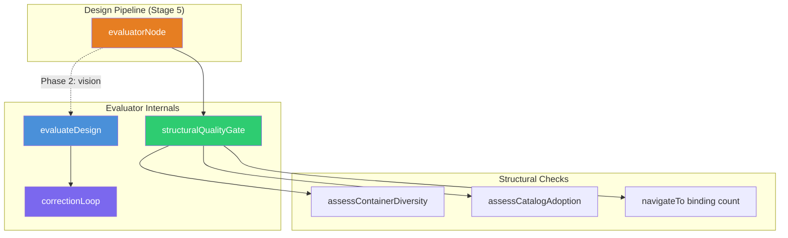
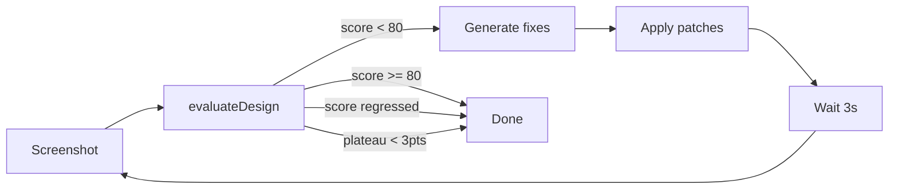

# Design Evaluator Architecture

The design evaluator is the feedback signal in CHIP's design pipeline. After the LLM generates a DesignSpec JSON, the evaluator scores it against five dimensions, applies structural deductions for common defects, and — if the score falls below 80 — triggers a correction loop that patches the spec and re-evaluates, up to three times. The evaluator is not a style guide; it is a quality gate that catches layout failures, content gaps, and visual monotony before they reach the user.

This page covers the evaluator's scoring algorithm, the correction loop, and how it integrates with the pipeline. It does not cover the design pipeline's other stages (research, planning, design) — see [Design Pipeline](../concepts/design-pipeline.md) for that.

## Components



| Component | File | Role |
|-----------|------|------|
| `evaluatorNode` | `packages/agents-ux/src/design-pipeline/nodes.ts:145` | Pipeline Stage 5 entry point; currently runs structural gate only |
| `evaluateDesign` | `packages/agents-ux/src/ux-design/design-evaluator.ts:172` | Vision LLM scoring (5 dimensions + structural deductions) |
| `runStructuralQualityGate` | `packages/agents-ux/src/ux-design/structural-quality-gate.ts` | Deterministic checks without vision model |
| `runCorrectionLoop` | `packages/agents-ux/src/ux-design/correction-loop.ts:100` | Iterative fix-and-re-evaluate loop (max 3 iterations) |
| `assessContainerDiversity` | `packages/agents-ux/src/ux-design/assess-container-diversity.ts` | Detects visual monotony across top-level sections |
| `assessCatalogAdoption` | `packages/agents-ux/src/ux-design/assess-catalog-adoption.ts` | Measures catalog component usage, suggests promotions |
| `buildEvaluationContext` | `packages/agents-ux/src/ux-design/evaluation-context.ts` | Compresses DesignSpec to ~300-600 tokens for vision LLM |

## Scoring: 5-dimension anchored rubric

The vision LLM scores each dimension 0–20, summing to 0–100:

| Dimension | 20 (best) | 10 (mid) | 0 (worst) |
|-----------|-----------|----------|-----------|
| **Layout Structure** | All components present, correct hierarchy | Missing sections, broken hierarchy | Blank or single element |
| **Visual Hierarchy** | Clear heading/body/label scale, 2+ typographic levels | Flat — most text same size | No differentiation |
| **Content Completeness** | Realistic domain text, no placeholders | Multiple missing labels or values | Mostly placeholder or missing |
| **Spacing & Density** | Consistent gaps, appropriate padding | >200px dead space or cramped sections | Overlapping elements |
| **Visual Treatment** | Mixed treatments (2+ of: shadow, border, flat, inset) | All sections identical treatment | No treatment at all |

After the vision score, structural deductions apply (capped at 20 points total):

| Check | Max deduction | Trigger |
|-------|--------------|---------|
| Container treatment monotony | 10 pts | 3+ top-level sections all use the same visual treatment |
| Low catalog adoption | 10 pts | >70% accelerator nodes AND promotable patterns exist |
| navigateTo binding mismatch | 15 pts (3/gap) | Planning expects N navigation bindings, spec has fewer |
| **Combined cap** | **20 pts** | Prevents a visually-good page from dropping below 60 |

**Formula:** `finalScore = max(0, visionScore - min(structuralDeductions, 20))`

**Quality classification** (at `design-evaluator.ts:376`):

- `score >= 80` → `good` — passes the gate, no correction needed
- `50 <= score < 80` → `needs_fixes` — correction loop runs
- `score < 50` → `poor` — correction loop runs

### Why 80 out of 100

The threshold is a 5-dimension rubric where each dimension scores 0–20. An 80 means scoring at least 16/20 average across all five dimensions — "minor issues in one or two areas, no major failures anywhere." This is calibrated against the evaluator's own anchored rubric: a page scoring 15/20 on all dimensions has clear hierarchy, populated content, consistent spacing, and mixed treatments — the minimum for a page that does not look broken or monotonous.

The threshold is not aspirational. During calibration (Visual Diversity Phase 3.7), designs scoring 75–79 consistently had one visible problem — a dead space gap, a monotonous container treatment, or truncated text. Designs scoring 80+ consistently passed manual visual review. The 20-point structural deduction cap ensures that a visually good page (vision score 85+) with one structural problem (e.g., monotonous containers, -10) still passes at 75+ after capping, while a page with both monotony and low catalog adoption would drop to 65 and trigger correction.

## Sample evaluations

### Passing design (score 85)

```
Layout Structure:     18/20  (all components present)
Visual Hierarchy:     17/20  (clear heading/body, one label inconsistency)
Content Completeness: 18/20  (all text populated, realistic values)
Spacing & Density:    16/20  (minor gap between sections)
Visual Treatment:     16/20  (shadow + outlined + flat treatments)
─────────────────────────────
Vision score:         85/100
Structural deductions: 0
Final score:          85 → "good"
```

No correction loop triggered. Page ships as-is.

### Failing design (score 65 → corrected to 82)

```
Layout Structure:     16/20
Visual Hierarchy:     14/20  (flat — most text same size)
Content Completeness: 12/20  (2 metric cards have placeholder text)
Spacing & Density:    13/20  (220px dead space below chart)
Visual Treatment:     10/20  (all 4 sections use shadow only)
─────────────────────────────
Vision score:         65/100
Structural deductions: 10 (monotony) → capped at 10
Final score:          55 → "needs_fixes"
```

Correction loop iteration 1: Fixes placeholder text (+3), reduces root height (+2), varies one container to outlined (+5). Re-evaluates at 72.

Correction loop iteration 2: Fixes heading scale (+6), varies another container to flat (+4). Re-evaluates at 82. Threshold met — loop stops.

### Structural-only evaluation (Phase 1 — current pipeline)

The pipeline currently runs `runStructuralQualityGate` without a vision model. This checks container diversity, catalog adoption, and navigateTo bindings against the raw DesignSpec JSON. Vision evaluation is implemented in `evaluateDesign()` but gated behind `AGENTFORGE_ENABLE_VISION_LLM`.

## Correction loop



**Stopping conditions** (checked in order at `correction-loop.ts`):

1. Score >= 80 — threshold met
2. Score = 0 with no issues — likely LLM parse failure
3. Score regressed from previous iteration — keep higher score
4. Improvement <= 0 or < 3 points — plateau
5. No critical/major issues remaining
6. All fix attempts skipped validation

**Parameters:** max 3 iterations, 80 quality threshold, 3000ms render delay between iterations.

## Container treatment classification

The `classifyContainerTreatment()` function at `assess-container-diversity.ts:31` categorizes each container node by its visual properties, in priority order:

| Treatment | Trigger | Visual appearance |
|-----------|---------|-------------------|
| **Elevated** | Has `shadow` | Raised card with drop shadow |
| **Inset** | Has border + secondary background | Recessed panel |
| **Outlined** | Has border only | Bordered card without background |
| **Separated** | Has `borderBottom` only | Section with bottom divider |
| **Flat** | Has secondary background | Subtle background, no border |
| **Bare** | None of the above | No visual treatment |

Monotony is flagged when 3+ top-level sections share the same treatment. The deduction is a flat 10 points, not per-section.

## Out of scope

- **Design pipeline stages 1–4** (research, planning, design, post-processing) — see [Design Pipeline](../concepts/design-pipeline.md)
- **DesignSpec JSON schema** — see `packages/core/src/types/design-spec-v2.ts`
- **Renderer architecture** — see `packages/designspec-renderer/`
- **Prompt engineering for the vision evaluator** — lives in `EVALUATION_SYSTEM_PROMPT` at `design-evaluator.ts:94`; not externalized as a separate document
