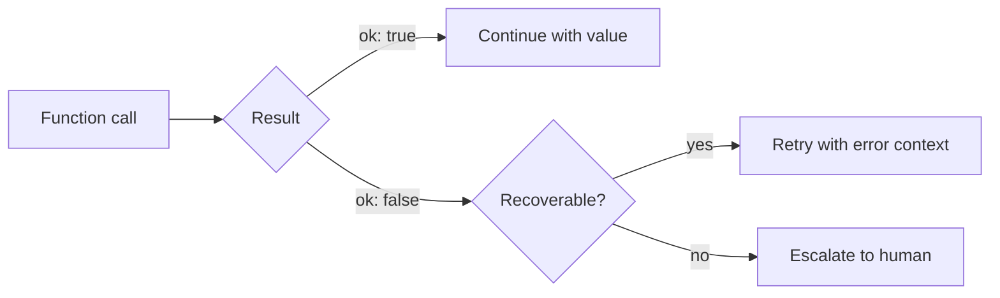
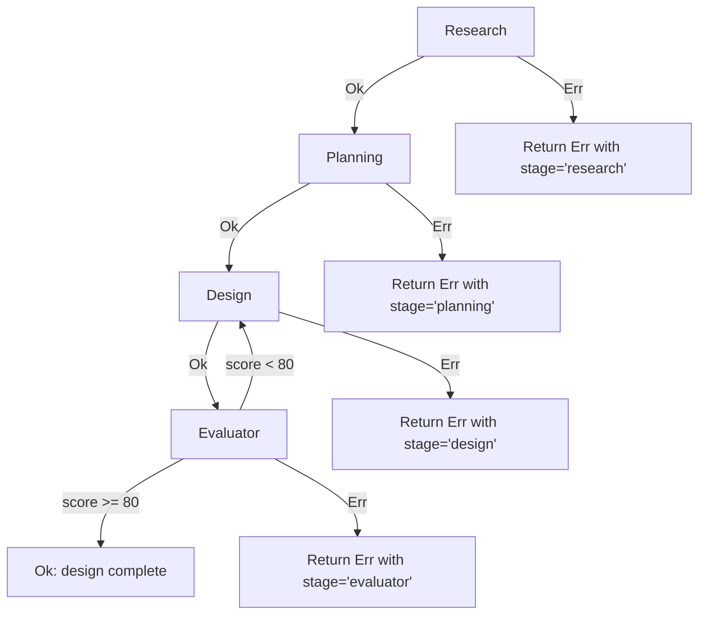

# Error handling architecture

> Authoritative source: [vision.md Layer 8](../vision.md#layer-8-implementation) (deterministic gates), [Layer 10](../vision.md#layer-10-hitl-human-in-the-loop) (HITL escalation)

CHIP uses the Result pattern for all operations — functions return `Result<T>` instead of throwing exceptions. This makes error propagation explicit: every caller must handle both the success and failure case. No error is silently swallowed, no exception unwinds through layers it wasn't designed for.

## Result type

Defined in `packages/core/src/types/result.ts`:

```typescript
type Result<T, E = AgentForgeError> =
  | { ok: true; value: T }
  | { ok: false; error: E };

const Ok = <T>(value: T): Result<T> => ({ ok: true, value });
const Err = <E>(error: E): Result<never, E> => ({ ok: false, error });
```



## Error codes

Each error code maps to a failure mode in `docs/reference/failure-modes.md`:

| Category | Codes | Recoverable? |
|----------|-------|-------------|
| LLM provider | `LLM_RATE_LIMIT`, `LLM_API_ERROR`, `LLM_MALFORMED_OUTPUT`, `LLM_CONTEXT_OVERFLOW`, `LLM_TIMEOUT` | Rate limit and API errors: yes (retry with backoff). Malformed output: yes (retry with error feedback). Context overflow: no. |
| Budget | `BUDGET_EXCEEDED_TASK`, `BUDGET_EXCEEDED_PHASE`, `BUDGET_EXCEEDED_PROJECT` | No — hard stop, notify human |
| HITL | `HITL_TIMEOUT`, `HITL_REJECTED` | Timeout: escalate to secondary channel. Rejected: return to previous stage. |
| Git/CI | `GIT_CONFLICT`, `GIT_PUSH_FAILED`, `CI_FAILED`, `CI_TIMEOUT` | Conflict: attempt auto-rebase. CI failed: retry with error context (max 3). |
| MCP | `MCP_UNAVAILABLE`, `MCP_SCHEMA_MISMATCH`, `CHANNEL_UNAVAILABLE` | Retry 3x, then fallback or pause. |
| State | `SPEC_LOCK_FAILED`, `SPEC_CONFLICT`, `TASK_NOT_FOUND`, `INVALID_STATE` | Lock: retry. Spec conflict (human edit): discard agent work, re-read human version. |
| Agent | `AGENT_LOOP_DETECTED`, `AGENT_ABORTED`, `AGENT_UNKNOWN` | Loop: force-stop. Aborted: terminal. |

## How errors flow through the design pipeline

The design pipeline (`runDesignPipeline()` in `packages/agents-ux/src/design-pipeline/pipeline.ts`) runs four stages sequentially. Each stage returns `Result`. On failure, the pipeline short-circuits:



The pipeline wraps each stage failure in a `PipelineStageError` (`packages/agents-ux/src/design-pipeline/types.ts`) that records which stage failed and what the error was. Callers (CLI and dashboard API routes) can resume from the failed stage using the `--stage` flag, since earlier stages cache their artifacts.

## How errors interact with HITL gates

Vision Layer 10 defines three HITL gates implemented as LangGraph interrupts. Errors at these gates follow specific escalation patterns:

**Clarification gate** (in the Clarifier graph at `storyWriter` and `escalationGate`):
- If the human doesn't respond, the graph remains interrupted — the checkpointer holds the state indefinitely.
- After max rounds (3) without convergence, the `escalationGate` node offers three options: accept (best-effort with capped confidence), restart, or abandon.
- A timeout timer is a planned feature (vision Layer 10, open decision) — not yet implemented.

**Design approval gate** (in the design pipeline, post-evaluator):
- If the design scores below threshold, the pipeline loops back to the design stage with correction instructions — no human involvement needed.
- If the human rejects a design at the approval screen, the pipeline restarts from the design stage with the rejection reason injected as context.

**Code merge gate** (planned — Review pipeline not yet built):
- Reviewer findings would be categorized as blocking or suggestion. Blocking findings return to the Implementer with bounded retry (max 2 revisions). After 2 failed revisions, escalation to human with full context.

## Circuit breaker

The circuit breaker contract (defined in `packages/core/src/agent-runtime/agent-runtime-lifecycle-p11.test.ts`) detects agents stuck in unproductive loops:

| Threshold | Behavior |
|-----------|----------|
| 5 consecutive failures | Circuit opens — agent paused |
| 5 LLM calls without state change | Loop detected — agent force-stopped with `AGENT_LOOP_DETECTED` |
| 5 minutes idle | Circuit auto-resets |

## Components

| Component | File | Role |
|-----------|------|------|
| `Result<T>`, `Ok()`, `Err()` | `packages/core/src/types/result.ts` | Result type and constructors |
| `ErrorCode` | same file | Exhaustive error code enum |
| `AgentForgeError` | same file | Error shape with `code`, `message`, `recoverable`, `agentId`, `taskId` |
| `PipelineStageError` | `packages/agents-ux/src/design-pipeline/types.ts` | Pipeline-specific error wrapper |
| Circuit breaker contract | `packages/core/src/agent-runtime/agent-runtime-lifecycle-p11.test.ts` | Interface: `recordCall`, `isLooping`, `reset` |

## Out of scope

- **Retry strategies per error code** — defined in the failure modes reference, not in this architecture page.
- **Notification channel fallback logic** — belongs in the integrations layer when channels are implemented.
- **Cost tracking integration** — budget errors are defined but cost aggregation is tracked in the observability layer.

## Related

- [Failure Modes Reference](../reference/failure-modes.md) — F1-F15 with recovery procedures
- [Failure Mode Testing Guide](../guides/failure-mode-testing.md) — how to reproduce failure modes
- [HITL & Governance](../concepts/hitl-governance.md) — approval gates and escalation
- [Design Pipeline Dataflow](design-pipeline-dataflow.md) — pipeline stage architecture
