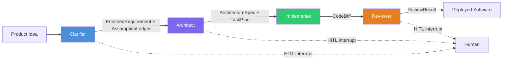
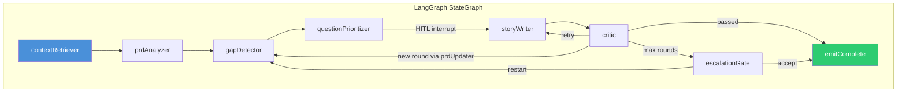
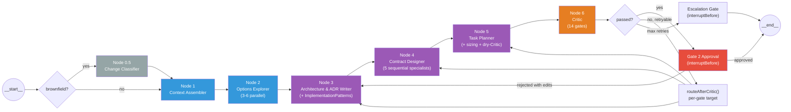
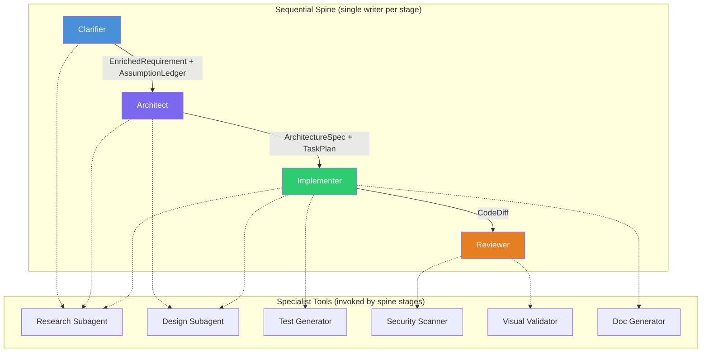
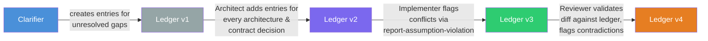

# CHIP's Spine

> Authoritative sources: [vision.md Layer 3](../vision.md#layer-3-agent-taxonomy),
> [The Spine Pattern](spine-pattern.md),
> [Architect Research](../research/architect-design.md),
> [Codebase-Grounded Design](../research/architect-codebase-grounded-design.md)

!!! abstract "About this document"

    How CHIP implements the four-stage spine pattern — node sequences, context
    handoffs, gate mechanics for all four stages. Every design decision is
    traced to external research and validated against the existing codebase.
    Read [The Spine Pattern](spine-pattern.md) first for the universal
    principles. For the system-level package layout and dependency graph, see
    [System Architecture](architecture.md).

---

## Overview

CHIP applies the spine as: **Clarifier -> Architect -> Implementer -> Reviewer**. Each stage owns a typed artifact, enforces single-writer discipline, and hands off through Zod-typed LangGraph channels. Three HITL gates sit at structural boundaries.



> Blue = Clarifier · Purple = Architect · Green = Implementer · Orange = Reviewer

The single invariant governing every decision: **context quality and write-coupling are the axes** ([vision.md](../vision.md#20-the-single-invariant)). Get good context into each LLM call. Keep writes single-threaded per artifact.

---

## Stage 1: Clarifier

!!! success "Status: Built"

    `packages/agents-clarifier/` --- 9-node LangGraph StateGraph, 114+ tests, dual
    bootstrap/evolution modes, HITL interrupts, assumption ledger.

The Clarifier is CHIP's front door. It transforms a raw product idea into structured, typed artifacts that downstream stages consume.

### Internal Structure

The Clarifier has **9 nodes** (correcting the "6 nodes" reference in several older docs --- see [Stale Documentation](#stale-documentation)):

| # | Node | Role | HITL? |
|---|------|------|-------|
| 1 | `contextRetriever` | Loads catalog, platform constraints; evolution mode calls 5 RAG tools | No |
| 2 | `prdAnalyzer` | Extracts structured PRD from raw input via forced-JSON Zod schema | No |
| 3 | `gapDetector` | Two-pass: deterministic intent checks + ClarifyGPT divergence detection | No |
| 4 | `questionPrioritizer` | Ranks gaps by EVPI score: `blastRadius * answerability * confidenceGap` | No |
| 5 | `storyWriter` | Produces EnrichedRequirement, FeaturePlan, AssumptionLedger | **Yes** |
| 6 | `critic` | Deterministic INVEST/EARS/DAG consistency checks | No |
| 7 | `prdUpdater` | Merges human clarification answers back into prdDraft between rounds | No |
| 8 | `escalationGate` | Human decides after maxRounds exhausted | **Yes** |
| 9 | `emitComplete` | Finalization, bridge event emission | No |

Source: `architect-codebase-grounded-design.md` Part 1.2, verified against `packages/agents-clarifier/src/graph/clarifier-graph.ts`.



> Blue = entry node · Green = exit node

### Design Decisions (Research-Backed)

**Bootstrap vs. evolution modes.** The Clarifier runs in two modes, backed by `clarifier-research.md` Lesson 7: "A single-clarifier-fits-all approach is unlikely to work. The clarifier needs to know whether it's bootstrapping or evolving and switch its option-generation strategy accordingly."

- **Bootstrap:** Loads base catalog + design tokens. Produces initial PRD.
- **Evolution:** Retrieves codebase via all 5 RAG tools (`searchCode`, `searchDocs`, `searchDesigns`, `getRepoMap`, `findSimilarPatterns`). Produces change request with impact analysis.

**Gap detection: deterministic + LLM hybrid.** Deterministic checklist (auth, validation, errors, NFRs, accessibility, orphan screens) catches structural gaps. ClarifyGPT consistency sampling (3 implementations at temperature 0.7, divergence analysis at temperature 0) catches semantic gaps. Backed by ClarifyGPT (FSE 2024): Pass@1 70.96% to 80.80%.

**Question budget.** Micro features 0--2, standard epics 3--7, cross-cutting max 15 per round, max 3 rounds. Backed by ClarifyCoder counter-evidence: over-asking drops pass@1 from 65% to 27%. The budget enforces calibrated uncertainty.

**Escalation.** After max rounds, user chooses: accept (best-effort PRD, confidence capped at 0.5), restart, or abandon.

### Outputs

The Clarifier's actual output is **richer than the original research assumed** (`architect-codebase-grounded-design.md` Part 1.1). This has a direct implication for the Architect: Node 4 (Contract Designer) refines existing structure, it does not discover from scratch.

**EnrichedRequirement** --- the primary handoff artifact:

```typescript
{
  id: string,                              // "req-{timestamp}"
  rawInput: string,                        // Original user request
  mode: 'bootstrap' | 'evolution',
  prd: PRD,                                // Structured JSON (see below)
  assumptionLedger: AssumptionLedger,      // First-class artifact
  clarificationRounds: [{round, questionsAsked, questionsAnswered, timestamp}],
  confidence: number,                      // 0-1 (capped at 0.5 if maxRounds reached)
}
```

**PRD** --- already structured JSON, not prose:

```typescript
{
  features: [{id, name, description, priority}],
  personas: [{id, name, role, goals: string[]}],
  dataEntities: [{id, name, fields: [{name, type, required?, description?}], relationships?}],
  screens: [{id, name, description, screenType?: 'page'|'modal'|'drawer'|'sheet'}],
  nfrs: [{id, category, description, target?, measurement?}],
  successMetrics: [{id, name, description, target, measurement}],
  outOfScope: string[],
}
```

Source: `packages/core/src/types/cross-boundary-artifacts.schemas.ts:121-161`.

---

## Stage 2: Architect

!!! success "Status: Built (M3)"

    `packages/agents-architect/` --- 7-node LangGraph StateGraph with Gate 2
    HITL approval, 24-channel typed state, 14 deterministic Critic gates,
    per-gate retry routing, brownfield support. Schemas + Critic in
    `packages/core/`. See [ADR-055](../adrs/ADR-055-architect-node4-shape.md),
    [ADR-056](../adrs/ADR-056-architect-package-boundary.md).

The Architect consumes the Clarifier's `EnrichedRequirement` and produces a `ContractBundle` — the full contract the Implementer needs before writing any code. This is "Approach B" (thick Architect) — the Implementer's sequential write order requires all cross-cutting decisions upfront (`architect-design.md` Section 3).

### Architecture

7-node sequential pipeline with mandatory Gate 2 HITL approval and an escalation gate for retry exhaustion. Per [ADR-056](../adrs/ADR-056-architect-package-boundary.md), schemas and the Critic live in `packages/core/` (no LangGraph dependency); graph, nodes, and runtime live in `packages/agents-architect/`.



> Gray = conditional (brownfield only) · Blue = parallel readers · Purple = single-threaded writers · Orange = critic · Red = HITL gate

Gate 2 Approval is a no-op pass-through node; the `interruptBefore` is the gate. Vision Layer 10 mandates Gate 2 on the happy path — not as a retry-max fallback. Pattern Designer is folded into Node 3 (preserves reasoning continuity: "use Drizzle" → `data-access-drizzle-only` pattern in the same call).

### State (24 Channels)

`ArchitectStateAnnotation` in `packages/agents-architect/src/graph/state.ts` defines 24 typed channels with explicit reducers and defaults. Key channels:

| Channel | Type | Producer |
|---------|------|----------|
| `enrichedRequirement` | `EnrichedRequirement \| null` | input |
| `mode` | `'greenfield' \| 'brownfield'` | input |
| `existingFiles` | `ReadonlySet<string> \| null` | input or Node 0.5 |
| `changeClassification` | `ChangeClassification \| null` | Node 0.5 |
| `constraintSet` | `ConstraintSet \| null` | Node 1 |
| `optionsBundle` | `OptionsBundle \| null` | Node 2 |
| `architectureSpec` | `ArchitectureSpec \| null` | Node 3 |
| `adrs` | `readonly ADR[]` | Node 3 |
| `dataModelSpec`, `apiChangeSets`, `componentCompositions`, `screenPlans`, `designSystemDiff` | various | Node 4 specialists |
| `taskPlan` | `TaskPlan \| null` | Node 5 |
| `criticReport` / `criticPassed` / `criticRetries` | report + flags | Node 6 |
| `gate2Decision` / `gate2Edits` | approval state | Gate 2 interrupt |

### The Seven Nodes

**Node 0.5 — Change Classifier** (brownfield only). Single Sonnet call producing `ChangeClassification` (5 scope axes: UI, component, designSystem, API, dataModel; plus blast radius). Populates `existingFiles` channel. Greenfield: skipped, all axes implicitly `true`.

**Node 1 — Context & Constraints Assembler.** Greenfield: deterministic (no LLM call). Brownfield: single Sonnet call capped at 20K tokens per R2 §7.6. Fuses evidence into `ConstraintSet`.

**Node 2 — Options Explorer.** 3–6 parallel Sonnet calls, one per open decision axis. Each returns a structured `OptionMemo`. No commitments — evidence only.

**Node 3 — Architecture & ADR Writer** (includes Implementation Patterns). Single Opus call producing `{ decisions[], adrs[], implementationPatterns[], stackConfig }`. Brownfield: `defaultToExistingPattern = true`, deviation requires explicit ADR. Seed pattern catalog (`packages/agents-architect/src/patterns/baseline.ts`) merged with LLM-derived patterns.

**Node 4 — Contract Designer.** Five sequential specialists ([ADR-055](../adrs/ADR-055-architect-node4-shape.md)), each making one Sonnet call. Sequential order mirrors the Implementer's write order one level up:

1. **Data model** — column-level `DataModelSpec` from `prd.dataEntities[]`
2. **API contracts** — OpenAPI 3.1 `ApiChangeSet[]`, reads data model for field-shape consistency
3. **Component composition** — `ComponentComposition[]` with prop signatures
4. **Screen specs** — `ScreenPlan[]` with data bindings referencing entity IDs
5. **Design system diff** — `DesignSystemDiff` via `buildDesignSystemContext()` (peer import from agents-ux)

Brownfield: `ChangeClassification.scopeAxes` controls which specialists run. Context scoping via `sliceContractBundle()` utility.

**Node 5 — Task Planner.** Single Opus call producing `TaskPlan` DAG. Every task carries `mode`, `estimatedTokenBudget` (via `estimateTaskTokenBudget()` sizing heuristic), `contextRefs[]`, `patternRefs[]`, `acceptanceCriteriaIds[]`. Dry-run Critic on gates 10–14 with single retry before final Node 6 invocation.

**Node 6 — Architect Critic.** Wraps `validateContractBundle()` from `packages/core/src/architect/critic.ts`. 14 deterministic gates (9 original + 5 added in M3): schema validation, DAG acyclicity, single-writer, PRD-criterion-coverage, entity-reference-integrity, gap-resolution, openapi-lint, migration-sql-parses, adr-completeness, patternRef-resolution, contextRef-resolution, acceptanceCriteria-coverage, tokenBudget-feasibility, mode-consistency. Gate 14 (mode-consistency) honors `existingFiles` — skips when undefined (greenfield), enforces strict check when defined (brownfield).

### Retry Routing Matrix

`routeAfterCritic()` in `packages/agents-architect/src/graph/retry-routing.ts` maps each failed gate to its retry target:

- Gates 1–4, 10–13 → re-run Node 5 (Task Planner)
- Gates 5, 8 → re-run Node 4 data-model specialist + downstream
- Gates 6, 9 → re-run Node 3 (Architecture Writer)
- Gate 7 → re-run Node 4 API specialist
- Gate 14 → escalation gate (humans resolve invented file paths)
- Max 1 retry per gate before escalation

### Greenfield vs. Brownfield

| Parameter | Greenfield | Brownfield |
|-----------|-----------|------------|
| Node 0.5 | Skipped (all axes `true`) | Runs, produces `ChangeClassification` + `existingFiles` |
| Node 1 | Deterministic (no LLM call) | Single Sonnet call with repo context |
| Node 3 | Every pick gets an ADR | Default to existing patterns; deviation requires ADR |
| Node 4 | All 5 specialists run | Only specialists for touched scope axes |
| Gate 14 | Skipped (`existingFiles` undefined) | Enforces mode-consistency against real files |

### Greenfield vs. Brownfield

Same seven nodes, different inputs and strictness (`architect-design.md` Section 4):

| Parameter | Greenfield | Brownfield |
|-----------|-----------|------------|
| Input to Node 0.5 | Skipped (all axes `true`) | `EnrichedRequirement` + repo context |
| Node 1 subagents | Steering files + reference patterns (aggressive) | All subagents including repo map + ADR library |
| Node 3 strictness | Every pick gets an ADR | Default to existing patterns; deviation requires ADR |
| Node 4 specialists | All 5 run | Only specialists for touched scope axes |

This symmetry mirrors the Clarifier's bootstrap/evolution design --- same workflow, different inputs. Validated by convergent practitioner evidence: Augment Code (Intent), Kiro (steering files), Spec Kit (greenfield/brownfield split). Source: `architect-design.md` Section 4.

---

## Stage 3: Implementer

!!! warning "Status: Specified, Not Yet Implemented"

    Locked decisions in [vision.md Layer 8](../vision.md#layer-8-implementation).
    Single-threaded tool loop with sequential write order.

### Design (Research-Backed)

**Single-threaded tool loop.** Processes one task at a time in sequential write order. Every production coding agent (Devin, Claude Code, Cursor Composer, Aider) is single-threaded at the artifact level --- see [The Spine Pattern](spine-pattern.md#1-single-writer-per-artifact).

**Sequential write order** (locked decision):

1. DB migration
2. Backend endpoint + service layer
3. Backend tests
4. Frontend component
5. Frontend tests
6. Integration test

Each step appends to the LLM's context so later steps see earlier decisions. This mirrors the Architect's Contract Designer sequencing applied one level lower --- the Architect decides *what* to build (contracts), the Implementer decides *how* to build it (code). Source: `vision.md` Layer 8:603-609.

**Deterministic gates** (locked decision): Typecheck, lint, tests pass to exit. Hard caps: 5 iteration limit, 200K token budget, 15-minute wall clock. LLM never self-declares completion. Budget caps are hard --- fail loud when exceeded.

**Model:** `claude-sonnet-4-6` (balanced).

**Cross-task parallelism:** Multiple tasks run concurrently in separate git worktrees. Merging via normal git. `max_concurrent_tasks` configurable (default 3). Source: `vision.md` Layer 8:642-644.

### Design Pipeline Integration

When integrated with the spine, the design pipeline redistributes (`architect-codebase-grounded-design.md` Part 2.2):

| Design Pipeline Stage | Where in Spine | Why |
|----------------------|----------------|-----|
| Research (constraints, patterns, accessibility) | **Architect Node 1 + Node 4** | Constraint assembly is Architect-level work |
| Planning (component tree, token bindings) | **Architect Node 4** | Component composition is a contract, not implementation |
| Design (DesignSpec v2 JSON generation) | **Implementer specialist tool** | Visual design is implementation |
| Evaluator (structural quality, catalog adoption) | **Implementer specialist tool** | Quality gating during implementation |

When the Implementer reaches a frontend task requiring UI, it invokes the design pipeline's design + evaluator stages as specialist tools, passing the Architect's `ScreenPlan` + `ComponentComposition` + `DesignTokensSpec` as input. Research and planning are skipped because the Architect already did that work --- cutting invocation from 4 stages to 2.

The standalone CLI path (`design:page` command) continues running all 4 stages for development iteration and demo purposes. For the standalone pipeline concept, stages, and evaluator approach, see [Design Pipeline](../concepts/design-pipeline.md).

### Open Decisions

From `vision.md` Layer 8, still unresolved:

1. **Tasks with no UI or no backend changes** --- skip irrelevant steps, driven by task scope from `TaskPlan`.
2. **Mid-task clarification** --- probably yes, via escalation to human (e.g., "this task references an entity field that doesn't exist").
3. **Tasks touching multiple modules** --- lean toward Architect splitting upstream so Implementer always gets scoped tasks.
4. **Intermediate commits** --- intermediate commits give rollback points; continuous rebase gives a clean final diff.

---

## Stage 4: Reviewer

!!! warning "Status: Specified, Not Yet Implemented"

    Locked decisions in [vision.md Layer 9](../vision.md#layer-9-review).
    Fresh context, deterministic gates first, bounded retry.

### Design (Research-Backed)

**Fresh context.** The Reviewer runs in a separate LangGraph graph. It does NOT inherit the Implementer's conversation, tool calls, or reasoning trace. It inherits the diff, the `ArchitectureSpec`, and the `AssumptionLedger`. Research basis: Cognition's Devin Review catches approximately 2 bugs per PR, 58% severe --- but only when the reviewer has clean context (`architect-design.md` Section 1, Property 2).

**Four sequential passes:**

1. **Deterministic gates** (run first): typecheck, lint, full test suite, Semgrep + CodeQL security scan, dependency license check. Any failure returns immediately to the Implementer.
2. **LLM reviewer**: failure-mode checklist prompt, scoped to the diff, with `ArchitectureSpec` and `AssumptionLedger` as context.
3. **Assumption validator**: compares diff against `AssumptionLedger`. Catches implementation details that contradict recorded assumptions.
4. **Triage**: categorizes findings as blocking / suggestion / false-positive with evidence.

**Post-review routing:**

- Approved -> HITL merge gate (human reviews PR on GitHub)
- Rejected with blocking findings -> return to Implementer (max 2 revisions)
- After 2 failed revisions -> escalate to human with full context

**Identical for greenfield and brownfield.** The Reviewer is diff-based --- it reviews code changes against spec and assumptions. Whether the project is new or existing does not change the review process. Source: `architect-codebase-grounded-design.md` Part 3.2.

**Model:** `claude-sonnet-4-6` (POC), possibly `claude-opus-4-6` (production). The 2025 DORA report and 2026 practitioner experience consistently report that review cost --- not generation cost --- is the binding constraint. This may warrant investing the most capable model in the Reviewer stage. Source: `planning-methodology-counter-analysis.md`.

### Implementation Guidance

**Package location:** `packages/agents-reviewer/` (M4 complete 2026-05-18).

**LangGraph structure (v1):** Three sequential nodes in a StateGraph: `deterministicGates` → `llmReview` → `emitReviewResult`. Vision Layer 9 passes 3+4 (assumption validator + triage) collapsed into the `llmReview` prompt as a v1 simplification. M4.5 splits into 4-node topology: `deterministicGates` → `llmReview` → `assumptionValidator` → `emitReviewResult`. See `docs/plans/active/chips-next-steps/m4-5-execution-plan.md` Phase 1.

**Pattern prototype:** The `/review-plan-impl` skill (`.claude/skills/review-plan-impl/`) validates two key patterns at the tool level before they are productionized in the LangGraph Reviewer:

1. **Fresh-context review** — spawns a subagent with no inherited conversation history, matching the Reviewer's "does not inherit Implementer's reasoning trace" requirement.
2. **Deterministic-first** — computes file-match, typecheck, and dead-code results before LLM judgment, matching the "deterministic gates run first" architecture.

Examine the skill's rubric (`references/rubric.md`), prompt template (`references/portable-prompt.md.tmpl`), and subagent spawn flow before designing the LangGraph Reviewer node. The skill's 7-point rubric is plan-specific (implementation fidelity), but the mechanical patterns (tiered extraction, finding classification, portable prompt audit trail) transfer directly.

**Shared components to extract:** `ReviewPass` interface, `ReviewFinding` Zod schema, deterministic gate runner. These should live in `packages/core/src/types/` or a shared review utilities module.

---

## Specialist Tools

Specialists are invoked by spine stages as tools. They never run in parallel as writers to shared artifacts. Research basis: Yan April 2026: successful multi-agent patterns have "writes stay single-threaded" and additional agents "contribute intelligence rather than actions."



> Blue = Clarifier · Purple = Architect · Green = Implementer · Orange = Reviewer. Dashed arrows show specialist tool invocation.

| Specialist | Invoked By | Implementation |
|-----------|-----------|----------------|
| Research subagent | Clarifier, Architect, Implementer | Read-only `packages/retrieval` tools returning compressed summaries |
| Design subagent | Architect, Implementer | `packages/agents-ux` design pipeline (research -> planning -> design -> evaluator) |
| Test generator | Implementer | Emits failing tests before implementation |
| Security scanner | Reviewer | Semgrep + CodeQL diff scan, LLM triage, no autonomous remediation |
| Visual validator | Reviewer | Playwright browser verification |
| Doc generator | Implementer | API docs, user guides |

### Collapsed Roles

The original ten-agent model mapped to a human org chart. The spine collapses it:

| Original Agent | Disposition |
|---------------|------------|
| PM Agent | Absorbed into Clarifier |
| Product Agent | Absorbed into Clarifier |
| Architect Agent | Spine stage 2 |
| Design Agent | Specialist tool (Architect, Implementer) |
| Implementation Agent | Spine stage 3 |
| Testing Agent | Specialist tool (Implementer) |
| Review Agent | Spine stage 4 |
| DevOps Agent | Specialist tool (Implementer) |
| Security Agent | Specialist tool (Reviewer) |
| Docs Agent | Specialist tool (Implementer) |

---

## Typed Contracts Between Stages

Every artifact that crosses a stage boundary has a Zod schema in `packages/core/src/types/`. This is a locked decision ([vision.md Layer 2](../vision.md#layer-2-coordination-substrate)).

### Clarifier -> Architect

| Contract | Schema Location | Status |
|----------|----------------|--------|
| `EnrichedRequirement` | `cross-boundary-artifacts.schemas.ts:152-161` | Exists, used |
| `AssumptionLedger` | `cross-boundary-artifacts.schemas.ts:45-62` | Exists, used |
| `PRD` | `cross-boundary-artifacts.schemas.ts:121-139` | Exists, used |
| `FeaturePlan` | `cross-boundary-artifacts.schemas.ts:190-193` | Exists, used |

### Architect -> Implementer

| Contract | Purpose | Status |
|----------|---------|--------|
| `ArchitectureSpec` | System overview, decisions, stack config, implementation patterns | **Exists, used** (M3) |
| `TaskPlan` | Implementation DAG with per-task file paths, budgets, context refs | **Exists, used** (M3) |
| `ContractBundle` | Full Architect output bundle | **Exists, used** (M3) |
| `ConstraintSet` | Fused constraints from evidence streams | **Exists, used** (M3) |
| `OptionsBundle` | Option memos per open decision axis | **Exists, used** (M3) |
| `CriticReport` | 14-gate validation results | **Exists, used** (M3) |
| `ScreenPlan` | Screen component membership, data bindings, navigation | **Exists, used** (M3) |
| `ChangeClassification` | 5 scope axes + blast radius | **Exists, used** (M3 Node 0.5) |

Source: `architect-codebase-grounded-design.md` Part 1.5. All schemas in `packages/core/src/types/architect.schemas.ts`.

### Implementer -> Reviewer

| Contract | Purpose | Status |
|----------|---------|--------|
| `Diff` | Git diff of all changes | Exists |
| `ArchitectureSpec` | Reviewer's reference (from Architect) | **Exists** (M3) |
| `AssumptionLedger` | For Pass 3 assumption validation | Exists |
| `TaskPlan` | Which tasks were executed | **Exists** (M3) |

---

## Assumption Ledger Lifecycle

The assumption ledger threads through the entire spine as the anti-drift backbone. Research basis: "The single most cost-effective anti-drift mechanism identified in the research synthesis" (`design-decisions.md` Section 2.3).



> Ledger versions colored by owning stage. Blue = Clarifier · Purple = Architect · Green = Implementer · Orange = Reviewer · Gray = initial state.

| Stage | Ledger Action | Implementation Status |
|-------|--------------|----------------------|
| Clarifier | Creates entries for unresolved gaps after maxRounds; marks resolved when human answers | **Built** (`story-writer.ts`) |
| Architect | Nodes 3-4 add entries for every architecture and contract decision; Critic (Node 6) checks for internal contradictions | **Built** (M3, `packages/agents-architect`) |
| Implementer | Uses `report-assumption-violation` tool to flag conflicts with recorded assumptions | Not yet implemented |
| Reviewer | Pass 3 validates diff against ledger; flags contradictions as blocking findings | Not yet implemented |

Source: `architect-codebase-grounded-design.md` Part 3.4.

---

## HITL Gates

Three structural checkpoints positioned on the spine, implemented as LangGraph `interruptBefore` nodes with Postgres-backed state persistence.

| Gate | Location | Decision | Mechanism | Status |
|------|----------|----------|-----------|--------|
| Gate 1 | After Clarifier `questionPrioritizer` | Human answers batched questions | `interruptBefore: ['storyWriter']` | **Built** |
| Gate 1.5 | After Clarifier `critic` (max rounds) | Accept / restart / abandon | `interruptBefore: ['escalationGate']` | **Built** |
| Gate 2 | After Architect Node 6 (Critic green) | Human reviews architecture, contracts, task plan | `interruptBefore: ['gate2Approval', 'escalationGate']` | **Machinery built** (M3); dashboard UI deferred ([backlog](../plans/backlog/gate2-dashboard-ui.md)) |
| Gate 3 | After Reviewer Pass 4 (triage) | Human reviews PR on GitHub | Git host integration | Not yet implemented |

On interrupt, full graph state serializes to Postgres checkpointer. Dashboard polls for pending approvals. On decision, graph resumes from interrupt point.

**Timeout handling:** If human does not respond within configurable timeout, escalation rules fire (retry notification, fall back to secondary channel, or fall back to recorded assumptions for non-critical questions). Source: `vision.md` Layer 10.

!!! danger "Rejected pattern"

    "Approve every tool call" / "approve every file write." Produces rubber-stamping.
    Vulnerable to HITL flooding attacks. Defeats autonomy. Source: `vision.md` Layer 10.

---

## Concurrency Model

| Dimension | Strategy | Evidence |
|-----------|----------|----------|
| Within-task | Strictly sequential, single writer | [Single writer per artifact](spine-pattern.md#1-single-writer-per-artifact) --- Yan Principle 2 |
| Cross-task | Independent features in separate git worktrees | Cursor 2.0 worktree isolation, `max_concurrent_tasks` configurable (default 3) |
| Within-stage parallel reads | Architect Nodes 1 & 2 only | Anthropic 90.2% lift for breadth-first reads, explicitly "less effective for coding" |
| Design pipeline | Sequential per-screen, sequential across screens via topological order | `vision.md` Layer 7:571-573 |

Source: `vision.md` Layer 8:642-644.

---

## Implementation Status

| Stage | Status | Package | Tests | Key Implementation Decision |
|-------|--------|---------|-------|-----------------------------|
| Clarifier | **Built** | `packages/agents-clarifier` | 114+ | 9-node LangGraph StateGraph, dual modes, HITL |
| Architect | **Built** (M3) | `packages/agents-architect` | 28+ | 7-node LangGraph StateGraph, 24 channels, 14 Critic gates, Gate 2 HITL, brownfield support. [ADR-055](../adrs/ADR-055-architect-node4-shape.md), [ADR-056](../adrs/ADR-056-architect-package-boundary.md) |
| Implementer | **Specified** | Not yet created | --- | Single-threaded tool loop, sequential write order |
| Reviewer | **Specified** | Not yet created | --- | Fresh context, 4-pass, bounded retry |
| Design pipeline | **Built** (as specialist) | `packages/agents-ux` | Yes | 4-stage pipeline, redistributes to Architect + Implementer in spine mode |
| Retrieval | **Built** (as specialist) | `packages/retrieval` | Yes | 5 MCP-compatible RAG tools |

---

## Open Decisions

These are not yet resolved in the research or vision document. Each is flagged with the relevant context.

1. **Spine graph composition.** How do the four stages compose as a LangGraph graph? The Clarifier is already its own `StateGraph`. Options: one parent graph with compiled subgraphs, four separate graphs invoked sequentially, or a meta-orchestrator. The research notes "six-node count is not magic" (`architect-design.md` Caveats) but does not specify composition. Needs an ADR.

2. **Cross-task coordination.** `vision.md` specifies worktree isolation with "merging via normal git, not by agent coordination." Cognition has moved to "manager-Devin map-reduce-and-manage" (Yan April 2026). Whether CHIP needs a task coordinator or simple worktree isolation suffices is unresolved.

3. **Error recovery across stages.** The Reviewer returns to the Implementer (max 2 revisions). But if the Implementer fails after max retries on a task, does it escalate to the Architect (re-plan the task) or straight to human? `vision.md` says "budget caps are hard; fail loud when exceeded" but does not specify the recovery path.

4. **Total spine-run budget.** Only per-stage budgets exist (Implementer: 5 iterations, 200K tokens, 15min; Clarifier: 3 rounds; Reviewer: 2 revisions). No total spine-run budget is specified. Is per-stage sufficient, or does the full run need a total budget?

5. **Expected latency.** No document specifies end-to-end latency for a full spine run. Needs benchmarking once stages are implemented.

6. **TaskPlan instantiation.** The Architect produces a `TaskPlan` DAG with `dependencies[]` per task. How does this DAG become individual Implementer task runs? No scheduler or instantiation mechanism is specified.

7. **Reviewer model.** `claude-sonnet-4-6` for POC, possibly `claude-opus-4-6` for production. The 2025 DORA report and 2026 practitioner data say review cost dominates --- this may warrant Opus. Source: `planning-methodology-counter-analysis.md`.

8. ~~**Architect 7-node status.**~~ **Resolved (M3).** The 7-node structure is implemented in `packages/agents-architect/` with [ADR-055](../adrs/ADR-055-architect-node4-shape.md) documenting the Node 4 shape choice and [ADR-056](../adrs/ADR-056-architect-package-boundary.md) documenting the package boundary. The internal node structure is not promoted to a vision.md locked decision — it remains an implementation detail that can evolve (e.g., subgraph-per-specialist migration per ADR-055 trigger).

---

## Stale Documentation

!!! info "Mostly resolved"

    Three of four stale references identified here have been fixed:

    - ~~`concepts/agent-taxonomy.md`~~ --- fixed (node count updated 6→9)
    - ~~`architecture/architecture.md`~~ --- fixed (4-stage spine model)
    - ~~`specs/sdlc-agents.md`~~ --- fixed (single-threaded Implementer)
    - **`CLAUDE.md`**: Still says "6 nodes" for Clarifier (plan status line). Update when Clarifier Initiative status is next revised.

---

## Related

- [The Spine Pattern](spine-pattern.md) --- universal principles with 24 citations
- [Vision](../vision.md) --- 15-layer architectural authority
- [Agent Taxonomy](../concepts/agent-taxonomy.md) --- spine stages and specialist tools
- [Architect Pipeline](../concepts/architect-pipeline.md) --- seven-node pipeline detail, data flow, research grounding
- [Clarifier Pipeline](../concepts/clarifier-pipeline.md) --- nine-node pipeline detail, routing, gap detection
- [Coordination & State](../concepts/coordination-and-state.md) --- typed channels and persistence
- [Design Pipeline](../concepts/design-pipeline.md) --- standalone pipeline concept, 4-stage mechanics, renderer separation
- [State Persistence](../concepts/state-persistence.md) --- three-tier persistence (YAML, Postgres checkpointer, in-memory)
- [Design Decisions](../design-decisions.md) --- topology, coordination, and artifact decisions
- [HITL & Governance](../concepts/hitl-governance.md) --- three structural checkpoints
- [Architect Research](../research/architect-design.md) --- Approach A vs B, five load-bearing properties, 24 citations
- [Architect Codebase-Grounded Design](../research/architect-codebase-grounded-design.md) --- typed contracts, shared modules, implementation sequence
- [Clarifier Research](../research/clarifier-research.md) --- 10 production systems analyzed
