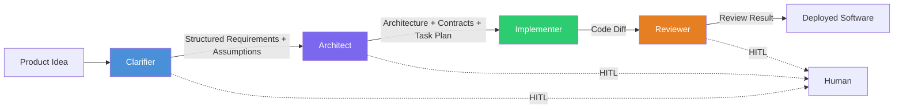
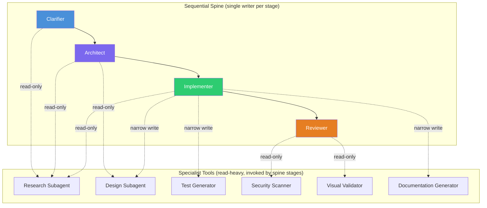

# The Spine Pattern for Autonomous SDLC Agents

!!! abstract "About this document"

    Research synthesis: why a four-stage sequential spine with specialist tools
    is the convergent architecture for autonomous SDLC agents. Grounded in
    production evidence from Cognition, Anthropic, Cursor, Aider, Kiro, GitHub,
    and the 2024--2026 academic literature. This page covers the universal
    pattern and its evidence base. For CHIP's package layout and dependency
    graph, see [System Architecture](architecture.md). For how CHIP implements
    each stage (node sequences, context handoffs, gate mechanics), see
    [CHIP's Spine](spine-implementation.md).

---

The spine pattern prescribes four sequential stages --- Clarifier, Architect, Implementer, Reviewer --- where each stage has exactly one writer, each handoff carries a typed artifact, and a human approves at structural boundaries. The following sections explain why this specific architecture is the convergent solution.

## The Problem

Every team building an autonomous SDLC agent eventually hits the same wall: the system generates code that compiles, passes tests, and solves the wrong problem --- or solves it three different ways in three files because three agents each committed to a different set of unstated assumptions.

The failure has a name. Walden Yan, engineering lead at Cognition (makers of Devin), calls it the **Flappy Bird problem** (June 2025): "Suppose your task is 'build a Flappy Bird clone.' This gets divided into Subtask 1 'build a moving background' and Subtask 2 'build a bird character.' Subagent 1 and subagent 2 cannot see what the other was doing and so their work ends up being inconsistent." Every action a writer takes --- choosing a color palette, a sprite resolution, a physics tick rate, an asset format --- commits to dozens of unstated micro-decisions that the other writer has no way to learn except by inspecting the artifact, which it is not doing.

Yan's stronger claim: *"you should by default rule out any agent architectures that don't abide by Principles 1 & 2."*

The deeper problem is not one failure mode but three, all sharing the same root cause:

- **Goal drift** --- code that compiles but solves the wrong problem (CORPGEN multi-horizon study, arXiv 2602.14229)
- **Reasoning drift** --- logic degradation across turns as context accumulates noise (ACON context-compression paper, arXiv 2510.00615)
- **Context drift** --- signal-to-noise collapse well before the hard token limit (Chroma "Context Rot" research; Anthropic context-engineering cookbook)

All three stem from **implicit assumptions accumulating without being surfaced as auditable, revisitable items**. The architecture that prevents them needs to enforce explicit handoffs, bounded context, and structured decision records.

---

## Five Load-Bearing Properties

The spine pattern rests on five properties that every alternative architecture --- flat agent networks, hierarchical supervisors with peer writers, peer handoff chains, free-form DAGs with parallel writers --- violates in at least one dimension. These are not design preferences; they are structural constraints derived from production failures.

### 1. Single Writer Per Artifact

Every production coding agent that has shipped --- Devin, Claude Code, Cursor Composer, Aider --- is single-threaded at the artifact level.

- **Cognition** (Walden Yan, June 2025, April 2026): Principle 2 --- "Actions carry implicit decisions, and conflicting decisions carry bad results." The April 2026 follow-up doubles down: Cognition deploys multi-agent systems in production at Devin and Windsurf, but only ones in which "writes stay single-threaded" and additional agents "contribute intelligence rather than actions."
- **Anthropic** (Liu et al., "Dive into Claude Code," arXiv 2604.14228): Claude Code's single-threaded "nO" master loop --- one writer per artifact, period.
- **Cursor** (Cursor 2.0, October 2025): Composer is the writing primitive. Parallelism is via git worktrees, each containing its own complete single-threaded writer --- not a parallel-write architecture inside one worktree.
- **Aider** (architect/editor mode): Two passes by the *same* writer line --- an architect model proposes, an editor model applies. The artifact has exactly one writer per pass.

The pattern holds because the alternative --- parallel writers sharing an artifact --- cannot be made safe. File locks do not help because the shared artifact is the *running application*. Frontend and backend agents invent incompatible API shapes because their implicit decisions (field names, error formats, timestamp types) cannot be fully pinned down by the spec.

### 2. Fresh Context Per Stage

Counterintuitive but validated: the review stage works *better* when it does not inherit the implementation stage's conversation.

- **Cognition** (Walden Yan, April 2026, from Devin Review): "This technique works best when the coding and review agents do not share any context beforehand." Devin Review catches approximately 2 bugs per PR, 58% rated severe --- but only with clean-context review.
- **Chroma "Context Rot" research**: Retrieval and reasoning quality decay non-linearly with context length, well before the hard token limit.
- **Anthropic context-engineering cookbook**: Same finding --- attention quality degrades as context grows.

A clean-context reviewer catches things the writer cannot because it is not buried under hours of trial-and-error reasoning. The same logic applies stage-to-stage: each stage inherits the *artifacts* of the prior stage (the typed output), not the *reasoning trace* (the abandoned options, partial drafts, and tool calls).

This is also why Spec Kit's `plan-template.md` partitions the design phase into discrete files (`research.md`, `data-model.md`, `contracts/`, `tasks.md`) --- each is a fresh-context handoff surface.

### 3. Typed Channels Between Stages

Free-form event-bus or peer-handoff architectures let one agent's prose become another agent's input. This is where coordination drift compounds.

- **MetaGPT** (arXiv 2308.00352, 2023): SOPs "materialize" as typed structured outputs (PRD, system interface design, sequence diagrams, task list). The handoff schema is what reduces hallucinated chatter between roles.
- **Spec Kit** `contracts/` directory: "Contracts are the handoff boundary --- an agent reading the contract knows exactly what to implement without reading the full spec."
- **Kiro** (AWS, 2025): Three-file convention --- `requirements.md` in EARS format, `design.md`, `tasks.md`. Each file is the complete handoff contract for the next stage.
- **"Context blindness"** (Spec Kit Agents, arXiv 2604.05278): The formalized failure mode --- artifacts that are internally coherent but incompatible with the repository. Typed channels are the structural fix.

### 4. Deterministic Gates Own "Done"

This is the property that distinguishes a real spine from a "soft" pipeline. The LLM never self-declares completion.

- The Implementer does not decide it is done; **typecheck, lint, and tests decide**.
- The Reviewer does not decide a finding is blocking; **the triage gate decides**.
- The Clarifier does not decide ambiguity is resolved; **the EVPI score and consistency-sampling agreement rate decide**.

!!! info "Evidence"

    - **AWS AI-DLC** names this principle explicitly: "human-gated progression" with "structured milestones" --- though its checkpoints are human approvals rather than deterministic computations.
    - **SWE-bench Pro** long-horizon failure analysis documents the "Endless File Reading" loop: when the LLM owns its own exit condition, it iterates indefinitely without converging.

Deterministic gates bound retry budgets and prevent infinite loops. They also make the system auditable --- every gate produces a machine-readable pass/fail record.

### 5. Assumption Ledger as Anti-Drift Backbone

The three drift failure modes (goal, reasoning, context) share a root cause: implicit assumptions accumulate without being surfaced as auditable items. The assumption ledger inverts this.

Every load-bearing decision is written to a structured artifact that:

- The **Architect** reads and extends (adding contract decisions)
- The **Implementer** reads and validates (flagging conflicts via a `report-assumption-violation` tool)
- The **Reviewer** audits (comparing the diff against recorded assumptions)
- The **next feature's Clarifier** consults (checking for contradictions with prior decisions)

!!! info "Evidence"

    - **Prassanna Ravishankar's drift taxonomy**: Three failure modes, one root cause --- implicit assumptions.
    - **CORPGEN** (arXiv 2602.14229): Multi-horizon study documenting goal drift in long-running agent tasks.
    - **ACON** (arXiv 2510.00615): Context-compression paper documenting reasoning drift from signal-to-noise collapse.
    - **Augment Code's "Intent"**: Calls this the "bidirectional feedback loop" --- specs that flow downstream and violations that flow back upstream. The assumption ledger is this loop narrowed to the specific drift surfaces an autonomous SDLC actually has.

---

## The Four-Stage Spine

The spine is a sequential pipeline of four stages. Each stage has exactly one writer, each handoff carries a typed artifact, and a human approves at structural boundaries.

> Blue = Clarifier · Purple = Architect · Green = Implementer · Orange = Reviewer

### Stage 1: Clarifier

Transforms raw input into structured requirements. Resolves ambiguity *before* any code commitment.

The evidence for a separate clarification stage is strong:

- **ClarifyGPT** (FSE 2024): GPT-4 Pass@1 jumps from 70.96% to 80.80% with test-input consistency checks as a clarification mechanism.
- **Ambig-SWE** (2026): Multi-agent system with "Intent Agent" achieves 69.40% resolve rate versus 61.20% single-agent. Critically, the system shows "well-calibrated uncertainty, conserving queries on simple tasks while proactively seeking information on more complex issues."

The counter-evidence is equally important:

- **ClarifyCoder** (2025): Okanagan's pass@1 drops from 65% to 27% on standard tasks when it asks unnecessarily. A clarifier needs **calibrated uncertainty**, not just question generation.

The converging UX across independent teams:

- **Anthropic's `AskUserQuestion`** (Claude Code, October 2025): 1--4 questions, 2--4 options each, "Recommended" label, "Other" free-text fallback.
- **Cursor 2.4** (January 2026): Non-blocking clarification --- the agent keeps working on parts it can handle while waiting for the human's answer.
- **Kiro** (AWS): EARS-formatted requirements (`WHEN [condition] THE SYSTEM SHALL [behavior]`), steering files, guided spec interviews.

### Stage 2: Architect

Pre-commits architecture, contracts, and a task plan before any code is written.

The critical question is **thin vs. thick**: should the Architect produce only a spec and ADRs (thin), or also emit concrete data models, API contracts, component composition, and screen specs (thick)?

The evidence converges on thick:

- **Kiro's `design.md`** already includes "components, data models, and interfaces."
- **Spec Kit** emits `data-model.md` + `contracts/` + `tasks.md` in its Phase 0--1 sequence.
- **MetaGPT's** Architect role emits "system interface design and sequence flow diagram" before the Engineer starts.

The deciding factor: if the Implementer writes code sequentially (database migration first, then backend, then tests, then frontend, then frontend tests, then integration test), **every cross-cutting decision must already be made before write 1 begins**. A thin Architect forces the Implementer to make implicit contract decisions while writing --- reintroducing the Flappy Bird problem at the contract level.

??? info "CHIP status"

    Specified but not yet built. See [CHIP's Spine](spine-implementation.md) for implementation status and design decisions.

### Stage 3: Implementer

Single-threaded tool loop writing code in a prescribed sequential order.

Every production agent that has shipped is single-threaded at the artifact level. Cross-task parallelism (independent features in separate git worktrees) is safe because each worktree is an isolated write surface. Within-task parallelism is not safe because the shared artifact is the running application.

Deterministic gates (typecheck, lint, tests) own "done." The LLM never self-declares completion. Budget caps (iteration limit, token budget, wall-clock cap) are hard --- fail loud when exceeded.

??? info "CHIP status"

    Specified but not yet built. See [CHIP's Spine](spine-implementation.md) for implementation status and design decisions.

### Stage 4: Reviewer

Fresh-context review with deterministic gates first, LLM review second.

The Reviewer runs in a separate context. It inherits the architecture spec and the code diff, but NOT the Implementer's reasoning trace, tool calls, or partial drafts. This is the "clean-context reviewer" pattern validated by Cognition's Devin Review.

Four sequential passes:

1. **Deterministic gates** --- typecheck, lint, tests, security scan, license check. Any failure returns immediately to the Implementer.
2. **LLM reviewer** --- failure-mode checklist prompt, scoped to the diff, with the architecture spec as reference context.
3. **Assumption validator** --- compares the diff against the assumption ledger. Catches "the Implementer quietly decided to use PUT instead of PATCH even though the Architect assumed PATCH."
4. **Triage** --- categorizes findings as blocking, suggestion, or false-positive with evidence.

Bounded retry: maximum 2 revisions before escalation to a human.

??? info "CHIP status"

    Specified but not yet built. See [CHIP's Spine](spine-implementation.md) for implementation status and design decisions.

---

## Specialist Tools: Read Many, Write One

Anthropic's multi-agent research system (June 2025) demonstrated a 90.2% lift over single-agent Claude Opus 4 on internal research evaluations, with token usage explaining 80% of variance on BrowseComp at approximately 15x token cost. But Anthropic is explicit about the boundary:

> "Multi-agent systems excel especially for breadth-first queries that involve pursuing multiple independent directions simultaneously" and are "less effective for tightly interdependent tasks such as coding."

The lead researcher does not write to a shared artifact. The subagents emit structured digests that the lead synthesizes. This is exactly the **read-only pattern** Yan endorses: "the first area of applicability being in read-only agents."

The implication: **parallel subagents are legitimate inside a spine stage whenever that stage's job is to gather evidence or explore options without writing the canonical artifact.** They are never legitimate as parallel writers to a shared artifact.

> Blue = Clarifier · Purple = Architect · Green = Implementer · Orange = Reviewer

Specialists contribute **intelligence** (evidence, analysis, validation), not **actions** (writes to shared artifacts). They never run in parallel as writers to the same artifact.

---

## What the Alternatives Lose

Each rejected architecture violates at least one of the five load-bearing properties.

| Alternative | Properties Violated | Evidence |
|------------|---------------------|----------|
| **Flat 10-agent event bus** | Single-writer (multiple agents publish events touching the same file), fresh context (shared bus is shared state) | Coordination overhead grows quadratically with agent count |
| **Hierarchical supervisor + peer writers** (MetaGPT's original conception) | Single-writer at the SDLC level | Architect's interface design and Engineer's data structures diverge unless one runs second and re-reads the other's full output --- at which point you have serialized them and reinvented the spine |
| **Peer handoff** (AutoGen-style) | Typed channels | Loses type information at the boundary; every pair of agents is a potential silent-drift bug |
| **Free-form DAG with parallel writers** | Single-writer | The explicit anti-pattern Yan rules out: "rule out any agent architectures that don't abide by Principles 1 & 2" |
| **Agents negotiating scope** | Fresh context + single-writer | "LLMs cannot reliably engage in long-context proactive discourse" (Yan). Anthropomorphizing function calls as teammates does not make them teammates. |
| **Thin Architect (spec only, no contracts)** | Assumption ledger + single-writer | Pushes contract decisions into the Implementer, where they are made implicitly while writing code --- reintroducing Flappy Bird at the contract level |

The spine is not one option among many. It is the only architecture that simultaneously preserves all five load-bearing properties.

---

## The Single Invariant

> **Context quality and write-coupling are the axes. Everything else is downstream.**

A system that gets context wrong produces wrong output regardless of architecture. A system that couples writes to shared artifacts across parallel agents produces inconsistent output regardless of quality.

Every decision in this document exists to protect one of these two properties:

- **Get good context into each LLM call** --- fresh context per stage, typed channels, assumption ledger, parallel reads for evidence gathering.
- **Keep writes single-threaded per artifact** --- sequential spine, single writer per stage, deterministic gates, specialists as tools not peers.

If a proposed change helps either property, it is probably right. If it hurts either, it is probably wrong.

---

??? info "Evidence Base (24 Citations)"

    ### Production Systems

    | Source | Contribution |
    |--------|-------------|
    | Walden Yan, *Don't Build Multi-Agents*, Cognition, June 2025 | Principles 1 and 2, Flappy Bird, edit-apply-model failure mode |
    | Walden Yan, *Multi-Agents: What's Actually Working*, Cognition, April 2026 | Single-threaded writes, clean-context reviewer (Devin Review), manager-Devin map-reduce-and-manage |
    | Anthropic Engineering, *How we built our multi-agent research system*, June 2025 | Orchestrator-worker, 90.2% lift, 80% variance from token volume, breadth-first only |
    | Liu, Zhao, Shang, Shen, *Dive into Claude Code*, arXiv 2604.14228, April 2026 | Single-threaded "nO" master loop, five-layer compaction pipeline, subagent summary-only returns |
    | Cursor 2.0, October 2025 | Composer as writing primitive, parallelism via git worktrees |
    | Aider, architect/editor mode | Two-pass single-writer pattern, tree-sitter repo map |
    | AWS Kiro, 2025 | EARS requirements, steering files, thick design stage, structured milestones |
    | GitHub Spec Kit, `plan-template.md` | Phase 0 research, Phase 1 contracts, Phase 2 tasks, context-grounding hooks |

    ### Academic Literature

    | Source | Contribution |
    |--------|-------------|
    | MetaGPT (arXiv 2308.00352, 2023) | SOPs as typed handoffs, Architect emits interface design before Engineer starts |
    | ClarifyGPT (FSE 2024) | Pass@1 70.96% to 80.80% with test-input consistency checks |
    | ClarifyCoder (2025) | Counter-evidence: over-asking drops pass@1 from 65% to 27% |
    | Ambig-SWE (2026) | Multi-agent Intent Agent achieves 69.40% vs 61.20% single-agent |
    | ACON (arXiv 2510.00615) | Context-compression, reasoning drift, signal-to-noise collapse |
    | CORPGEN (arXiv 2602.14229) | Multi-horizon goal drift in long-running agent tasks |
    | Beyond pass@1 (arXiv 2603.29231) | Long-horizon evaluation metrics |
    | Spec Kit Agents (arXiv 2604.05278) | "Context blindness" failure mode, read-only context-grounding hooks |
    | Knowledge-Based Multi-Agent Framework (arXiv 2503.20536) | Staged SDLC agent with thick architecture/design stage |
    | AdaCoder (arXiv 2504.04220) | Adaptive code generation with staged pipeline |
    | Blueprint2Code (PMC12575318) | Structured design-to-implementation pipeline |
    | ALMAS (arXiv 2510.03463) | Academic SDLC agent framework with deterministic gates |

    ### Practitioner Reports

    | Source | Contribution |
    |--------|-------------|
    | AWS AI-DLC, *Open-Sourcing Adaptive Workflows* | Adaptive breadth/depth, structured milestones, human-gated progression |
    | Augment Code, *Intent* | Brownfield spec-driven development, bidirectional feedback loop |
    | Prassanna Ravishankar, drift taxonomy | Three failure modes, one root cause --- implicit assumption accumulation |
    | 2025 DORA Report + 2026 practitioner data | Review cost is the binding constraint, not generation cost |

---

??? warning "Thresholds That Would Change This"

    Three conditions would weaken the spine commitment:

    1. **If models stop drifting on cross-cutting decisions.** If a future model generation can reliably coordinate parallel writers without implicit-decision divergence, the single-writer constraint can be relaxed and parallel frontend/backend writers (via worktrees) become safe at the artifact level. As of mid-2026, the production evidence (Cognition April 2026; Cursor 2.0 worktree isolation; Anthropic "less effective for tightly interdependent tasks such as coding") points the other way.

    2. **If brownfield blast-radius classification is unreliable.** The thick Architect's optimization (skip unchanged scope axes) depends on accurate change classification. If classification false-negatives are too frequent, all specialists must run in brownfield mode too. This is a tuning question answerable with production telemetry.

    3. **If parallel-read synthesis loss exceeds latency savings.** The Architect's evidence-gathering nodes use Anthropic-style parallel subagents. If inconsistencies between subagent memos exceed what the deterministic merger can reconcile, collapse to single-threaded reads. This is the same trade-off Anthropic flags at approximately 15x token cost.

    Several of the cited sources are practitioner blog posts and arXiv preprints rather than peer-reviewed work. The Cognition essays are public-facing engineering posts and should be read as informed practitioner opinion plus production telemetry rather than controlled experiments. The 90.2% Anthropic figure is from internal evaluations on internal benchmarks; the 80%-of-variance-from-tokens claim is on BrowseComp specifically, not on coding tasks.

---

## Related

**CHIP implementation:**

- [CHIP's Spine](spine-implementation.md) --- how this project applies the spine pattern (stage internals, node sequences, gate mechanics)
- [System Architecture](architecture.md) --- CHIP's package layout, dependency graph, API contracts

**Concepts:**

- [What is CHIP](../concepts/overview.md) --- high-level introduction to the system
- [Agent Taxonomy](../concepts/agent-taxonomy.md) --- spine stages and specialist tools from a taxonomy perspective
- [Architecture at a Glance](vision-overview.md) --- 15-layer architecture dashboard
- [HITL & Governance](../concepts/hitl-governance.md) --- human approval gates at phase boundaries

**Research:**

- [Architect Research](../research/architect-design.md) --- full research report: Approach A vs B, five load-bearing properties, 24 citations
- [Clarifier Research](../research/clarifier-research.md) --- synthesis of 10 production clarification systems
- [Design Decisions](../design-decisions.md) --- decision records for topology, coordination, and artifact choices
