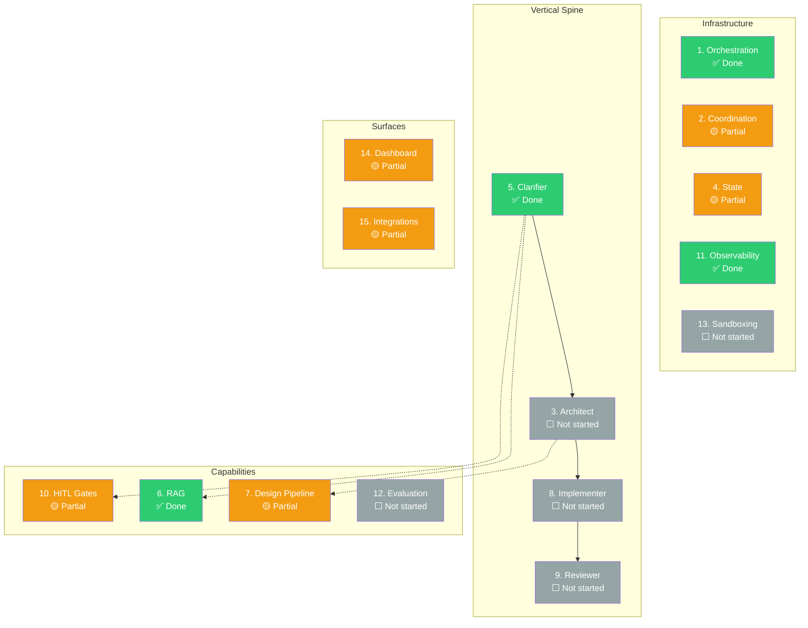

# Architecture Vision

!!! abstract "About this document"

    Reader-friendly overview of CHIP's 15-layer architecture, grouped by category.
    For the canonical authority with locked/open decisions per layer, see
    [vision.md](../vision.md) (under Internal > Governance). For the research-backed spine design, see
    [The Spine Pattern](spine-pattern.md) and [CHIP's Spine](spine-implementation.md).

---

## Status Dashboard

| # | Layer | Category | Status | Summary | Deep Dive |
|---|-------|----------|--------|---------|-----------|
| 1 | Orchestration Runtime | Infrastructure | Done | TypeScript LangGraph (ADR-043). Python deprecated. | [vision.md L1](../vision.md#layer-1-orchestration-runtime) |
| 2 | Coordination Substrate | Infrastructure | Partial | Clarifier uses typed channels. Legacy EventEmitter being migrated. | [vision.md L2](../vision.md#layer-2-coordination-substrate), [Coordination & State](../concepts/coordination-and-state.md) |
| 3 | Agent Taxonomy | Spine | Partial | Clarifier + Design pipeline operational. Architect/Implementer/Reviewer not built. | [vision.md L3](../vision.md#layer-3-agent-taxonomy), [CHIP's Spine](spine-implementation.md) |
| 4 | State & Persistence | Infrastructure | Partial | YAML artifacts + Postgres checkpointer factory. Not wired into all pipelines. | [vision.md L4](../vision.md#layer-4-state-and-persistence), [State Persistence](../concepts/state-persistence.md) |
| 5 | Clarifier | Spine | Done | 9-node LangGraph StateGraph with HITL, assumption ledger, dual modes. | [vision.md L5](../vision.md#layer-5-clarifier-front-door), [CHIP's Spine](spine-implementation.md#stage-1-clarifier) |
| 6 | RAG / Context | Capability | Done | Hybrid search (BM25 + dense + rerank). 5 MCP tools. Wired into Clarifier. | [vision.md L6](../vision.md#layer-6-rag-context-engineering), [RAG & Context](../concepts/rag-context.md) |
| 7 | Design Pipeline | Capability | Partial | Per-screen pipeline works. Cross-screen coherence is post-hoc. | [vision.md L7](../vision.md#layer-7-design-pipeline), [Design Pipeline](../concepts/design-pipeline.md) |
| 8 | Implementation | Spine | Not started | Architecture specified (single-threaded, sequential write order). | [vision.md L8](../vision.md#layer-8-implementation), [CHIP's Spine](spine-implementation.md#stage-3-implementer) |
| 9 | Review | Spine | Not started | Architecture specified (fresh context, deterministic gates first). | [vision.md L9](../vision.md#layer-9-review), [CHIP's Spine](spine-implementation.md#stage-4-reviewer) |
| 10 | HITL Gates | Capability | Partial | 2 of 3 gates operational (clarification, design approval). Code merge pending. | [vision.md L10](../vision.md#layer-10-hitl-human-in-the-loop), [HITL & Governance](../concepts/hitl-governance.md) |
| 11 | Observability | Infrastructure | Done | OTel + Langfuse self-hosted + prompt versioning + cost tracking. | [vision.md L11](../vision.md#layer-11-observability), [Observability](../concepts/observability.md) |
| 12 | Evaluation | Capability | Not started | Design evaluator exists. No golden test sets or CI integration. | [vision.md L12](../vision.md#layer-12-evaluation) |
| 13 | Sandboxing | Infrastructure | Not started | Runs on dev machine. Zero-secret design principle followed. | [vision.md L13](../vision.md#layer-13-sandboxing-and-security) |
| 14 | Dashboard & UX | Surface | Partial | 15 routes, Mantine v9. Clarifier at `/new`, Design Studio at `/design`. | [vision.md L14](../vision.md#layer-14-dashboard-and-ux), [Dashboard Architecture](../concepts/dashboard-architecture.md) |
| 15 | Integrations | Surface | Partial | CLI operational. MCP tools built. No Slack/Jira. | [vision.md L15](../vision.md#layer-15-integrations) |

> Legend: green = Done | orange = Partial | gray = Not started

---

## Infrastructure Layers

These layers provide the foundation that all spine stages and capabilities run on.

### Layer 1: Orchestration Runtime (Done)

`@langchain/langgraph` (TypeScript) is the sole orchestration runtime. Python engine deprecated via ADR-043.

**Locked:** TypeScript LangGraph only. Chosen over CrewAI (no typed state), OpenAI Agents SDK (no checkpointing), Microsoft Agent Framework (wrong ecosystem fit).

### Layer 2: Coordination Substrate (Partial)

Two distinct planes: typed LangGraph channels for coordination, EventEmitter for telemetry only.

**Locked:** Event bus demoted to telemetry. Typed channels with Zod schemas are the coordination substrate. Every cross-agent artifact has a Zod schema.

**Migration in progress:** Clarifier uses typed channels. Older design pipeline code still uses EventEmitter for some control flow.

### Layer 4: State & Persistence (Partial)

Three tiers: YAML artifacts in git, Postgres LangGraph checkpointer for run state, in-memory for ephemeral data.

**Locked:** Checkpoints on every node boundary (fine-grained resumption). Human-edited YAML always wins over agent-edited.

### Layer 11: Observability (Done)

OpenTelemetry + Langfuse self-hosted. `TracedProvider` wraps LLM calls. `LangfuseSink` emits pipeline lifecycle spans. Prompt versioning via git frontmatter + pre-commit hook.

**Locked:** OTel is the tracing standard. Cost tracking is first-class.

### Layer 13: Sandboxing (Not Started, Deferred for POC)

Target: ephemeral Docker containers with egress allowlist. Zero-secret agent design (credentials never in LLM context).

**Locked:** Zero-secret design principle followed today. Sandboxed execution is the production target.

---

## The Spine

CHIP's core: a four-stage sequential pipeline where each stage has one writer, typed handoffs, and human approval at structural boundaries.

For the universal principles behind the spine, see [The Spine Pattern](spine-pattern.md) (24 citations from Cognition, Anthropic, MetaGPT, and the academic literature).

For CHIP-specific stage details, typed contracts, and implementation status, see [CHIP's Spine](spine-implementation.md).

### Layer 3: Agent Taxonomy (Partial)

Four-stage spine replaces the original ten-agent peer network. Specialists (Research, Design, Test Gen, Security, Visual Validator, Doc Generator) are invoked as tools by spine stages.

**Locked:** Four-stage spine is committed. No flat peer network. Specialists never run as parallel writers.

### Layer 5: Clarifier (Done)

9-node LangGraph StateGraph with HITL interrupts, assumption ledger, dual bootstrap/evolution modes. First spine stage operational.

**Locked:** Clarifier is a first-class gated phase. EARS format for acceptance criteria. Question budget: micro 0-2, standard 3-7, max 15/round, 3 rounds.

### Layer 8: Implementation (Not Started)

Single-threaded tool loop with sequential write order (DB -> backend -> tests -> frontend -> tests -> integration). Cross-task parallelism via git worktrees.

**Locked:** Single-threaded writer within a task. Deterministic gates own "done." Budget caps are hard.

### Layer 9: Review (Not Started)

Fresh-context reviewer with four passes: deterministic gates, LLM review, assumption validator, triage. Bounded retry (max 2 revisions).

**Locked:** Reviewer runs in fresh context. Deterministic gates first, LLM second. Security is a specialist, not a gate.

### The Single Invariant

> **Context quality and write-coupling are the axes. Everything else is downstream.**

A system that gets context wrong produces wrong output regardless of architecture. A system that couples writes across parallel agents produces inconsistent output regardless of quality. Every decision in this architecture exists to protect one of these two properties. See [The Spine Pattern](spine-pattern.md#the-single-invariant) for the 24-citation evidence base.

---

## Capabilities

Cross-cutting capabilities invoked by spine stages.

### Layer 6: RAG / Context Engineering (Done)

Hybrid search (BM25 + dense + rerank) for code, docs, and designs. Aider-style repo map. 5 MCP-compatible tools. Wired into Clarifier.

**Locked:** Hybrid retrieval (deterministic structure first, semantic second). Skip GraphRAG (AST suffices). Skip Mem0 (97.8% junk rate).

### Layer 7: Design Pipeline (Partial)

Per-screen pipeline works (Research -> Planning -> Design -> Evaluator). Cross-screen coherence is currently post-hoc.

**Target:** Move coherence from post-hoc to in-loop. Sequential cross-screen generation via topological order with shared running context.

**Locked:** Per-screen and across-screen generation are both sequential (not parallel). DesignSpec JSON is the central intermediate representation.

### Layer 10: HITL Gates (Partial)

Three structural checkpoints: clarification (built), design/API approval (built), code merge (pending).

**Locked:** LangGraph interrupts, not application-layer callbacks. "Approve every action" is explicitly rejected.

### Layer 12: Evaluation (Not Started)

Target: golden test sets in-repo with CI-integrated regression detection. 10% regression threshold fails PRs.

**Locked:** Golden test sets live in the repo. Metrics computed automatically. Eval scenarios grow from production failures.

---

## Surfaces

User-facing layers.

### Layer 14: Dashboard & UX (Partial)

Next.js + Mantine v9. 15 routes. Clarifier at `/new`, Design Studio at `/design`, pipeline view, runs page.

**Locked:** Chat metaphor for clarifier. Real-time updates via SSE/websockets. Graph visualization via LangGraph Mermaid export.

### Layer 15: Integrations (Partial)

MCP as universal integration protocol. CLI operational. GitHub integration non-optional.

**Locked:** MCP is the tool protocol. Tools are self-hosted.

---

## Open Decisions

| Layer | Decision | Current Lean |
|-------|----------|-------------|
| L2 | Keep EventEmitter or switch to OTel-native emission for telemetry | Keep EventEmitter as facade |
| L3 | Whether Implementer research subagent is single or multiple | Single for POC |
| L3 | Whether Design subagent is owned by Architect or Implementer | Both invoke it at different granularity |
| L4 | Retention policy for checkpoints | Keep indefinitely during POC |
| L4 | SQLite for single-user local development | Possible; not locked |
| L5 | Chat metaphor vs wizard for dashboard clarifier UI | Chat (industry trend) |
| L5 | Whether user can skip the clarifier | Offer "accept all assumptions" after round 1 |
| L7 | Partial regeneration for requirement changes | Currently whole-screen regen |
| L8 | How to handle tasks with no UI or no backend | Skip irrelevant steps |
| L8 | Whether implementer can request mid-task clarification | Probably yes, via escalation |
| L8 | Whether to commit intermediate progress | Either works |
| L9 | Reviewer model choice | Sonnet for POC, possibly Opus for production |
| L9 | Schema for reviewer findings | Probably yes |
| L10 | Timeout durations per gate | Configurable per-project |
| L10 | Whether human can edit at gate or just approve/reject | Inline edits at design gate |
| L14 | Mobile experience | Desktop-first |
| L15 | Jira/Linear integration depth | Ingress only for POC |

---

## Migration Status

| Phase | What | Status |
|-------|------|--------|
| 0.1 | Deprecate Python engine (ADR-043) | Done |
| 0.2 | Typed channels in CLAUDE.md | Done |
| 0.3 | Postgres checkpointer factory | Done |
| 1 | Clarifier graph + dashboard | Done (graph), partial (dashboard) |
| 2 | RAG / retrieval layer | Done |
| 3 | Agent taxonomy collapse | Partial (Clarifier + Design built) |
| 4 | Design pipeline coherence | Partial |
| 5 | Single-threaded Implementer | Not started |
| 6 | Reviewer | Not started |
| 7 | Observability (OTel + Langfuse) | Done |
| 8 | Evaluation golden sets | Not started |

---

## Related

- [vision.md](../vision.md) --- canonical architectural authority (15 layers, locked/open decisions)
- [The Spine Pattern](spine-pattern.md) --- universal spine principles with 24 citations
- [CHIP's Spine](spine-implementation.md) --- CHIP-specific stage details and typed contracts
- [Design Decisions](../design-decisions.md) --- decisions by topic with rejected alternatives
- [Roadmap](../roadmap.md) --- phased delivery plan
