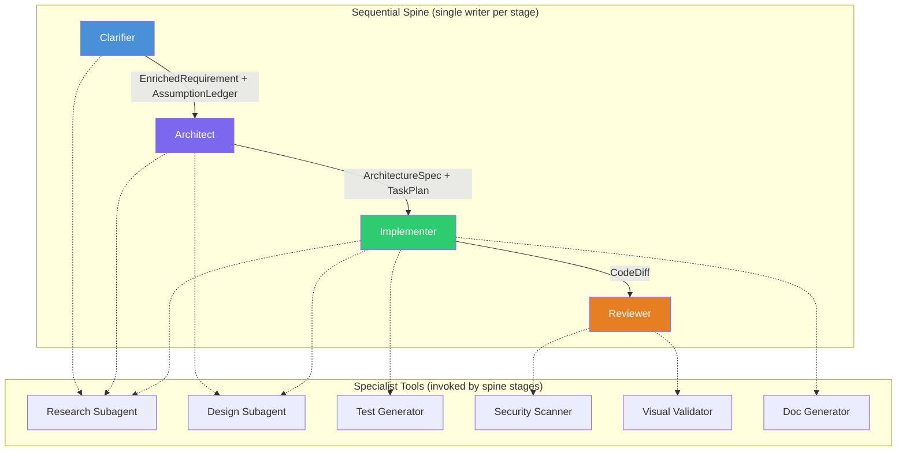

# Agent Taxonomy

> Authoritative source: [vision.md Layers 3, 5, 8, 9](../vision.md#layer-3-agent-taxonomy)

CHIP organizes its AI agents into two roles: **spine stages** that own and produce artifacts in sequence, and **specialist tools** that gather information on demand. This separation keeps writes single-threaded (one agent writes at a time) while reads can parallelize freely — specialists never modify shared artifacts.

Each spine stage owns a typed artifact and hands off to the next through Zod-typed LangGraph channels.

## How it works

Solid arrows show the sequential handoff — each stage produces a typed artifact that the next stage consumes. Dashed arrows show specialist invocation — spine stages call specialists as tools during their execution, but specialists never write to shared artifacts directly.

## Spine Stages

### Clarifier (`packages/agents-clarifier`)

The front door of CHIP. A nine-node LangGraph `StateGraph` that transforms a vague product idea into a structured PRD through 1-3 rounds of focused questions. Two HITL interrupt points pause for human input: once for answering prioritized questions, once at the escalation gate if max rounds are reached.

Supports bootstrap mode (greenfield projects with initial PRD generation) and evolution mode (existing codebases with RAG-powered change analysis). For node-level detail, routing, and gap detection mechanics, see [Clarifier Pipeline](clarifier-pipeline.md).

### Architect

!!! note "Planned"

    The Architect will consume `EnrichedRequirement` and produce `ArchitectureSpec`, ADRs, and a `TaskPlan` (DAG of scoped implementation tasks). It will invoke the design subagent for screen-level UI proposals.

### Implementer

!!! note "Planned"

    The Implementer will use a single-threaded tool loop with a fixed write order: DB migration → backend + service layer → backend tests → frontend component → frontend tests → integration test. Each step appends to LLM context so later steps see earlier decisions.

    Deterministic gates will own "done" — the LLM never self-declares completion. Hard caps: 5 iteration limit, 200K token budget, 15-minute wall clock. Cross-task parallelism via git worktrees.

### Reviewer

!!! note "Planned"

    The Reviewer will operate with fresh LangGraph context (does not inherit Implementer's conversation). Four passes:

    1. Deterministic gates: `typecheck`, `lint`, tests, Semgrep security scan, license check
    2. LLM reviewer: failure-mode checklist prompt, scoped to diff, with architecture + AssumptionLedger as context
    3. Assumption validator: compares diff against AssumptionLedger, flags contradictions
    4. Triage: blocking / suggestion / false-positive with evidence

    Bounded retry: max 2 revisions before escalation to human.

## Specialist Tools

Specialists are invoked by spine stages as tools — never as parallel writers to shared artifacts.

| Specialist | Invoked by | Implementation |
|-----------|-----------|----------------|
| Research subagent | Clarifier, Architect, Implementer | Read-only `packages/retrieval` tools returning compressed summaries |
| Design subagent | Architect, Implementer | `packages/agents-ux` design pipeline (research → planning → design → evaluator) |
| Test generator | Implementer | Emits failing tests before implementation |
| Security scanner | Reviewer | Semgrep + CodeQL diff scan, LLM triage, no autonomous remediation |
| Visual validator | Reviewer | Playwright browser verification |
| Doc generator | Implementer | API docs, user guides |

??? info "Historical context: from ten agents to four stages"

    The original ten-agent model from PRD v2.0 mapped each role to a separate agent in a peer network. This design was rejected during research before any code was written ([vision.md Layer 3](../vision.md#layer-3-agent-taxonomy)). The spine architecture was the first and only implementation — four stages absorbed the critical roles while six were demoted to specialist tools.

    | Original Agent | Disposition |
    |---------------|------------|
    | PM Agent | Absorbed into Clarifier |
    | Product Agent | Absorbed into Clarifier |
    | Architect Agent | Spine stage 2 |
    | Design Agent | Specialist tool (invoked by Architect, Implementer) |
    | Implementation Agent | Spine stage 3 |
    | Testing Agent | Specialist tool (invoked by Implementer) |
    | Review Agent | Spine stage 4 |
    | DevOps Agent | Specialist tool (invoked by Implementer) |
    | Security Agent | Specialist tool (invoked by Reviewer) |
    | Docs Agent | Specialist tool (invoked by Implementer) |

## Current implementation

The Clarifier is the only spine stage built and operational — a nine-node LangGraph StateGraph with typed channels, HITL interrupts, and Postgres checkpointing. The design pipeline operates as a specialist tool invoked manually. The remaining spine stages (Architect, Implementer, Reviewer) are specified in vision.md but not yet implemented.

## Known limitations

- **Three of four spine stages are unbuilt.** The Clarifier is operational; Architect, Implementer, and Reviewer are specified but have no code.
- **Specialist invocation is manual.** The design pipeline runs as a standalone CLI command, not as a tool automatically invoked by a spine stage.
- **No cross-stage context carryover.** Each stage will start with fresh LangGraph context by design, but the mechanism for injecting upstream artifacts (e.g., passing EnrichedRequirement to Architect) is not yet implemented.

## Related Docs

- [Vision Layer 3](../vision.md#layer-3-agent-taxonomy) — taxonomy authority
- [Vision Layer 5](../vision.md#layer-5-clarifier-front-door) — clarifier specification
- [Vision Layer 8](../vision.md#layer-8-implementation) — implementer specification
- [Vision Layer 9](../vision.md#layer-9-review) — reviewer specification
- [Clarifier Pipeline](clarifier-pipeline.md) — nine-node pipeline detail, routing, gap detection
- [Clarifier Initiative](../plans/active/clarifier-initiative/execution-plan.md) — implementation plan
