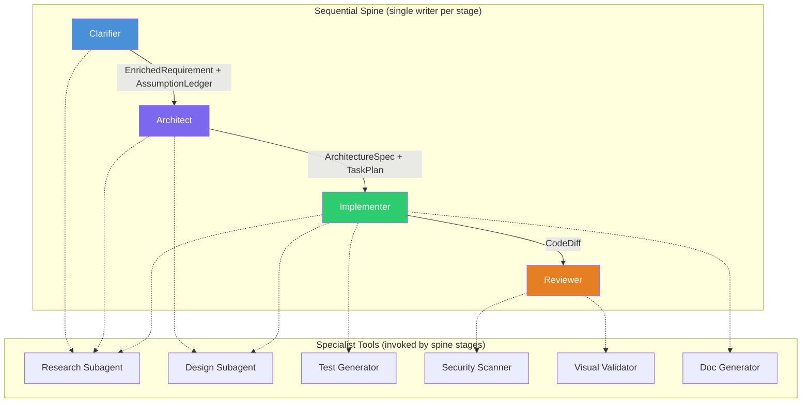

# Agent Taxonomy

> Authoritative source: [vision.md Layers 3, 5, 8, 9](../vision.md#layer-3-agent-taxonomy)

CHIP uses a four-stage sequential spine with specialist tools, replacing the original ten-agent peer network. Each spine stage owns a typed artifact, enforces single-writer discipline, and hands off through Zod-typed LangGraph channels.

## Spine Stages

### Clarifier (`packages/agents-clarifier`)

LangGraph `StateGraph` with `Annotation.Root()` typed channels. Six nodes processing in sequence: `contextRetriever` → `prdAnalyzer` → `gapDetector` → `questionPrioritizer` → `storyWriter` → `critic`. Two HITL interrupt points: before `storyWriter` (human answers questions) and at `escalationGate` (after max rounds).

- **Bootstrap mode:** Loads base catalog + design tokens. Produces initial PRD.
- **Evolution mode:** Retrieves codebase via all 5 RAG tools (`searchCode`, `searchDocs`, `searchDesigns`, `getRepoMap`, `findSimilarPatterns`). Produces change request with impact analysis.
- **Gap detection:** Deterministic checklist (auth, validation, errors, NFRs, accessibility, orphan screens) + ClarifyGPT consistency sampling (3 implementations at temp 0.7, divergence analysis at temp 0).
- **Question budget:** Micro features 0-2, standard epics 3-7, cross-cutting max 15 per round, max 3 rounds.
- **Escalation:** After max rounds, user chooses accept (best-effort PRD, confidence capped at 0.5), restart, or abandon.

### Architect (specified, not yet implemented)

Consumes `EnrichedRequirement`. Produces `ArchitectureSpec`, ADRs, and `TaskPlan` (DAG of scoped implementation tasks). Invokes design subagent for screen-level UI proposals.

### Implementer (specified, not yet implemented)

Single-threaded tool loop. Within-task write order: DB migration → backend + service layer → backend tests → frontend component → frontend tests → integration test. Each step appends to LLM context so later steps see earlier decisions.

Deterministic gates own "done" — the LLM never self-declares completion. Hard caps: 5 iteration limit, 200K token budget, 15-minute wall clock. Cross-task parallelism via git worktrees.

### Reviewer (specified, not yet implemented)

Fresh LangGraph context (does not inherit Implementer's conversation). Four passes:

1. Deterministic gates: `typecheck`, `lint`, tests, Semgrep security scan, license check
2. LLM reviewer: failure-mode checklist prompt, scoped to diff, with architecture + AssumptionLedger as context
3. Assumption validator: compares diff against AssumptionLedger, flags contradictions
4. Triage: blocking / suggestion / false-positive with evidence

Bounded retry: max 2 revisions before escalation to human.

## Specialist Tools

Specialists are invoked by spine stages as tools — never as parallel writers to shared artifacts.

| Specialist | Invoked by | Implementation |
|-----------|-----------|----------------|
| Research subagent | Clarifier, Architect, Implementer | Read-only `packages/retrieval` tools returning compressed summaries |
| Design subagent | Architect, Implementer | `packages/agents-ux` design pipeline (research → planning → design → evaluator) |
| Test generator | Implementer | Emits failing tests before implementation |
| Security scanner | Reviewer | Semgrep + CodeQL diff scan, LLM triage, no autonomous remediation |
| Visual validator | Reviewer | Playwright browser verification |
| Doc generator | Implementer | API docs, user guides |

## Collapsed Roles

The original ten-agent model mapped to a human org chart. Four of those agents are absorbed; four are demoted to specialists:

| Original Agent | Disposition |
|---------------|------------|
| PM Agent | Absorbed into Clarifier |
| Product Agent | Absorbed into Clarifier |
| Architect Agent | Spine stage 2 |
| Design Agent | Specialist tool (invoked by Architect, Implementer) |
| Implementation Agent | Spine stage 3 |
| Testing Agent | Specialist tool (invoked by Implementer) |
| Review Agent | Spine stage 4 |
| DevOps Agent | Specialist tool (invoked by Implementer) |
| Security Agent | Specialist tool (invoked by Reviewer) |
| Docs Agent | Specialist tool (invoked by Implementer) |

## Related Docs

- [Vision Layer 3](../vision.md#layer-3-agent-taxonomy) — taxonomy authority
- [Vision Layer 5](../vision.md#layer-5-clarifier-front-door) — clarifier specification
- [Vision Layer 8](../vision.md#layer-8-implementation) — implementer specification
- [Vision Layer 9](../vision.md#layer-9-review) — reviewer specification
- [Clarifier Initiative](../plans/active/clarifier-initiative/execution-plan.md) — implementation plan
