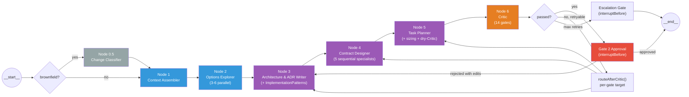
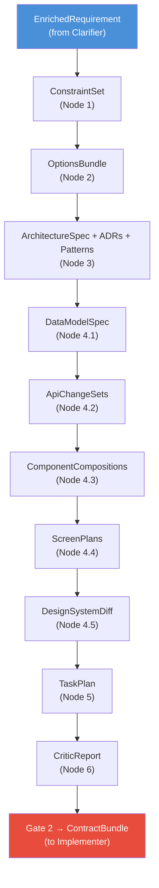

# Architect Pipeline

> Authoritative sources: [vision.md Layer 3](../vision.md#layer-3-agent-taxonomy),
> [Architect Design Research](../research/architect-design.md),
> [Codebase-Grounded Design](../research/architect-codebase-grounded-design.md),
> [R2/R3/R6 Research](../research/architect-r2-r3-r6.md)

The Architect is a senior solution architect that takes a clarified requirement and produces every contract the Implementer needs --- data model, API, component signatures, screen plans, design tokens, and a task DAG --- before a single line of code is written. This is "Approach B" (thick Architect): the research recommends it because the Implementer's sequential write order requires all cross-cutting decisions upfront ([architect-design.md §3](../research/architect-design.md)).

Implemented in `packages/agents-architect/`. Schemas and the deterministic Critic live in `packages/core/` ([ADR-056](../adrs/ADR-056-architect-package-boundary.md)).

## How it works

Seven functional nodes in a LangGraph `StateGraph`, plus two HITL interrupt points (Gate 2 approval and escalation). 24 typed state channels carry data through the pipeline. 14 deterministic Critic gates validate the output before human review.



> Gray = conditional (brownfield only) · Blue = parallel readers · Purple = single-threaded writers · Orange = critic · Red = HITL gate

## Routing functions

Three conditional routing functions control the pipeline's execution path:

- **`routeFromStart()`** --- greenfield → `contextAssembler`, brownfield → `changeClassifier`
- **`routeAfterCritic()`** --- passed → `gate2Approval`, retryable → per-gate target (see [retry routing matrix](#retry-routing-matrix)), max retries → `escalationGate`
- **`routeAfterGate2()`** --- approved → END, rejected → `architectureWriter` (re-runs with `gate2Edits`)

Source: `packages/agents-architect/src/graph/architect-graph.ts`

---

## Node details

### Node 0.5 --- Change Classifier (brownfield only)

| | |
|---|---|
| **Reads** | `existingRepoSnapshot` (filePaths array) |
| **Writes** | `existingFiles` (ReadonlySet\<string\>) |
| **LLM calls** | 0 (stub; full ChangeClassification deferred to M3.5/M4) |
| **File** | `graph/nodes/change-classifier.ts` |

Extracts file paths from the repository snapshot into an `existingFiles` set for downstream mode-consistency checks. Full LLM-based `ChangeClassification` (scope axes, blast radius, affected modules) is planned but not yet wired.

Research: recommended as a lightweight node inside the Architect graph rather than a separate stage or Clarifier concern --- `architect-codebase-grounded-design.md` [§1.3](../research/architect-codebase-grounded-design.md).

### Node 1 --- Context Assembler

| | |
|---|---|
| **Reads** | `enrichedRequirement`, `mode`, `changeClassification` (brownfield) |
| **Writes** | `constraintSet` (projectId, constraints[], gaps[], mode) |
| **LLM calls** | Greenfield: 0 (deterministic). Brownfield: 1 Sonnet call (20K token cap per R2 §7.6) |
| **File** | `graph/nodes/context-assembler.ts` |

Greenfield: deterministic constraint extraction from `EnrichedRequirement` --- no LLM call needed. Brownfield: single Sonnet call to produce a repo-map digest, fusing evidence into a `ConstraintSet`.

Research: Anthropic-style parallel reads are safe because read-only --- 90.2% lift on breadth-first research ([architect-design.md §2](../research/architect-design.md)). Reuses `buildDesignSystemContext()` from `packages/agents-ux/` ([architect-codebase-grounded-design.md §1.4](../research/architect-codebase-grounded-design.md)).

### Node 2 --- Options Explorer

| | |
|---|---|
| **Reads** | `constraintSet` (gaps[] from Node 1) |
| **Writes** | `optionsBundle` (projectId, memos[]) |
| **LLM calls** | 3--6 parallel Sonnet calls (one per open decision axis). Currently stub. |
| **File** | `graph/nodes/options-explorer.ts` |

Each subagent researches one decision axis (e.g., "Supabase vs Postgres", "Recharts vs D3"), returns a structured `OptionMemo` with alternatives, tradeoffs, and blast radius estimates. No commitments --- evidence only.

Research: parallel reads per decision axis --- [architect-design.md Node 2](../research/architect-design.md).

### Node 3 --- Architecture & ADR Writer

| | |
|---|---|
| **Reads** | `enrichedRequirement`, `assumptionLedger`, `constraintSet`, `optionsBundle`, `changeClassification`, `gate2Edits` (on re-run after rejection) |
| **Writes** | `architectureSpec` (decisions[], stackConfig, implementationPatterns[]), `adrs` (ADR[]) |
| **LLM calls** | 1 Opus call (`claude-opus-4-6`, temp=0, structured output) |
| **File** | `graph/nodes/architecture-writer.ts` |
| **Prompt** | `prompts/architecture-writer.md` (v2) |

Produces architecture decisions resolving each gap from the `optionsBundle`, ADRs documenting each decision, implementation patterns, and stack config (`frontend`, `backend`, `database`, `styling`, `componentLibrary`).

**Implementation patterns** are merged with a 7-entry baseline catalog (`patterns/baseline.ts`): `data-access-drizzle-only`, `api-error-rfc7807`, `component-tailwind-tokens-only`, `state-server-only`, `validation-zod-at-boundary`, `auth-middleware-required`, `logging-structured-pino`. Same id → LLM override wins.

Every emitted pattern must be derivable from a decision in the same response. This prevents the Flappy Bird failure mode (Cognition's Walden Yan): parallel tasks diverge on implicit decisions unless patterns are pinned beforehand.

Research: thick Architect rationale --- [architect-design.md §3](../research/architect-design.md) (Approach B). ImplementationPatterns necessity --- [architect-r2-r3-r6.md R6 §7.1](../research/architect-r2-r3-r6.md).

### Node 4 --- Contract Designer (5 sequential specialists)

Each specialist makes 1 Sonnet call (`claude-sonnet-4-6`) with structured output. Sequential order mirrors the Implementer's write order one level up --- each specialist reads prior specialists' output for cross-reference integrity. Research: "A screen spec written without the API contract settled will commit to an implicit data shape the API contract may contradict" ([architect-design.md §4](../research/architect-design.md)). Shape choice documented in [ADR-055](../adrs/ADR-055-architect-node4-shape.md).

| # | Specialist | Reads | Writes | Prompt | Research |
|---|-----------|-------|--------|--------|----------|
| 4.1 | **Data Model** | `enrichedRequirement.prd.{features, dataEntities}`, `architectureSpec.{decisions, stackConfig}`, `changeClassification` | `dataModelSpec` (entities with column types, relationships, constraints) | `contract-designer/data-model.md` (v1) | R6 §6.1--6.2 |
| 4.2 | **API** | prior + `dataModelSpec` | `apiChangeSets[]` (OpenAPI 3.1 endpoint changes) | `contract-designer/api.md` (v1) | R6 §6.3 |
| 4.3 | **Components** | prior + `apiChangeSets` | `componentCompositions[]` (component trees with prop signatures) | `contract-designer/components.md` (v1) | R6 §6.4 |
| 4.4 | **Screens** | prior + `componentCompositions` | `screenPlans[]` (routes, data bindings referencing entity IDs, navigation targets) | `contract-designer/screens.md` (v1) | R6 §6.5 |
| 4.5 | **Design System Diff** | `architectureSpec.{stackConfig, implementationPatterns}`, `componentCompositions`, `screenPlans`, `deps.designSystemContext` | `designSystemDiff` (addedTokens, modifiedTokens, removedTokens) | `contract-designer/design-system-diff.md` (v1) | R6 §6.6 |

Brownfield: `ChangeClassification.scopeAxes` controls which specialists run. Only specialists for active axes execute --- if `scopeAxes.api === false`, the API specialist is skipped.

Dispatch orchestration: `graph/nodes/contract-designer/index.ts`.

### Node 5 --- Task Planner

| | |
|---|---|
| **Reads** | ALL output channels (enrichedRequirement through designSystemDiff), plus `constraintSet`, `assumptionLedger`, `existingFiles` |
| **Writes** | `taskPlan` (projectId, tasks[], featureCoverage) |
| **LLM calls** | 1--2 Opus calls (initial + optional dry-Critic retry) |
| **File** | `graph/nodes/task-planner.ts` |
| **Prompt** | `prompts/task-planner.md` (v1) |

Produces a `TaskPlan` DAG where each task carries:

- `mode` --- `'NEW'` or `'MODIFY'`
- `estimatedTokenBudget` --- per-task context window estimate
- `contextRefs[]` --- pointers to contract elements (entities, API changes, screen plans, patterns)
- `patternRefs[]` --- pointers to implementation patterns the task must follow
- `acceptanceCriteriaIds[]` --- PRD EARS criteria this task satisfies

**Post-processing:** `estimateTaskTokenBudget()` from `sizing-heuristic.ts` re-estimates budgets. Formula: BASE(4K) + contextRef costs + dependency costs(3K each) + file output costs(400 each). Clamped to [1K, 120K].

**Dry-Critic:** After producing the task plan, runs gates 10--14 immediately (patternRef-resolution, contextRef-resolution, acceptanceCriteria-coverage, tokenBudget-feasibility, mode-consistency). If any fail, retries once with failure feedback before handing off to the full Critic.

Research: task decomposition --- [architect-r2-r3-r6.md R2](../research/architect-r2-r3-r6.md) (screen/endpoint-level granularity, 6--10 tasks per feature). TaskNode schema additions --- R2 Q7. Context scoping --- R3 §3.

### Node 6 --- Critic

| | |
|---|---|
| **Reads** | ALL output channels. Assembles full `ContractBundle` from state. |
| **Writes** | `criticReport`, `criticPassed`, `criticRetries` (incremented), `lastFailedGate` |
| **LLM calls** | 0 --- all 14 gates are deterministic validation |
| **File** | `graph/nodes/critic.ts` (wrapper) + `packages/core/src/architect/critic.ts` (gates) |

Calls `validateContractBundle(bundle, enrichedRequirement, existingFiles)` from `@agentforge/core`. 14 gates organized in three tiers:

| Gates | Name | What it checks |
|-------|------|---------------|
| 1--4 | schema-validation, dag-acyclic, single-writer, prd-criterion-coverage | Structural validity |
| 5--9 | entity-reference-integrity, gap-resolution-completeness, openapi-lint, migration-sql-parses, adr-completeness | Contract coherence |
| 10--14 | patternRef-resolution, contextRef-resolution, acceptanceCriteria-coverage, tokenBudget-feasibility, mode-consistency | Task plan completeness |

Gate 14 (mode-consistency) honors `existingFiles`: skips when undefined (greenfield), enforces strict check when defined (brownfield) --- MODIFY tasks must reference files that actually exist.

Research: fresh context, deterministic gates first --- [architect-design.md Node 6](../research/architect-design.md). Contract-blindness prevention --- [architect-r2-r3-r6.md R6 Q5](../research/architect-r2-r3-r6.md) (10 failure modes mapped).

### Gate 2 Approval (HITL interrupt)

No-op pass-through node; the `interruptBefore: ['gate2Approval']` is the gate. Human reviews the full `ContractBundle` (architecture decisions, ADRs, contracts, task DAG). Sets `gate2Decision` (approved/rejected) and optional `gate2Edits` (partial `ContractBundle` corrections). If rejected, routes back to Node 3 with edits.

Vision Layer 10 mandates Gate 2 on the happy path --- not as a retry-max fallback. Dashboard UI for Gate 2 review is deferred ([backlog](../plans/backlog/gate2-dashboard-ui.md)).

### Escalation Gate (HITL interrupt)

No-op pass-through; fires after max retries (1 per gate) or when Gate 14 (mode-consistency) fails --- humans must resolve invented file paths.

---

## Data flow

Channels accumulate through the pipeline. Each node reads upstream channels and writes its own output:



### State channels (24 total)

| Category | Channels | Count |
|----------|----------|-------|
| **Input** | enrichedRequirement, assumptionLedger, mode, existingFiles, existingRepoSnapshot, retrievalContext | 6 |
| **Node outputs** | changeClassification, constraintSet, optionsBundle, architectureSpec, adrs, dataModelSpec, apiChangeSets, componentCompositions, screenPlans, designSystemDiff | 10 |
| **Task + Critic** | taskPlan, criticReport, criticPassed, criticRetries | 4 |
| **Routing + Gate 2** | lastFailedGate, gate2Decision, gate2Edits, threadId | 4 |

Source: `packages/agents-architect/src/graph/state.ts`

### Context slicing

`sliceContractBundle(contextRefs, bundle)` in `context-slicer.ts` filters the full bundle to only the contract elements a task references. Maps `contextRef.kind` to bundle fields:

- `'dataModel.entity'` → filters entities by id
- `'apiChangeSet'` → filters API change sets by id
- `'componentComposition'` → filters by screenId
- `'screenPlan'` → filters screen plans by id
- `'pattern'` → filters implementation patterns by id

Reduces token load by ~70% per task (R3 §3).

### Sizing heuristic

`estimateTaskTokenBudget(task, bundle)` in `sizing-heuristic.ts` estimates per-task context:

| Element | Token cost |
|---------|-----------|
| Base system prompt | 4,000 |
| Entity | 800 + 50 per field |
| API ChangeSet | 600 + 200 per endpoint |
| Component Composition | 500 |
| Screen Plan | 700 |
| Pattern | 150 |
| Dependency | 3,000 |
| File output | 400 per file |

Clamped to [1,000, 120,000]. Tasks below 8K suggest merging; tasks above 120K need splitting.

---

## Retry routing matrix

`routeAfterCritic()` in `retry-routing.ts` maps each failed gate to its retry target. Max 1 retry per gate before escalation.

| Gate | Retry target |
|------|-------------|
| 1--4 (schema, DAG, single-writer, PRD-coverage) | Node 5 (Task Planner) |
| 5 (entity-reference-integrity) | Node 4 (Contract Designer) |
| 6 (gap-resolution-completeness) | Node 3 (Architecture Writer) |
| 7 (openapi-lint) | Node 4 (Contract Designer) |
| 8 (migration-sql-parses) | Node 4 (Contract Designer) |
| 9 (adr-completeness) | Node 3 (Architecture Writer) |
| 10--13 (patternRef, contextRef, criteria, budget) | Node 5 (Task Planner) |
| 14 (mode-consistency) | Escalation Gate (humans resolve) |

---

## Greenfield vs. brownfield

| Parameter | Greenfield | Brownfield |
|-----------|-----------|------------|
| Node 0.5 | Skipped (all axes `true`) | Runs, produces `existingFiles` |
| Node 1 | Deterministic (no LLM call) | Sonnet call with repo context |
| Node 3 | Every pick gets an ADR | Default to existing patterns; deviation requires ADR |
| Node 4 | All 5 specialists run | Only specialists for touched scope axes |
| Gate 14 | Skipped (`existingFiles` undefined) | Enforces mode-consistency against real files |

---

## Design pipeline integration

The design pipeline (`packages/agents-ux/`) has 4 stages: Research → Planning → Design → Evaluator. The Architect absorbs the upstream work; the Implementer (M4) invokes only downstream stages as specialist tools.

| Stage | Standalone mode | Spine mode | What changes |
|-------|----------------|------------|-------------|
| Research | `researchNode` | **Architect Node 1 + Node 4** | Constraints, patterns, accessibility grounded in structured PRD (not flat strings) |
| Planning | `planningNode` | **Architect Node 4** | Component tree, token bindings, screen specs become typed contracts |
| Design | `designNode` | **Implementer specialist tool** | Receives Architect's `ScreenPlan` + `ComponentComposition` → DesignSpec JSON |
| Evaluator | `evaluatorNode` | **Implementer specialist tool** | Same quality gate, but with richer contract context |

This cuts the design pipeline from 4 stages to 2 when called by the Implementer --- because the Architect already did the research and planning work. The standalone CLI path (`design:page` command) continues running all 4 stages for development iteration.

### Integration timeline

| Milestone | Integration step | Status |
|-----------|-----------------|--------|
| M1 | Clarifier PRD flows into design pipeline (1,086× richer context) | **Complete** |
| M2 | Architect schemas + Critic (contract validation) | **Complete** |
| M3 | Architect absorbs Research + Planning (producer side) | **Complete** |
| M3.5 | Brownfield design delta research (R9 brief) | **Next** |
| M4 | Implementer invokes Design + Evaluator using Architect contracts (consumer side) | After M3.5 |
| Phase 8 | Remove standalone Research/Planning; design pipeline = 2 stages only | After M4 battle-tested |

### End-state: Greenfield (e.g., "Build an expense tracker")

```
User idea → Clarifier (bootstrap mode)
  → EnrichedRequirement (structured PRD: screens, entities, features)

→ Architect
  → Node 1: constraints from design tokens, catalog
  → Node 2: explore options (Supabase vs Postgres, Recharts vs D3)
  → Node 3: architecture decisions + ADRs + patterns
  → Node 4: DataModelSpec → ApiChangeSets → ComponentCompositions → ScreenPlans → DesignSystemDiff
  → Node 5: TaskPlan DAG (10 tasks with budgets, contextRefs, patternRefs)
  → Node 6: Critic (14 gates)
  → Gate 2: Human reviews ContractBundle

→ Implementer (M4)
  Backend tasks: write code using DataModelSpec + ApiChangeSets
  Frontend tasks with UI:
    1. Receives ScreenPlan + ComponentComposition from Architect
    2. Invokes designNode → DesignSpec JSON (SKIPS Research + Planning)
    3. Invokes evaluatorNode → quality validation
    4. Uses DesignSpec as blueprint → writes component code
```

### End-state: Brownfield (e.g., "Add budgeting to existing app")

```
User idea → Clarifier (evolution mode + RAG)
  → Identifies: new Budget entity, new budget-overview screen,
    modified dashboard (add budget progress)

→ Architect
  → Node 0.5: scopeAxes { ui:true, api:true, dataModel:true, designSystem:false }
  → Node 4: ONLY 3 specialists run (data-model, api, screens)
    4.4 ScreenPlans:
      - budget-overview: NEW screen (full ScreenPlan)
      - dashboard: MODIFIED screen (delta component tree)
  → Node 5: MODIFY + NEW tasks; Gate 14 validates MODIFY tasks reference real files

→ Implementer (M4)
  T5 (NEW screen): full design generation
  T6 (MODIFY screen): loads existing DesignSpec, applies delta,
    preserves existing nodes, adds BudgetProgressSection
```

---

## Components

| File | Role |
|------|------|
| `src/graph/state.ts` | `ArchitectStateAnnotation` (24 channels) |
| `src/graph/architect-graph.ts` | `StateGraph` assembly + `interruptBefore` |
| `src/graph/retry-routing.ts` | `routeAfterCritic()` gate-to-target matrix |
| `src/graph/nodes/change-classifier.ts` | Node 0.5 (brownfield) |
| `src/graph/nodes/context-assembler.ts` | Node 1 |
| `src/graph/nodes/options-explorer.ts` | Node 2 |
| `src/graph/nodes/architecture-writer.ts` | Node 3 |
| `src/graph/nodes/contract-designer/index.ts` | Node 4 (orchestrator) |
| `src/graph/nodes/contract-designer/{data-model,api,components,screens,design-system-diff}.ts` | Node 4 specialists |
| `src/graph/nodes/task-planner.ts` | Node 5 |
| `src/graph/nodes/critic.ts` | Node 6 (wraps core Critic) |
| `src/graph/nodes/gate2-approval.ts` | Gate 2 HITL |
| `src/graph/nodes/escalation-gate.ts` | Escalation HITL |
| `src/deps.ts` | `ArchitectDeps` interface |
| `src/run.ts` | `runArchitect()` + `runArchitectPipelineStream()` |
| `src/context-slicer.ts` | `sliceContractBundle()` |
| `src/sizing-heuristic.ts` | `estimateTaskTokenBudget()` |
| `src/patterns/baseline.ts` | 7 seed patterns |
| `src/prompts/**/*.md` | 10 versioned prompts |

---

## Known limitations

- **Nodes 0.5, 1, 2 are stubs.** LLM calls for change classification (Node 0.5), brownfield repo-map digest (Node 1), and options exploration (Node 2) are deferred.
- **Gate 2 dashboard UI deferred.** LangGraph interrupt machinery is built; visual review page is [backlogged](../plans/backlog/gate2-dashboard-ui.md).
- **No browser E2E tests.** Unit + integration + eval coverage ships; Playwright tests are [backlogged](../plans/backlog/architect-e2e-tests.md).
- **Shared module extraction incomplete.** `buildDesignSystemContext` + `assessCatalogAdoption` remain in `agents-ux` as peer imports ([ADR-045 addendum](../adrs/ADR-045-evaluator-deferred-to-phase-2.md)).

!!! warning "Brownfield design delta (M3.5 research)"

    Four open questions block brownfield frontend tasks in M4:

    1. **Per-screen impact analysis** --- Node 0.5 identifies scope axes but not per-screen node-level impact. `ChangeClassification` is module-granularity, not screen-node-granularity.
    2. **DesignSpec delta format** --- DesignSpec v2 has no delta format (unchanged/modified/new/removed nodes). Research sketches the approach but no schema exists.
    3. **MODIFY task context** --- MODIFY tasks need `existingDesignSpec + deltaTree` but the Implementer wiring doesn't exist.
    4. **Design info value** --- Does injecting DesignSpec context into code-generation tasks improve quality or bloat context?

    Tracked as M3.5 in the [spine build-out plan](../plans/active/chips-next-steps/execution-plan.md).

---

## Related

- [Spine Implementation §2](../architecture/spine-implementation.md) --- architecture-level detail
- [Agent Taxonomy](agent-taxonomy.md) --- spine stages and specialist tools
- [HITL & Governance](hitl-governance.md) --- Gate 2 checkpoint
- [Design Pipeline](design-pipeline.md) --- standalone pipeline concept, spine integration table
- [ADR-055](../adrs/ADR-055-architect-node4-shape.md) --- Contract Designer node shape
- [ADR-056](../adrs/ADR-056-architect-package-boundary.md) --- core vs agents-architect split
- [Architect Design Research](../research/architect-design.md) --- Approach A vs B, five load-bearing properties, 24 citations
- [Codebase-Grounded Design](../research/architect-codebase-grounded-design.md) --- typed contracts, shared modules, three codebase adjustments
- [R2/R3/R6 Research](../research/architect-r2-r3-r6.md) --- task decomposition, context management, spec-driven methodology
