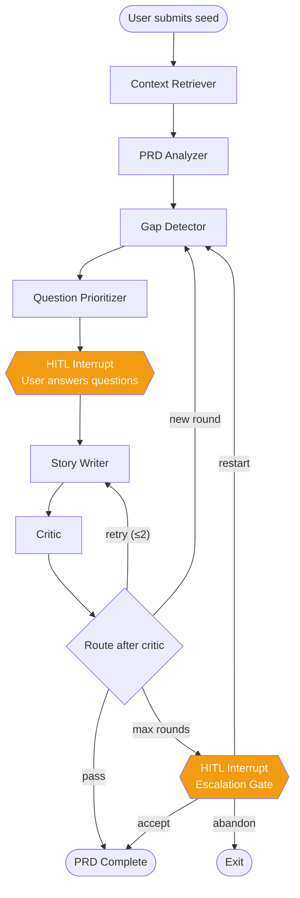
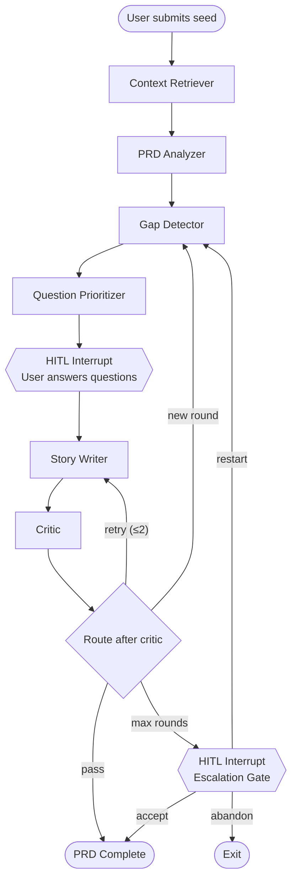

# Clarifier Pipeline

> Authoritative source: [vision.md Layer 5](../vision.md#layer-5-clarifier-front-door) and [research-report.md Part 3](../research-report.md#part-3-conversational-clarification-agents)

The clarifier is the front door of CHIP. Before any architecture, code, or design is generated, every idea passes through a six-stage pipeline that transforms a vague seed ("recipe sharing app with search and ratings") into a structured PRD (Product Requirements Document) with explicit assumptions, acceptance criteria, and a feature dependency graph. The clarifier asks questions before building — not after.

Think of it as a senior product manager who interviews you in 2-3 rounds of focused questions, records every decision, and produces a complete spec that downstream stages can execute against without guessing.

## Why CHIP does this

No commercial AI coding tool ships a proper clarification pipeline. Bolt, Lovable, and v0 accept a text prompt and start generating immediately. Cursor asks clarifying questions but only about code changes, not product requirements. Devin explicitly expects someone else to clarify first.

The research report, Part 3, documents why this matters:

> *"The clarifier is AgentForge's highest-leverage differentiation opportunity because no commercial product has integrated the necessary pieces. The academic foundation is sound; the commercial space has not caught up."* — `docs/research-report.md`, Part 3

The vision document states the consequence of skipping clarification:

> *"A text-box input without clarification is the most common root cause of autonomous agent failures documented in the research report (Answer.AI's Devin test, Replit Agent 3 'creative workarounds', the general 'looks-right-but-broken' failure mode)."* — `docs/vision.md`, Layer 5

Answer.AI's controlled test of Devin (20 tasks, Jan 2025) produced 3 successes, 14 failures, 3 inconclusive — primarily because tasks were underspecified and the agent made silent assumptions instead of asking.

## How it works

The clarifier runs as a LangGraph `StateGraph` — the first real graph in the CHIP monorepo. It has six processing nodes, two human-in-the-loop (HITL) interrupt points, and conditional routing that supports multi-round clarification with bounded retries.

Mermaid source (paste into mermaid.live)

### Stage 1: Context Retriever

Loads project context before any LLM call. In **bootstrap mode** (new app), it reads the base component catalog and design tokens. In **evolution mode** (change to existing app), it calls all 5 RAG tools — code search, doc search, design search, repo map, and similar patterns — via `Promise.allSettled` so partial failures don't block the pipeline.

No LLM calls. Pure file reads and retrieval queries.

### Stage 2: PRD Analyzer

Takes the raw user input and extracted context, sends it to **Claude Opus** (`claude-opus-4-6`) with a forced-JSON response schema. Opus is used here (not Sonnet) because extracting structured intent from ambiguous natural language — features, screens, data entities, NFRs (Non-Functional Requirements), success metrics — requires stronger reasoning than downstream stages.

Output: a structured `PRD` object validated with `PRDSchema.safeParse()`.

### Stage 3: Gap Detector

The core differentiator. Runs two passes to find what's missing, ambiguous, or conflicting in the PRD:

**Pass 1 — Deterministic checklist.** Scans the PRD for common gaps: authentication mentioned but not specified, forms without validation rules, no error handling, NFRs without measurable targets, screens not linked to features, no accessibility requirements. High recall, low cost.

**Pass 2 — ClarifyGPT consistency sampling.** Two LLM calls with Claude Sonnet:

1. Generate 3 distinct implementation approaches from the PRD (temperature 0.7 for diversity)
2. Analyze where the approaches diverge (temperature 0 for precision)

Each divergence point becomes a `Gap` with `divergentInterpretations` — the concrete approaches that disagreed. This technique comes from the ClarifyGPT paper (ACM FSE 2024, Mu et al.), which demonstrated that **behavioral divergence detects ambiguity more reliably than text analysis**.

> *"Consistency sampling is the cheapest high-value ambiguity signal. Generate 3–5 plausible implementations; any material divergence is a gap; questions target the divergence."* — `docs/research-report.md`, Part 3

### Stage 4: Question Prioritizer

Ranks gaps by Expected Value of Perfect Information (EVPI) — a proxy score: `blastRadius × answerability × confidenceGap`. High-impact gaps with low confidence become questions; low-impact gaps become assumptions in the Assumption Ledger.

Question budget prevents the "100 questions" anti-pattern:

- Micro features (≤5 items): 2 questions max
- Standard epics (6-15 items): 7 questions max
- Cross-cutting (>15 items): 15 questions max, across ≤3 rounds

Below-threshold gaps are recorded as assumptions with evidence, confidence score, blast radius, and a `requiresConfirmation` flag. The Assumption Ledger is a first-class artifact that flows through every downstream stage.

No LLM calls. Pure computation.

### Stage 5: Story Writer

Takes the PRD, user answers, and assumptions. Produces:

- **EnrichedRequirement** — the PRD wrapped with clarification context and confidence
- **FeaturePlan** — a DAG (Directed Acyclic Graph) of features with dependencies
- **Acceptance criteria** in EARS format: `WHEN <condition> THE SYSTEM SHALL <behavior>`

Uses Claude Sonnet. After max rounds without convergence, caps confidence at 0.5 and marks remaining gaps as assumptions with `requiresConfirmation: true`.

### Stage 6: Critic

Deterministic quality gate. Checks:

- **EARS compliance**: every acceptance criterion has a non-empty condition and behavior
- **INVEST compliance**: stories have adequate descriptions and criteria counts
- **DAG consistency**: no orphan dependencies, no cycles (detected via depth-first search)

Bounded retry: fails ≤2 times → routes back to Story Writer. After 2 retries → passes with warnings.

No LLM calls in current implementation (prompt scaffolded for optional LLM review).

## Two modes, one pipeline

The same six nodes handle both **bootstrap** (new app from scratch) and **evolution** (change to existing app). The difference is in context retrieval:

| Aspect | Bootstrap | Evolution |
|--------|-----------|-----------|
| Context Retriever | Base catalog + tokens | All 5 RAG tools (code, docs, designs, repo map, patterns) |
| PRD Analyzer | Thorough feature discovery | Impact-focused analysis |
| Gap Detector | Full checklist + ClarifyGPT | Filters gaps already addressed by prior human responses |
| Question Prioritizer | Standard budget | Multiple-choice when codebase precedent exists |

## HITL interrupts

Two human checkpoints, implemented via LangGraph's `interruptBefore`:

1. **Question gate** (before `storyWriter`): the user sees prioritized questions and answers them. Their responses are passed back through the graph's `humanResponses` channel.

2. **Escalation gate** (after max rounds): if 3 rounds of Q&A haven't converged, the user chooses:
   - **Accept**: proceed with best-effort PRD (confidence ≤0.5)
   - **Restart**: reset round counter, re-enter gap detection
   - **Abandon**: exit

State persists across interrupts via the LangGraph checkpointer (MemorySaver or PostgresSaver).

## Components

| Component | File | Role |
|-----------|------|------|
| Context Retriever | `packages/agents-clarifier/src/nodes/context-retriever.ts` | Loads project context for both modes |
| PRD Analyzer | `packages/agents-clarifier/src/nodes/prd-analyzer.ts` | Extracts structured PRD via Claude Opus |
| Gap Detector | `packages/agents-clarifier/src/nodes/gap-detector.ts` | Two-pass gap detection (deterministic + ClarifyGPT) |
| Question Prioritizer | `packages/agents-clarifier/src/nodes/question-prioritizer.ts` | EVPI ranking + assumption generation |
| Story Writer | `packages/agents-clarifier/src/nodes/story-writer.ts` | EARS criteria + FeaturePlan DAG |
| Critic | `packages/agents-clarifier/src/nodes/critic.ts` | EARS/INVEST/DAG compliance checks |
| Graph builder | `packages/agents-clarifier/src/graph/clarifier-graph.ts` | StateGraph assembly + conditional routing |
| Pipeline runner | `packages/agents-clarifier/src/run.ts` | `runClarifierPipeline()` — entry point for dashboard |
| State annotation | `packages/agents-clarifier/src/graph/state.ts` | 15 typed LangGraph channels |
| DI factory | `packages/agents-clarifier/src/deps.ts` | `ClarifierDeps` interface for dependency injection |

## Known limitations

- **Question options are not domain-specific.** The ClarifyGPT divergence analysis generates concrete approaches, but they lack grounding in real-world product patterns. A question about JWT storage should offer options like "HttpOnly cookies (Stripe pattern)" rather than generic descriptions. See [Question Generation Research](../research/clarifier-question-generation.md) for the proposed fix.

- **Round 2+ loses prior context.** When the pipeline re-runs after user answers, the gap detector regenerates implementation approaches from the original PRD without incorporating round 1 decisions. The user's "no auth, localStorage" answers don't constrain round 2's analysis.

- **No expertise adaptation.** The same questions are shown to a technical founder and a non-technical PM. The research report recommends progressive disclosure based on user language signals.

- **Dashboard integration is partial.** API routes and the `/new` page exist, but the UX is under active redesign (CHIP UX Overhaul Phase 3). The `/evolve` page for evolution mode is not yet built.

## Related

- [Coordination & State](coordination-and-state.md) — how typed LangGraph channels work
- [RAG & Context](rag-context.md) — the retrieval layer the clarifier consumes
- [HITL & Governance](hitl-governance.md) — how human gates are enforced
- [Question Generation Research](../research/clarifier-question-generation.md) — proposed improvements to option quality
- [ADR-043](../adrs/ADR-043-typescript-only-orchestration.md) — TypeScript LangGraph as sole runtime
