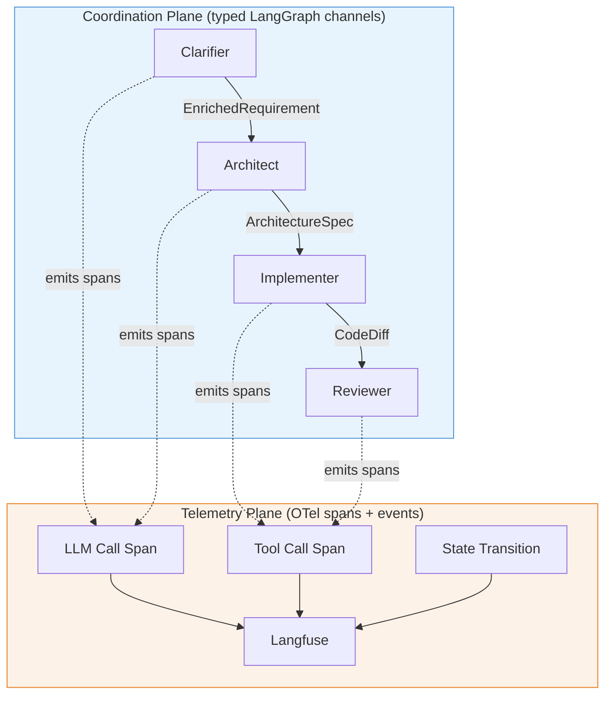

# Coordination & State

> Authoritative source: [vision.md Layers 2 and 4](../vision.md#layer-2-coordination-substrate)

## The Two-Plane Model

Agent systems need two kinds of communication, and conflating them is the single most common architectural mistake:

1. **Coordination** — "Agent B, here is the enriched requirement; produce an architecture spec." This is a typed contract with a specific shape.
2. **Telemetry** — "Agent B started at 14:32, consumed 4,200 tokens, cost $0.03." This is observability data for debugging and dashboards.

Most agent frameworks use one mechanism for both. CHIP separates them explicitly.

### Coordination Plane

Every artifact that crosses a stage boundary has a **Zod schema** in `packages/core/src/types/`. The LangGraph state graph declares typed channels with explicit reducers:

- **Last-write-wins** — most channels (e.g., `architectureSpec`)
- **Concatenation** — channels where items accumulate (e.g., `assumptionLedger`, `errors`)
- **Merge** — channels where partial updates are combined

Shape errors are caught at authoring time, not in production. With a ten-agent event bus, that's ~45 pairwise channels where untyped payloads could silently drift. Typed channels reduce this to zero.

### Telemetry Plane

The in-memory `EventEmitter` is demoted to telemetry only. It emits spans for observability, debugging, and replay — but **no control flow decisions depend on event subscriptions.** If the event bus goes down, the pipeline still runs. If a span is dropped, no agent behavior changes.

## State Persistence

CHIP uses three tiers, each optimized for its access pattern:

| Tier | What | Backend | Why |
|------|------|---------|-----|
| **Artifacts** | PRDs, design specs, task plans, tokens | YAML files in git | Human-readable, version-controlled, diff-friendly |
| **Run state** | Current node, channel contents, interrupt status, cost counters | Postgres (LangGraph checkpointer) | Durable across restarts, supports time-travel debugging |
| **Ephemeral** | Tool call results, intermediate subagent outputs | In-memory | No persistence needed; already compressed into summaries |

### Why Not Just YAML for Everything?

YAML works for artifacts — they're read by humans, edited by humans, version-controlled in git. But run state needs different properties: atomic writes, checkpoint/resume on crash, time-travel for debugging. If a 15-minute implementation task crashes at minute 12, you want to resume from the last checkpoint, not rerun from scratch ($5 of LLM calls lost).

## Current State

- **Coordination:** Event bus still used for some control flow (legacy). New code uses typed LangGraph channels (Clarifier is the first graph).
- **State:** YAML artifacts working. Postgres checkpointer factory implemented (`MemorySaver` for dev, `PostgresSaver` when `DATABASE_URL` set). Not yet wired into pipelines beyond Clarifier.
- **Telemetry:** OTel spans via `TracedProvider` + `LangfuseSink`. Working end-to-end.

## Key Decisions

| Decision | Rationale | ADR |
|----------|-----------|-----|
| Event bus demoted to telemetry only | Prevents silent-drift bugs from untyped payloads | [Vision Layer 2](../vision.md#layer-2-coordination-substrate) |
| Typed LangGraph channels with Zod schemas | Shape errors caught at compile time | [ADR-043](../adrs/ADR-043-typescript-only-orchestration.md) |
| Postgres checkpointer for run state | Durable, resumable, time-travel debugging | [Vision Layer 4](../vision.md#layer-4-state-and-persistence) |
| YAML stays for artifacts | Human-readable, git-native, diff-friendly | [Vision Layer 4](../vision.md#layer-4-state-and-persistence) |

## Related Docs

- [Vision Layer 2](../vision.md#layer-2-coordination-substrate) — coordination substrate authority
- [Vision Layer 4](../vision.md#layer-4-state-and-persistence) — state persistence authority
- [ADR-043](../adrs/ADR-043-typescript-only-orchestration.md) — TypeScript-only orchestration
