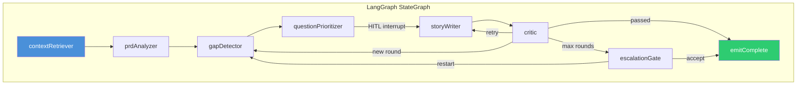
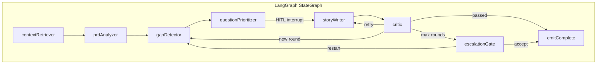

# Coordination & State

> Authoritative source: [vision.md Layers 2 and 4](../vision.md#layer-2-coordination-substrate)

CHIP's agents communicate through typed state channels, not through an event bus. Each spine stage reads from shared state, does its work, and writes back a partial update. The LangGraph runtime merges updates via declared reducers. The event bus exists only for telemetry — if it goes down, no agent behavior changes.

This separation — coordination through typed channels, telemetry through EventEmitter — is a deliberate architectural choice. Research Report Part 1, "Inter-agent communication," ranks five coordination patterns and concludes: "Shared typed state (channels + reducers) — the right default for spine-level artifacts." Event buses lose type information at boundaries, producing silent drift bugs that are expensive to debug in production agent pipelines (Design Decisions, Section 1.2).

## How it works



<details><summary>Mermaid source (paste into mermaid.live)</summary>



</details>

Every node function receives the full `ClarifierState` and returns `Partial<ClarifierState>` — only the fields it changed. LangGraph's channel reducers merge the partial into the full state automatically.

## Worked example: Clarifier state channels

The Clarifier graph (`packages/agents-clarifier/src/graph/state.ts`) defines 15 typed channels via `Annotation.Root()`:

```typescript
export const ClarifierStateAnnotation = Annotation.Root({
  rawInput:    Annotation<string>({ reducer: (_, b) => b, default: () => '' }),
  mode:        Annotation<ClarifierMode>({ reducer: (_, b) => b, default: () => 'bootstrap' }),
  context:     Annotation<ClarifierContext>({ reducer: (_, b) => b, default: () => ({}) }),
  gaps:        Annotation<readonly Gap[]>({ reducer: (_, b) => b, default: () => [] }),
  questions:   Annotation<readonly Question[]>({ reducer: (_, b) => b, default: () => [] }),
  // The only accumulator: each HITL round's answers append, never overwrite
  humanResponses: Annotation<readonly HumanResponse[]>({
    reducer: (a, b) => [...a, ...b],
    default: () => [],
  }),
  requirement: Annotation<EnrichedRequirement | null>({ reducer: (_, b) => b, default: () => null }),
  assumptions: Annotation<AssumptionLedger | null>({ reducer: (_, b) => b, default: () => null }),
  round:       Annotation<number>({ reducer: (_, b) => b, default: () => 1 }),
  // ... plus maxRounds, error, prdDraft, featurePlan, criticRetries, criticPassed, escalationDecision
});
```

Two reducer strategies appear:

| Reducer | Behavior | Used by |
|---------|----------|---------|
| `(_, b) => b` | Last-write-wins | 14 of 15 channels (`rawInput`, `gaps`, `requirement`, `assumptions`, etc.) |
| `(a, b) => [...a, ...b]` | Accumulator (append) | `humanResponses` only — each HITL round adds answers without losing previous rounds |

The graph compiles with HITL interrupts at `storyWriter` (human answers questions) and `escalationGate` (accept/restart/abandon after max rounds):

```typescript
const compiled = graph.compile({
  interruptBefore: ['storyWriter', 'escalationGate'],
  checkpointer,  // MemorySaver or PostgresSaver
});
```

When an interrupt fires, the checkpointer persists the full channel state. The dashboard resumes by calling `compiled.invoke()` with the same `threadId` — the graph picks up exactly where it left off.

## Components

| Component | File | Role |
|-----------|------|------|
| `ClarifierStateAnnotation` | `packages/agents-clarifier/src/graph/state.ts` | Channel definitions with reducers |
| `compileClarifierGraph()` | `packages/agents-clarifier/src/graph/clarifier-graph.ts` | Graph topology: 8 nodes, conditional edges, HITL interrupts |
| `routeAfterCritic()` | same file | Routes to retry, new round, escalation, or complete |
| `routeAfterEscalation()` | same file | Routes to accept, restart, or abandon |
| `createCheckpointer()` | `packages/core/src/checkpointer/index.ts` | `MemorySaver` (dev) or `PostgresSaver` (when `DATABASE_URL` set) |
| Cross-boundary Zod schemas | `packages/core/src/types/cross-boundary-artifacts.schemas.ts` | 10 schemas for artifacts crossing stage boundaries |

## Telemetry plane

`EventEmitter` from `eventemitter3` handles observability. `TracedProvider` in `packages/telemetry/` wraps LLM calls with OTel spans. `LangfuseSink` emits pipeline-stage lifecycle spans. `CompositeSink` combines transport sinks (CLI stdout, dashboard SSE) with LangfuseSink.

The clarifier uses zero EventBus calls for coordination. Its only event emission is `writeBridgeEvent()` after successful completion — a telemetry notification, not a control-flow signal.

## Current implementation

- **Coordination:** The Clarifier is the first production LangGraph `StateGraph` with typed channels. Older design pipeline code still uses EventEmitter for some control flow (migration target: typed channels for all new spine stages).
- **Zod schemas:** 10 cross-boundary artifact schemas in `packages/core/src/types/cross-boundary-artifacts.schemas.ts` (AssumptionLedger, EnrichedRequirement, PRD, FeaturePlan, ChangeClassification, ScreenPlan, APIChangeSet, Diff, ReviewResult).
- **Persistence:** Checkpointer factory operational. Postgres via Docker Compose at `docker/docker-compose.agentforge.yml` (Postgres 16, port 5433).

## Known limitations

- Older pipeline code paths still use EventEmitter for some control flow — migration to typed channels is ongoing per vision Layer 2.
- The gap-detector node defines LLM response schemas as raw JSON Schema objects rather than using `zod-to-json-schema` — a deviation from the typed contract rule.
- State persistence degrades silently to in-memory when `DATABASE_URL` is unset — crash recovery is unavailable in dev without explicit Postgres setup.

## Related

- [State Persistence](state-persistence.md) — YAML artifacts, checkpointer tiers, crash recovery
- [Vision Layer 2](../vision.md#layer-2-coordination-substrate) — coordination authority
- [Vision Layer 4](../vision.md#layer-4-state-and-persistence) — persistence authority
- [ADR-043](../adrs/ADR-043-typescript-only-orchestration.md) — LangGraph adoption
- [Observability](observability.md) — telemetry plane details
