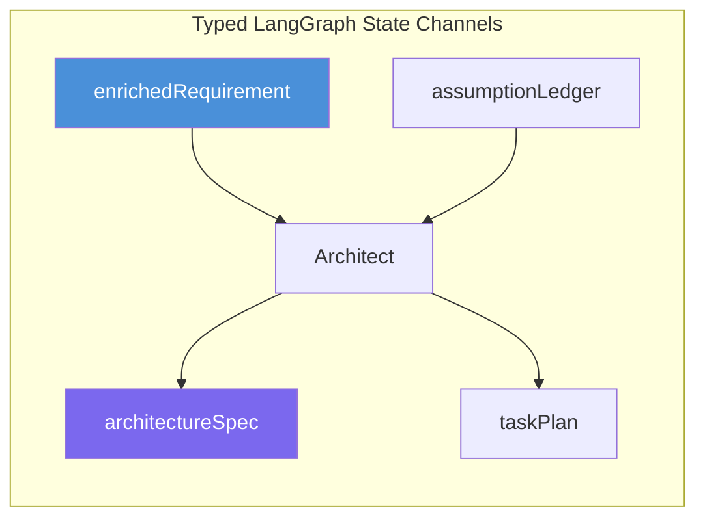

# Coordination & State

> Authoritative source: [vision.md Layers 2 and 4](../vision.md#layer-2-coordination-substrate)

CHIP separates coordination (typed LangGraph channels with Zod schemas) from telemetry (OTel spans + EventEmitter). Spine stages communicate through declared state channels with explicit reducers. The event bus is demoted to observability — no control flow depends on event subscriptions.

## Coordination Plane

Every artifact crossing a stage boundary has a Zod schema in `packages/core/src/types/`. Channel reducers are declared per field:

| Reducer | Usage | Example |
|---------|-------|---------|
| Last-write-wins | Most channels | `architectureSpec`, `enrichedRequirement` |
| Concatenation | Accumulating channels | `assumptionLedger`, `errors` |
| Merge | Partial update channels | State metadata |

The Clarifier graph (`packages/agents-clarifier/src/graph/clarifier-graph.ts`) is the first production implementation: `Annotation.Root()` with typed channels, `interruptBefore` for HITL gates, conditional routing (`routeAfterEscalation`) for escalation handling.

## Telemetry Plane

`EventEmitter` from `eventemitter3` handles observability. `TracedProvider` wraps LLM calls with OTel spans. `LangfuseSink` emits pipeline-stage lifecycle spans. `CompositeSink` combines transport sinks (CLI stdout, dashboard SSE) with LangfuseSink.

If the event bus goes down or a span is dropped, no agent behavior changes. The pipeline runs identically without telemetry infrastructure.

## State Persistence

Three tiers, each optimized for its access pattern:

| Tier | Content | Backend | Properties |
|------|---------|---------|------------|
| Artifacts | PRDs, design specs, task plans, tokens, catalog | YAML in `agentforge/spec/` (git-tracked) | Human-readable, diffable, version-controlled |
| Run state | Current node, channel contents, interrupt status, cost counters | Postgres via `@langchain/langgraph-checkpoint-postgres` | Durable, resumable, time-travel debugging |
| Ephemeral | Tool call results, subagent intermediate outputs | In-memory per run | Discarded after compression into summaries |

Checkpointer factory in `packages/core/src/checkpointer/`: `MemorySaver` for development, `PostgresSaver` when `DATABASE_URL` is set. Docker Compose at `docker/docker-compose.agentforge.yml` (Postgres 16, port 5433). Checkpoints fire on every node boundary for fine-grained resumption.

Human-edited YAML always wins over agent-edited YAML. File locking prevents concurrent corruption. Content hashing detects human edits mid-agent-write.

## Current Implementation

- **Coordination:** Clarifier uses typed LangGraph channels. Older code paths still use EventEmitter for some control flow (migration target: typed channels for all new code).
- **Persistence:** YAML artifacts operational across all pipelines. Postgres checkpointer factory implemented, wired into Clarifier. Docker Compose ready.
- **Telemetry:** OTel spans via `TracedProvider` + `LangfuseSink` working end-to-end. Prompt versioning enforced.

## Related Docs

- [Vision Layer 2](../vision.md#layer-2-coordination-substrate) — coordination authority
- [Vision Layer 4](../vision.md#layer-4-state-and-persistence) — persistence authority
- [ADR-043](../adrs/ADR-043-typescript-only-orchestration.md) — LangGraph adoption
- [Observability](observability.md) — telemetry plane details
