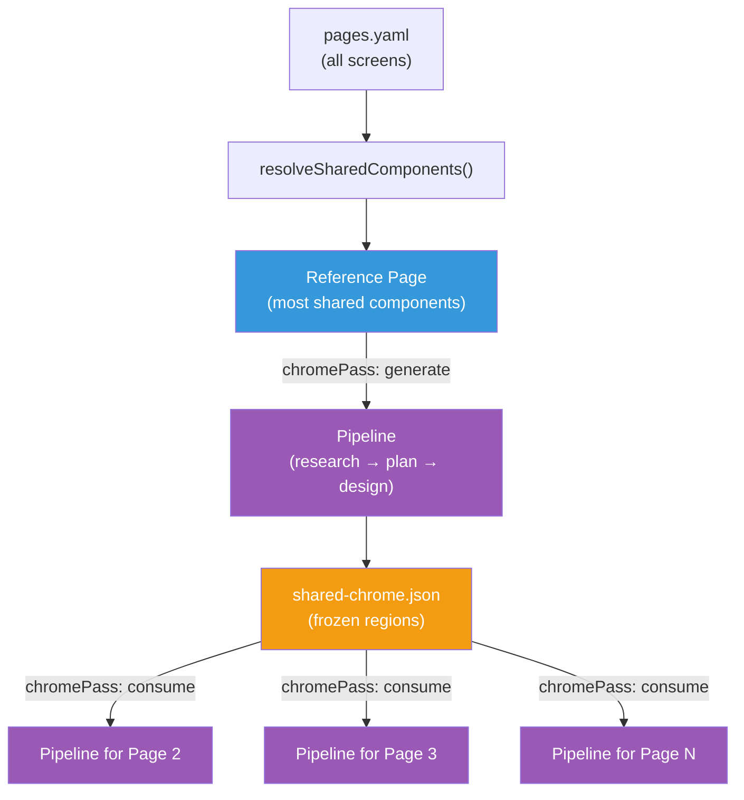
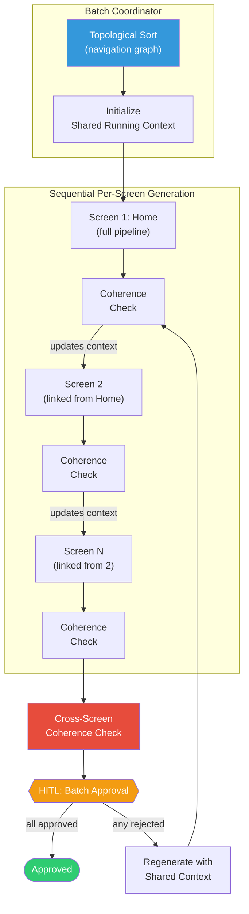

# Cross-Screen Coherence

> Authoritative source: [vision.md Layer 7](../vision.md#layer-7-design-pipeline) and [Design Pipeline Dataflow](../architecture/design-pipeline-dataflow.md)

When CHIP generates designs for multiple screens in a project, each screen shares visual elements — navigation bars, headers, color tokens, data entity fields, and component patterns. Cross-screen coherence ensures these shared elements remain consistent across all screens, so the result feels like one application rather than a collection of independent pages.

## Current State: Chrome Pass

The design pipeline generates screens one at a time. To share visual chrome (headers, navigation, footers), the pipeline uses a two-phase Chrome Pass via `runPagesWithChromePass()` in `packages/agents-ux/src/design-pipeline/run-pages.ts`:

1. **Generate phase:** A reference page (the one sharing the most components with other pages) runs the full pipeline with `chromePass: { mode: 'generate' }`. The design agent produces a complete spec including chrome regions.
2. **Consume phase:** Each subsequent page runs with `chromePass: { mode: 'consume', spec: chromeSpec }`. The frozen chrome from the reference page is injected into the design prompt, and the design agent reproduces it without modification.

`resolveSharedComponents()` selects the reference page by analyzing which page has the most components in common with other pages.

Chrome Pass handles shared visual elements (headers, navigation bars), but it does not enforce consistency for:

- Data entity field names referenced across screens
- Design token usage (which colors, typography, spacing tokens each screen applies)
- Component variant selection (which catalog entries are used and how)
- Navigation route declarations (whether declared targets actually exist)

These are caught only by post-hoc informational checks, not enforced during generation.

## Target State: In-Loop Coherence (Vision Layer 7)

The target architecture wraps each per-screen pipeline as a LangGraph subgraph. A batch coordinator runs screens in topological order (home first, then pages linked from home) with a shared running context that threads through all screens.

**Running context threaded across screens includes:**

- Navigation routes each screen declares (for cross-screen nav validation)
- Component usage (which catalog entries and variants are in use)
- Design tokens touched (for consistency enforcement)
- Data fields referenced (for model alignment)

**Key behavioral changes from current state:**

- Coherence check runs per-screen _inside_ the generation loop, not after all screens are complete
- Cross-screen coherence runs before the HITL approval gate, blocking approval until resolved
- Incoherence triggers targeted regeneration with shared context, not post-hoc fixing
- HITL approval is atomic for the whole batch — any rejected screen drops all affected screens back to correction

## Related

- [Design Pipeline](design-pipeline.md) — per-screen pipeline stages
- [Design Pipeline Dataflow](../architecture/design-pipeline-dataflow.md) — full data flow with Chrome Pass
- [vision.md Layer 7](../vision.md#layer-7-design-pipeline) — locked and open decisions
- [CHIP's Next Steps M1](../plans/active/chips-next-steps/m1-execution-plan.md) — `runPagesWithChromePass()` extraction (prerequisite)
