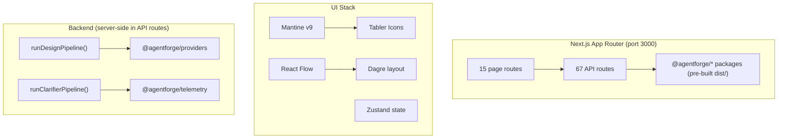

# Dashboard & UX

> Authoritative source: [vision.md Layer 14](../vision.md#layer-14-dashboard-and-ux)

CHIP's dashboard is a Next.js App Router application that serves as the primary interface for running pipelines, reviewing designs, managing approvals, and monitoring agent activity. It communicates with backend agent packages through Next.js API routes — the same `runDesignPipeline()` function runs from both the CLI and the dashboard, ensuring identical behavior regardless of entry point.

## Why CHIP does this

Vision Layer 14 identifies three primary surfaces the dashboard must provide: a clarifier surface (conversational input), a pipeline surface (graph visualization of spine runs), and an artifacts surface (PRDs, design specs, diffs). The dashboard is not a separate system from the agent pipeline — it is a thin presentation layer over the same typed artifacts and pipeline functions the CLI uses. This "one pipeline, two entry points" pattern prevents the common failure where dashboard and CLI pipelines diverge (see `docs/issues/cli-dashboard-pipeline-divergence.md`).

## How it works



<details><summary>Mermaid source (paste into mermaid.live)</summary>


</details>

### Page structure

The dashboard has 15 routes organized in two layout groups:

**`(dashboard)` group** — wrapped in `DashboardShell` (sidebar + header):

| Route | Page | Purpose |
|-------|------|---------|
| `/` | Home | State-aware landing pad with project status, recent runs, pending approvals |
| `/pipeline` | Runs | 4-stage spine visualization, run history table, emergency controls |
| `/design` | Design Studio | Per-screen design generation, approval, prototype preview |
| `/spec` | Spec Viewer | Browse pages.yaml, models.yaml, api.yaml |
| `/tasks` | Tasks | Task kanban board |
| `/agents` | Agents | Agent configuration and status |
| `/agents/[id]/live` | Live Agent | Real-time agent monitoring |
| `/approvals` | Approvals | Pending HITL approval center |
| `/trust` | Governance | Trust levels and permission configuration |
| `/costs` | Budget | Cost tracking per run and per project |
| `/integrations` | Integrations | External service configuration |
| `/new` | New Project | Clarifier conversational input |
| `/audit` | Design Audit | Cross-screen design quality audit |
| `/traces` | Traces | Agent trace viewer |

**`(standalone)` group** — no shared shell:

| Route | Page | Purpose |
|-------|------|---------|
| `/onboarding` | Onboarding | First-time project setup wizard |

The sidebar navigation (`packages/dashboard/src/components/layout/sidebar-nav.tsx`) groups pages into five sections: **Build** (Runs, Design Studio, Spec), **Execute** (Tasks, Agents, Approvals), **Govern** (Trust, Budget), **Configure** (Integrations), and **External** (Langfuse link at `http://localhost:3001`).

### Backend communication

Two patterns connect the dashboard to agent code:

**Pattern 1: API routes import monorepo packages server-side.** `next.config.js` lists `@agentforge/*` packages as `serverExternalPackages` so webpack does not bundle them — Node.js loads the pre-built `dist/` files at runtime. API route handlers directly call functions like `runDesignPipeline()`, `runClarifierPipeline()`, and `generateAppSpec()`.

**Pattern 2: Client components fetch API routes.** React components call `fetch('/api/...')` for data. Real-time updates use event streaming via `use-event-feed.ts` and `use-run-progress.ts` hooks.

### Build requirements

The dashboard uses pre-built `dist/` from monorepo packages, not raw TypeScript source. This makes cold-start fast but means **packages must be rebuilt before running the dashboard** after any package source change:

```bash
nx run-many -t build          # rebuild all packages
cd packages/dashboard && npm run dev   # start dashboard on port 3000
```

## Components

| Component | File | Role |
|-----------|------|------|
| Root layout | `packages/dashboard/src/app/layout.tsx` | MantineProvider with dark theme |
| Dashboard layout | `packages/dashboard/src/app/(dashboard)/layout.tsx` | DashboardShell wrapper |
| Sidebar nav | `packages/dashboard/src/components/layout/sidebar-nav.tsx` | 5-section navigation |
| Pipeline input builder | `packages/dashboard/src/app/api/_lib/pipeline-input-builder.ts` | Constructs `PipelineInput` for dashboard API routes |
| Dashboard SSE sink | `packages/dashboard/src/app/api/_lib/dashboard-sink.ts` | Telemetry sink for real-time UI updates |
| Theme | `packages/dashboard/src/theme.ts` | `chipTheme` Mantine configuration |

## Current implementation

- 15 page routes, 67 API route files covering the full pipeline lifecycle.
- UI built on Mantine v9, React Flow for graph visualization, Zustand for state management, Recharts for cost charts.
- API routes import `@agentforge/*` packages server-side — the same `runDesignPipeline()` runs from both CLI and dashboard.
- Design Studio at `/design` provides per-screen generation, approval, and prototype preview with a live browser renderer on port 4100.
- CHIP UX Overhaul (active initiative) is redesigning pages following a state-aware, spine-oriented layout pattern.

## Known limitations

- The formal `ApiClient` interface (`packages/dashboard/src/lib/api-client.ts`) matching PRD Section 28 is fully stubbed — all methods return `notImplemented`. Pages use direct `fetch()` instead.
- Real-time updates use polling and SSE; the vision targets Server-Sent Events or WebSockets with proper connection management.
- The dashboard pipeline path for `design:page:all` reuses the CLI command directly (`designPageAllCommand`), bypassing the dashboard's own `DashboardSseSink` telemetry.
- No mobile experience — desktop-first per vision Layer 14.

## Related

- [Vision Layer 14](../vision.md#layer-14-dashboard-and-ux) — dashboard authority
- [Design Pipeline](design-pipeline.md) — how designs are generated and previewed
- [HITL & Governance](hitl-governance.md) — approval gates surfaced in the dashboard
- [Observability](observability.md) — Langfuse traces linked from agent nodes
