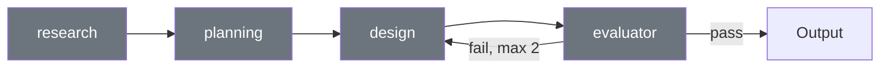

# Design Pipeline

> Authoritative source: [vision.md Layer 7](../vision.md#layer-7-design-pipeline) and [Design Pipeline Dataflow](../architecture/design-pipeline-dataflow.md)

Per-screen design generation — transforms a screen requirement into a validated DesignSpec JSON through four sequential stages. Each stage builds on the previous: research gathers constraints, planning decides structure, design produces the spec, and the evaluator validates it. Sequential execution ensures each stage has clean context from its predecessors — research findings inform planning decisions, planning structure constrains design choices.

Single entry point: `runDesignPipeline()` in `packages/agents-ux/src/design-pipeline/pipeline.ts`. Both CLI (`design:page`) and dashboard (`/api/design`) call the same orchestrator.

## Pipeline Stages

Four stages because each needs different context: research discovers project constraints the LLM would otherwise hallucinate; planning makes structural decisions before committing to visual details; design generates the full spec with planning decisions as guardrails; evaluation catches errors before human review.



| Stage | Node Function | Cached Artifact | Output |
|-------|--------------|-----------------|--------|
| `research` | `researchNode` | `researchBrief` | Project context: tokens, catalog, brand, existing designs |
| `planning` | `planningNode` | `planningSpec` | Screen plan: layout structure, component choices, data bindings, nav routes |
| `design` | `designNode` | `designSpecV2` | DesignSpec JSON (flat adjacency list of typed nodes) |
| `evaluator` | `evaluatorNode` | — | Token compliance, catalog correctness, layout quality, vision model review |

Stage order is defined by `STAGE_ORDER` in `pipeline.ts`. Pipeline supports resume from any stage via `input.stage` parameter — the orchestrator skips stages before the requested start index if cached artifacts exist.

## DesignSpec JSON

The LLM produces a flat adjacency list of `NodeSpec` objects. `AcceleratorType` values: `page`, `container`, `section`, `header`, `divider`, `spacer`, `text`. Nodes reference catalog entries by ID (e.g., `catalog: "button"`, `catalog: "input"`). Overrides specify token-based styling (colors, typography, spacing).

The LLM decides **what** to render (node tree, content, catalog references). The renderer in `packages/designspec-renderer` decides **how** (React components, CSS, Tailwind classes). The LLM never produces API calls or framework-specific code.

!!! note "Schema constraints"

    Anthropic's grammar compiler enforces a 24-optional-field limit per schema. Internal-only fields (set programmatically, never by the LLM) use local type intersections (`NodeSpec & { field?: Type }`) to avoid consuming slots.

## Renderer

Following the design/render separation (above), the renderer is a deterministic transformation — no LLM calls, no design decisions. `packages/designspec-renderer` translates DesignSpec JSON to React/shadcn/Tailwind components in a Vite-served browser app (port 4100). The dashboard auto-starts the renderer; Playwright E2E tests use `waitForRendererReady()`.

Catalog resolution normalizes IDs via `normalizeCatalogIdToKebab()` in `catalog/catalog-id.ts`. Color tokens resolve through `resolveTokenColor()`. Missing catalog types fall back to container rendering with a warning — dedicated renderers exist for all built-in catalog types.

## Evaluator

Deterministic checks catch structural errors (missing fields, invalid types) with certainty and at zero LLM cost. The vision model review catches design quality issues (alignment, visual hierarchy, readability) that no automated metric can detect. Two passes combine both:

1. **Mechanical checks** (deterministic): Token compliance, catalog entry validation, required fields present, navigation routes valid.
2. **Vision model review** (LLM): Screenshot + compact evaluation context (`buildEvaluationContext(spec)`, ~300-600 tokens vs ~4,000-15,000 for raw JSON). The vision LLM sees the rendered output — the context only provides what the image can't convey (intent, names, `navigateTo` targets, token references).

Correction loop: evaluator findings feed back to the design node for a corrected spec. Bounded at 2 iterations. Progressive evaluation adjusts severity thresholds per iteration.

## Spine Integration

In standalone mode (CLI, dashboard), all four stages run in sequence. In spine mode, the Architect stage handles research and planning through its own nodes — the Implementer invokes only the design and evaluator stages as specialist tools, passing the Architect's `ScreenPlan`, `ComponentComposition`, and `DesignTokensSpec` as input.

| Stage | Standalone | Spine mode |
|-------|-----------|------------|
| Research | `researchNode` | Architect Node 1 + Node 4 |
| Planning | `planningNode` | Architect Node 4 |
| Design | `designNode` | Implementer specialist tool |
| Evaluator | `evaluatorNode` | Implementer specialist tool |

See [spine-implementation.md §4](../architecture/spine-implementation.md#design-pipeline-integration) for integration-level detail on the redistribution.

## Cross-Screen Architecture

### Current approach

Screens generate independently. After individual approval, a coherence pass checks consistency across navigation routes, component usage, and shared tokens. This pass reports findings but does not trigger regeneration.

### Target vision

Batch coordinator runs screens in topological order (home first, linked pages next) with shared running context threading: navigation routes, component usage, tokens referenced, data fields. Coherence checking moves in-loop — incoherence triggers per-screen regeneration with the shared context, not post-hoc fixing.

## Three-Layer Architecture

```
Layer C — Transport Callers
  CLI design:page.ts ──────────┐
  CLI design-page-all.ts ──────┤
  Dashboard design/route.ts ───┤── PipelineInput
  Spine Implementer (tool) ────┘        │
                                         ▼
Layer B — Orchestrator: runDesignPipeline()
  Sequential: research → planning → design → evaluator
  Caching: per-stage JSON artifacts for resume
  Telemetry: PipelineTelemetrySink callbacks
  Dispatch: designTool → browserDesignWork

Layer A — Work Functions (pure agent logic)
  uxResearchWork()  → typed UXResearchOutput
  uxPlanningWork()  → typed UXPlanningOutput
  browserDesignWork() → typed DesignSpecV2
```

## Related Docs

- [Spine Implementation: Design Pipeline Integration](../architecture/spine-implementation.md#design-pipeline-integration) — how the pipeline integrates as a specialist tool within the spine
- [Vision Layer 7](../vision.md#layer-7-design-pipeline) — design pipeline authority
- [Design Pipeline Dataflow](../architecture/design-pipeline-dataflow.md) — end-to-end data flow (standalone pipeline)
- [Design Evaluator](../architecture/design-evaluator.md) — evaluation architecture
- [ADR-034](../adrs/ADR-034-flat-adjacency-list-over-nested-tree.md) — flat adjacency list
- [ADR-035](../adrs/ADR-035-catalog-first-component-model.md) — catalog-first components
- [ADR-047](../adrs/ADR-047-browser-default-design-tool.md) — browser as default tool
- [Visual Diversity Plan](../plans/active/visual-diversity/execution-plan.md) — quality initiative
