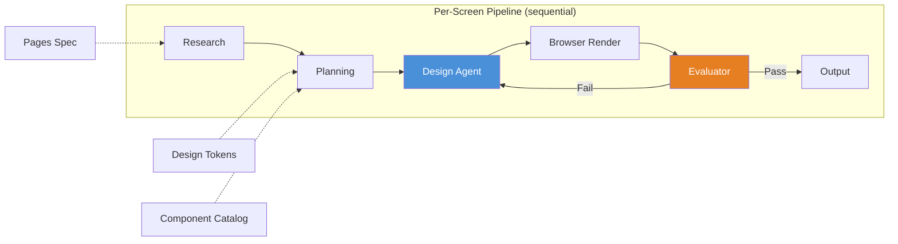

# Design Pipeline

> Authoritative source: [vision.md Layer 7](../vision.md#layer-7-design-pipeline) and [Design Pipeline Dataflow](../architecture/design-pipeline-dataflow.md)

## Why Design Gets Its Own Pipeline

Most AI coding tools treat UI as an afterthought — generate HTML, maybe add Tailwind classes, ship it. The result is software that looks like every other AI-generated app: Inter font, generic blue, "wrap everything in a card."

CHIP treats design as a first-class engineering problem. A dedicated pipeline generates, validates, and iterates on designs using real rendering (not mockups), vision-based evaluation (not just code checks), and project-specific design tokens (not hardcoded defaults).

## How It Works

**Seven stages, one entry point (`runDesignPipeline()`):**

1. **Research** — Loads project context: design tokens, component catalog, brand spec, existing designs. In evolution mode, retrieves current codebase patterns via RAG.
2. **Planning** — Produces a screen plan: layout structure, component choices, data bindings, navigation routes. Uses design tokens and catalog as constraints.
3. **Design Agent** — Generates a **DesignSpec JSON** (flat adjacency list of nodes with types, overrides, and catalog references). The LLM decides *what* to render; it never generates API calls.
4. **Browser Render** — A deterministic renderer translates DesignSpec JSON into a real browser page using shadcn/Tailwind components. This is not a mockup — it's the actual component library.
5. **Evaluator** — Takes a screenshot of the rendered page and evaluates it: token compliance, catalog correctness, layout quality, visual coherence. Mechanical checks run first; vision LLM review second.
6. **Correction Loop** — If the evaluator flags issues, the design agent receives the findings and produces a corrected spec. Bounded to 2 iterations.
7. **Output** — Final DesignSpec JSON + rendered screenshot saved to `agentforge/designs/<screen>/`.

## The WHAT/HOW Separation

The most important architectural decision in the design pipeline:

| Layer | Responsibility | Format |
|-------|---------------|--------|
| **LLM** (what) | Decides layout, component choices, content, styling | DesignSpec JSON (~300-600 tokens per screen) |
| **Renderer** (how) | Translates JSON to real components, handles API quirks | React + shadcn + Tailwind |

Previous approaches let the LLM generate 600+ line scripts calling design tool APIs directly. The LLM hallucinated API calls ~30% of the time. With DesignSpec, the LLM outputs compact JSON; the renderer deterministically produces correct output. This eliminated all API bugs and reduced token usage ~89%.

## Cross-Screen Coherence

Today, screens are generated one at a time. The target architecture serializes screens in topological order (home first, then pages linked from home) with a shared running context that threads:

- Navigation routes declared by each screen
- Component usage (catalog entries, variants)
- Design tokens referenced
- Data fields for model alignment

Coherence checking moves from post-hoc (informational) to in-loop (blocking before approval).

## Current State

- **Working:** Per-screen pipeline (research → planning → design → render → evaluation → correction)
- **Working:** Design Studio dashboard at `/design` with per-screen approval
- **Working:** Prototype renderer with screen-to-screen navigation
- **Partial:** Cross-screen coherence (post-hoc only, not in-loop)
- **Not built:** Batch generation with topological ordering

## Key Decisions

| Decision | Rationale | ADR |
|----------|-----------|-----|
| Flat adjacency list for DesignSpec | Stays within LLM structured output limits (24 optional fields) | [ADR-034](../adrs/ADR-034-flat-adjacency-list-over-nested-tree.md) |
| Catalog-first component model | Reusable components with consistent anatomy | [ADR-035](../adrs/ADR-035-catalog-first-component-model.md) |
| Browser as default design tool | Real components, no design tool API quirks | [ADR-047](../adrs/ADR-047-browser-default-design-tool.md) |
| Separate WHAT from HOW | LLM produces intent (JSON), renderer produces output | [Lessons Learned](../lessons-learned-rules.md#designspec-v2-separate-what-from-how) |

## Related Docs

- [Vision Layer 7](../vision.md#layer-7-design-pipeline) — design pipeline authority
- [Design Pipeline Dataflow](../architecture/design-pipeline-dataflow.md) — end-to-end data flow
- [Design Evaluator](../architecture/design-evaluator.md) — evaluation architecture
- [Design Generation Guide](../guides/design-generation.md) — operational how-to
- [Visual Diversity Plan](../plans/active/visual-diversity/execution-plan.md) — active quality initiative
