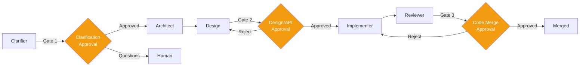

# HITL & Governance

> Authoritative source: [vision.md Layer 10](../vision.md#layer-10-hitl-human-in-the-loop) and [Governance & Operations Spec](../specs/governance-and-operations.md)

## Why Three Gates, Not One

Most AI coding tools have a single approval point: review the PR before merge. This catches implementation bugs but misses two earlier, cheaper opportunities:

1. **Before design:** Did we understand the problem correctly? (Fixing a misunderstood requirement after code is written costs 10-50x more than fixing it before design starts.)
2. **After design, before code:** Does the architecture make sense? Are the UI screens right? (Redesigning after implementation is a full rewrite.)

CHIP places human checkpoints at three moments where human judgment has maximum leverage and minimum cost.

## The Three Gates

### Gate 1: Clarification

The Clarifier batches questions for the human. Multiple-choice where possible (grounded in codebase patterns via RAG). The human answers, and the clarifier refines the requirement. After 3 rounds without convergence, the human can accept (with capped confidence), restart, or abandon.

### Gate 2: Design / API Approval

After the design pipeline produces screens, the human reviews them in the Design Studio. Cross-screen approval is atomic — rejecting one screen drops the whole batch back to correction. This is where architecture decisions get validated before code is written.

### Gate 3: Code Merge

Per-hunk diff review integrated with the git host (GitHub PR). The Reviewer has already run deterministic checks and LLM review; the human focuses on semantic decisions.

## LangGraph Interrupts

All three gates are implemented as **LangGraph interrupts**, not application-layer callbacks:

1. When an interrupt fires, the graph state is persisted to the Postgres checkpointer.
2. The dashboard exposes the pending approval with full context.
3. When the human decides, the graph resumes from exactly where it stopped.
4. If the process crashes, the interrupt state survives — no lost approvals.

This is fundamentally different from application-layer callbacks (webhooks, polling), where the approval state lives in application memory and dies with the process.

## Governance Middleware

CHIP wraps every agent execution with governance middleware that enforces:

| Layer | What it does |
|-------|-------------|
| **Permission** | Checks whether the operation is allowed for this trust level |
| **Budget** | Enforces token/cost budgets per-run with real-time tracking |
| **HITL** | Routes to human approval based on policy level |
| **Audit** | Records every decision for replay and compliance |

The middleware ordering matters: permission checks happen first (cheapest), then budget (aborts early if exceeded), then HITL (most expensive — human attention).

### Policy Levels

Projects configure their approval appetite:

| Level | Behavior |
|-------|----------|
| `full_approval` | Every gate requires explicit human approval |
| `review_and_override` | Human reviews; system proceeds unless vetoed |
| `notify_only` | Human notified; system proceeds automatically |
| `fully_autonomous` | No human involvement (for trusted, low-risk tasks) |

## The Explicit Anti-Pattern

CHIP does **not** implement "approve every tool call" or "approve every file write." This produces rubber-stamping: the human clicks "approve" without reading because the 47th approval prompt looks the same as the first. It's vulnerable to approval fatigue and defeats the purpose of autonomy.

Instead: structural gates at phase boundaries where the human reviews a meaningful artifact (requirement, design, code diff), not individual operations.

## Current State

- **Gate 1 (Clarification):** Implemented via LangGraph `interruptBefore` in the Clarifier graph. Dashboard integration at `/new` partially complete.
- **Gate 2 (Design Approval):** Working in Design Studio. Per-screen approval with accept/reject/correct. Cross-screen atomic approval not yet implemented.
- **Gate 3 (Code Merge):** Not yet implemented (Implementer/Reviewer not built).
- **Governance middleware:** Budget and audit layers exist. HITL middleware framework defined.

## Key Decisions

| Decision | Rationale | ADR |
|----------|-----------|-----|
| Three gates, not one | Catch errors at lowest correction cost | [Vision Layer 10](../vision.md#layer-10-hitl-human-in-the-loop) |
| LangGraph interrupts for HITL | State survives process crashes | [Vision Layer 10](../vision.md#layer-10-hitl-human-in-the-loop) |
| No "approve every action" | Prevents rubber-stamping and approval fatigue | [Vision Layer 10](../vision.md#layer-10-hitl-human-in-the-loop) |
| Governance as middleware, not service | Wraps execution without separate infrastructure | [ADR-004](../adrs/ADR-004-governance-middleware-ordering.md) |

## Related Docs

- [Vision Layer 10](../vision.md#layer-10-hitl-human-in-the-loop) — HITL authority
- [Governance & Operations Spec](../specs/governance-and-operations.md) — middleware details
- [ADR-004](../adrs/ADR-004-governance-middleware-ordering.md) — middleware ordering
