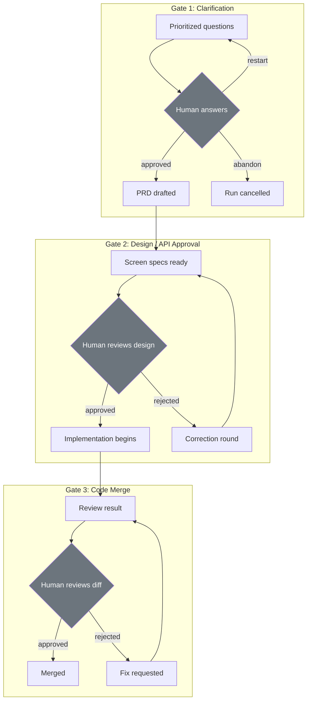

# HITL & Governance

> Authoritative source: [vision.md Layer 10](../vision.md#layer-10-hitl-human-in-the-loop) and [Governance & Operations Spec](../specs/governance-and-operations.md)

CHIP pauses at three points to get human approval — after gathering requirements, after proposing a design, and before merging code. Each pause saves full progress, so nothing is lost if the reviewer takes a day to respond.

Governance middleware wraps every agent execution in a fixed order — permission, budget, HITL, audit — so that cheap checks fail fast before expensive human attention is needed.

## Why Structural Gates

CHIP explicitly rejects "approve every tool call" / "approve every file write" ([vision.md Layer 10](../vision.md#layer-10-hitl-human-in-the-loop)). Per-action approval produces rubber-stamping — humans click "approve" without reading after the 20th prompt. Structural gates at phase boundaries where the human reviews a meaningful artifact (requirement, design, code diff) provide higher-signal approval with lower fatigue.

## HITL Gates

| Gate | Trigger | Human decision | Artifact reviewed |
|------|---------|----------------|-------------------|
| **1. Clarification** | Clarifier produces prioritized questions | Answer questions, then approve PRD — or restart / abandon | Batched questions (multiple-choice where codebase patterns exist via RAG). Max 3 rounds, budget 15 questions/round. |
| **1.5 Escalation**[^1] | Max clarification rounds reached | Accept (confidence capped 0.5) / restart / abandon | Assumption ledger with confidence scores |
| **2. Design / API** | Design pipeline produces screen specs | Approve, reject, or correct per screen | Screen specs in Design Studio at `/design`. Cross-screen atomic approval planned but not yet implemented. |
| **3. Code Merge** | Reviewer produces ReviewResult | Approve or request changes on diff | Per-hunk diff review. Deterministic gates (typecheck, lint, tests, Semgrep) already passed. |

[^1]: Gate 1.5 is a sub-gate within the Clarification phase. It fires when the clarifier reaches its maximum round count without converging. See [Clarifier Pipeline](clarifier-pipeline.md) for the full node graph. spine-implementation.md §9 enumerates this as a separate gate with its own checkpoint.

!!! note "Gate numbering"

    This page follows vision.md's three-gate model (Clarification, Design/API, Code Merge). [spine-implementation.md §9](../architecture/spine-implementation.md) further decomposes into Gate 1, Gate 1.5, and defines Gate 2 as *architecture review* (after Architect Critic green) rather than design approval. The vision document is authoritative for the concept-level model; see spine-implementation.md for the implementation-level decomposition.

## Governance Middleware

`packages/governance/` wraps agent execution as ordered middleware:

| Layer | Order | Function |
|-------|-------|----------|
| Permission | 1st | Checks trust level allows the operation |
| Budget | 2nd | Enforces token/cost caps per-run with real-time tracking. Aborts at configurable threshold (default 80%). |
| HITL | 3rd | Routes to human approval based on policy level |
| Audit | 4th | Records every decision for replay and compliance |

!!! tip "Why this ordering ([ADR-004](../adrs/ADR-004-governance-middleware-ordering.md))"

    Permission is cheapest — fail fast on unauthorized. Budget catches runaway costs before expensive HITL attention. Audit runs last so it captures the actual outcome.

### Policy Levels

Configurable per-project in `chip.yaml`:

!!! note "Planned"

    The `chip.yaml` configuration file is not yet implemented. Policy levels are currently set programmatically.

| Level | Behavior |
|-------|----------|
| `full_approval` | Every gate requires explicit human approval |
| `review_and_override` | Human reviews; system proceeds unless vetoed within timeout |
| `notify_only` | Human notified; system proceeds automatically |
| `fully_autonomous` | No human involvement (trusted, low-risk tasks only) |

Agent autonomy can increase over time based on performance — if an agent's outputs have been approved without changes for N consecutive runs, the project can escalate from `full_approval` to `review_and_override` ([Governance Spec §13.2](../specs/governance-and-operations.md)). Rejection resets the counter.

## Known Limitations

- **Cross-screen atomic approval** — Design Studio currently approves screens individually. Atomic batch approval (reject one → batch drops to `in_correction`) is designed but not yet implemented.
- **Gate 3 (Code Merge)** — Requires Implementer + Reviewer stages, which are not yet built. Gate 3 is specified, not implemented.
- **Timeout handling** — Vision specifies escalation rules (retry notification → secondary channel → recorded assumptions for non-critical questions). Not yet wired. The framework never auto-approves a gated action on timeout ([Governance Spec §13.3](../specs/governance-and-operations.md)).
- **Progressive trust escalation** — Performance-based autonomy escalation ([Governance Spec §13.2](../specs/governance-and-operations.md)) is specified but not wired into the gate system.

??? info "Implementation details"

    **Mechanism:** All gates use LangGraph `interruptBefore` nodes. On interrupt, the full graph state serializes to the Postgres checkpointer. The dashboard polls for pending approvals. On decision, the graph resumes from the interrupt point. Process crash between interrupt and decision loses nothing.

    **Gate 1 implementation:** `interruptBefore: ['storyWriter']` in the Clarifier graph. The `escalationGate` node handles max-round escalation (Gate 1.5). See [Clarifier Pipeline](clarifier-pipeline.md) for node-level detail.

    **Gate 2 implementation:** Design Studio UI at `/design` with per-screen accept/reject/correct.

    **Resume semantics:** `graph.stream(null, { configurable: { thread_id } })` resumes from the interrupt checkpoint.

    For full LangGraph mechanics, node names, and checkpoint behavior, see [spine-implementation.md §9](../architecture/spine-implementation.md).

## Related Docs

- [Vision Layer 10](../vision.md#layer-10-hitl-human-in-the-loop) — HITL authority
- [Governance & Operations Spec](../specs/governance-and-operations.md) — policy levels, middleware, escalation
- [ADR-004](../adrs/ADR-004-governance-middleware-ordering.md) — middleware ordering rationale
- [spine-implementation.md §9](../architecture/spine-implementation.md) — gate implementation mechanics, LangGraph interrupt details
- [Clarifier Pipeline](clarifier-pipeline.md) — Gate 1 node graph and escalation flow
- [Coordination & State](coordination-and-state.md) — coordination substrate (typed channels, not event bus)
- [Concepts Overview](overview.md) — HITL summary in system context
- [Clarifier Initiative](../plans/active/clarifier-initiative/execution-plan.md) — Gate 1 implementation plan
