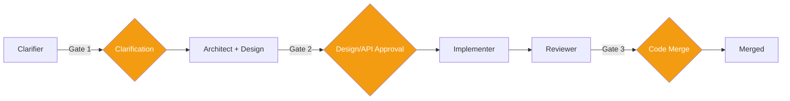

# HITL & Governance

> Authoritative source: [vision.md Layer 10](../vision.md#layer-10-hitl-human-in-the-loop) and [Governance & Operations Spec](../specs/governance-and-operations.md)

Three LangGraph `interruptBefore` gates at phase boundaries. State persists to Postgres checkpointer on interrupt; graph resumes from checkpoint on human decision. Governance middleware wraps every agent execution in the order: permission → budget → HITL → audit.

## HITL Gates

| Gate | Trigger | Behavior | Implementation |
|------|---------|----------|----------------|
| **Clarification** | Clarifier produces prioritized questions | Human answers batched questions (multiple-choice when codebase patterns exist via RAG). Max 3 rounds, budget 15 questions/round. After max rounds: accept (confidence capped 0.5) / restart / abandon. | `interruptBefore: ['storyWriter']` + `escalationGate` node in Clarifier graph |
| **Design/API** | Design pipeline produces screen specs | Cross-screen atomic approval in Design Studio — reject one, batch drops to `in_correction`. | Design Studio UI at `/design` with accept/reject/correct per screen |
| **Code Merge** | Reviewer produces ReviewResult | Per-hunk diff review integrated with git host. Deterministic gates already passed. | Specified, not yet implemented |

All gates use `interruptBefore` (LangGraph primitive). On interrupt, the full graph state serializes to the Postgres checkpointer. The dashboard polls for pending approvals. On decision, `graph.stream(null, { configurable: { thread_id } })` resumes from the interrupt point. Process crash between interrupt and decision loses nothing.

## Governance Middleware

`packages/governance` wraps agent execution as ordered middleware:

| Layer | Order | Function |
|-------|-------|----------|
| Permission | 1st | Checks trust level allows the operation |
| Budget | 2nd | Enforces token/cost caps per-run with real-time tracking via `TracedProvider.costDetails`. Aborts at configurable threshold (default 80%). |
| HITL | 3rd | Routes to human approval based on policy level |
| Audit | 4th | Records every decision for replay and compliance |

Ordering matters: permission is cheapest (fail fast on unauthorized), budget catches runaway costs before expensive HITL attention.

### Policy Levels

Configurable per-project in `agentforge.yaml`:

| Level | Behavior |
|-------|----------|
| `full_approval` | Every gate requires explicit human approval |
| `review_and_override` | Human reviews; system proceeds unless vetoed within timeout |
| `notify_only` | Human notified; system proceeds automatically |
| `fully_autonomous` | No human involvement (trusted, low-risk tasks only) |

## Rejected Pattern: Per-Action Approval

CHIP explicitly rejects "approve every tool call" / "approve every file write" ([vision.md Layer 10](../vision.md#layer-10-hitl-human-in-the-loop)). Per-action approval produces rubber-stamping — humans click "approve" without reading after the 20th prompt. Structural gates at phase boundaries where the human reviews a meaningful artifact (requirement, design, code diff) provide higher-signal approval with lower fatigue.

## Current Implementation

- **Gate 1 (Clarification):** Implemented. `interruptBefore` in Clarifier graph with `escalationGate` for max-round handling. Dashboard at `/new` partially integrated.
- **Gate 2 (Design/API):** Working. Design Studio per-screen approval with accept/reject/correct. Atomic cross-screen approval not yet implemented.
- **Gate 3 (Code Merge):** Not yet implemented (requires Implementer + Reviewer stages).
- **Governance middleware:** Budget and audit layers exist. HITL middleware framework defined in `packages/governance`.

## Related Docs

- [Vision Layer 10](../vision.md#layer-10-hitl-human-in-the-loop) — HITL authority
- [Governance & Operations Spec](../specs/governance-and-operations.md) — policy levels, middleware
- [ADR-004](../adrs/ADR-004-governance-middleware-ordering.md) — middleware ordering
- [Clarifier Initiative](../plans/active/clarifier-initiative/execution-plan.md) — Gate 1 implementation
