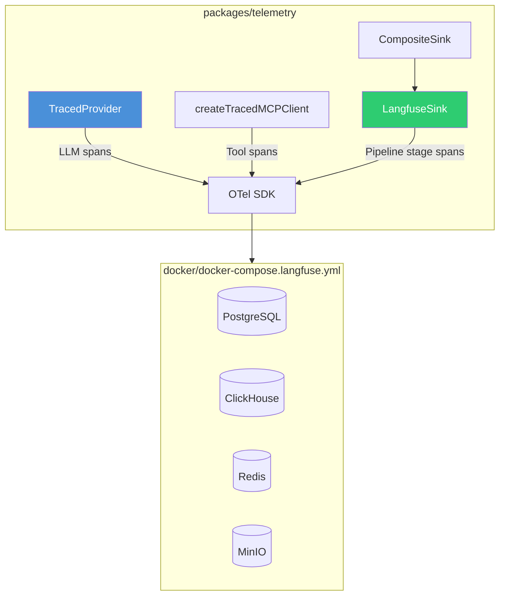

# Observability

> Authoritative source: [vision.md Layer 11](../vision.md#layer-11-observability) and [Langfuse Setup Guide](../guides/langfuse-setup.md)

OpenTelemetry spans for every LLM call, tool call, and pipeline stage. Langfuse self-hosted as trace backend. Prompt versioning via git frontmatter with pre-commit enforcement. Graceful no-op when `LANGFUSE_SECRET_KEY` is unset — pipeline runs identically without telemetry infrastructure.

## Architecture



## Span Types

| Span | Created by | Attributes |
|------|-----------|------------|
| LLM call | `TracedProvider` wrapping `provider.complete()` | Model, prompt version, input/output tokens, latency, cost (`costDetails`), response schema |
| Tool call | `createTracedMCPClient` wrapping `MCPClient.callTool()` | Tool name, arguments (sanitized), response size, latency. Uses `@opentelemetry/api` for post-hoc span lifecycle. |
| Pipeline stage | `LangfuseSink` | Stage name (`stage:research`, `stage:planning`, etc.), duration, cost/token aggregates. `dispose()` for orphan cleanup. |

`CompositeSink` combines transport sinks (CLI stdout for terminal output, dashboard SSE for real-time UI updates) with `LangfuseSink` for trace persistence.

## Prompt Versioning

Every `.md` prompt file carries YAML frontmatter:

```yaml
---
version: 2.1.0
purpose: Generate DesignSpec JSON for a single screen
---
```

Three enforcement mechanisms:

1. `parsePromptFrontmatter()` — strips frontmatter before LLM input
2. `TracedProvider` — records `metadata.promptVersion` on every Langfuse generation span
3. `scripts/check-prompt-versions.ts` — pre-commit hook fails if prompt content changed without version bump

Every Langfuse trace shows which prompt version produced it. Regression analysis traces quality changes to specific prompt edits.

## Cost Tracking

`TracedProvider` captures per-call cost: `input_tokens * model_input_rate + output_tokens * model_output_rate`. Langfuse aggregates per call, per stage, per run, per project. Governance middleware budget layer can abort runs when cost exceeds configurable threshold.

## Setup

```bash
docker compose -f docker/docker-compose.langfuse.yml up -d
# Langfuse UI at http://localhost:3001 — create project, copy keys

export LANGFUSE_SECRET_KEY=sk-lf-...
export LANGFUSE_PUBLIC_KEY=pk-lf-...
export LANGFUSE_HOST=http://localhost:3001
```

Full setup, verification, and troubleshooting: [Langfuse Setup Guide](../guides/langfuse-setup.md).

## Current Implementation

- **TracedProvider:** Wraps all `provider.complete()` calls. LLM spans with model, tokens, cost, prompt version.
- **MCP tracing:** `createTracedMCPClient` wraps tool calls with OTel spans.
- **LangfuseSink:** Pipeline stage lifecycle spans with cost/token attributes. Orphan cleanup via `dispose()`.
- **Prompt versioning:** Frontmatter parser + TracedProvider metadata + pre-commit hook. All operational.
- **Langfuse self-hosted:** Docker Compose (Postgres, ClickHouse, Redis, MinIO). UI at port 3001.
- **Not built:** Cost aggregation in CHIP dashboard (visible in Langfuse UI). Evaluation hooks for regression detection (Layer 12, deferred).

## Related Docs

- [Vision Layer 11](../vision.md#layer-11-observability) — observability authority
- [Langfuse Setup Guide](../guides/langfuse-setup.md) — setup and troubleshooting
- [ADR-046](../adrs/ADR-046-langfuse-observability.md) — architectural decision
- [Observability Plan](../plans/active/observability/execution-plan.md) — Phases 1-4 complete
