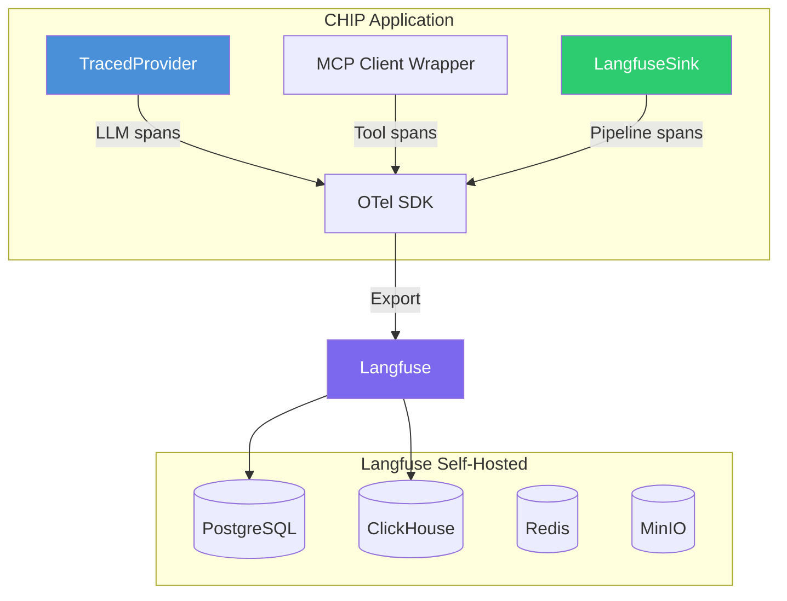

# Observability

> Authoritative source: [vision.md Layer 11](../vision.md#layer-11-observability) and [Langfuse Setup Guide](../guides/langfuse-setup.md)

## Why Observability is Non-Negotiable for Agents

Without traces, every bug report starts with "can you reproduce it?" and ends with "well, the model was non-deterministic." Without prompt versions, you can't tell which change caused a regression. Without cost tracking, you discover your LLM bill is 10x expected at the end of the month.

These aren't nice-to-haves. For agent systems, they're the difference between a debuggable system and a black box.

## Architecture



### Three Span Types

| Span Type | What it captures | Created by |
|-----------|-----------------|-----------|
| **LLM Call** | Model, prompt version, input/output tokens, latency, cost | `TracedProvider` wrapping `provider.complete()` |
| **Tool Call** | Tool name, arguments, response size, latency | `createTracedMCPClient` wrapping MCP calls |
| **Pipeline Stage** | Stage name (research, planning, design), duration, cost/tokens | `LangfuseSink` emitting OTel spans |

### Graceful Degradation

When `LANGFUSE_SECRET_KEY` is not set, all telemetry code is a no-op. The pipeline runs identically — just without traces. This means:

- Local development works without Docker/Langfuse
- CI runs work without telemetry infrastructure
- Production failures in the telemetry stack never break the pipeline

## Prompt Versioning

Every `.md` prompt file carries YAML frontmatter with a `version` field:

```yaml
---
version: 2.1.0
purpose: Generate DesignSpec JSON for a single screen
---

You are a design agent...
```

Three mechanisms enforce version discipline:

1. **`parsePromptFrontmatter()`** strips the frontmatter before sending to the LLM
2. **`TracedProvider`** records `metadata.promptVersion` on every Langfuse generation span
3. **Pre-commit hook** (`scripts/check-prompt-versions.ts`) fails if prompt content changed without a version bump

This means every Langfuse trace shows which prompt version produced it. When quality regresses, you can identify the exact prompt change that caused it.

## Cost Tracking

`TracedProvider` captures per-call cost via `costDetails` (input tokens x model rate + output tokens x model rate). Langfuse aggregates automatically, giving cost breakdowns per:

- Individual LLM call
- Pipeline stage
- Full pipeline run
- Project (across all runs)

Budget enforcement is real-time: the governance middleware's budget layer can abort a run when cost exceeds a configurable threshold.

## Current State

- **Working:** TracedProvider for LLM spans, LangfuseSink for pipeline stages, MCP client tracing, CompositeSink for multi-destination output
- **Working:** Prompt versioning (frontmatter parser + TracedProvider metadata + pre-commit hook)
- **Working:** Langfuse self-hosted via Docker Compose
- **Not built:** Cost aggregation dashboard in CHIP UI (Langfuse UI shows it)
- **Not built:** Evaluation hooks for regression detection (Layer 12, deferred)

## Getting Started

```bash
# Start Langfuse
docker compose -f docker/docker-compose.langfuse.yml up -d

# Set credentials (from Langfuse UI at http://localhost:3001)
export LANGFUSE_SECRET_KEY=sk-lf-...
export LANGFUSE_PUBLIC_KEY=pk-lf-...
export LANGFUSE_HOST=http://localhost:3001

# Run any pipeline — traces appear automatically
```

See the [Langfuse Setup Guide](../guides/langfuse-setup.md) for detailed instructions, verification, and troubleshooting.

## Key Decisions

| Decision | Rationale | ADR |
|----------|-----------|-----|
| OpenTelemetry as tracing standard | Vendor-neutral, industry standard | [ADR-046](../adrs/ADR-046-langfuse-observability.md) |
| Langfuse self-hosted | Full data control, no SaaS dependency for POC | [ADR-046](../adrs/ADR-046-langfuse-observability.md) |
| Prompt versioning via git frontmatter | Simple, version-controlled, no external registry | [Vision Layer 11](../vision.md#layer-11-observability) |
| Graceful degradation when unset | Pipeline never fails due to telemetry issues | [ADR-046](../adrs/ADR-046-langfuse-observability.md) |

## Related Docs

- [Vision Layer 11](../vision.md#layer-11-observability) — observability authority
- [Langfuse Setup Guide](../guides/langfuse-setup.md) — setup, verification, troubleshooting
- [ADR-046](../adrs/ADR-046-langfuse-observability.md) — architectural decision
- [Observability Plan](../plans/active/observability/execution-plan.md) — active initiative
