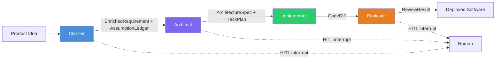

# CHIP — What It Is and Why It Exists

> Authoritative source: [vision.md](../vision.md)

CHIP (Crafted Human Intelligence Platform) interrogates a product requirement before generating anything — detecting ambiguity, asking prioritized questions, and recording every assumption — then passes the clarified requirement through four sequential stages (Clarifier, Architect, Implementer, Reviewer) where each stage has exactly one writer, each handoff carries a Zod-typed artifact, and a human approves at three structural boundaries. The result is a pipeline where silent assumptions become explicit decisions before any code is written.

## How it works

The four spine stages run sequentially with single-writer discipline — only one stage writes to the shared artifact at a time. Each stage's output is a Zod-typed LangGraph channel consumed by the next: the Clarifier produces an `EnrichedRequirement` with an assumption ledger, the Architect produces an `ArchitectureSpec` and `TaskPlan`, the Implementer produces a `CodeDiff`, and the Reviewer produces a `ReviewResult`. Specialist tools (research subagents, design pipeline, test generator, security scanner) are invoked by spine stages as read-only helpers — never as parallel writers to the same artifact.

Three human gates pause the pipeline at phase boundaries where the human reviews a meaningful artifact rather than rubber-stamping individual tool calls. The Clarifier pauses to collect answers to prioritized questions, the Architect pauses for design and API approval, and the Reviewer pauses for code merge decisions. Full graph state serializes to a Postgres checkpointer at each gate, so nothing is lost if the reviewer takes a day to respond. See [HITL & Governance](hitl-governance.md) for gate mechanics, policy levels, and escalation rules.

## What the Clarifier does differently

Before generating anything, the Clarifier detects ambiguity in the requirement. It generates multiple plausible implementations from the same input, finds where they diverge, and converts each divergence point into a prioritized question — ranked by how much the answer would reduce downstream uncertainty. Gaps below the priority threshold become tracked assumptions with confidence scores, carried through every downstream stage so the Architect and Implementer know which decisions are settled and which are best-effort.

The Clarifier supports two modes — bootstrap (new application from a product brief) and evolution (change request against an existing codebase) — through the same graph with mode-dependent retrieval context. For the full node graph, question budgeting, and multi-round flow, see [Clarifier Pipeline](clarifier-pipeline.md).

## Components

| Component | Package | Role |
|-----------|---------|------|
| Clarifier graph | `packages/agents-clarifier/src/graph/clarifier-graph.ts` | 9-node LangGraph `StateGraph` — context retrieval, PRD analysis, gap detection, question prioritization, story writing, critic, PRD updater, escalation gate, emit complete. See [Clarifier Pipeline](clarifier-pipeline.md) for node details |
| Design pipeline | `packages/agents-ux/src/design-pipeline/pipeline.ts` | 4-stage pipeline (research → planning → design → evaluator) producing DesignSpec JSON |
| DesignSpec renderer | `packages/designspec-renderer/src/renderer/browser/app/src/DesignSpecRenderer.tsx` | Translates DesignSpec JSON to real React/shadcn/Tailwind components in the browser |
| Retrieval layer | `packages/retrieval/src/tools/` | 5 MCP-compatible RAG tools: `searchCode`, `searchDocs`, `searchDesigns`, `getRepoMap`, `findSimilarPatterns` |
| Observability | `packages/telemetry/src/traced-provider.ts` | OpenTelemetry spans on every LLM call + Langfuse pipeline lifecycle spans |
| LLM providers | `packages/providers/` | Multi-provider abstraction (Claude, OpenAI, Vertex AI) with Application Default Credentials support |
| Governance | `packages/governance/` | Permission, budget, HITL gate, and audit middleware |
| Dashboard | `packages/dashboard/` | Next.js 16 + Mantine v9 web UI (15 routes) |
| CLI | `packages/cli/` | Commander.js command-line interface |

## Current state

The Clarifier and the design pipeline are the two operational spine-adjacent stages — both run end-to-end from CLI, with partial dashboard integration. The retrieval layer (five hybrid-search tools backed by Qdrant, Voyage embeddings, and Cohere Rerank) and observability infrastructure (OpenTelemetry + Langfuse with prompt versioning) are production-ready. The Architect, Implementer, and Reviewer spine stages are specified in the vision but have no implementation yet. See [Current Status](current-status.md) for per-layer state and active initiatives.

## Known limitations

- **Architect, Implementer, and Reviewer are specified but not implemented.** The spine today runs only the Clarifier and the design pipeline. Full end-to-end PRD-to-code requires the remaining three stages.
- **Cross-screen design coherence is post-hoc only.** The design pipeline generates screens individually and validates coherence after the fact, not during generation.
- **No sandboxing.** Code runs on the developer's machine. Ephemeral container isolation is planned but not built.
- **Dashboard pipeline integration is partial.** The design pipeline works from CLI but has `import.meta.url` issues under webpack in the Next.js dashboard ([Dashboard Pipeline Fix plan](../plans/active/dashboard-pipeline-fix/execution-plan.md)).

## Related

- [Vision](../vision.md) — 15-layer architectural authority
- [Agent Taxonomy](agent-taxonomy.md) — spine stages and specialist tools
- [Clarifier Pipeline](clarifier-pipeline.md) — full clarification graph with question prioritization and multi-round flow
- [HITL & Governance](hitl-governance.md) — three human gates, governance middleware, and policy levels
- [Design Pipeline](design-pipeline.md) — DesignSpec rendering pipeline
- [Coordination & State](coordination-and-state.md) — typed channels and persistence
- [Current Status](current-status.md) — initiative progress
- [Design Decisions](../design-decisions.md) — topology, coordination, and artifact decisions with rejected alternatives
