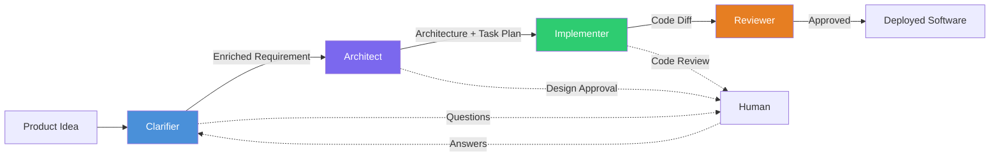

# What is CHIP?

> Authoritative source: [vision.md Section 1](../vision.md#1-product-vision-one-paragraph)

## The Problem

Every AI coding tool today shares the same failure mode: they skip straight to code. A vague idea goes in, and lines of code come out — often plausible-looking but built on assumptions nobody verified. The result is software that "works" in demo but breaks in production, because no one asked the hard questions first.

This is the same mistake human teams make when they skip requirements gathering. The difference is that LLMs compound it faster and more confidently.

## What CHIP Does Differently

**CHIP** (Crafted Human Intelligence Platform) is a multi-agent SDLC framework that takes a product idea and produces working, reviewed, deployable software. Instead of one monolithic AI coding assistant, CHIP uses a small set of specialized stages — each with a clear job, clear inputs, and clear outputs.

The key insight: **context quality matters more than agent quantity.** CHIP invests heavily in understanding the problem before writing code, enforces single-writer discipline per artifact, and places human checkpoints at the three moments where human judgment matters most.

## How It Works

**Four stages, three human checkpoints:**

1. **Clarifier** — Asks the right questions before anyone writes code. Produces an enriched requirement with an assumption ledger that tracks everything the system guessed.
2. **Architect** — Designs the architecture, creates ADRs, and breaks work into scoped tasks. Design approval happens here.
3. **Implementer** — Writes code one task at a time, sequentially. No parallel writers racing on the same artifact.
4. **Reviewer** — Fresh-context review: deterministic checks first, then LLM review, then assumption validation.

## The Single Invariant

Every architectural decision in CHIP is tested against one question:

> **Does this improve context quality or tighten write-coupling?**

Good context into each LLM call. Single writer per artifact. If a proposed change helps either axis, it's probably right. If it hurts either, it's probably wrong.

## Current State

CHIP is in active development. The design pipeline (Clarifier + Design Agent) is the most mature subsystem, with per-screen generation, vision-based correction, and a browser-based prototype renderer. The Architect, Implementer, and Reviewer stages are specified but not yet implemented.

- **Working today:** Design pipeline, Clarifier (6-stage LangGraph graph), RAG layer (5 retrieval tools), Dashboard (Next.js + Mantine), Observability (Langfuse + OTel)
- **Specified, not built:** Architect stage, Implementer stage, Reviewer stage, cross-task parallelism via git worktrees

## Tech Stack

| Component | Technology |
|-----------|-----------|
| Monorepo | Nx + TypeScript |
| Orchestration | `@langchain/langgraph` (TypeScript) |
| Dashboard | Next.js 16 + Mantine v9 |
| Testing | Jest + Playwright |
| Observability | OpenTelemetry + Langfuse (self-hosted) |
| RAG | Tree-sitter + Voyage embeddings + Qdrant + Cohere Rerank |

## Key Decisions

| Decision | Rationale | ADR |
|----------|-----------|-----|
| TypeScript LangGraph as sole runtime | Single-language, typed state, checkpointable | [ADR-043](../adrs/ADR-043-typescript-only-orchestration.md) |
| Four-stage spine over 10-agent peer network | Eliminates coordination overhead, enforces single-writer | [ADR-022](../adrs/ADR-022-typescript-only-orchestration-engine.md) |
| Event bus demoted to telemetry only | Typed channels prevent silent drift between agents | [Design Decisions](../design-decisions.md) |

## Learn More

- [Vision Document](../vision.md) — the full architectural authority (15 layers)
- [PRD](../specs/PRD.md) — product requirements and API contracts
- [Current Status](current-status.md) — where each initiative stands today
- [Agent Taxonomy](agent-taxonomy.md) — deep dive on the four-stage spine
