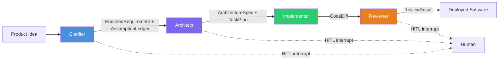

# CHIP — What It Is and Why It Exists

> Authoritative source: [vision.md](../vision.md)

CHIP (Crafted Human Intelligence Platform) is a framework that turns a product requirement into working, reviewed software by passing it through four sequential stages — Clarifier, Architect, Implementer, Reviewer — where each stage has exactly one writer, each handoff carries a typed artifact, and a human approves at three boundaries. Think of it as a compiler for requirements: structured input in, verified code out, with human checkpoints instead of silent assumptions.

## Why CHIP does this differently

Every coding agent that reached production in 2025–2026 — Devin, Claude Code, Cursor Composer — runs single-threaded per artifact. Cognition's "Don't Build Multi-Agents" documents why: parallel write-agents sharing a codebase produce incompatible outputs the orchestrator cannot safely merge. Anthropic's multi-agent research system validates the opposite for reads: parallel subagents returning summaries improved research breadth by 90% (Research Report, Part 1, §"The agent taxonomy problem").

CHIP applies this synthesis as its core topology: a thin sequential spine for writes, with parallel specialist tools for reads. This is design decision §1.3 ([design-decisions.md](../design-decisions.md)):

> "Four-stage vertical spine — Clarify → Architect → Implement → Review — with specialists invoked as tools by spine nodes. No flat multi-agent peer network."

The second differentiator is the Clarifier. No shipping product in 2026 implements EVPI-style question prioritization, ClarifyGPT-style consistency sampling, or an integrated assumption ledger that flows through the spine (Research Report, Part 1, §"Conversational clarification layer"). Most tools — Linear AI, Jira AI, Notion AI — are draft-and-edit; Devin expects someone else to clarify first. CHIP interrogates the requirement before generating anything, then carries every assumption forward as a trackable, validatable artifact.

## How it works

**Spine stages** run sequentially with single-writer discipline per artifact. Each stage's output is a Zod-typed LangGraph channel consumed by the next. Specialist tools (research subagents, design agent, test generator, security scanner) are invoked by spine stages as read-only or narrow-write tools — never as parallel writers to the same artifact.

**Three human-in-the-loop (HITL) gates** are implemented as LangGraph `interruptBefore` nodes with Postgres-backed state persistence:

1. **Clarification** — The Clarifier batches prioritized questions ranked by expected value of perfect information (EVPI): `blastRadius * answerability * confidenceGap`. Budget-capped at 15 questions per round, 3 rounds max. Human answers; graph resumes.
2. **Design/API approval** — Cross-screen atomic approval after coherence validation.
3. **Code merge** — Deterministic gates (typecheck, lint, tests, Semgrep) run first; LLM review second; human decides on diff.

## Components

| Component | Package | Role |
|-----------|---------|------|
| Clarifier graph | `packages/agents-clarifier/src/graph/clarifier-graph.ts` | 6-node LangGraph `StateGraph` — context retrieval, PRD analysis, gap detection, question prioritization, story writing, critic |
| Design pipeline | `packages/agents-ux/src/design-pipeline/pipeline.ts` | 4-stage pipeline (research → planning → design → evaluator) producing DesignSpec JSON |
| DesignSpec renderer | `packages/designspec-renderer/src/renderer/browser/app/src/DesignSpecRenderer.tsx` | Translates DesignSpec JSON to real React/shadcn/Tailwind components in the browser |
| Retrieval layer | `packages/retrieval/src/tools/` | 5 MCP-compatible RAG tools: `searchCode`, `searchDocs`, `searchDesigns`, `getRepoMap`, `findSimilarPatterns` |
| Observability | `packages/telemetry/src/traced-provider.ts` | OpenTelemetry spans on every LLM call + Langfuse pipeline lifecycle spans |
| LLM providers | `packages/providers/` | Multi-provider abstraction (Claude, OpenAI, Vertex AI) with Application Default Credentials support |
| Governance | `packages/governance/` | Permission, budget, HITL gate, and audit middleware |
| Dashboard | `packages/dashboard/` | Next.js 16 + Mantine v9 web UI (15 routes) |
| CLI | `packages/cli/` | Commander.js command-line interface |

## Current implementation

The Clarifier is the first production LangGraph `StateGraph` in the monorepo. It handles both bootstrap (new app from a PRD) and evolution (change request against an existing codebase) through the same graph with mode-dependent retrieval priors. Gap detection uses a deterministic checklist (auth, validation, errors, NFRs, accessibility, orphan screens) plus ClarifyGPT consistency sampling — three implementations at temperature 0.7, divergence analysis at temperature 0.

The design pipeline is operational: `runDesignPipeline()` in `packages/agents-ux/src/design-pipeline/pipeline.ts` is the single entry point for both CLI and dashboard. The LLM produces DesignSpec JSON (a flat adjacency list with typed accelerators), and a deterministic renderer translates it to real React/shadcn components. Mechanical checks and vision-model evaluation run in a bounded correction loop (max 2 iterations).

The retrieval layer provides five hybrid-retrieval tools backed by Qdrant, Voyage embeddings, and Cohere Rerank, with Merkle-tree incremental re-indexing on git commits.

Observability wraps every `provider.complete()` call with OpenTelemetry spans capturing model, prompt version, tokens, cost, and latency. Prompt versioning is enforced via git frontmatter and a pre-commit hook.

## Known limitations

- **Architect, Implementer, and Reviewer are specified but not implemented.** The spine today runs only the Clarifier and the design pipeline. Full end-to-end PRD-to-code requires the remaining three stages.
- **Cross-screen design coherence is post-hoc only.** The design pipeline generates screens individually and validates coherence after the fact, not during generation.
- **No sandboxing.** Code runs on the developer's machine. Ephemeral container isolation is planned but not built.
- **Dashboard pipeline integration is partial.** The design pipeline works from CLI but has `import.meta.url` issues under webpack in the Next.js dashboard ([Dashboard Pipeline Fix plan](../plans/active/dashboard-pipeline-fix/execution-plan.md)).

## Related

- [Vision](../vision.md) — 15-layer architectural authority
- [Agent Taxonomy](agent-taxonomy.md) — spine stages and specialist tools
- [Design Pipeline](design-pipeline.md) — DesignSpec rendering pipeline
- [Coordination & State](coordination-and-state.md) — typed channels and persistence
- [Current Status](current-status.md) — initiative progress
- [Design Decisions](../design-decisions.md) — topology, coordination, and artifact decisions with rejected alternatives
