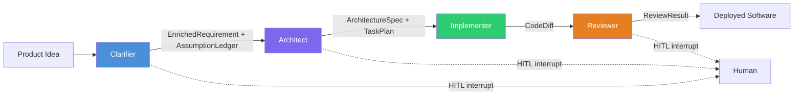

# CHIP

> Authoritative source: [vision.md](../vision.md)

CHIP (Crafted Human Intelligence Platform) is a multi-agent SDLC framework built on TypeScript LangGraph. It coordinates four sequential stages — Clarifier, Architect, Implementer, Reviewer — through typed state channels with Zod schemas, with human-in-the-loop interrupts at three phase boundaries.

The framework is organized as 19 packages in an Nx monorepo, with 116 tests on the Clarifier graph alone, 5 hybrid-retrieval RAG tools, a 4-stage design pipeline producing DesignSpec JSON rendered through real shadcn/Tailwind components, and full observability via OpenTelemetry + Langfuse.

## Architecture

**Spine stages** run sequentially with single-writer discipline per artifact. Each stage's output is a Zod-typed channel consumed by the next. Specialist tools (research subagents, design agent, test generator, security scanner) are invoked by spine stages as read-only or narrow-write tools — never as parallel writers.

**Three HITL gates** implemented as LangGraph `interruptBefore` nodes with Postgres-backed state persistence:

1. **Clarification** — Clarifier batches prioritized questions (EVPI-ranked, budget-capped at 15/round). Human answers; graph resumes.
2. **Design/API approval** — Cross-screen atomic approval after coherence validation.
3. **Code merge** — Deterministic gates (typecheck, lint, tests, Semgrep) run first; LLM review second; human decides on diff.

## Clarifier Graph

The first production LangGraph `StateGraph` in the monorepo. Six nodes, typed `Annotation.Root()` channels, two interrupt points:

| Node | Model | Output |
|------|-------|--------|
| `contextRetriever` | — (RAG) | Bootstrap context or codebase retrieval via 5 tools |
| `prdAnalyzer` | `claude-opus-4-6` | Structured PRD with `responseSchema` forced JSON |
| `gapDetector` | `claude-sonnet-4-6` | Deterministic checklist + ClarifyGPT consistency sampling (3 implementations, divergence analysis) |
| `questionPrioritizer` | — (deterministic) | EVPI proxy ranking: `blastRadius * answerability * confidenceGap` |
| `storyWriter` | `claude-sonnet-4-6` | EARS-format acceptance criteria, INVEST stories, `FeaturePlan` DAG |
| `critic` | — (deterministic) | EARS/INVEST/DAG compliance, bounded retry (max 2) |

Handles both bootstrap (new app) and evolution (change request) modes through the same graph with mode-dependent retrieval priors.

## Design Pipeline

Four stages orchestrated by `runDesignPipeline()` — single entry point for both CLI and dashboard:

| Stage | Agent Function | Cached Artifact |
|-------|---------------|----------------|
| `research` | `researchNode` | `researchBrief` |
| `planning` | `planningNode` | `planningSpec` |
| `design` | `designNode` | `designSpecV2` |
| `evaluator` | `evaluatorNode` | — |

The LLM produces **DesignSpec JSON** (flat adjacency list, `AcceleratorType`: page, container, section, header, divider, spacer, text + catalog references). A deterministic renderer in `packages/designspec-renderer` translates to real React/shadcn components. Mechanical checks and vision-model evaluation run in a bounded correction loop (max 2 iterations).

## Retrieval Layer

Five MCP-compatible tools in `packages/retrieval/src/tools/`:

| Tool | Pipeline |
|------|----------|
| `searchCode` | Tree-sitter AST chunking → Voyage-code-3 + BM25 hybrid (RRF k=60) → Cohere Rerank 3.5 |
| `searchDocs` | Header-aware Markdown splitting → Voyage-3-large + BM25 hybrid → Cohere Rerank |
| `searchDesigns` | DesignSpec JSON chunked by node → same hybrid pipeline |
| `getRepoMap` | Aider-style repo map (Tree-sitter + PageRank over symbol graph, no embeddings) |
| `findSimilarPatterns` | Pattern matching across indexed codebase |

Qdrant vector store with 3 collections. Merkle-tree incremental re-indexing on git commits.

## Observability

`TracedProvider` wraps every `provider.complete()` call with OTel spans capturing model, prompt version, tokens, cost, latency. `LangfuseSink` adds pipeline-stage lifecycle spans. `createTracedMCPClient` wraps tool calls. Prompt versioning enforced via git frontmatter + pre-commit hook. Graceful no-op when `LANGFUSE_SECRET_KEY` unset.

## Package Structure

19 packages in the Nx monorepo:

| Package | Role |
|---------|------|
| `core` | Types, config, LLM wrapper, checkpointer factory, test utilities |
| `agents-clarifier` | Clarifier LangGraph graph (6 nodes, 116 tests) |
| `agents-ux` | Design pipeline orchestration |
| `designspec-renderer` | DesignSpec JSON → React/shadcn browser renderer |
| `retrieval` | RAG layer (5 tools, Qdrant, Voyage, Cohere) |
| `providers` | Multi-provider LLM abstraction (Claude, OpenAI, Vertex AI) |
| `telemetry` | OTel + Langfuse integration |
| `dashboard` | Next.js 16 + Mantine v9 (15 routes) |
| `governance` | Permission, budget, HITL, audit middleware |
| `cli` | Commander.js CLI |

Plus 7 phase-specific agent packages (`agents-spec`, `agents-design`, `agents-code`, `agents-cicd`, `channels`, `integration-tests`, `e2e-test`) and `stacks` (project scaffolding templates).

## Related Docs

- [Vision](../vision.md) — 15-layer architectural authority
- [Agent Taxonomy](agent-taxonomy.md) — spine stages and specialist tools
- [Design Pipeline](design-pipeline.md) — DesignSpec rendering pipeline
- [Coordination & State](coordination-and-state.md) — typed channels and persistence
- [Current Status](current-status.md) — initiative progress
