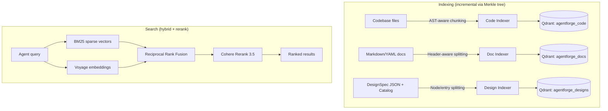

# RAG & Context Engineering

> Authoritative source: [vision.md Layer 6](../vision.md#layer-6-rag--context-engineering)

Every agent in CHIP operates on context retrieved from the project's codebase, documents, and design artifacts. Without retrieval, agents operate blind — the Clarifier cannot ask grounded questions referencing existing patterns, and the Implementer cannot follow established conventions. CHIP's retrieval layer provides this context through a hierarchy: deterministic structure first (repo map), semantic search second (embeddings + reranking), with results fused and ranked before reaching an agent.

## Why CHIP does this

Research Report Part 2 identifies context engineering as "the single largest quality lever" for agent systems. CHIP's retrieval architecture reflects two findings:

- "Aider-style repo map (tree-sitter + PageRank, no embeddings) as the default code-context tool" — structural context is deterministic and cheap, providing the stable foundation every agent call needs (Research Report, §"Build the RAG layer on deterministic structure first, semantic search second").
- Rare tokens, error codes, and identifiers need keyword search — dense embeddings alone miss exact-match queries. CHIP uses hybrid BM25 + dense search with Reciprocal Rank Fusion (k=60) to cover both cases (Design Decisions, Section 4).

## How it works

Mermaid source (paste into mermaid.live)

### Indexing

Three indexers (`packages/retrieval/src/indexing/`) convert project files into vectors stored in Qdrant. Each uses a Merkle tree (`merkle-tree.ts`) to detect which files changed since the last index — only changed files are re-embedded, keeping cost proportional to changes rather than project size.

**Code indexer:** AST-aware chunking (`code-chunker.ts`) splits at function and class boundaries rather than arbitrary line counts. Each chunk gets both a dense vector (Voyage `voyage-code-3`, 1024 dimensions) and a sparse BM25 vector with camelCase-aware tokenization.

**Doc indexer:** Header-aware splitting (`doc-chunker.ts`) respects Markdown heading hierarchy and YAML top-level keys. Uses `voyage-3-large` for dense embeddings.

**Design indexer:** Splits DesignSpec JSON by node and component catalog by entry (`design-chunker.ts`). Each chunk is independently searchable by screen or component.

### Search

All three search pipelines follow the same pattern (`packages/retrieval/src/search/`):

1. **Embed the query** — Voyage dense vector (asymmetric, `query` input type)
2. **Compute BM25 sparse vector** — keyword matching for exact identifiers
3. **Qdrant hybrid search** — dense + sparse with Reciprocal Rank Fusion (k=60)
4. **Cohere rerank** — `rerank-v3.5`, top 10 results

### Repo map

The repo map (`packages/retrieval/src/repo-map/`) provides structural context without embeddings:

1. **Parse** — extracts function/class/type symbols and imports from TypeScript/JavaScript files
2. **Build symbol graph** — directed graph where imports create edges between files
3. **PageRank** — ranks symbols by structural importance, optionally personalized to seed files
4. **Render** — token-budgeted text output listing ranked files and their key symbols

## Five retrieval tools

All tools are MCP-compatible with JSON Schema definitions, created by `createRetrievalTools()` in `packages/retrieval/src/tools/tool-factory.ts`:

| Tool | Function | When an agent uses it |
|------|----------|----------------------|
| `searchCode` | Hybrid code search with rerank | Finding implementations of a pattern, locating a function |
| `searchDocs` | Hybrid doc search with rerank | Finding relevant PRD sections, ADR decisions, guide content |
| `searchDesigns` | Hybrid design search with rerank | Finding existing screen designs, component usage patterns |
| `getRepoMap` | Structural repo map via PageRank | Understanding project structure, finding entry points |
| `findSimilarPatterns` | Code search by example snippet | Finding existing code similar to what needs to be written |

## Components

| Component | File | Role |
|-----------|------|------|
| `createRetrievalTools()` | `packages/retrieval/src/tools/tool-factory.ts` | Creates all 5 tools from config |
| `searchCode()` | `packages/retrieval/src/search/code-search.ts` | Hybrid code search pipeline |
| `generateRepoMap()` | `packages/retrieval/src/repo-map/repo-map.ts` | Structural repo map orchestrator |
| `buildMerkleTree()` | `packages/retrieval/src/indexing/merkle-tree.ts` | Incremental indexing via content hashing |
| `createVoyageClient()` | `packages/retrieval/src/clients/voyage-client.ts` | Embedding generation wrapper |
| `createCohereClient()` | `packages/retrieval/src/clients/cohere-client.ts` | Reranking wrapper |
| `createQdrantClient()` | `packages/retrieval/src/clients/qdrant-client.ts` | Vector store wrapper |

## Current implementation

- Three search pipelines operational: code, docs, designs — all with hybrid BM25+dense and Cohere rerank.
- Incremental indexing via Merkle trees prevents full re-indexing on every change.
- Five MCP-compatible tools created by `createRetrievalTools()`.
- Golden query evaluation framework with precision@5 gate (`packages/retrieval/src/eval/`).
- First consumer: the Clarifier's `contextRetriever` node calls all 5 tools via `Promise.allSettled` with partial failure tolerance.
- Qdrant runs via Docker Compose at `docker/docker-compose.agentforge.yml`.

## Known limitations

- Repo map parser uses regex-based symbol extraction rather than full Tree-sitter AST parsing — the `web-tree-sitter` dependency is declared but not yet wired into the parsing pipeline.
- Only `packages/agents-clarifier` consumes retrieval tools — other spine stages (Architect, Implementer, Reviewer) are not yet wired.
- No CLI command to run the golden query evaluation framework — `computePrecisionAtK` exists but has no command-line entry point.
- Qdrant vs pgvector is an open decision — Qdrant is recommended but not locked (vision Layer 6).

## Related

- [Vision Layer 6](../vision.md#layer-6-rag--context-engineering) — retrieval authority
- [Agent Taxonomy](agent-taxonomy.md) — how spine stages invoke retrieval tools
- [Coordination & State](coordination-and-state.md) — how retrieved context flows through channels
