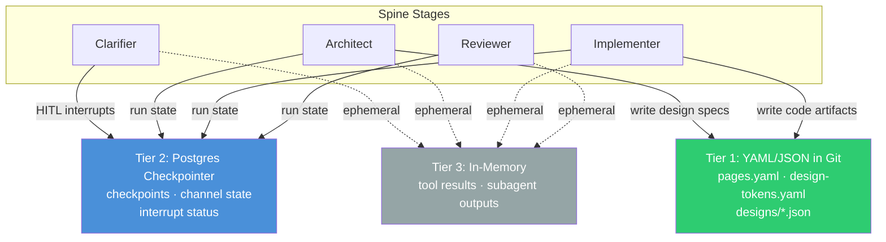

# State Persistence

> Authoritative source: [vision.md Layer 4](../vision.md#layer-4-state-and-persistence)

CHIP separates its persistence into three tiers: human-editable YAML files tracked in git for design artifacts, a Postgres-backed LangGraph checkpointer (a component that saves pipeline state after every node boundary for crash recovery and pause/resume) that persists run state including [channel contents](coordination-and-state.md) and interrupt status, and in-memory storage for temporary tool outputs. Each tier is optimized for its access pattern — YAML for human readability and git history, Postgres for crash recovery and resume, in-memory for speed on disposable outputs.

## Why CHIP does this

The Research Report's [inter-agent communication analysis](../research/research-report.md#inter-agent-communication) identifies five ranked patterns for how agents exchange data. Pattern 2 — "Blackboard via git — the right default for code itself" — directly motivates Tier 1: design artifacts live as files that humans can read, edit, and version alongside code. The [document system](../research/research-report.md#document-system-living-docs-specs-artifacts-ephemeral) further defines a four-tier artifact hierarchy (living documents, immutable specs, generated artifacts, ephemeral context) that maps onto CHIP's three persistence tiers ([Design Decisions §2.1](../design-decisions.md#21-four-tier-artifact-hierarchy)).

Run state needs a different backend entirely. The Clarifier's HITL interrupts — where the pipeline pauses for human answers and resumes hours later — require durable checkpoints that survive process crashes. YAML files can't do this; a transactional database can. Ephemeral outputs (tool call results, raw subagent responses) need neither git history nor crash recovery — they're consumed once and discarded.

## How it works



*Diagram legend: green = filesystem (git-tracked), blue = database (Postgres), gray = volatile (in-memory).*

<details><summary>Mermaid source (paste into mermaid.live)</summary>

```text
graph TD
    subgraph Spine ["Spine Stages"]
        C[Clarifier]
        A[Architect]
        I[Implementer]
        R[Reviewer]
    end

    T1["Tier 1: YAML/JSON in Git\npages.yaml · design-tokens.yaml\ndesigns/*.json"]
    T2["Tier 2: Postgres Checkpointer\ncheckpoints · channel state\ninterrupt status"]
    T3["Tier 3: In-Memory\ntool results · subagent outputs"]

    A -->|"write design specs"| T1
    I -->|"write code artifacts"| T1
    C -->|"HITL interrupts"| T2
    A & I & R -->|"run state"| T2
    C & A & I & R -.->|"ephemeral"| T3

    style T1 fill:#2ECC71,color:#fff
    style T2 fill:#4A90D9,color:#fff
    style T3 fill:#95A5A6,color:#fff
```

</details>

**Spine stage → tier mapping:** The Clarifier is the heaviest Tier 2 consumer — its HITL interrupts persist full channel state so the dashboard can resume hours later. Architect and Implementer are the primary Tier 1 writers — design specs, tokens, and task plans flow into `agentforge/spec/` as human-readable YAML. All four stages use Tier 3 for tool call results that are consumed and discarded within a single node execution.

### Tier 1: YAML/JSON artifacts

Spec files in `agentforge/spec/` are the living project definition. Agents read and write these files through typed loaders in `packages/core/`:

| Artifact | File | Loader |
|----------|------|--------|
| Project manifest | `agentforge.yaml` | `loadProjectManifest()` via `packages/core/src/config/config-loader.ts` |
| Design tokens | `agentforge/spec/design-tokens.yaml` | `loadDesignTokens()` |
| Brand spec | `agentforge/spec/brand.yaml` | `loadBrandSpec()` |
| Component catalog | `agentforge/spec/component-catalog.yaml` | `loadComponentCatalog()` |
| Pages | `agentforge/spec/pages.yaml` | `readSpecs()` |
| Design specs | `agentforge/designs/{pageId}.json` | `readDesignSpec()` / `writeDesignSpec()` via `packages/core/src/design-spec-store.ts` |
| Tasks | `agentforge.tasks.yaml` | `loadTasks()` / `saveTasks()` via `packages/core/src/state/task-manager.ts` |

All YAML writes use atomic file operations. Design specs support backup and revert (`packages/core/src/design-spec-store.ts`, backup/revert functions).

**Human-edit protection:** The lock manager (`packages/core/src/state/lock-manager.ts`) uses TTL-based expiration and content hashing to detect when a human edits a file mid-agent-write. Human-edited YAML always wins over agent-edited YAML — this is a locked decision in vision Layer 4.

### Tier 2: Postgres checkpointer

Run state persists via `@langchain/langgraph-checkpoint-postgres`. The checkpointer factory (`packages/core/src/checkpointer/index.ts`) selects the backend:

```typescript
// Without DATABASE_URL: in-memory (dev, non-durable)
const checkpointer = new MemorySaver();

// With DATABASE_URL: Postgres (durable, crash-recoverable)
const saver = PostgresSaver.fromConnString(process.env.DATABASE_URL);
await saver.setup();  // creates checkpoint tables if missing
```

Checkpoints fire on every node boundary — not just phase boundaries — giving fine-grained resumption. When a HITL interrupt fires (e.g., the Clarifier waits for human answers at [`storyWriter`](clarifier-pipeline.md)), the full [channel state](coordination-and-state.md) is persisted. The dashboard resumes by invoking the compiled graph with the same `threadId`.

Docker Compose at `docker/docker-compose.agentforge.yml` provides Postgres 16 on port 5433.

### Tier 3: Ephemeral

Tool call results and subagent intermediate outputs live in memory per run. After a tool returns, its result enters the LLM's context but is not persisted. When subagent summaries are compressed into the parent's context, the raw outputs are discarded.

## Components

| Component | File | Role |
|-----------|------|------|
| `createCheckpointer()` | `packages/core/src/checkpointer/index.ts` | Factory: `MemorySaver` or `PostgresSaver` based on `DATABASE_URL` |
| `readDesignSpec()` / `writeDesignSpec()` | `packages/core/src/design-spec-store.ts` | Design spec persistence with backup/revert |
| `loadTasks()` / `saveTasks()` | `packages/core/src/state/task-manager.ts` | Task state YAML persistence |
| Lock manager | `packages/core/src/state/lock-manager.ts` | TTL locks with content hash human-edit detection |
| Learnings manager | `packages/core/src/state/learnings-manager.ts` | Per-agent learning persistence in `.agentforge/learnings/` |
| File event bridge | `packages/core/src/events/file-event-bridge.ts` | Cross-runtime telemetry via `.agentforge/events.jsonl` (deprecated — ADR-043) |

## Current implementation

- YAML artifact persistence is operational across all pipelines — spec files, design specs, tasks, and learnings.
- Checkpointer factory implemented and wired into the Clarifier graph and dashboard API routes.
- Atomic file writes prevent corruption on concurrent access.
- Content-hash based human-edit detection in the lock manager.
- Design spec backup/revert for safe iteration during design feedback loops.

## Known limitations

!!! warning "Silent fallback"

    When `DATABASE_URL` is unset, both the CLI runner and dashboard routes fall back to `MemorySaver` without warning. Crash recovery is unavailable in this mode.

- Retention policy for checkpoints is undefined — kept indefinitely during POC. Production needs a TTL (vision Layer 4, open decision).
- No SQLite checkpointer option for local development — LangGraph has one, but it's not wired into the factory (vision Layer 4, open decision).
- The file event bridge (`.agentforge/events.jsonl`) is a workaround for cross-runtime telemetry between TypeScript and the deprecated Python engine — scheduled for removal after ADR-043 migration completes.

## Related

- [Coordination & State](coordination-and-state.md) — the logical view: what flows through channels and how agents coordinate (this page covers the physical view: where state is stored)
- [Vision Layer 4](../vision.md#layer-4-state-and-persistence) — persistence authority
- [Spine Implementation](../architecture/spine-implementation.md) — how spine stages interact with persistence tiers
- [Design Decisions §2.1](../design-decisions.md#21-four-tier-artifact-hierarchy) — four-tier artifact hierarchy rationale
- [Observability](observability.md) — telemetry persistence via Langfuse
- [ADR-043](../adrs/ADR-043-typescript-only-orchestration.md) — LangGraph adoption
