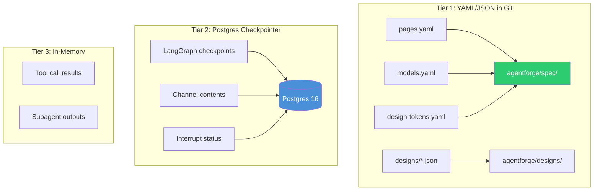
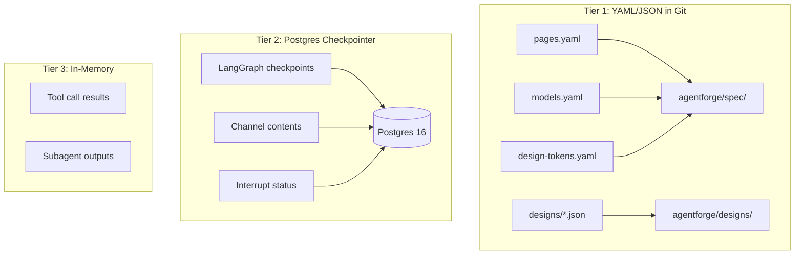

# State Persistence

> Authoritative source: [vision.md Layer 4](../vision.md#layer-4-state-and-persistence)

CHIP persists state in three tiers, each matched to its access pattern. Design artifacts (PRDs, design specs, tokens) live as YAML/JSON files in `agentforge/spec/` — human-readable, git-tracked, diffable. Run state (which node is executing, what's in each channel, interrupt status) lives in a Postgres checkpointer that survives process crashes. Ephemeral state (tool call results, intermediate outputs) lives in memory and is discarded after each run.

This separation exists because a single persistence backend is wrong for at least one of these use cases. YAML is ideal for artifacts humans read and edit but wrong for resumable run state. A database is ideal for crash recovery but wrong for artifacts that need git-tracked version history (Design Decisions, Section 2.2; Research Report, §"Inter-agent communication," pattern 2: "Blackboard via git — the right default for code itself").

## How it works



<details><summary>Mermaid source (paste into mermaid.live)</summary>



</details>

### Tier 1: YAML/JSON artifacts

Spec files in `agentforge/spec/` are the living project definition. Agents read and write these files through typed loaders in `packages/core/`:

| Artifact | File | Loader |
|----------|------|--------|
| Project manifest | `agentforge.yaml` | `loadProjectManifest()` via `packages/core/src/config/config-loader.ts` |
| Design tokens | `agentforge/spec/design-tokens.yaml` | `loadDesignTokens()` |
| Brand spec | `agentforge/spec/brand.yaml` | `loadBrandSpec()` |
| Component catalog | `agentforge/spec/component-catalog.yaml` | `loadComponentCatalog()` |
| Pages | `agentforge/spec/pages.yaml` | `readSpecs()` |
| Design specs | `agentforge/designs/{pageId}.json` | `readDesignSpec()` / `writeDesignSpec()` via `packages/core/src/design-spec-store.ts` |
| Tasks | `agentforge.tasks.yaml` | `loadTasks()` / `saveTasks()` via `packages/core/src/state/task-manager.ts` |

All YAML writes use atomic file operations. Design specs support backup and revert (`packages/core/src/design-spec-store.ts`, backup/revert functions).

**Human-edit protection:** The lock manager (`packages/core/src/state/lock-manager.ts`) uses TTL-based expiration and content hashing to detect when a human edits a file mid-agent-write. Human-edited YAML always wins over agent-edited YAML — this is a locked decision in vision Layer 4.

### Tier 2: Postgres checkpointer

Run state persists via `@langchain/langgraph-checkpoint-postgres`. The checkpointer factory (`packages/core/src/checkpointer/index.ts`) selects the backend:

```typescript
// Without DATABASE_URL: in-memory (dev, non-durable)
const checkpointer = new MemorySaver();

// With DATABASE_URL: Postgres (durable, crash-recoverable)
const saver = PostgresSaver.fromConnString(process.env.DATABASE_URL);
await saver.setup();  // creates checkpoint tables if missing
```

Checkpoints fire on every node boundary — not just phase boundaries — giving fine-grained resumption. When a HITL interrupt fires (e.g., the Clarifier waits for human answers at `storyWriter`), the full channel state is persisted. The dashboard resumes by invoking the compiled graph with the same `threadId`.

Docker Compose at `docker/docker-compose.agentforge.yml` provides Postgres 16 on port 5433.

### Tier 3: Ephemeral

Tool call results and subagent intermediate outputs live in memory per run. After a tool returns, its result enters the LLM's context but is not persisted. When subagent summaries are compressed into the parent's context, the raw outputs are discarded.

## Components

| Component | File | Role |
|-----------|------|------|
| `createCheckpointer()` | `packages/core/src/checkpointer/index.ts` | Factory: `MemorySaver` or `PostgresSaver` based on `DATABASE_URL` |
| `readDesignSpec()` / `writeDesignSpec()` | `packages/core/src/design-spec-store.ts` | Design spec persistence with backup/revert |
| `loadTasks()` / `saveTasks()` | `packages/core/src/state/task-manager.ts` | Task state YAML persistence |
| Lock manager | `packages/core/src/state/lock-manager.ts` | TTL locks with content hash human-edit detection |
| Learnings manager | `packages/core/src/state/learnings-manager.ts` | Per-agent learning persistence in `.agentforge/learnings/` |
| File event bridge | `packages/core/src/events/file-event-bridge.ts` | Cross-runtime telemetry via `.agentforge/events.jsonl` |

## Current implementation

- YAML artifact persistence is operational across all pipelines — spec files, design specs, tasks, and learnings.
- Checkpointer factory implemented and wired into the Clarifier graph and dashboard API routes.
- Atomic file writes prevent corruption on concurrent access.
- Content-hash based human-edit detection in the lock manager.
- Design spec backup/revert for safe iteration during design feedback loops.

## Known limitations

- Checkpointer fallback is silent — when `DATABASE_URL` is unset, both the CLI runner and dashboard routes fall back to `MemorySaver` without warning. Crash recovery is unavailable in this mode.
- Retention policy for checkpoints is undefined — kept indefinitely during POC. Production needs a TTL (vision Layer 4, open decision).
- No SQLite checkpointer option for local development — LangGraph has one, but it's not wired into the factory (vision Layer 4, open decision).
- The file event bridge (`.agentforge/events.jsonl`) is a workaround for cross-runtime telemetry between TypeScript and the deprecated Python engine — it should be removed after ADR-043 migration completes.

## Related

- [Coordination & State](coordination-and-state.md) — how agents coordinate through channels
- [Vision Layer 4](../vision.md#layer-4-state-and-persistence) — persistence authority
- [Observability](observability.md) — telemetry persistence via Langfuse
- [ADR-043](../adrs/ADR-043-typescript-only-orchestration.md) — LangGraph adoption
