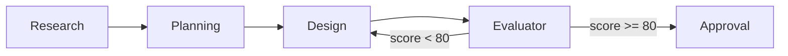

# How to generate designs in CHIP

> Authoritative source: [vision.md Layer 7](../vision.md#layer-7-design-pipeline) | Architecture: [Design Pipeline Dataflow](../architecture/design-pipeline-dataflow.md)

Run `agentforge design:page <page-name>` to generate a screen design. The pipeline produces a DesignSpec v2 JSON describing every UI element — layout, typography, colors, components — then renders it in the browser for approval. No Figma or Penpot account required for browser-only rendering.

## Prerequisites

- Node 20+ — verify with `node --version`
- An initialized project — `agentforge init` must have completed (creates `agentforge.yaml`, `agentforge/spec/`)
- `ANTHROPIC_API_KEY` set — the pipeline makes LLM calls at each stage

## Pipeline stages

The design pipeline (`runDesignPipeline()` in `packages/agents-ux/src/design-pipeline/pipeline.ts`) runs four stages sequentially:



### 1. Research

Analyzes the page requirements against the project's existing design system. Reads `agentforge/spec/pages.yaml`, design tokens, brand spec, and component catalog. Produces a research brief with UX patterns, accessibility requirements, and component recommendations.

- Agent: `ux_research` role (default model: `claude-sonnet-4-6`)
- Output cached at `.agentforge/previews/<page>/artifacts/research-brief.json`

### 2. Planning

Produces a component tree with token bindings, responsive layout rules, and content hierarchy. The planning spec defines WHAT the screen contains and WHERE each element sits — not HOW it renders.

- Agent: `ux_planning` role (default model: `claude-opus-4-7`)
- Output cached at `.agentforge/previews/<page>/artifacts/planning-spec.json`

### 3. Design

Generates the DesignSpec v2 JSON: a flat adjacency list of `NodeSpec` objects with `id`, `parentId`, `type`, `catalog` references, and style `overrides`. Uses structured output via `responseSchema` for guaranteed schema compliance.

- Agent: `ux_design` role (default model: `claude-opus-4-6`)
- Output saved at `.agentforge/previews/<page>/scripts/designspec-v2.json`

### 4. Evaluator

Scores the design across multiple dimensions (layout quality, color contrast, typography hierarchy, component usage, responsive behavior). If the score is below 80/100, the pipeline loops back to the Design stage with correction instructions.

- Agent: `ux_evaluator` role (default model: `claude-opus-4-7`)
- Evaluation results logged in pipeline telemetry

## Steps

### 1. Generate a single page

```bash
agentforge design:page home --project-root ./my-app
```

This runs all four stages for the `home` page. The page must exist in `agentforge/spec/pages.yaml`.

### 2. Generate all pages

```bash
agentforge design:page:all --project-root ./my-app
```

Runs the pipeline for every page defined in `pages.yaml`, sequentially. Shared chrome (navigation bars, sidebars) is generated once and propagated to all pages via `shared-chrome.json`.

### 3. Preview in the browser

Open the dashboard at `http://localhost:3000/design`, select the page, and click **Prototype** to see the rendered result. The renderer at `packages/designspec-renderer/` converts DesignSpec JSON into live HTML/CSS.

### 4. Customize the design system

The pipeline reads three spec files that control visual output:

| File | Controls | Key fields |
|------|----------|------------|
| `agentforge/spec/design-tokens.yaml` | Colors, typography, spacing, borders, elevation | `colors.semantic`, `typography.font_families`, `spacing.scale` |
| `agentforge/spec/brand.yaml` | Tone, motion, accessibility level | `tone`, `motion_preference`, `accessibility_level` |
| `agentforge/spec/component-catalog.yaml` | Available components, variants, token bindings | `components[].variants`, `components[].token_bindings` |

Edit these files to change the design direction. The pipeline re-reads them on every run.

### 5. Resume from a specific stage

Each stage caches its output. To re-run only the design stage (skipping research and planning):

```bash
agentforge design:page home --stage design --project-root ./my-app
```

Valid stages: `research`, `planning`, `design`, `evaluator`.

## Verify

After generation, confirm:

1. DesignSpec JSON exists: `ls .agentforge/previews/<page>/scripts/designspec-v2.json`
2. Browser renders correctly: open `http://localhost:3000/design`, click the page, click **Prototype**
3. Evaluation passed: check pipeline output for `score >= 80`

## Troubleshooting

| Symptom | Cause | Fix |
|---------|-------|-----|
| "No agentforge.yaml found" | Project not initialized | Run `agentforge init` first |
| Pipeline hangs at Research | Missing API key | Set `ANTHROPIC_API_KEY` |
| Design score below 80, looping | Ambiguous page requirements | Improve the page description in `pages.yaml` |
| Prototype button disabled | Page missing `designStatus: rendered` | Add `designStatus: rendered` to the page entry in `pages.yaml` |
| Stale prototype in browser | Old Vite process on port 4100 | Kill it: `lsof -ti:4100 \| xargs kill -9` |

## What's next

- [CLI Design Commands](cli-design-commands.md) — full command reference with flags and options
- [Design Pipeline Dataflow](../architecture/design-pipeline-dataflow.md) — architecture: data flow between stages
- [Design Evaluator](../architecture/design-evaluator.md) — how scoring and correction work
- [Design Pipeline concept](../concepts/design-pipeline.md) — mental model for the pipeline
