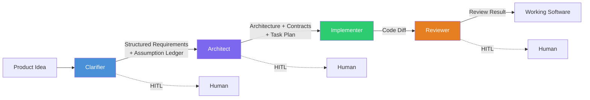

# CHIP Documentation

**CHIP** (Crafted Human Intelligence Platform) turns a product idea into working, reviewed software. Four AI-driven stages -- clarify, architect, implement, review -- pass typed artifacts through a sequential spine, with humans approving at structural boundaries.

- **[Single-writer discipline](architecture/spine-pattern.md#1-single-writer-per-artifact)** -- each stage owns its artifact. No parallel writers to shared code. Every production coding agent that shipped (Devin, Claude Code, Cursor, Aider) converged on this independently.
- **[Typed handoffs](architecture/spine-pattern.md#3-typed-channels-between-stages)** -- every artifact crossing a stage boundary has a Zod schema. Typed contracts prevent the context blindness that free-form handoffs cause.
- **[Parallel where it's safe](architecture/spine-implementation.md#concurrency-model)** -- independent features run in parallel worktrees. Evidence-gathering spawns parallel read-only subagents. Writes to shared artifacts stay single-threaded.
- **[Research-backed](architecture/spine-pattern.md#the-single-invariant)** -- 24 citations from Cognition, Anthropic, MetaGPT, and the 2024--2026 academic literature. Not opinion -- convergent evidence from teams that shipped.

## Start Here

| # | Document | What you'll learn |
|---|----------|-------------------|
| 1 | [The Spine Pattern](architecture/spine-pattern.md) | Why a sequential spine wins -- the five load-bearing properties and the evidence behind them. |
| 2 | [CHIP's Spine](architecture/spine-implementation.md) | How CHIP applies the pattern -- stage details, typed contracts, implementation status. |
| 3 | [Architecture at a Glance](architecture/vision-overview.md) | All 15 layers, status dashboard, locked vs open decisions. |

??? info "Full reading order for contributors"

    | # | Document | Purpose |
    |---|----------|---------|
    | 1 | [Vision](vision.md) | Canonical architectural authority. 15 layers with locked/open decisions. **When vision and codebase disagree, the vision wins.** |
    | 2 | [The Spine Pattern](architecture/spine-pattern.md) | Why a four-stage sequential spine wins. 24 research citations. |
    | 3 | [CHIP's Spine](architecture/spine-implementation.md) | How CHIP applies the spine. Every decision traced to research + codebase. |
    | 4 | [PRD](specs/PRD.md) | Product spec. Source of truth for scope, interfaces, API contracts, enums. |
    | 5 | [Roadmap](roadmap.md) | Eight-phase dependency-ordered rollout with demoable outcomes per phase. |
    | 6 | [Design Decisions](design-decisions.md) | Decisions by topic with reasoning, alternatives considered, and revisit criteria. |
    | 7 | [Lessons Learned](lessons-learned-rules.md) | Active rules -- what to follow and what has been superseded. |

## Tech Stack

- **Monorepo:** Nx with TypeScript
- **Orchestration:** TypeScript LangGraph (sole runtime per ADR-043)
- **Dashboard:** Next.js + Mantine v9
- **Testing:** Jest + Playwright
- **Observability:** OpenTelemetry + Langfuse self-hosted
- **RAG:** Tree-sitter + Voyage embeddings + Qdrant + Cohere Rerank

> **The single invariant:** context quality and write-coupling are the axes. Get good context into each LLM call. Keep writes single-threaded per artifact. Everything else is downstream. [Why this matters →](architecture/spine-pattern.md#the-single-invariant)
