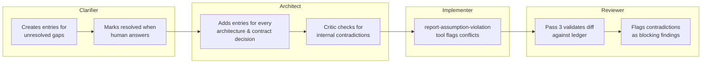
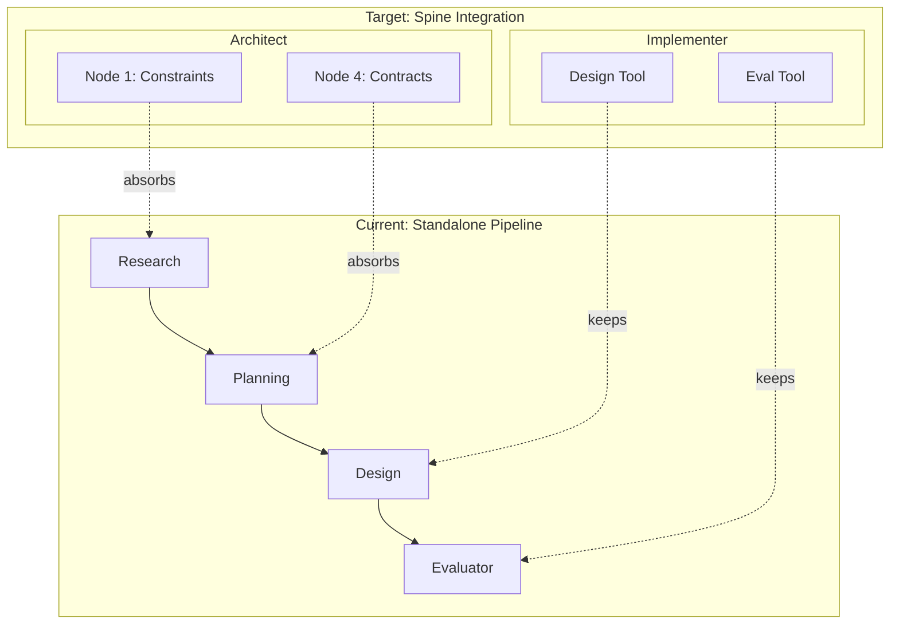
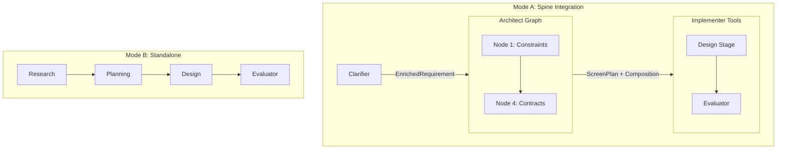

# CHIP's Next Steps: Spine Build-Out Plan

## Status: M0 COMPLETE (2026-05-04) — M1 COMPLETE (2026-05-14) — M2 COMPLETE (2026-05-14) — M3 COMPLETE (2026-05-15) — M3.5 COMPLETE (2026-05-15) — M3.6 COMPLETE (2026-05-16) — M4 COMPLETE (2026-05-18) — M4.5 NOT STARTED

## Plan Structure

This is a large initiative spanning multiple months. It's broken into **5 milestone phases**, each independently shippable and demo-able. Each phase includes its own eval harness — eval is built alongside the pipeline, not bolted on after (lesson from Clarifier).

| Milestone | What ships | Eval gate | Depends on |
|-----------|-----------|-----------|------------|
| **M0: Ground Truth** | Research doc overhaul with real data from both paths | N/A (documentation) | Clarifier run on CashPulse |
| **M1: Connect** | Clarifier output threads into design pipeline | Existing design pipeline tests + new integration test | M0 |
| **M2: Architect Foundation** | Typed contracts + Critic (Node 6) + eval harness | Architect eval: hand-crafted bundles scored by Critic | M1 |
| **M3: Architect Core** | Nodes 1-5 + shared module extraction | Architect eval: end-to-end on 3 fixture projects | M2 |
| **M3.5: Brownfield Design Delta Research** | Research brief (R9) + brownfield fixture: per-screen impact analysis, DesignSpec delta format, MODIFY task context wiring (slice-aware) | N/A (research) | M3 |
| **M3.6: Design Info Value Eval** | Empirical measurement across 5 context configurations × 6 tasks × 3 reps (90 cells); recommends DesignSliceStrategy default for M4 | Pre-shipped eval harness produces R9_4 brief with data-driven recommendation | M3.5 (does not block M4) |
| **M4: Full Spine** | Implementer + Reviewer + backward compat cleanup | Full spine eval: Clarifier→Architect→Design→Review | M3.5 |

Each milestone gets its own execution plan when it's time to start it. This document covers M0 in detail and M1-M4 at outline level.

## M0 Checklist (Ground Truth)

This is the current milestone. 4 steps, no code changes — documentation + data capture only.

- [x] **Step 1: Run Clarifier on CashPulse PRD.** COMPLETE (2026-05-04). Bootstrap mode, max 1 round, cooperative simulator. 412s, 7 questions, 3 resume cycles (critic retried twice). Output: 7 screens, 8 entities, 25 features, 3 personas, 9 NFRs. All 4 schemas validated (PRD, FeaturePlan, EnrichedRequirement, AssumptionLedger). Script: `scripts/run-clarifier-cashpulse.ts`. Eval scenario: `packages/eval/src/scenarios/cashpulse.yaml`.
- [x] **Step 2: Update research doc with both paths + gap analysis.** COMPLETE (2026-05-04). Document rewritten (645→856 lines): staleness admonition, schema-name citations, 6 Mermaid diagrams, admonitions, Related section. New sections: Part 0 (worked examples with real CashPulse data from both paths), Part 2 (pipeline stage analysis with prompt coverage table + duplication analysis), Part 3 (stage fate + solutions), Part 4 (5 key decisions), Part 10 (prerequisite plans), FB1-FB4 trade-offs. MkDocs builds clean.
- [x] **Step 3: Create self-contained LLM research briefs.** COMPLETE (2026-05-04). 6 briefs in `docs/research/briefs/` (R1-R6, 586 lines total). Each is self-contained with: architecture context, verbatim Zod schemas, real CashPulse data, settled decisions, external references, desired output format.
- [x] **Step 4: Clean up execution plan.** COMPLETE (2026-05-04). Migrated analysis replaced with pointers to research doc. Phases 1-4 task lists collapsed (DONE). Forward-looking content preserved.

## Context

The research doc (`docs/research/architect-codebase-grounded-design.md`) is the **definitive bridge** between theoretical research (`architect-design.md`) and the actual CHIP codebase. It's cited 15+ times by `spine-implementation.md` and referenced by `vision.md`. It covers **understanding** — what exists, how the Clarifier/init/design-pipeline overlap, and where the gaps are. The **path forward** (what to build, in what order, migration phases) lives in THIS execution plan, not in the research doc.

**Six gaps identified through deep codebase research (3 research agents, 60+ files read):**

1. **The document doesn't reference any prompt files** — the design pipeline's prompts (`ux-research-system.md` v1.0.0/56 lines, `ux-planning-system.md` v2.2.0/214 lines, `ux-penpot-designspec-v2.md` v2.4.0/222 lines) contain the actual LLM instructions. Container treatments, typography, and token names are duplicated 3-4x across prompts. The document talks about code modules but ignores the prompt dimension.

2. **The evaluator description is wrong for the pipeline** — the document says "structural quality metrics, catalog adoption assessment, vision evaluation" but the pipeline evaluator (`evaluatorNode` in `nodes.ts:145-167`) only runs structural checks. The vision evaluator (`evaluateDesign` in `design-evaluator.ts:172-400`) exists but is disconnected — called by 7 other code paths (CLI, dashboard, correction loops) but NOT by the pipeline. Deferred per ADR-045.

3. **Research stage duplicates Clarifier output with loss of structure** — the Clarifier produces structured accessibility (typed gap, confidence 0.90 in `gap-detector.ts:289-333`), structured data entities (`prd.dataEntities[]` with typed fields and relationships), and structured screens (with `screenType` enum). The Research stage re-derives these as flat strings. Root cause: `design-page.ts:530-531` constructs `prdRequirements = [description]` — the pipeline never receives `EnrichedRequirement`.

4. **Prompt instructions duplicated 3-4x across stages** — container treatment patterns (identical 5-pattern list in Planning, DesignSpec, and Penpot prompts), typography hierarchy (same px/weight values in DesignSpec and Penpot), semantic token names (in Planning, DesignSpec, and Penpot). The document's "overlap matrix" (§1.4) covers code modules but misses prompt-level duplication.

5. **No Mermaid diagrams** — 645-line document with zero visual aids. ASCII art lifecycle diagram (lines 460-468) violates the active lessons-learned rule "ASCII Box Diagrams Don't Render in MkDocs — Use Mermaid."

6. **No brownfield worked example** — the document describes brownfield handling theoretically but never traces a concrete scenario. Critical questions about impact analysis, task splitting, and dependency handling are unanswered.

---

## What the revised document must deliver

### A. Ground truth (what IS implemented today)
- Design pipeline: 4-stage sequential loop (NOT LangGraph — `pipeline.ts:68`), with exact data flow traced
- Clarifier: 9-node StateGraph with structured PRD output including screens, entities, features
- Evaluator: structural-only in pipeline; full vision evaluator exists but disconnected
- Typed contracts: 4 exist, 2 exist but unused, 4+ need creation
- Prompts: 4 prompt files with version numbers, line counts, and overlap analysis

### B. Two worked examples (greenfield + brownfield)
The document must open (after TL;DR) with two numbered scenario walkthroughs that trace a real app through the entire pipeline, step by step. These make the abstract architecture concrete and answer the critical "how does this actually work" questions inline.

### C. Brownfield-specific questions answered inline
- How the pipeline analyzes which existing designs are impacted
- How tasks split into atomic plans for independent agent execution
- How plan dependencies are handled (execute vs wait)
- Brownfield variation: modifying existing designs vs adding new designs

### D. Design pipeline stage analysis (NEW section the current doc lacks)
- **Per-stage breakdown**: what each prompt instructs, what data flows in/out, what's unique vs duplicated
- **Prompt overlap matrix**: which categories appear in which prompts
- **Clarifier→Research duplication**: structured data re-derived as flat strings
- **Evaluator reality**: pipeline evaluator is structural-only

### E. Clear path forward (stage fate decisions) with concrete solutions
- Each problem gets a before/after code sketch, not just a recommendation
- Pipeline architecture diagram showing migration from current 4-stage pipeline to spine integration

### F. Key architectural questions requiring human decisions

### G. Prerequisite plans identified
- Capabilities that must exist before the Architect can be built, each flagged for separate planning

---

## Implementation Plan (M0 — COMPLETE)

??? success "Phases 1-4: All COMPLETE (2026-05-04)"

    All analysis and task content from Phases 1-4 has been executed and migrated to the [research doc](../../research/architect-codebase-grounded-design.md). Key deliverables:

    - **Phase 1 (Structural fixes):** Staleness admonition, schema-name citations, 6 Mermaid diagrams, admonitions, Related section
    - **Phase 2 (Worked examples):** Part 0 with real CashPulse data from both pipeline paths
    - **Phase 3 (New analysis):** Pipeline stage analysis (§2), stage fate + solutions (§3), key decisions (§4), prerequisite plans (§10), FB1-FB4 trade-offs
    - **Phase 4 (TL;DR + reorder):** Updated TL;DR with real data, 16-section final structure

    Original task lists preserved below for historical reference.

### Phase 1: Structural fixes (low risk, high value) — DONE

#### 1.1 Add staleness admonition at document top

Insert after the title, before TL;DR:

```markdown
!!! warning "Point-in-time snapshot (2026-05-02)"

    This document was written against the codebase as of 2026-05-02. Line-range
    citations may have drifted. `spine-implementation.md` synthesizes these
    findings into the canonical architecture reference. Verify claims against
    current code before acting on them.
```

#### 1.2 Replace line-range citations with schema/function names

Throughout the document, change patterns like:
- `cross-boundary-artifacts.schemas.ts:152-161` → `cross-boundary-artifacts.schemas.ts → EnrichedRequirementSchema`
- `vision.md:589-664` → `vision.md → Layer 8: Implementation`
- `ux-research.ts:36-56` → `ux-research.ts → UXResearchOutput interface`

Prevents drift and is more searchable.

#### 1.3 Replace ASCII lifecycle diagram with Mermaid (§3.4)

Replace lines 460-468 with:



#### 1.4 Add Architect 7-node flow diagram (§1.6)

Mermaid diagram showing Node 0.5 → Node 1 → Node 2 → Node 3 → Node 4 → Node 5 → Node 6 with annotations for single-threaded writers vs parallel readers and HITL interrupts.

#### 1.5 Add design pipeline redistribution diagram (§2.2)



#### 1.6 Add HITL gates diagram (§5)

Convert HITL gates table into a sequence diagram showing the full spine flow with interrupt points.

#### 1.7 Convert recommendations and open decisions to admonitions

- §1.3 "Recommendation: Option A" → `!!! tip "Recommendation: Lightweight Architect Node 0.5"`
- §2.4 "Open decisions from vision" → `??? info "Open decisions (vision Layer 8)"` (collapsible)
- §3.3 "Open decisions from vision" → `??? info "Open decisions (vision Layer 9)"` (collapsible)
- §1.5 "Need to be created" table → `!!! note "Planned"` admonition wrapping the table

#### 1.8 Add "Related" section

```markdown
## Related

- [Spine Implementation](../architecture/spine-implementation.md) — synthesizes this research into canonical architecture reference
- [Spine Pattern](../architecture/spine-pattern.md) — the four-stage spine pattern this research validates
- [Architect Design Research](architect-design.md) — the theoretical companion
- [Vision Layer 8: Implementation](../vision.md#layer-8-implementation) — Implementer authority
- [Vision Layer 9: Review](../vision.md#layer-9-review) — Reviewer authority
- [ADR-045](../adrs/ADR-045-evaluator-deferred-to-phase-2.md) — vision evaluation deferral
- [Design Pipeline Dataflow](../architecture/design-pipeline-dataflow.md) — current pipeline data flow
```

---

### Phase 2: Worked examples (the critical addition)

Insert as **Part 0: How the Pipeline Works** right after the TL;DR.

#### Scenario 1: Greenfield — "Build a personal expense tracker"

User input: "I want an app to track daily expenses, split bills with roommates, set monthly budgets, and see spending reports."

**Step 1: Clarifier** (implemented — `packages/agents-clarifier/`)
- PRD Analyzer extracts structured PRD:
  - **Screens**: `[dashboard, expense-entry, split-detail, budget-overview, reports, settings]` each with `screenType: 'page'`
  - **Data entities**: `[Expense{amount,category,date,paidBy}, Category{name,icon,budget}, Split{expense,participants,shares}, Budget{category,limit,period}]` with typed fields and relationships
  - **Features**: 8 features with `must-have`/`should-have` priorities and EARS acceptance criteria
  - **Personas**: `[primary-user, roommate]`
- Gap Detector identifies decision points: "Do splits support unequal shares?", "Is the budget per-category or total?"
- Story Writer produces `FeaturePlan` with feature DAG (budgets depend on categories, splits depend on expenses)
- **HITL Gate 1**: Human reviews questions, provides answers
- Output: `EnrichedRequirement` + `FeaturePlan` + `AssumptionLedger`

**Step 2: Architect Node 0.5 — Change Classifier** (not yet built)
- Greenfield: **skipped**. All scope axes implicitly `true`.

**Step 3: Architect Node 1 — Context & Constraints Assembler** (not yet built)
- Reads `EnrichedRequirement.prd` (structured)
- Reads project `design-tokens.yaml` → brand-aware context
- Reads `component-catalog.yaml` → available UI components
- **No RAG** for greenfield — no existing codebase
- Output: `ConstraintSet` = `{ hard: [8px-grid, WCAG-AA, mobile-first], soft: [card-based-dashboard, tab-navigation], gaps: [data-store-choice, auth-strategy, chart-library], mode: 'greenfield' }`

> **How does greenfield differ from brownfield here?**
> Greenfield skips repo-map and ADR-library subagents (nothing to index). Constraints come from design tokens, component catalog, and steering files. All `ConstraintSet.gaps` are open decisions.

**Step 4: Architect Node 2 — Options Explorer** (not yet built)
- One subagent per gap: data store (SQLite vs Postgres vs Supabase), auth (email vs OAuth vs magic link), chart library (Recharts vs Chart.js vs D3)
- Each returns `OptionMemo` with alternatives, tradeoffs, blast radius
- Output: `OptionsBundle` — evidence only, no commitments

**Step 5: Architect Node 3 — Architecture & ADR Writer** (not yet built)
- Commits: Supabase, Recharts, Next.js
- Writes `ArchitectureSpec` + ADRs (one per load-bearing pick)
- Updates `AssumptionLedger`

**Step 6: Architect Node 4 — Contract Designer** (not yet built, reuses `packages/agents-ux/` logic)
- **Sequential specialist invocations** (order matters — each reads prior artifacts):

  1. **Data model specialist** → refines `prd.dataEntities[]` into concrete schema
  2. **API contract specialist** → OpenAPI 3.1 fragments (reads data model to match shapes)
  3. **Component composition specialist** → `ComponentTreeNode[]` per screen (reuses `ux-planning.ts` logic)
  4. **Screen spec specialist** → `ScreenPlan[]` using existing schema (reuses `ux-research.ts` constraints)
  5. **Design system diff specialist** → compares proposed tokens against `DesignTokensSpec`

> **How do specialists know their execution order?**
> Sequential inside a single node (vision Layer 8: single-threaded writer). Order is hardcoded: data model → API → component composition → screen spec → design system diff. Each reads prior artifacts from LangGraph state. NOT parallel — "A screen spec without the API contract settled commits to an implicit data shape" (architect-design.md §4).

**Step 7: Architect Node 5 — Task Planner** (not yet built)
- Decomposes into `TaskPlan` DAG:

  | Task | Description | Files | Deps | Write Order |
  |------|-------------|-------|------|-------------|
  | T1 | Scaffold | `package.json`, dirs | — | 0 |
  | T2 | DB migration | `migrations/001.sql` | T1 | 1 |
  | T3 | Expense API | `api/expenses/route.ts` | T2 | 2 |
  | T4 | Split API | `api/splits/route.ts` | T2 | 2 |
  | T5 | Backend tests | `tests/api/*.test.ts` | T3,T4 | 3 |
  | T6 | Dashboard (design+build) | `dashboard/page.tsx` | T3 | 4 |
  | T7 | Expense entry (design+build) | `expenses/new/page.tsx` | T3 | 4 |
  | T8 | Split detail (design+build) | `splits/[id]/page.tsx` | T4 | 4 |
  | T9 | Frontend tests | `tests/*.test.tsx` | T6,T7,T8 | 5 |
  | T10 | Integration test | `tests/integration/*.test.ts` | T5,T9 | 6 |

- Deterministic validators: PRD criterion coverage, DAG acyclic, single-writer, contract-task coverage

> **How do tasks split into atomic plans for independent agent execution?**
> Each task declares `filePaths[]` (what it writes) and `dependencies[]` (what must complete first). Single-writer rule: no two tasks write the same file. Frontier tasks (T3 and T4 both depend on T2) execute in parallel in **separate git worktrees**.

> **How are plan dependencies handled (execute vs wait)?**
> The orchestrator reads the `TaskPlan` DAG. A task is "ready" when all its `dependencies[]` have status `completed`. Ready tasks dispatch to Implementer instances in separate worktrees. On completion, worktree merges to integration branch, orchestrator re-evaluates frontier. Git-mediated coordination, not in-memory state (vision Layer 8).

**Step 8: Architect Node 6 — Critic** (not yet built)
- Fresh context. Deterministic gates first, LLM review second. Green gate → emit `ContractBundle`.

**Step 9: HITL Gate 2 — Design/API Approval**
- Human reviews architecture, contracts, task plan. Inline edits allowed. Cross-screen atomic.

**Step 10: Implementer executes task DAG** (not yet built)
- For frontend tasks (T6-T8), invokes design stage as specialist tool with Architect's `ScreenPlan` + `ComponentComposition` → DesignSpec v2 → structural evaluation
- Then writes code consuming DesignSpec as blueprint
- Sequential write order within each task

**Step 11: Reviewer** (not yet built)
- 4-pass fresh-context review. Pass 3 validates diff against assumption ledger. Max 2 revisions before human escalation.

---

#### Scenario 2: Brownfield — "Add budgeting to the existing expense tracker"

User input: "Add monthly budget tracking. Dashboard should show budget progress. Alert when spending exceeds 80%."

**TWO sub-types the pipeline must distinguish:**
- **2A: New screens** — `budget-overview` doesn't exist yet
- **2B: Modified screens** — existing `dashboard` gets a budget progress section

**Step 1: Clarifier** (evolution mode)
- `contextRetriever` calls 5 RAG tools: `searchCode` (finds existing models), `searchDocs` (finds existing PRD), `searchDesigns` (finds existing DesignSpec v2 for all screens), `getRepoMap`, `findSimilarPatterns`
- PRD Analyzer in evolution mode: identifies **delta** features, **new** entities (Budget), **new** screen (budget-overview), **modified** screen (dashboard)

**Step 2: Architect Node 0.5 — Change Classifier** (brownfield-specific)
```typescript
{
  scopeAxes: { ui: true, component: true, designSystem: false, api: true, dataModel: true },
  blastRadius: 'module'
}
```

> **How does the pipeline analyze which designs get impacted?**
> The Change Classifier reads the enriched requirement (screens list with new + modified names) and the repo map (existing `agentforge/designs/*.json` files). Comparison:
> - Screen in requirement AND has existing design → **modified** (design delta needed)
> - Screen in requirement but NO existing design → **new** (full design needed)
> - Screen in design files but NOT in requirement → **unchanged** (skip)
>
> This flows into `ChangeClassification.scopeAxes.ui = true` and the screen spec specialist receives both "new" and "modified" screen lists.

**Step 3: Architect Node 1** (brownfield — all subagents run)
- Repo map subagent indexes existing codebase via `packages/retrieval/`
- ADR library subagent retrieves existing ADRs
- Output: `ConstraintSet` with `mode: 'brownfield'`, hard constraints include "maintain existing dashboard card layout"

**Step 4: Architect Node 2** (fewer open axes — data store, auth already decided)
- `defaultToExistingPattern = true` — deviation requires explicit ADR

**Step 5-6: Architecture + Contracts** (brownfield scope-conditional)
- Only specialists for active scope axes run
- Component composition specialist produces:
  - **NEW screen (budget-overview)**: full component tree
  - **MODIFIED screen (dashboard)**: reads existing DesignSpec v2, produces **delta component tree**

> **How does the pipeline handle modifications to existing designs?**
> The specialist receives the existing screen's DesignSpec v2 JSON (from `agentforge/designs/dashboard.json`). It produces a **delta specification**:
> - `unchanged` nodes: referenced by ID, not re-specified
> - `new` nodes: full specification
> - `modified` nodes: ID + changed fields only
> - `removed` nodes: listed by ID
>
> The Implementer's design stage applies the delta to produce the updated full DesignSpec v2, preserving existing design decisions.

**Step 7: Task Planner** (brownfield — delta tasks)

| Task | Type | Files | Deps |
|------|------|-------|------|
| T1 | DB: add Budget table | `migrations/002.sql` | — |
| T2 | Backend: budget API | `api/budgets/route.ts` | T1 |
| T3 | Backend: spending aggregation | `lib/budget-spending.ts` | T1 |
| T4 | Backend tests | `tests/api/budgets.test.ts` | T2,T3 |
| T5 | **NEW** design+build: budget-overview | `budgets/page.tsx` | T2 |
| T6 | **MODIFY** dashboard: add budget progress | `dashboard/page.tsx` (delta) | T3 |
| T7 | Frontend: alert threshold | `lib/budget-alerts.ts` | T3,T6 |
| T8 | Frontend tests | `tests/budgets.test.tsx` | T5,T6,T7 |
| T9 | Integration test | `tests/integration/budget.test.ts` | T4,T8 |

> **How do atomic tasks handle modifications vs new screens differently?**
> - **T5 (NEW)**: Implementer invokes design stage with full `ScreenPlan` → complete DesignSpec v2 from scratch
> - **T6 (MODIFY)**: Implementer invokes design stage with delta spec → receives existing `dashboard.json`, delta component tree, instructions to insert `BudgetProgressSection` while preserving existing nodes → outputs new complete `dashboard.json`
> - **T7 (behavior)**: No design stage — purely code. Depends on T6 (alert hook references budget progress section)

> **Can T5 and T6 run in parallel?**
> Yes — different files, single-writer rule satisfied, separate git worktrees. T7 depends on T6 (waits for merge).

---

#### Brownfield Variation: "Add dark mode" (design-system-scoped)

- `ChangeClassification`: `{ ui: true, designSystem: true, component: false, api: false, dataModel: false }`
- Design system diff specialist runs → `DesignSystemDiff`: added tokens (dark variants), theme strategy (CSS custom properties)
- Screen spec specialist identifies ALL screens as impacted (all use surface/text tokens)
- Task Planner: T1 (add dark tokens) → T2 (theme toggle component) → T3-T8 (regenerate each screen, parallelizable) → T9 (E2E test)

> **How does the pipeline propagate design system changes?**
> The `DesignSystemDiff` lists added/modified tokens. For each screen's existing DesignSpec, the specialist checks referenced tokens. Screens referencing any changed token → impacted → regeneration task. One task per screen (parallelizable) plus theme toggle component.

---

### Phase 3: New analysis sections

#### 3.1 Design Pipeline Stage Analysis

Insert as **Part 2** (renumber existing sections).

**Per-stage data flow diagram** (Mermaid):
```
Pipeline Input → Research → state.research → Planning → state.planning → Design → state.design → Evaluator
```
With exact state fields flowing between each stage.

**Prompt coverage table:**

| Category | Research (v1.0.0, 56 lines) | Planning (v2.2.0, 214 lines) | DesignSpec (v2.4.0, 222 lines) | Unique owner |
|---|---|---|---|---|
| Component hierarchy | — | **Primary** | Flat adjacency list | Planning |
| Container treatments | — | Token binding for elevation | 5 treatments with rules | **Duplicated** |
| Typography scale | — | Roles by name | Exact px/weight | DesignSpec |
| Semantic color tokens | — | Allowlist enforcement | Token names listed | Planning gates, DesignSpec consumes |
| Spacing values | — | Sizing defaults (px ranges) | Spacing & grouping rules | **Duplicated** |
| Responsive breakpoints | Mention only | **Primary** (3 breakpoints) | Single viewport | Planning |
| WCAG accessibility | **Primary** | Touch targets, ARIA | Semantic HTML from catalog | Research discovers, others implement |
| navigateTo routing | — | **Primary** | — | Planning |
| Screen partitioning | — | **Primary** | screen field | Planning |

**Clarifier → Research duplication analysis:**

| Information | Clarifier output | Research output | Status |
|---|---|---|---|
| Accessibility | Typed gap, confidence 0.90 | Flat strings | **Duplicated with loss** |
| Data entities | Typed fields, relationships | Flat strings | **Duplicated with loss** |
| Design constraints | Not produced | Grounded in design tokens | **Unique to Research** |
| UX reference patterns | Not produced | UI idioms | **Unique to Research** |

Root cause: `design-page.ts:530-531` passes `[description]`, not `EnrichedRequirement`.

**Evaluator reality vs claims:**

| Capability | In `evaluateDesign` | In pipeline `evaluatorNode` | Runs in pipeline? |
|---|---|---|---|
| Container diversity | Yes | Yes | **YES** |
| Catalog adoption | Yes | Yes | **YES** |
| Vision (5-dim LLM) | Yes | No | **NO** |
| Token compliance | Yes (optional) | No | **NO** |
| NavigateTo count | Yes (optional) | No | **NO** |

#### 3.2 Stage Fate Recommendations

**Research → Slim and absorb into Architect Node 1**
- Keep: design-token-aware constraints, UX pattern selection (unique)
- Eliminate: re-derivation of accessibility, entities (Clarifier produces these structured)
- Prerequisite: thread `EnrichedRequirement` into pipeline

**Planning → Becomes Architect Node 4 specialist**
- Component tree, token binding, screen partitioning are architectural decisions
- Token validation loop (`token-validation.ts`) moves to shared module
- Planning prompt becomes Node 4 component composition specialist prompt

**Design → Implementer specialist tool (confirmed)**
- Visual composition depends on Architect contracts
- Prompt deduplication: container treatments, typography, spacing become sole responsibility of DesignSpec prompt

**Evaluator → Wire vision into pipeline (Phase 2)**
- Function exists, schema exists, 7 callers work. Wiring task only.

#### 3.3 Concrete Solutions (before → after)

**Solution: Thread structured PRD**

Before (`design-page.ts:530-531`):
```typescript
const prdRequirements = [description];
if (prdContent) prdRequirements.push(prdContent);
```

After:
```typescript
interface PipelineInput {
  enrichedRequirement: EnrichedRequirement;   // structured Clarifier output (required in spine mode)
  featurePlan: FeaturePlan;                   // feature DAG (required in spine mode)
  prdRequirements?: string[];                 // migration-period compatibility only
}
```

**Solution: Prompt deduplication map**

| Category | Current owners | Target owner | Action |
|---|---|---|---|
| Container treatments | Planning+DesignSpec+Penpot | **DesignSpec** | Remove from Planning, Penpot |
| Typography scale | DesignSpec+Penpot | **DesignSpec** | Remove from Penpot |
| Spacing rules | Planning+DesignSpec+Penpot | DesignSpec (visual), Planning (structural) | Remove from Penpot |
| `readSpecs()` | Research+Planning | **Once in `initState()`** | Add `existingSpecs` to state |

**Solution: Evaluator wiring**

Before (`nodes.ts:145-167`):
```typescript
const gate = runStructuralQualityGate(spec);
return { evaluation: { score: gate.score, issues: gate.issues, structural: true } };
```

After:
```typescript
const gate = runStructuralQualityGate(spec);
if (state.enableVisionEval && state.screenshotPath) {
  const visionResult = await evaluateDesign({
    screenshotPath: state.screenshotPath,
    designSpec: JSON.stringify(spec),
    planning: state.planning,
    designTokens: state.designTokensSpec,
    catalogMap: state.catalogMap,
  });
  return { evaluation: { ...visionResult, structural: false } };
}
return { evaluation: { score: gate.score, issues: gate.issues, structural: true } };
```

**Solution: Pipeline architecture diagram (both modes)**



#### 3.4 Key Decisions Required

5 decisions as admonitions with options and recommendations:

1. **Should the Architect receive the Clarifier's structured PRD?** → Recommendation: Yes
2. **Should Planning survive as a standalone stage?** → Recommendation: Full spine integration, no standalone mode
3. **Where does the token validation loop live?** → Recommendation: Shared module in `packages/core/src/architect/`
4. **When to wire vision evaluation into pipeline?** → Recommendation: Opt-in flag, default off for iteration
5. **Shared module location?** → Recommendation: `packages/core/src/architect/`

#### 3.5 Eval Harness Per Milestone

Eval is built alongside the pipeline, not bolted on after. The Clarifier eval (cooperative simulator, `packages/eval/`) proves this pattern works — apply it to every new spine stage.

**M0 (Ground Truth):** No eval — documentation milestone.

**M1 (Connect):** Verify that threading `EnrichedRequirement` into the design pipeline produces equivalent or better DesignSpec output.
- Run `design:page` on CashPulse fixture with and without `enrichedRequirement`
- Diff the two DesignSpec outputs — document differences
- Existing design pipeline tests must pass unchanged

**M2 (Architect Foundation):** Architect eval harness modeled after `packages/eval/`.
- **Golden bundles:** 3 hand-crafted `ContractBundle` fixtures (correct, missing-field, contradictory). Critic must pass correct, reject the other two.
- **Schema validation:** Every Architect output parses against its Zod schema
- **Metric:** Critic false-positive rate (passes bundles that have real issues) and false-negative rate (rejects valid bundles)
- **Location:** `packages/eval/src/scenarios/architect/` or `packages/architect-eval/`

**M3 (Architect Core):** End-to-end Architect eval.
- **Golden inputs:** 3 fixture projects (`personal-expense-tracker` + 2 new: a CRUD API app + a dashboard app)
- **Run Architect on each:** Clarifier output → Architect → `ContractBundle`
- **Verify:**
  - All output schemas parse (Zod validation)
  - Data model covers all PRD entities
  - API contracts cover all PRD features
  - Component composition references only catalog components that exist
  - Task plan DAG is acyclic, single-writer, covers all PRD criteria
  - Screen specs reference only entities in data model
- **Regression:** Compare Architect output against baseline (stored in fixtures)
- **Cost tracking:** LLM cost per Architect run (via Langfuse)

**M4 (Full Spine):** Full pipeline eval.
- **End-to-end:** Raw idea → Clarifier → Architect → Design → Evaluator → score
- **Comparison baseline:** Standalone pipeline output on same fixture
- **Gate:** Spine output DesignSpec scores >= standalone baseline on structural quality gate
- **Spine eval scenario:** Add to `packages/eval/` as a new scenario type

#### 3.6 Plans Required Before Implementation

| # | Capability | Needed by | Scope |
|---|-----------|-----------|-------|
| 1 | **Orchestrator / Task Dispatcher** | M4 | New `packages/orchestrator/`, LangGraph outer graph |
| 2 | **Design Delta Specification** | M3 (brownfield) | Extension to DesignSpecV2 type |
| 3 | **Existing Design Loader** | M3 (brownfield) | Utility in `packages/core/` |
| 4 | **Impact Analysis** | M3 (brownfield) | Part of Architect Node 0.5 |
| 5 | **Structured PRD Threading** | M1 | Wiring in `design-page.ts` + `PipelineInput` |
| 6 | **Architect Eval Harness** | M2 | Golden bundles, schema validation, regression baseline |

---

### Phase 4: Update TL;DR and section order

**Updated TL;DR** adds two bullets:
- Design pipeline stage analysis (prompt overlap, Clarifier duplication, evaluator reality)
- Brownfield handling (impact analysis, delta specifications, task splitting)

**Final section order:**
1. Title + staleness admonition
2. TL;DR (6 bullets)
3. **Part 0: How the Pipeline Works** (greenfield + brownfield scenarios)
4. Methodology
5. Part 1: Architect Stage — Grounded Adjustments (existing + diagrams)
6. **Part 2: Design Pipeline Stage Analysis** (NEW)
7. **Part 3: Stage Fate + Solutions** (NEW, with before/after code)
8. **Part 4: Key Decisions** (NEW, 5 admonitions)
9. Part 5: Implementer Stage (existing, renumbered)
10. Part 6: Reviewer Stage (existing, renumbered)
11. Part 7: Shared Module Opportunity (existing, updated)
12. Part 8: Contract Summary (existing)
13. Part 9: Implementation Sequence (existing, updated)
14. **Part 10: Prerequisite Plans** (NEW)
15. Related (NEW)
16. Citations (expanded)

---

## Pipeline Overlap Analysis — MIGRATED

!!! info "Moved to research doc"

    The pipeline overlap analysis (field-by-field map, three systems, key findings, merge path) is now in the [research doc Part 0 (Scenario 1)](../../research/architect-codebase-grounded-design.md#part-0-how-the-pipeline-works--two-worked-examples) and [Part 2 (§2.5)](../../research/architect-codebase-grounded-design.md#part-2-design-pipeline-stage-analysis-grounded-in-real-data), grounded in real M0 data from both pipeline paths.

Original content preserved below for reference.

Grounded in real data from `fixtures/personal-expense-tracker/` (design pipeline outputs) and `packages/core/src/types/cross-boundary-artifacts.schemas.ts` (Clarifier schemas).

### The Three Systems

```
SYSTEM 1: agentforge init (exists)
  PRD markdown → LLM → pages.yaml, models.yaml, api.yaml, design-tokens.yaml, component-catalog.yaml

SYSTEM 2: Clarifier (exists, 9-node LangGraph)
  Raw idea → structured PRD + FeaturePlan + AssumptionLedger

SYSTEM 3: Architect (proposed, not built)
  EnrichedRequirement → 7-node graph → ContractBundle
```

### Field-by-Field Overlap Map

| Data needed by Design Pipeline | `agentforge init` produces | Clarifier produces | Research re-derives | Planning re-derives | Architect would produce |
|---|---|---|---|---|---|
| **Screen list** (id, name, desc, route) | `pages.yaml` — full (5 screens: dashboard, add-expense, spending-insights, settings, confirm-delete) with route, components, data_sources, navigates_to, screen_type | `prd.screens[]` — partial (id, name, desc, optional screenType. NO route, NO components, NO navigates_to) | — | `screens[]` — partial (name, componentNames) | `ScreenPlan[]` — full |
| **Components per screen** | `pages.yaml` components[] (14 for dashboard) | — | `referencePatterns[]` — flat strings | `componentTree[]` — **rich** (34 nodes with props, defaults, children, navigateTo) | `ComponentComposition` reusing planning logic |
| **Data models** | `models.yaml` — 8 entities (Expense 10 fields, Category 9, Budget 7, PaymentMethod 7, QuickAddSuggestion 9, DailyAggregate 7, CategoryAggregate 8, UserSettings 6), typed fields, db_table | `prd.dataEntities[]` — entities with typed fields, optional relationships. NO db_table | `dataModelDependencies[]` — flat strings | — | Concrete schema (columns, indexes, constraints, migration) |
| **API contracts** | `api.yaml` — 19 endpoints | — | — | — | OpenAPI 3.1 fragments |
| **Design tokens** | `design-tokens.yaml` — full system (10 primitive colors, 16 semantic, 6 typography roles, spacing scale, 4 elevation levels, motion, z-index, state) | — | Reads + references | Reads, validates bindings (99 entries) | Design system diff |
| **Component catalog** | `component-catalog.yaml` — 25 components with anatomy, variants, states, token_bindings, library_mapping | — | `referencePatterns[]` — flat strings | Reads as vocabulary | No change |
| **Navigation** | `pages.yaml` navigates_to — structured (target, trigger, source_node, mode) | — | — | `navigateTo` on components — simple string | `ScreenPlan.navigationTargets` |
| **Token bindings** | — | — | — | `tokenBindings` — 99 entries | Part of ComponentComposition |
| **Responsive** | — | — | Mentioned | `responsiveRules[]` — 3 breakpoints | Part of ScreenPlan |
| **Accessibility** | — | Phantom gaps → auto-assumptions (WCAG 2.1 AA, confidence 0.90) | 17 WCAG strings | Touch targets in bindings | Part of ConstraintSet |
| **Features + criteria** | — | `featurePlan.features[]` — EARS criteria, deps DAG | — | — | Task plan |
| **Assumptions** | — | `assumptionLedger` entries with confidence, blastRadius | — | — | Updated with decisions |

### Key Findings

**Finding 1: `agentforge init` IS the current Architect.** Init takes a PRD and produces exactly the artifacts the Architect's Node 4 specialists would produce. The Architect replaces init with a multi-node LangGraph graph that adds deterministic validation, ADR documentation, task planning, and assumption ledger threading.

**Finding 2: Clarifier and init have PARTIAL overlap on screens and entities.** Clarifier has the seed (4 fields per screen); init has the enriched version (12+ fields). For entities, Clarifier has MORE detail per field (required, description) but init has db_table. Neither is a superset of the other.

**Finding 3: Research stage re-derives what BOTH Clarifier and init already have.** Accessibility → Clarifier auto-assumptions. Data model deps → both Clarifier and init have structured versions. Design constraints → init's design-tokens.yaml. Research's only unique value: grounding constraints in project-specific design tokens, but init already produced those tokens.

**Finding 4: Planning does work that belongs BETWEEN init and design.** Init produces the WHAT (14 component names); Planning produces the HOW (34-node tree with props, defaults, children). This is genuine value, but it's architectural work — it belongs in the Architect, not in the design pipeline.

**Finding 5: Design pipeline overlaps with init, not the Architect directly.** The Architect replaces init, so Research and Planning become redundant once the spine is active. The current 4-stage pipeline is the migration source, not a permanent parallel path.

### The Merge Path

**Current flow:**
```
PRD.md → init → YAML specs → Research → Planning → Design → Evaluator
```

**Target flow:**
```
Raw idea → Clarifier → Architect → Design → Evaluator
              ↓              ↓           ↓
        structured PRD   replaces init  visual layout
        + FeaturePlan    + Research     (implementation)
        + Assumptions    + Planning
```

**What gets eliminated:** init (replaced by Architect), Research in spine mode (absorbed by Architect Node 1+4), Planning in spine mode (absorbed by Architect Node 4).

**What stays:** Design stage (visual composition), Evaluator (quality gate), Standalone mode (Research + Planning for dev iteration).

**Init bridging question:** Init stays as "quick start" for demos; Architect is the production path. They converge when the Architect stabilizes.

---

## Clarifier v0 Known Trade-Offs and Future Work — MIGRATED

!!! info "Moved to research doc"

    FB1-FB4 trade-offs are now in the [research doc "Clarifier v0 Known Trade-Offs" section](../../research/architect-codebase-grounded-design.md#clarifier-v0-known-trade-offs-fb1-fb4), updated with real CashPulse M0 run data. See also `docs/lessons-learned-rules.md` § "Clarifier: Known v0 Trade-Offs and Coverage Gaps."

Original content preserved below for reference.

Merged from `docs/plans/completed/clarifier-initiative/execution-plan.md` (v0 pipeline review, 2026-05-02). See `docs/lessons-learned-rules.md` § "Clarifier: Known v0 Trade-Offs and Coverage Gaps."

### FB1: Semantic Deduplication for LLM Gaps (future)

SHA-256 content hashing of `topic::description` misses semantic duplicates. Current mitigation: system prompt instruction + `qaSection` in user message + `filterAskedGaps` by ID. Future: embed gap descriptions with Voyage, cosine similarity rejection above 0.85 threshold.

### FB2: PRD Over-Production (documented trade-off)

Bootstrap mode deliberately over-produces features/screens/entities. `could-have` priority and divergence prompt constraints are mitigations. Eval metric: `unvalidated-artifact-survival` — count of `could-have` items never referenced by any human answer. Future: post-clarification pruning of zero-reference `could-have` items.

### FB3: Critic is Structure-Only (documented limitation)

Critic runs ONLY deterministic checks (EARS, INVEST, DAG). `criticPassed: true` = structurally valid, NOT quality-assured. `critic-system.md` scaffolded but not wired. Eval metric: track false-positive rate — how often `criticPassed: true` correlates with evaluator scores below 60/100.

### FB4: Eval Personality Variants (future)

Cooperative simulator always picks `recommended: true`. Priority-update logic in PRD Updater is untested. Future: opinionated, evasive, and contradictory personas. Each must have at least one eval run.

---

## Open Findings (from 2026-05-04 session research)

### Finding A: Clarifier is missing onboarding context (3 gaps)

| What init wizard collects | Clarifier equivalent | Gap | Resolution |
|---|---|---|---|
| Styling library (6 options, shadcn default — `component-library-presets.ts`) | Context Retriever loads generic base catalog | **Missing** | Architect Node 2 axis, not Clarifier. Clarifier does WHAT, Architect decides HOW. |
| Stack (React/Node/PostgreSQL/Tailwind — hardcoded in `init.ts:120`) | Not in `ClarifierInput` | **Missing** | Currently hardcoded. Becomes Architect decision when multiple stacks supported. |
| Design tokens + brand (`design-system-writer.ts`) | Loads tokens if they exist | **Partial** | Needs project setup step BEFORE Clarifier in bootstrap mode. |

**Decision:** Keep styling/stack OUT of Clarifier. Add styling library as Architect Node 2 (Options Explorer) axis.

### Finding B: PRD Analyzer is deliberately narrower than App Spec Generator

PRD Analyzer (`prd-analyzer.ts`) produces WHAT: features, personas, entities, screens, NFRs. App Spec Generator (`generate-app-spec.ts`) produces HOW: pages with routes+components+data_sources+navigates_to, models with db_table+nullable, 19 API endpoints. The gap is filled by the Architect, not by expanding the Clarifier.

### Finding C: Node 5 (Task Planner) verification is the hardest unsolved problem

Structural validation (Critic): DAG acyclic, single-writer, PRD coverage. But execution validation (can a single agent complete each task within budget?) is only provable by running. Task granularity principle: feature-level tasks (coarse), Implementer handles sequential write order internally. Verification: run Architect on CashPulse, compare TaskPlan against what was actually built.

---

## Accumulated Knowledge Inventory (preserve during migration)

| Asset | Location | What it carries | Migration risk |
|-------|----------|-----------------|----------------|
| Planning prompt v2.2.0 (214 lines) | `agents-ux/src/prompts/ux-planning-system.md` | Domain-specific naming, concrete sizing defaults, navigation binding, token binding format rules | Battle-tested through visual diversity phases |
| DesignSpec prompt v2.4.0 (222 lines) | `agents-ux/src/prompts/ux-penpot-designspec-v2.md` | 5 container treatments, "never border AND shadow" rule, hierarchy px/weight scale, catalog-vs-type distinction | Earned through visual bugs |
| Token validation pipeline | `agents-ux/src/ux-planning/token-validation.ts` | 3-strategy correction: filter → deterministic dot-notation fix → LLM retry. Calibrated thresholds. | LLMs consistently generate invalid tokens |
| Structural quality gate | `agents-ux/src/ux-design/structural-quality-gate.ts` | Container diversity + catalog adoption scoring. MAX_STRUCTURAL_DEDUCTION = 20. | Tuned during evaluator calibration |
| Catalog adoption assessment | `agents-ux/src/ux-design/assess-catalog-adoption.ts` | 70% accelerator threshold, 3 promotable patterns | Each pattern from a real missing-renderer bug |
| Design system context builder | `agents-ux/src/ux-design/design-system-context.ts` | Parses DesignTokensSpec into brand-aware LLM context. Template variable system. | Multiple design token format iterations |
| Evaluation context builder | `agents-ux/src/ux-design/evaluation-context.ts` | Compact spec ~300-600 tokens vs ~4K-15K raw. Strips what the vision LLM can SEE. | Token budget crisis (lessons-learned rule) |
| 10+ lessons-learned rules | `docs/lessons-learned-rules.md` | DesignSpec v2, NodeSpec field budget, screen type before design, renderer verification, evaluator token budget | Months of design pipeline work |
| ADR-045 (evaluator deferral) | `docs/adrs/` | Structural-only in pipeline, vision opt-in. Don't reintroduce without addressing cost. | OOM + cost incidents |

**Migration invariant:** At every phase boundary, `nx run-many -t test` and `nx run-many -t typecheck` pass. The `design:page` CLI command (transitioning from standalone to spine-backed) produces valid DesignSpec at every step.

---

## Research TODOs (produce self-contained LLM briefs in `docs/research/briefs/`)

Every gap needs a decision. Every decision needs research. Each TODO produces a standalone brief that an LLM WITHOUT codebase access can use to produce a useful report.

Each brief contains: Question, CHIP Architecture Context (relevant layers only), Relevant Schemas (copied verbatim), Real Data Examples (from fixtures), Settled Decisions (don't re-litigate), Desired Output Format, Constraints.

| # | Research Topic | Question | Blocks | Priority | Output |
|---|---------------|----------|--------|----------|--------|
| R1 | Orchestrator & Multi-Agent Coordination | How does the Orchestrator manage multiple Implementer agents across git worktrees? | M4 | P2 | `docs/research/orchestrator-multi-agent.md` |
| R2 | Task Decomposition & Granularity | How should Node 5 decompose architecture into tasks right-sized for a single agent? | M3 | P1 | `docs/research/task-decomposition.md` |
| R3 | Context Management Between Tasks | When T2 depends on T1, what context does T2 receive? Contracts or code? | M3 | P1 | `docs/research/inter-task-context.md` |
| R4 | Styling Library & Stack Decision | Where in the pipeline does styling library / tech stack get decided? | M2 | P1 | ADR |
| R5 | Design System Bootstrapping Order | In greenfield, what happens BEFORE the Clarifier? | M1 | P1 | Updated greenfield flow diagram |
| R6 | Spec-Driven Development Methodology | How specific do Architect contracts need to be for independent agents to produce compatible code? | M3 | P1 | `docs/research/spec-driven-development.md` |
| **R7** | **Dashboard → Spine Integration** | **How should CLI/Dashboard invocation be unified, and how does the unified layer integrate with the spine? What replaces `buildDashboardPipelineInput()` and the separate CLI input construction?** BRIEF COMPLETE (2026-05-12). Scope expanded to include flow unification (4 inconsistent paths) + spine integration. 9 open questions (4 unification, 5 spine). 8 desired outputs. | **M1** | **P0** | `docs/research/briefs/R7-dashboard-spine-integration.md` |
| **R8** | **Multi-Screen Design Coordination** | **Who owns shared chrome generation in spine mode? How does frozen chrome thread across the Implementer's task DAG? How does caching work with LangGraph checkpointing?** | **M1** | **P0** | `docs/research/briefs/R8-multi-screen-coordination.md` |

**Dependency map:**
```
R7 (dashboard integration) ┐
R8 (multi-screen coord.)   ├→ M1 (Connect) — P0 blockers
R5 (bootstrap order) ──────┘
R4 (styling decision) ─→ M2 (Architect Foundation)
R2 (task decomposition) ┐
R3 (context management) ├→ M3 (Architect Core)
R6 (spec methodology)  ┘
R1 (orchestrator) ──────→ M4 (Full Spine)
```

**P0 (must resolve before M1 design):** R7 + R8. Without knowing the Dashboard integration shape and Chrome Pass coordination strategy, M1 risks building the wrong wiring.

R5+R4 can be done in parallel. R2+R3+R6 should be done together. R1 can wait until M3 is stable.

---

## Migration Phases (M1-M7, incremental, backward-compatible at every step)

### M1 Phase 1: Connect (spine-only, no standalone mode)
Thread Clarifier's structured PRD into design pipeline input. All design generation goes through the spine — there is no standalone mode. Dashboard "Generate All" and per-page buttons, CLI `design:page` and `design:page:all` all invoke the spine path. Key design decisions before implementation:

- How Dashboard API routes transition from `runDesignPipeline()` to spine invocation (R7)
- How Chrome Pass coordination works across the Implementer's task DAG (R8)
- Full `PipelineInput` → `ContractBundle` field mapping (~20 fields, see research doc Part 11 Gap 3)

**Blocked by R5, R7, R8.**

### M2 Phase 2: Architect typed contracts (new schemas only)
Create `ConstraintSet`, `OptionsBundle`, `ArchitectureSpec`, `TaskPlan`, `ContractBundle` Zod schemas in `packages/core/src/types/`. No code moves. **Blocked by R4.**

### M2 Phase 3: Architect eval harness
Golden bundles (correct, missing-field, contradictory). Critic false-positive/negative metrics. Location: `packages/eval/src/scenarios/architect/`.

### M3 Phase 4: Shared module extraction (copy-then-redirect, not move)
For each module: copy to shared location → re-export from original → Architect imports from shared → all tests pass → deprecate (not delete) re-export after Architect works.

### M3 Phase 5: Architect Critic (Node 6)
Gate that defines "Architect done." Tested with hand-crafted bundles. **Blocked by R6.**

### M3 Phase 6: Architect nodes 1-5
Contract Designer (Node 4, highest risk) → then Nodes 1, 2, 3, 5. Planning prompt's 214 lines of rules inform the specialist prompt — adapt, don't rewrite. **Blocked by R2, R3.**
<!-- 
### M3.5: Brownfield Design Delta Research

Research milestone (no code). Produces `docs/research/briefs/R9-brownfield-design-delta.md` — a self-contained LLM brief answering 4 questions that block M4's brownfield frontend task handling.

**R9.1 — Per-screen impact analysis:** How should Node 0.5 (Change Classifier) identify which specific nodes in existing DesignSpec JSON are affected by a change request? Current `ChangeClassification.scopeAxes` is module-level; need screen-node-level granularity. What does the comparison workflow look like? (reads existing `agentforge/designs/*.json` via `readDesignSpec()` from `packages/core/src/design-spec-store.ts`, compares against new `EnrichedRequirement.prd.screens`)

**R9.2 — DesignSpec delta format:** What schema extension to `DesignSpecV2` (flat adjacency list of `NodeSpec` objects in `packages/designspec-renderer/src/types/design-spec-v2.ts`) supports delta operations? Research doc sketches "unchanged nodes referenced by ID, new nodes fully specified, modified nodes with changed fields only, removed nodes listed by ID" — formalize into a Zod schema. How does the design specialist (`designNode` in agents-ux) produce a delta instead of a full spec?

**R9.3 — MODIFY task context wiring:** How does the Implementer receive `existingDesignSpec + deltaTree` for MODIFY frontend tasks? What enters the task's context window? `sliceContractBundle()` already filters by `contextRefs` — extend to include existing design state? Or separate channel? Vision Layer 8 locked decision: "MODIFY tasks receive existingDesignSpec + deltaTree."

**R9.4 — Design info in code generation tasks:** Does passing ScreenPlan + ComponentComposition + DesignSpec context into code-generation prompts improve implementation quality, or does it bloat the context window with information the LLM already infers from the component composition? What's the right token budget allocation? (R3 §5 hard cap: 76K input ceiling)

**Output:** `docs/research/briefs/R9-brownfield-design-delta.md`
**Blocks:** M4 brownfield frontend tasks -->

### M3.5: Brownfield Design Delta Research — COMPLETE (2026-05-15)

Research milestone (no production code; one throwaway fixture script). Produces `docs/research/briefs/R9-brownfield-design-delta.md` — a research brief in the R7 mold, grounded in a real brownfield fixture, answering three analysis questions that block M4's brownfield frontend task handling. The fourth original question (design-info value in code generation) is split out as M3.6 because it requires measurement, not analysis.

**M3.5 deliverables (2026-05-15):** Clarifier evolution mode run on CashPulse with "Add recurring transactions" change request (258s, 6 screens, 3 entities, 8 features, 4/4 schemas validated). Brownfield fixture at `packages/eval/src/scenarios/cashpulse-brownfield.yaml`. R9 brief (664 lines) with 8 recommendations, hybrid delta schema (`DesignSpecDelta`), `AffectedScreen` impact classification, slice-aware `ContextRefKind` extension, measured token budget (~25-35K of 76K ceiling). Verification review confirmed 13/15 citations accurate, 2 drift issues corrected in-place. Script: `scripts/run-clarifier-cashpulse-brownfield.ts`.

**Step 1: Generate a brownfield fixture.** Run Clarifier evolution mode on CashPulse with a single change request (recommended: "add recurring transactions"). Capture (a) the existing `agentforge/designs/*.json` set from the M0 baseline, (b) the resulting modified `EnrichedRequirement` output, (c) a hand-derived expected `AffectedScreen[]` list with node-level annotations. Fixture lives at `packages/eval/src/scenarios/cashpulse-brownfield.yaml` and becomes M4's brownfield eval seed.

**Step 2: Write the R9 brief.** Following the R7 pattern — current-state code excerpts with verbatim citations, candidate options with trade-offs, concrete recommendation. Sections labeled `Current state (M3)` vs `Proposed wiring (M4)` to keep the reader honest about what exists.

**Step 3: Verification review.** A separate `R9-brownfield-design-delta-review.md` pass that checks the brief's code citations against the live repo at the moment of milestone closure (R7-review pattern).

The three questions the brief answers:

**R9.1 — Per-screen impact analysis.** `ChangeClassificationSchema` today carries `scopeAxes` (module-level enum) and `affectedModules: string[]` — neither expresses screen-node identity. The brief specifies (a) a comparison algorithm that reads existing DesignSpec JSON via `readDesignSpec()` from `packages/core/src/design-spec-store.ts` and diffs against `EnrichedRequirement.prd.screens`, producing a typed `AffectedScreen[]` with node IDs and change kinds; (b) a `ChangeClassificationSchema` extension carrying that list. The algorithm is traced manually against the Step 1 fixture and the result compared against the hand-derived expected output. If the algorithm doesn't reproduce the expected output, that's a finding — not a failure of the milestone.

**R9.2 — DesignSpec delta format.** `DesignSpecV2` in `packages/designspec-renderer/src/types/design-spec-v2.ts` is a flat adjacency list (`Readonly<Record<string, NodeSpec>>`) with a hard constraint: `NodeSpec` uses 19 of 24 available optional-field slots under the Anthropic tool-schema budget. The brief sketches 2–3 candidate Zod delta schemas (e.g. `{unchanged: nodeId[], added: NodeSpec map, modified: partial NodeSpec map, removed: nodeId[]}` vs. an operation-list format vs. a hybrid), evaluates each against (a) the field-budget constraint, (b) round-trip apply semantics (deltaApply(existing, delta) → new spec must equal what designNode would have produced from scratch), and (c) renderability by the existing `designspec-renderer`. Picks one with justification. Specifies the change to `designNode` in `packages/agents-ux/src/design-pipeline/nodes.ts` that emits a delta when an existing spec is present, full spec otherwise.

**R9.3 — MODIFY task context wiring (slice-aware).** `ContextRefKindSchema` in `packages/core/src/types/architect.schemas.ts` currently has five kinds: `dataModel.entity | apiChangeSet | componentComposition | screenPlan | pattern`. None covers existing-design state. The brief proposes wiring that treats the existing-design context as a **configurable slice strategy**, not a fixed blob — so M3.6's findings can refine the slice without refactoring the wiring. Two candidate approaches with trade-offs: extending `ContextRefKindSchema` with `existingDesign` and `delta` kinds and routing them through `sliceContractBundle()` in `packages/agents-architect/src/context-slicer.ts`, vs. a parallel `DesignContextSliceStrategy` channel orthogonal to ContractBundle. Picks one. Includes **token budget math** measured against the Step 1 fixture: typical DesignSpec JSON size in tokens, typical delta size, typical sliced ContractBundle size, total against R3's 76K input ceiling. If the unsliced approach already breaches 76K on a representative MODIFY task, that's a hard constraint M3.6 inherits.

**Output:** `docs/research/briefs/R9-brownfield-design-delta.md` + `R9-brownfield-design-delta-review.md` + `packages/eval/src/scenarios/cashpulse-brownfield.yaml`.
**Blocks:** M4 brownfield frontend task wiring (R9.1, R9.2, R9.3 outputs).
**Does not block:** M3.6 (runs in parallel).

---

### M3.6: Design Info Value Eval — COMPLETE (2026-05-16)

Empirical milestone (eval harness + measurement, no production wiring changes). Answers what M3.5's analysis cannot: which `DesignSliceStrategy` value should M4 default to, and whether the answer differs between NEW and MODIFY frontend tasks. Runs in parallel with M4 — informs M4's default slice strategy but does not gate M4's integration work, because M3.5's R9.3 wiring is slice-aware by design.

Five configurations (A baseline, B planning-only, C full DesignSpec, D labels-only slice, E structure-only slice) × 2 task types (NEW, MODIFY) × 3 tasks per type × 3 reps = 90 cells. Three-axis scoring: visual fidelity (single-blind LLM reviewer, 0-3), prop & binding correctness (deterministic AST + TypeScript compilation, 0-3), token cost (raw input tokens). Standalone execution plan at `docs/plans/completed/chips-next-steps-m3/m3-6-execution-plan.md`.

**Output:** `docs/research/briefs/R9_4-design-info-value-eval.md` (eval brief, 473 lines) + `packages/eval/src/scenarios/design-info-value.yaml` (regression scenario) + `packages/eval/results/m3-6/` (raw + scored results).

**Results (2026-05-16):** 90/90 cells completed, 0 failures. Recommended `DesignSliceStrategy`: task-type-dependent. **NEW tasks: `'none'`** (Config A fidelity=1.89, no design context needed; all other configs drop to 1.33). **MODIFY tasks: `'structure-only'`** (Config E fidelity=2.56, matching Config C full-spec at 44% lower token cost; Config D labels-only underperforms at 2.22). Headline finding: baseline (A) achieves 2.06 overall mean fidelity at 746 input tokens — design-stage context is not universally beneficial. `DesignSliceStrategy` enum should add `'none'` value. Confidence: MEDIUM (small fixture set, single model). Full analysis: `docs/research/briefs/R9_4-design-info-value-eval.md`.

**Findings to carry into M4** (closeout 2026-05-17; detail in [R9.4 §9](../../research/briefs/R9_4-design-info-value-eval.md#9-open-caveats-and-m4-follow-throughs), decision in [ADR-057](../../adrs/ADR-057-task-type-aware-design-slice-strategy.md)):

1. **Routing must be explicit and tested** — unit tests: NEW task → no design-spec in implementer prompt; MODIFY task → `extractStructure(existingDesignSpec)` present.
2. **Brownfield design specialist is mandatory** — M3.6 MODIFY cells used hand-crafted deltas; M4 must emit `DesignSpecDelta` from the pipeline, not full-screen regeneration.
3. **Production instrumentation** — log `taskType`, `DesignSliceStrategy`, and a quality proxy (compilation, schema validation) per implementer call for post-launch validation.

**Blocks:** Nothing. M4 ships with task-type-aware routing (`'none'` for NEW, `'structure-only'` for MODIFY) per M3.6 findings and ADR-057.

### M4: Full Spine — COMPLETE (2026-05-18)

**Child execution plan:** [`../../completed/chips-next-steps-m4/execution-plan.md`](../../completed/chips-next-steps-m4/execution-plan.md) (7 phases: ADR-057 routing + instrumentation → brownfield schemas → delta design specialist → Architect TaskPlan wiring → Implementer graph → Reviewer graph → full spine eval).

Design stage becomes Implementer specialist tool. Reviewer is self-contained. Task-level git-worktree parallelism (R1) is **deferred** — M4 ships sequential single-threaded execution per task. Gate 6a (spine passes) and Gate 6b (regression guard) both PASSED 2026-05-18.

### M4.5: Skill-Derived Spine Quality Gates — NOT STARTED

**Child execution plan:** [`m4-5-execution-plan.md`](m4-5-execution-plan.md) (5 phases: assumption validator node split → enriched Reviewer deterministic gates → Implementer post-code quality gates → Architect Critic enrichment → eval + regression guard).

Extracts deterministic logic from 8 Claude Code skills into spine pipeline nodes. Reviewer: 3→4 nodes, 5→16 gates. Implementer: 4→5 nodes, 0→5 gates. Critic: 15→17 gates. Skills continue working as Claude Code commands — no rewrite.

### Brownfield wiring (from R9 brief)

**Schemas from M3.5 to incorporate:**
- `AffectedScreenSchema` / `ScreenImpact` (R9 §6.1) — Node 0.5 (Change Classifier) output additions
- `DesignSpecDeltaSchema` / `DesignNodeDeltaSchema` (R9 §6.2) — hybrid format with `added` / `modified` / `removed` / `reordered` maps
- `ContextRefKindSchema` extension (R9 §6.3) — adds `existingDesign` and `designDelta` kinds
- `DesignSliceStrategy` type (R9 §6.4) — `'none' | 'full' | 'labels-only' | 'structure-only'`; default per [ADR-057](../../adrs/ADR-057-task-type-aware-design-slice-strategy.md): `'none'` for NEW, `'structure-only'` for MODIFY

**Implementation notes from R9 verification review (§B1 and §C):**

- **Delta dispatch interception point.** The delta-aware path is inside `browserDesignWork` or `penpotDesignWorkV2` in `packages/agents-ux/src/design-pipeline/nodes.ts`, NOT at `designNode`'s return boundary. The R9 brief's "designNode emits a single delta" phrasing is editorial — the actual `designNode` returns `Result<Partial<DesignPhaseState>>` and the DesignSpec lives at `state.design.spec`. M4 adds an `existingDesignSpec` field to the design work function input (`PenpotDesignInput` or equivalent for browser path), and the delta-aware branch lives inside the design work function.

- **Type-safety constraint on `submit_design_delta` tool schema.** The delta payload uses `z.record(z.unknown())` (1 optional field) to stay within Anthropic's 24-optional-field strict-mode limit (NodeSpec already uses 19/24). The tool output is validated post-hoc against `DesignSpecDeltaSchema` rather than at the boundary. Accept this regression; do not attempt a typed schema.

- **Screen name matching dependency.** The impact analysis algorithm in R9 §2 matches semantic screen names from Clarifier output (e.g., "Dashboard — Upcoming Recurring Card") to existing kebab-case page IDs (e.g., `dashboard`). Use `pages.yaml` as authoritative mapping. If absent or stale, fall back to normalized substring matching with a confidence penalty (R9 review §C2).

- **Round-trip property test.** `deltaApply(existingSpec, delta).nodes` must pass the same structural quality gate as a fresh full-spec design. Cover with a test in the M4 test suite (R9 §7.4 deliverables table, row 6).

---

## Phase 8: Backward Compatibility Cleanup (after spine battle-tested)

During migration (Phases 1-7), backward compatibility code serves as a **verification bridge** — running the old standalone pipeline alongside the new spine path to confirm identical or improved results. Once the spine is battle-tested, this compat code becomes dead weight and must be cleaned up.

### What "battle-tested" means (gate criteria)

The spine is battle-tested when ALL of:
- Architect produces valid `ContractBundle` for at least 3 different project types (e.g., expense tracker, dashboard app, CRUD API)
- Implementer consumes `ContractBundle` and produces working code for at least 1 full project
- Reviewer approves at least 1 complete implementation cycle
- Dashboard and CLI both invoke the spine (no standalone `design:page` path remains)
- All eval scenarios pass through the full spine (Clarifier → Architect → Design) with scores >= standalone baseline

### What gets cleaned up

| Compat artifact | Created in | Cleanup action |
|----------------|-----------|---------------|
| Re-exports from original locations (`agents-ux/src/ux-planning/token-validation.ts` → re-exports from `core/src/architect/`) | Phase 3 | Delete re-export, update all imports to shared location |
| `prdRequirements?: string[]` fallback in `PipelineInput` | Phase 1 | Remove field, make `enrichedRequirement` required |
| Standalone Research stage | Phase 1 | Mark as `@deprecated`, keep for debugging only |
| Standalone Planning stage | Phase 1 | Mark as `@deprecated`, keep for debugging only |
| `agentforge init` single-LLM-call path | Phase 5+ | Replace with thin wrapper around Architect, or keep as "quick-start template" mode |
| Design pipeline's 4-stage sequential loop (`pipeline.ts:68`) | Phase 7 | Replace with 2-stage loop (Design + Evaluator) that receives Architect output — no standalone mode retained |

### Cleanup verification

For each compat artifact removed:
1. `nx run-many -t test` — all tests pass
2. `nx run-many -t typecheck` — zero errors
3. `grep -rn "<removed-export>"` — zero references remain
4. The spine produces the same (or better) output that the standalone path produced for the same input

### Backward compat as a comparison tool

Before cleanup, run both paths on the same fixture and diff the outputs:
```bash
# Standalone path (old)
agentforge design:page dashboard --project fixtures/personal-expense-tracker

# Spine path (new)
agentforge spine:run --input fixtures/personal-expense-tracker/docs/prd.md --stage design

# Compare
diff standalone-output.json spine-output.json
```

This diff is the evidence that the spine produces equivalent results. Keep the diff artifacts in `fixtures/personal-expense-tracker/agentforge/migration-verification/` as proof of equivalence. Only after this evidence exists should the compat code be removed.

---

## Research Consolidation Task (M1 or M2 priority)

**Goal:** A reader should understand the full spine architecture from one document (or a clear reading order), not by piecing together 15+ files.

**Current research docs:**

| Doc | Lines | Content |
|-----|-------|---------|
| `architect-codebase-grounded-design.md` | ~900 | Codebase-grounded analysis (definitive bridge) |
| `architect-design.md` | ~600 | Theoretical companion (Cognition, Anthropic, MetaGPT, Kiro, Spec Kit) |
| `clarifier-research.md` | ~400 | Clarifier design research |
| `clarifier-question-generation.md` | ~300 | Question generation approach |
| `planning-methodology-investigation.md` | ~300 | Planning approach analysis |
| `planning-methodology-counter-analysis.md` | ~200 | Counter-analysis to above |
| `visual-diversity-investigation.md` | ~200 | Visual diversity approach |
| `chip-vs-openui-comparison.md` | new | CHIP vs OpenUI comparison |
| R1-R6 briefs | 586 | Self-contained LLM research briefs |
| R7-R8 briefs (planned) | TBD | Dashboard integration + multi-screen coordination |

**Deliverable:** A consolidated architecture narrative that:

- Provides a clear reading order for someone new to the codebase
- References (not duplicates) the R1-R8 briefs for deep dives
- Resolves contradictions between older research and current decisions
- Marks which older docs are superseded vs still authoritative

---

## Verification

1. `python3 -m mkdocs build` — zero warnings
2. All cited file paths verified with `test -f`
3. All Mermaid diagrams render (backstage preview)
4. No aspirational present tense — every claim verified against code
5. Competitor-swap test on TL;DR and section openers
6. All 5 decisions have options and recommendations
7. Prompt file versions match current frontmatter
8. Every fixture data count matches (14 components in pages.yaml, 34 in planning-spec, 8 models, 19 endpoints, 25 catalog components)

---

## Deferred from M1

### Cross-Screen Coherence (Vision Layer 7)

**What:** Replace post-hoc coherence checking with in-loop coherence during batch generation.

**Target (vision L7):**
- Per-screen pipeline wrapped as LangGraph subgraph
- Batch coordinator runs screens in topological order with shared running context
- Running context threads: navigation routes, component usage, design tokens, data fields
- Coherence check per-screen after design, cross-screen check before HITL approval
- Incoherence triggers regeneration, not post-hoc fixing
- Atomic HITL approval gate for all affected screens

**Current state (post-M1):**
- Chrome Pass injects shared headers/navs (works)
- `runPagesWithChromePass()` extracted as shared helper (M1 Phase 3)
- Post-hoc coherence checker exists but is informational only
- No shared running context between screens

**Prerequisite:** M1 `runPagesWithChromePass()` extraction

**Not assigned to a milestone.** Design pipeline coherence is orthogonal to the Architect spine (M2-M4). Assign when design pipeline maturity is prioritized.

**Reference:** `docs/concepts/cross-screen-coherence.md` (created in M1 Phase 8)

### Telemetry Gap: Research and Planning LLM calls not traced in Langfuse

**What:** Langfuse traces only capture the Design stage's LLM call. Research and Planning stage LLM calls are not recorded as separate generations in the trace. The `LangfuseSink` wraps pipeline stages as spans (`stage:research`, `stage:design`, `stage:evaluator`) but only the Design stage's `TracedProvider` LLM call appears as a generation within the trace. Planning's LLM call is invisible in Langfuse.

**Impact:** Cannot verify via Langfuse that enriched PRD content flows into Research and Planning prompts. Verification requires DEBUG=1 logs or cached artifact inspection instead.

**Root cause:** The `TracedProvider` wrapper records LLM calls as OpenTelemetry spans, which the `LangfuseSink` converts to Langfuse generations. But the pipeline creates a new provider per stage via `agentContext.resolveProvider()`, and only the Design stage's provider appears to propagate the trace context correctly.

**Not blocking M1.** Enriched PRD flow was verified via: (1) DEBUG=1 logs showing `enrichedRequirement present: true`, `prdRequirements[0] length: 15201 chars`, (2) cached research brief containing entity-specific field names (`prepTime`, `cookTime`, `servings`, etc.) from the enriched PRD, (3) rendered design output grounded in PRD entities.

**Assign to:** Dashboard Pipeline Fix plan or future telemetry improvement.

### M1 Acceptance Test Findings (2026-05-14)

Six bugs found and fixed during browser-verified end-to-end acceptance testing:

| # | Bug | Root Cause | Fix | File |
|---|-----|-----------|-----|------|
| 1 | Post-approval navigated to Design Studio of old project | `router.push('/design?project=...')` — Design page ignores `project` param | Navigate to `/` (home auto-loads active project) | `new/page.tsx:316` |
| 2 | CLI `design:page` didn't load enriched-requirement.yaml | Inline PipelineInput construction bypassed shared `buildPipelineInput()` factory | Load enriched-requirement.yaml with Zod validation, pass to pipeline | `design-page.ts:530` |
| 3 | pages.yaml empty after Clarifier approval | `scaffoldProject()` always writes `pages: []`; no screen→page derivation | Derive pages from `enrichedRequirement.prd.screens` during project creation | `project-creation.ts:266` |
| 4 | "Quick Generate" option in design modal | Confusing dual-path UX, Quick Generate produces lower quality | Removed — single "Generate" button runs full pipeline | `design/page.tsx:1558` |
| 5 | 429 error message swallowed by provider | `mapApiError` 429 path didn't include `error.message` | Added `message` field to RATE_LIMITED error | `claude-provider.ts:163` |
| 6 | User's model selection ignored by pipeline | `STAGE_DEFAULTS` always overrode `providerString` via `??` | Explicit model takes precedence over stage defaults; wired dashboard model selection through API route | `pipeline.ts:106`, `design/route.ts`, `pipeline-input-builder.ts` |

**Acid test result:** prdRequirements[0] went from 14 chars (just page name) to 15,201 chars (full structured PRD via `renderPrdToMarkdown`). 1,086x improvement.

---

## Files modified

- `docs/research/architect-codebase-grounded-design.md` — significant rewrite/expansion
- No other files modified (for the document overhaul)
