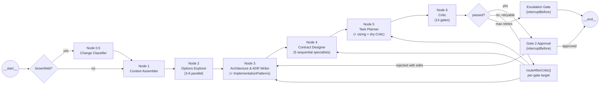

# M3: Architect Core — Execution Plan

## Status: IN PROGRESS — Phase 6 next (Phase 5 COMPLETE 2026-05-15)

## Related Documents

- **Parent plan:** `docs/plans/active/chips-next-steps/execution-plan.md` (M3 outline)
- **Vision:** `docs/vision.md` Layer 3 (Agent Taxonomy), Layer 8 (Implementation), Layer 10 (HITL — Gate 2 mandate)
- **Roadmap:** `docs/roadmap.md`
- **ADRs:** ADR-038 (TypeScript as contract truth), ADR-043 (TypeScript LangGraph sole runtime), ADR-045 (shared module extraction), ADR-046 (Langfuse telemetry), ADR-054 (styling library axis)
- **Research:** `docs/research/architect-r2-r3-r6.md` (R2/R3/R6 authoritative research)
- **M2 child plan:** `docs/plans/completed/chips-next-steps-m2/execution-plan.md`
- **Guide:** `docs/guides/planning-docs.md`

## Overview

Implement the Architect LangGraph stage: 7 nodes plus a mandatory HITL Gate 2 approval interrupt, all living in a new `packages/agents-architect/` package. Consumes the Clarifier's `EnrichedRequirement` and produces a `ContractBundle` ready for the M4 Implementer to pick up. Ships R2/R3/R6 schema additions, 5 new Critic gates (14 total) with `existingFiles`-aware gate 14, brownfield Change Classifier, gate→node retry routing matrix, full `ArchitectStateAnnotation` (**24 channels** — dedicated `adrs` channel mirrors root-level `ContractBundle.adrs`, separate from `ArchitectureSpec`), explicit `ArchitectDeps` interface, copy-then-redirect shared-module extraction, prompt rubric pointers per node, and migrated existing eval fixtures.

## Revision history

**v2 (this revision)** — folds in 8 critical points from external review (all verified against codebase before applying):

1. **Package boundary fix.** Graph/nodes/run.ts/prompts move from `packages/core/src/architect/` to NEW `packages/agents-architect/`. Per `CLAUDE.md`, `core` depends on `@langchain/langgraph-checkpoint` only — NOT `@langchain/langgraph`. Schemas + critic stay in core (no langgraph deps). Mirrors `packages/agents-clarifier/`.
2. **HITL Gate 2 mandatory.** Per [`docs/vision.md`](docs/vision.md) line 744, Gate 2 is a structural happy-path interrupt, not a retry-max fallback. Add `gate2Approval` no-op node + `interruptBefore: ['gate2Approval', 'escalationGate']`.
3. **Explicit `ArchitectStateAnnotation`.** 24-channel table replaces high-level "input/output" wave (mirrors Clarifier's 16-channel state.ts). The extra channel vs a naive "spec holds ADRs" layout is **`adrs`** at state root, matching `ContractBundle.adrs`.
4. **Explicit `ArchitectDeps` interface.** Mirrors `ClarifierDeps` shape with Architect-specific additions.
5. **Copy-then-redirect extraction** per parent plan [`execution-plan.md:793-794`](docs/plans/active/chips-next-steps/execution-plan.md). For token-validation: copy to core, agents-ux re-exports + `@deprecated`. For buildDesignSystemContext + assessCatalogAdoption: full extraction deferred (depends on agents-ux internals); agents-architect direct peer-imports for M3 (no circular because agents-architect ≠ core).
6. **Migrate 3 existing eval fixtures.** After Phase 1 schema extension, `correct-cashpulse.yaml`, `missing-field.yaml`, `contradictory.yaml` need new TaskNode fields populated.
7. **Mode-consistency mechanism.** Critic signature gains optional `existingFiles?: ReadonlySet<string>` 3rd param. Gate 14 skips when undefined (greenfield); enforces R2 §6.5 strict reading when defined. Node 0.5 populates the channel in brownfield.
8. **Prompt rubric pointers.** Phases 4-6 cite R2/R3/R6 sections per prompt file so implementers don't write rubric-blind prompts.

**v1** (replaced) absorbed 4 stonebraker memo insights: Pattern Designer fold into Node 3 (8 → 7 nodes), per-node token budget table, `sliceContractBundle()` as explicit Phase 5 deliverable, Node 1 brownfield = 1 Sonnet call. v1 rejected stonebraker's weak `mode-consistency` semantics and undocumented retry routing. All v1 decisions preserved in v2.

**v2 verifications** (open questions resolved against codebase):

- `ChangeClassificationSchema` already lives in [`packages/core/src/types/cross-boundary-artifacts.schemas.ts:167`](packages/core/src/types/cross-boundary-artifacts.schemas.ts) and is wired into `ContractBundleSchema.changeClassification` ([`architect.schemas.ts:240`](packages/core/src/types/architect.schemas.ts)). No Phase 1 sub-task needed; Phase 3's conditional wording is replaced with a fact.
- Gate 2 dashboard UI is explicitly out of M3 scope (deferred to CHIP UX Overhaul Phase 4.6). M3 ships only the machinery — see "Out of M3 scope" section below.

## Architectural shape

7-node sequential LangGraph pipeline + Gate 2 approval + escalation gate. Lives in `packages/agents-architect/`. Hybrid Option A: linear specialists in Node 4 ship M3; Option B (subgraph-per-specialist) deferred per ADR-NNN.



Pattern Designer folds into Node 3 (preserves reasoning continuity: "use Drizzle" → `data-access-drizzle-only` pattern in same call). Gate 2 Approval is a no-op pass-through; the interrupt is the gate. Vision Layer 10 mandates Gate 2 on the happy path — not as retry-max fallback.

## ArchitectStateAnnotation (Phase 3)

Mirrors [`packages/agents-clarifier/src/graph/state.ts`](packages/agents-clarifier/src/graph/state.ts) pattern. All channels use `Annotation<T>` with explicit reducer + default.

| # | Channel | Type | Reducer | Default | Producer |
|---|---------|------|---------|---------|----------|
| 1 | `enrichedRequirement` | `EnrichedRequirement \| null` | last-write-wins | `null` | input |
| 2 | `assumptionLedger` | `AssumptionLedger \| null` | last-write-wins | `null` | input |
| 3 | `mode` | `'greenfield' \| 'brownfield'` | last-write-wins | `'greenfield'` | input |
| 4 | `existingFiles` | `ReadonlySet<string> \| null` | last-write-wins | `null` | input or Node 0.5 |
| 5 | `existingRepoSnapshot` | `RepoSnapshot \| null` | last-write-wins | `null` | input (brownfield) |
| 6 | `retrievalContext` | `RetrievalContext \| null` | last-write-wins | `null` | input |
| 7 | `changeClassification` | `ChangeClassification \| null` | last-write-wins | `null` | Node 0.5 |
| 8 | `constraintSet` | `ConstraintSet \| null` | last-write-wins | `null` | Node 1 |
| 9 | `optionsBundle` | `OptionsBundle \| null` | last-write-wins | `null` | Node 2 |
| 10 | `architectureSpec` | `ArchitectureSpec \| null` | last-write-wins | `null` | Node 3 (decisions, `stackConfig`, patterns; not ADR bodies) |
| 11 | `adrs` | `readonly ADR[]` | last-write-wins | `[]` | Node 3 |
| 12 | `dataModelSpec` | `DataModelSpec \| null` | last-write-wins | `null` | Node 4.1 |
| 13 | `apiChangeSets` | `readonly ApiChangeSet[]` | last-write-wins | `[]` | Node 4.2 |
| 14 | `componentCompositions` | `readonly ComponentComposition[]` | last-write-wins | `[]` | Node 4.3 |
| 15 | `screenPlans` | `readonly ScreenPlan[]` | last-write-wins | `[]` | Node 4.4 |
| 16 | `designSystemDiff` | `DesignSystemDiff \| null` | last-write-wins | `null` | Node 4.5 |
| 17 | `taskPlan` | `TaskPlan \| null` | last-write-wins | `null` | Node 5 |
| 18 | `criticReport` | `CriticReport \| null` | last-write-wins | `null` | Node 6 |
| 19 | `criticPassed` | `boolean` | last-write-wins | `false` | Node 6 |
| 20 | `criticRetries` | `number` | last-write-wins | `0` | Node 6 |
| 21 | `lastFailedGate` | `string \| null` | last-write-wins | `null` | routeAfterCritic |
| 22 | `gate2Decision` | `'approved' \| 'rejected' \| null` | last-write-wins | `null` | gate2Approval interrupt |
| 23 | `gate2Edits` | `Partial<ContractBundle> \| null` | last-write-wins | `null` | gate2Approval interrupt |
| 24 | `threadId` | `string` | last-write-wins | `''` | input |

24 channels total. Architect doesn't accumulate human input across rounds the way Clarifier does, so the `humanResponses`-style append reducer is intentionally omitted; Gate 2 either approves or rejects with optional edits.

## ArchitectDeps (Phase 3)

In `packages/agents-architect/src/deps.ts`:

```typescript
import type { LLMProvider } from '@agentforge/providers';
import type { RetrievalTools } from '@agentforge/retrieval';
import type { DesignSystemContext } from '@agentforge/agents-ux';
import type { ArchitectStateType } from './graph/state.js';

export interface ArchitectDeps {
  /** LLM provider wrapped with createTracedProvider (ADR-046). */
  readonly provider: LLMProvider;
  /** Retrieval tools — required for brownfield Node 1 repo-map digest. */
  readonly retrievalTools?: RetrievalTools;
  /** Filesystem root for Node 4.5 design-system-diff token reads. */
  readonly projectRoot: string;
  /** Project identifier — scopes retrieval queries. */
  readonly projectId: string;
  /** Pre-loaded base catalog YAML for Critic Node 6 catalog adoption checks. */
  readonly baseCatalog?: string;
  /** Pre-built design system context (skips Node 4.5 LLM call when present). */
  readonly designSystemContext?: DesignSystemContext;
}

export type ArchitectNodeFn = (
  state: ArchitectStateType,
) => Promise<Partial<ArchitectStateType>>;
```

Mirrors [`packages/agents-clarifier/src/deps.ts`](packages/agents-clarifier/src/deps.ts) structure with Architect-specific additions.

## Out of M3 scope (tracked deferrals)

To keep M3 focused on the Architect machinery, the following are explicitly deferred. Each gets a tracking artifact created in Phase 8 (per `docs/lessons-learned-rules.md` § *Deferrals Must Land in a Tracking Artifact*):

- **Gate 2 dashboard UI** — visual rendering of ContractBundle (architecture decisions, ADRs, task DAG, API contracts) + approve/reject/edit controls. Belongs in CHIP UX Overhaul Phase 4.6. M3 ships only the machinery: `gate2Approval` node, `gate2Decision` + `gate2Edits` channels, `interruptBefore: ['gate2Approval', 'escalationGate']`, eval-time deterministic responder, and CLI resume via `updateState({ gate2Decision: 'approved' }) + stream(null)` (mirrors Clarifier HITL resume pattern). Backlog plan: `docs/plans/backlog/gate2-dashboard-ui.md` (Phase 8).
- **`buildDesignSystemContext` + `assessCatalogAdoption` full extraction** — depends on agents-ux internals; M3 uses direct peer import (no circular because `agents-architect` ≠ `core`). Tracked in ADR-045 addendum (Phase 8).
- **Architect E2E browser tests** — Architect SSE endpoint, Gate 2 approval flow (browser-driven), Clarifier→Architect round-trip. M3 ships unit + integration + headless eval; browser-level E2E is `docs/plans/backlog/architect-e2e-tests.md` (Phase 8).
- **Subgraph-per-specialist Node 4 (Option B)** — deferred per ADR-NNN with explicit migration trigger (gates 5-8 retry rate > 15% across 30 runs OR per-specialist P50 latency > 90s).

## Per-node token + cost budget (CashPulse: 25 features, 8 entities, 7 screens)

| Node | LLM calls | Model | Tokens (in/out) | Wall-clock | Cost |
|------|-----------|-------|-----------------|-----------|------|
| 0.5 Change Classifier (brownfield only) | 1 | Sonnet | 15K / 2K | ~6s | $0.05 |
| 1 Context Assembler — greenfield | 0 | — | 0 | ~2s deterministic | $0.00 |
| 1 Context Assembler — brownfield | 1 | Sonnet | 18K / 5K (capped 20K per R2 §7.6) | ~10s | $0.06 |
| 2 Options Explorer | 3-6 parallel | Sonnet | 8K / 3K each | ~12s parallel | $0.10 |
| 3 Architecture & ADR Writer (incl. patterns) | 1 | Opus | 40K / 14K | ~35s | $0.18 |
| 4 Contract Designer (5 sequential) | 5 | Sonnet | 15-35K / 2-8K each | ~50s | $0.12 |
| 5 Task Planner | 1 | Opus | 50K / 10K | ~28s | $0.15 |
| 6 Critic | 0 | — | 0 | ~1s | $0.00 |
| Gate 2 Approval | 0 | — | 0 | (interrupt — no execution) | $0.00 |

**CashPulse totals:** ~10-12 LLM calls, ~360K tokens, ~130s wall-clock (excl. Gate 2 human time), ~$0.66/run greenfield or ~$0.71/run brownfield.

These numbers become the Phase 6 sizing-heuristic test inputs and Phase 7 telemetry-validation oracle.

## Schema additions (Phase 1)

In [`packages/core/src/types/architect.schemas.ts`](packages/core/src/types/architect.schemas.ts) — additive only, no `additionalProperties: object` (lessons-learned rule — Claude API rejects):

- `ImplementationPatternSchema` — `{ id, category, title, rule, rationale?, example?, forbids?, appliesTo? }`
- `ContextRefSchema` — `{ kind: 'dataModel.entity' | 'apiChangeSet' | 'componentComposition' | 'screenPlan' | 'pattern', id: string }`
- `TaskModeSchema` — `'NEW' | 'MODIFY'`
- `TaskCompletionReportSchema` — `{ taskId, filesWritten, interfacesExposed, patternsApplied, deviationsFromContract }` (M4 input shape, defined here)
- `TaskNodeSchema` extended: `+ mode, estimatedTokenBudget, contextRefs[], patternRefs[], acceptanceCriteriaIds[]`
- `ArchitectureSpecSchema` extended: `+ implementationPatterns: ImplementationPattern[]`

**Critic signature change** in [`packages/core/src/architect/critic.ts`](packages/core/src/architect/critic.ts):

```typescript
export function validateContractBundle(
  bundle: ContractBundle,
  enrichedReq: EnrichedRequirement,
  existingFiles?: ReadonlySet<string>,  // NEW — populated in brownfield
): CriticReport;
```

When `existingFiles` is undefined (greenfield), gate 14 skips the filesystem check. When defined, gate 14 enforces R2 §6.5 strict reading.

## 5 new Critic gates (Phase 1)

`validateContractBundle()` extends from 9 → 14 gates:

1. `patternRef-resolution` — every `task.patternRefs[]` resolves to `architectureSpec.implementationPatterns[]`
2. `contextRef-resolution` — every `task.contextRefs[]` resolves to a real entity / changeSet / composition / plan / pattern
3. `acceptanceCriteria-coverage` — every PRD EARS criterion id is referenced by at least one task
4. `tokenBudget-feasibility` — no `task.estimatedTokenBudget > 120000` (R3 ceiling)
5. `mode-consistency` — for every `mode: 'MODIFY'` task, at least one entry in `filePaths` must pre-exist in `existingFiles` (R2 §6.5 strict reading; skipped when `existingFiles` undefined)

## Phases

### Phase 1 — Schema additions + 5 new Critic gates + fixture migration (COMPLETE)

- Extend `architect.schemas.ts` (4 new schemas + 2 extensions)
- Add 5 new gates to `critic.ts` (signature extended with `existingFiles?` param)
- Unit tests per new gate: positive, negative, AND greenfield-skip case for gate 14
- **Migrate 3 existing eval fixtures** (`correct-cashpulse.yaml`, `missing-field.yaml`, `contradictory.yaml`) to populate new TaskNode fields. Strategy: every existing task gets `mode: 'NEW'`, `estimatedTokenBudget` derived from existing `filePaths` count × heuristic, empty `contextRefs[]`/`patternRefs[]` initially, `acceptanceCriteriaIds[]` populated from PRD EARS where the scenario asserts on coverage. The contradictory + missing-field scenarios may need targeted patternRef/contextRef additions to keep their failure-detection intent intact.
- **Verification gate:** `nx run-many -t typecheck` zero failures, `nx test core --testPathPattern="architect/critic"` 31+ pass, `nx test eval` (3 migrated scenarios still pass), `/review-plan-impl --phase 1`, `/mid-session-drift-check`

### Phase 2 — Copy-then-redirect shared module extraction (COMPLETE)

Per parent plan [`execution-plan.md:793-794`](docs/plans/active/chips-next-steps/execution-plan.md): "copy to shared location → re-export from original → Architect imports from shared → all tests pass → deprecate (not delete) re-export after Architect works."

- **token-validation (full extraction):** copy `packages/agents-ux/src/ux-planning/token-validation.ts` → `packages/core/src/architect/token-validation.ts`. Update `packages/agents-ux/src/ux-planning/token-validation.ts` to re-export from `@agentforge/core` with `@deprecated` JSDoc + sunset note. agents-architect imports from `@agentforge/core`.
- **buildDesignSystemContext (extraction DEFERRED):** function depends heavily on agents-ux internals (token resolution, catalog parsing). For M3, agents-architect imports directly from `@agentforge/agents-ux` (peer agent dep — no circular because agents-architect ≠ core). Phase 8 ships an addendum to ADR-045 noting full extraction is owed.
- **assessCatalogAdoption (extraction DEFERRED):** same treatment as buildDesignSystemContext.
- **Verification gate:** typecheck + `nx run-many -t test --projects=core,agents-ux` zero failures, no new circular import warnings, `/review-plan-impl --phase 2`

### Phase 3 — Scaffold agents-architect package + skeleton (COMPLETE)

**Package scaffolding** (mirror `packages/agents-clarifier/`):

- `packages/agents-architect/package.json` — depends on `@agentforge/core`, `@agentforge/providers`, `@agentforge/retrieval`, `@agentforge/telemetry`, `@agentforge/agents-ux` (peer for design-system-context + assess-catalog-adoption), `@langchain/langgraph`, `@langchain/core`, `zod`
- `packages/agents-architect/project.json` — Nx project with build/test/typecheck/lint targets
- `packages/agents-architect/tsconfig.json` + `tsconfig.lib.json` + `tsconfig.spec.json`
- `packages/agents-architect/src/index.ts` — barrel export
- `packages/agents-architect/jest.config.ts`
- Update root `tsconfig.base.json` paths + `nx.json` if needed

**Skeleton files** under `packages/agents-architect/src/`:

- `deps.ts` — `ArchitectDeps` interface (table above)
- `types.ts` — local types only (`RepoSnapshot`, `RetryTarget`). `ChangeClassification` already lives in [`packages/core/src/types/cross-boundary-artifacts.schemas.ts:167`](packages/core/src/types/cross-boundary-artifacts.schemas.ts) and is wired into `ContractBundleSchema.changeClassification` ([`architect.schemas.ts:240`](packages/core/src/types/architect.schemas.ts)) — import from core, do not redeclare.
- `graph/state.ts` — `ArchitectStateAnnotation` (24-channel table above)
- `graph/nodes/change-classifier.ts` — Node 0.5 (brownfield, 1 Sonnet call → ChangeClassification + populates `existingFiles` channel)
- `graph/nodes/context-assembler.ts` — Node 1 (greenfield deterministic; brownfield 1 Sonnet call capped 20K per R2 §7.6)
- `graph/nodes/options-explorer.ts` — Node 2 (3-6 parallel Sonnet calls)
- `graph/nodes/critic.ts` — Node 6 wraps `validateContractBundle()` from core, passes `state.existingFiles` as 3rd arg
- `graph/nodes/gate2-approval.ts` — no-op pass-through (the interrupt is the gate; node body is `(state) => state`)
- `graph/nodes/escalation-gate.ts` — no-op pass-through, used after retry-max
- `graph/architect-graph.ts` — assembles StateGraph; greenfield route skips Node 0.5; compiles with `interruptBefore: ['gate2Approval', 'escalationGate']` and Postgres checkpointer
- `run.ts` — public `runArchitect(input, deps)` entry
- `prompts/{change-classifier,context-assembler-brownfield,options-explorer}.md` with `version: 1` frontmatter

Unit tests per node factory using mock `ArchitectDeps` pattern (mirrors [`packages/agents-clarifier/src/nodes/*.test.ts`](packages/agents-clarifier/src/nodes)).

- **Verification gate:** typecheck, `nx test agents-architect --testPathPattern="graph"`, integration test that compiles graph + asserts `interruptBefore` fires for both gate2Approval and escalationGate, `/review-plan-impl --phase 3`

### Phase 4 — Node 3 (Architecture & ADR Writer + ImplementationPatterns) (COMPLETE 2026-05-14)

Pattern Designer folded in here. **Prompt rubric pointers (encode inline in prompt + cite in frontmatter):** R6 §5 (architecture decision rubric), R6 §7.1 (pattern emission criteria), `docs/lessons-learned-rules.md` § *Negative constraints in prompts*.

- `graph/nodes/architecture-writer.ts` — 1 Opus call, structured output `{ decisions[], adrs[], implementationPatterns[], stackConfig }`; state updates `{ architectureSpec, adrs }`
- `prompts/architecture-writer.md` (version 2) — encode R6 Q5/Q6 + §7.1 rubrics inline; reference baseline pattern catalog as concrete examples; explicit "every emitted pattern must be derivable from a Decision in this same response" rule
- `packages/agents-architect/src/patterns/baseline.ts` — seed catalog (5-8 patterns: `data-access-drizzle-only`, `api-error-rfc7807`, `component-tailwind-tokens-only`, `state-server-only`, `validation-zod-at-boundary`, etc.) merged with LLM-derived patterns at node exit
- Unit tests: greenfield happy path, brownfield with ChangeClassification, prompt regression test asserting patterns reference Node 2 OptionsBundle decisions, failure-path tests (provider error, invalid JSON, Zod reject), Gate 2 edit slice in user message
- **Verification gate:** `nx test agents-architect --testPathPattern="architecture-writer"`, golden-output snapshot test on CashPulse fixture, `/review-plan-impl --phase 4` (receipt: `artifacts/plan-impl-review/20260514T180000-m3-phase4/`)

### Phase 5 — Node 4 (Contract Designer + context slicer) (COMPLETE 2026-05-15)

**Prompt rubric pointers per specialist:**

- data-model: R6 §6.1 (column-level rubric) + R6 §6.2 (FK + index rules)
- api: R6 §6.3 (OpenAPI 3.1 conformance) + lessons-learned § *EARS→endpoint translation*
- components: R6 §6.4 (prop-signature rubric)
- screens: R6 §6.5 (data-binding integrity rules)
- design-system-diff: R6 §6.6 (additive-only token rule, lessons-learned)

Files:

- `packages/agents-architect/src/context-slicer.ts` — `sliceContractBundle(contextRefs, bundle): Partial<ContractBundle>` (R3 §3 implementation; absorbed from stonebraker memo). Used by every specialist to scope its input to the slice it actually needs.
- 5 specialist node factories under `packages/agents-architect/src/graph/nodes/contract-designer/`:
  - `data-model.ts` — column-level DataModelSpec
  - `api.ts` — OpenAPI 3.1 ApiChangeSet
  - `components.ts` — ComponentComposition with prop signatures
  - `screens.ts` — ScreenPlans with data bindings referencing entity ids
  - `design-system-diff.ts` — DesignSystemDiff via `buildDesignSystemContext()` (peer import from agents-ux)
- Sequential dispatch in Node 4 entry point — each specialist's output appended to bundle, next specialist receives sliced view via `sliceContractBundle()`
- Brownfield: ChangeClassification's `scopeAxes` controls which specialists run
- Versioned prompts (5 files in `prompts/contract-designer/` with rubric pointers in frontmatter)
- Unit tests per specialist + integration test for full sequence + slicer unit tests
- **Verification gate:** `nx test agents-architect --testPathPattern="contract-designer"`, `/review-plan-impl --phase 5`

### Phase 6 — Node 5 (Task Planner with sizing + dry-Critic) (COMPLETE 2026-05-15)

**Prompt rubric pointers:** R2 §5 (granularity rubric), R2 §6 (TaskNode field population guide), R3 §4 (contextRef selection rules), `docs/lessons-learned-rules.md` § *Plans Must Trace Data Flows*.

- `graph/nodes/task-planner.ts` — 1 Opus call produces TaskPlan DAG
- `packages/agents-architect/src/sizing-heuristic.ts` — `estimateTaskTokenBudget(task, bundle)` returns budget per R3 estimation rules; fed back into Task Planner prompt as constraint
- Dry-run Critic invocation: after Node 5 emits TaskPlan, run gates 10-14 (the new ones) immediately and feed any failures back into a single retry attempt before Node 6 final Critic
- TaskNode field population: every task carries populated `mode`, `estimatedTokenBudget`, `contextRefs`, `patternRefs`, `acceptanceCriteriaIds`
- **Deferred from Phase 5 — RESOLVED:** Singular/plural bridging code (`stateCompositionsToBundle()`) added to context-slicer.ts. Specialist dispatch wiring investigated and determined N/A: `sliceContractBundle()` filters by `contextRefs`, but contextRefs are populated by Node 5 (Task Planner) which runs AFTER Node 4 (Contract Designer). Specialists are the producers of contract artifacts, not consumers — they already scope input via per-specialist `buildUserMessage()` functions. The slicer's real consumer is the M4 Implementer, which uses `sliceContractBundle(task.contextRefs, bundle)` per R3 §3 to scope each task's context window.
- Unit tests: token-budget sizing on 5 fixture tasks (uses Phase 1 budget table as oracle), context-ref population, acceptance-criteria coverage, golden-fixture dry-Critic test
- **Verification gate:** `nx test agents-architect --testPathPattern="task-planner"`, golden-fixture test all CashPulse tasks pass dry-Critic, `/review-plan-impl --phase 6`

### Phase 7 — Brownfield wiring + retry routing matrix + brownfield eval scenario

- `packages/agents-architect/src/graph/retry-routing.ts` — `routeAfterCritic(criticReport): RetryTarget` matrix:

  - Gates 1-3 (schema, DAG, single-writer) → re-run Node 5
  - Gate 4 (PRD-criterion-coverage) → re-run Node 5
  - Gate 5 (entity-reference-integrity) → re-run Node 4 specialist 1 (data-model) + downstream specialists
  - Gate 6 (gap-resolution) → re-run Node 3
  - Gate 7 (openapi-lint) → re-run Node 4 specialist 2 (api)
  - Gate 8 (migration-sql-parses) → re-run Node 4 specialist 1 (data-model)
  - Gate 9 (adr-completeness) → re-run Node 3
  - Gate 10 (patternRef-resolution) → re-run Node 5
  - Gate 11 (contextRef-resolution) → re-run Node 5
  - Gate 12 (acceptanceCriteria-coverage) → re-run Node 5
  - Gate 13 (tokenBudget-feasibility) → re-run Node 5 with smaller-task instruction
  - Gate 14 (mode-consistency) → fail to escalation gate (humans must resolve invented file paths)
  - Max retries per gate: 1 → escalate to escalationGate interrupt

- `packages/eval/src/scenarios/architect/add-budgeting-brownfield.yaml` — brownfield scenario: existing CashPulse, add Budgeting feature; expects `scopeAxes = ['api', 'data-model', 'screens']`, 4-6 MODIFY tasks + 2-3 NEW tasks. Provides `existingFiles` snapshot.
- End-to-end eval runner update in [`packages/eval/src/architect-runner.ts`](packages/eval/src/architect-runner.ts) to: (a) validate retry-routing decisions in trace output, (b) inject mock Gate 2 approval (eval-time `ArchitectDeps` includes deterministic gate-2 responder that always approves; integration test asserts `state.gate2Decision === 'approved'`), (c) assert all 4 fixtures populate the 5 new TaskNode fields (`mode`, `estimatedTokenBudget`, `contextRefs`, `patternRefs`, `acceptanceCriteriaIds`).

**Dashboard wiring (M3 surfaces Architect as a real spine stage):**

- Update [`packages/dashboard/src/components/spine/spine-constants.ts`](packages/dashboard/src/components/spine/spine-constants.ts) — flip line 18 `architect: { ..., implemented: false }` → `implemented: true`
- Extend [`e2e/runs-page.spec.ts`](e2e/runs-page.spec.ts) — assert Architect stage renders as active (not greyed-out) in the runs page, with the Gate 2 pending state surfaced when the interrupt fires

- **Verification gate:** `nx test agents-architect --testPathPattern="retry-routing"`, `nx test dashboard`, `npx playwright test runs-page`, full eval run on all 4 scenarios pass (3 migrated + 1 brownfield), all 4 fixture-field assertions green, `/review-plan-impl --phase 7`, `/mid-session-drift-check`

### Phase 8 — ADRs + doc updates

- `docs/adrs/ADR-NNN-architect-node4-shape.md` — Hybrid choice: Approach 1 (Sequential 7-node) ships M3, Option B (subgraph-per-specialist) deferred. Migration trigger: Critic gates 5-8 retry rate > 15% across 30 runs OR per-specialist P50 latency > 90s. Cites stonebraker truncation analysis as evidence against further collapsing.
- `docs/adrs/ADR-NNN+1-architect-package-boundary.md` — schemas + critic in `packages/core/` (no langgraph dep), graph/nodes/run.ts in `packages/agents-architect/` (langgraph). Documents the v2 review correction. References `CLAUDE.md` package dep rules.
- `docs/adrs/ADR-045-addendum-deferred-extractions.md` (or inline addendum to ADR-045) — `buildDesignSystemContext` + `assessCatalogAdoption` full extraction still owed; sunset target post-M4 once Implementer's needs are fully known.
- [`docs/architecture/spine-implementation.md`](docs/architecture/spine-implementation.md) — replace conceptual 6-node Architect description with actual 7-node + Gate 2 shape; link the new ADRs
- [`CLAUDE.md`](CLAUDE.md) — update Active Plan #2 (CHIP's Next Steps) M3 progress + last-session line; add `agents-architect` to package dependency list
- [`docs/plans/active/chips-next-steps/execution-plan.md`](docs/plans/active/chips-next-steps/execution-plan.md) — mark M3 phases complete as they ship

**Backlog tracking** (per `docs/lessons-learned-rules.md` § *Deferrals Must Land in a Tracking Artifact*):

- Create `docs/plans/backlog/gate2-dashboard-ui.md` — "Gate 2 ContractBundle review page": renders architecture decisions + ADRs + task DAG + API contracts; provides approve/reject/edit controls; consumes `gate2Decision` + `gate2Edits` channels shipped by M3 Phase 3. Unblocks CHIP UX Overhaul Phase 4.6.
- Update [`docs/plans/active/chip-ux-overhaul/execution-plan.md`](docs/plans/active/chip-ux-overhaul/execution-plan.md) Phase 4.6 — annotate "Blocked by M3 Gate 2 channels (delivered M3 Phase 3); UI plan tracked at `docs/plans/backlog/gate2-dashboard-ui.md`."
- Create `docs/plans/backlog/architect-e2e-tests.md` — "Architect E2E test coverage": Architect SSE endpoint, Gate 2 approval flow (browser-driven via Playwright), Clarifier→Architect data flow round-trip. Unit + integration coverage ships in M3; browser-level deferred.

- **Verification gate:** `/verify-docs`, `/verify-done`, parent plan updated, both backlog files exist + linked from CHIP UX Overhaul Phase 4.6

## Key files

| File | Role | Phase |
|------|------|-------|
| [`packages/core/src/types/architect.schemas.ts`](packages/core/src/types/architect.schemas.ts) | Schema additions | 1 |
| [`packages/core/src/architect/critic.ts`](packages/core/src/architect/critic.ts) | 5 new gates + signature gains `existingFiles?` | 1 |
| `packages/core/src/architect/token-validation.ts` | Extracted from agents-ux (copy-then-redirect) | 2 |
| `packages/eval/src/scenarios/architect/{correct-cashpulse,missing-field,contradictory}.yaml` | Migrated existing fixtures | 1 |
| `packages/agents-architect/{package.json,project.json,tsconfig*.json,jest.config.ts}` | New package scaffold | 3 |
| `packages/agents-architect/src/deps.ts` | `ArchitectDeps` interface | 3 |
| `packages/agents-architect/src/graph/state.ts` | `ArchitectStateAnnotation` (24 channels incl. `adrs`) | 3–4 |
| `packages/agents-architect/src/graph/nodes/change-classifier.ts` | Node 0.5 | 3 |
| `packages/agents-architect/src/graph/nodes/context-assembler.ts` | Node 1 | 3 |
| `packages/agents-architect/src/graph/nodes/options-explorer.ts` | Node 2 | 3 |
| `packages/agents-architect/src/graph/nodes/architecture-writer.ts` | Node 3 (incl. patterns) | 4 |
| `packages/agents-architect/src/patterns/baseline.ts` | Seed pattern catalog | 4 |
| `packages/agents-architect/src/graph/nodes/contract-designer/{data-model,api,components,screens,design-system-diff}.ts` | Node 4 specialists | 5 |
| `packages/agents-architect/src/context-slicer.ts` | sliceContractBundle utility | 5 |
| `packages/agents-architect/src/graph/nodes/task-planner.ts` | Node 5 | 6 |
| `packages/agents-architect/src/sizing-heuristic.ts` | Token budget estimator | 6 |
| `packages/agents-architect/src/graph/nodes/critic.ts` | Node 6 wrapper (passes existingFiles) | 3 |
| `packages/agents-architect/src/graph/nodes/gate2-approval.ts` | HITL Gate 2 interrupt point | 3 |
| `packages/agents-architect/src/graph/nodes/escalation-gate.ts` | Retry-max interrupt point | 3 |
| `packages/agents-architect/src/graph/architect-graph.ts` | StateGraph + `interruptBefore` | 3 |
| `packages/agents-architect/src/graph/retry-routing.ts` | routeAfterCritic matrix | 7 |
| `packages/agents-architect/src/run.ts` | runArchitect entry | 3 |
| `packages/agents-architect/src/prompts/**/*.md` | Versioned prompts with rubric pointers | 3-6 |
| `packages/eval/src/scenarios/architect/add-budgeting-brownfield.yaml` | Brownfield scenario | 7 |
| `docs/adrs/ADR-NNN-architect-node4-shape.md` | Hybrid Option A choice | 8 |
| `docs/adrs/ADR-NNN+1-architect-package-boundary.md` | core vs agents-architect split | 8 |
| `docs/adrs/ADR-045-addendum-deferred-extractions.md` | Deferred extractions (or inline) | 8 |
| [`docs/architecture/spine-implementation.md`](docs/architecture/spine-implementation.md) | Architect section update | 8 |
| [`packages/dashboard/src/components/spine/spine-constants.ts`](packages/dashboard/src/components/spine/spine-constants.ts) | Flip `architect.implemented: true` | 7 |
| [`e2e/runs-page.spec.ts`](e2e/runs-page.spec.ts) | Architect active-stage assertion | 7 |
| `docs/plans/backlog/gate2-dashboard-ui.md` | Deferred UI tracking | 8 |
| `docs/plans/backlog/architect-e2e-tests.md` | Deferred browser E2E tracking | 8 |

## Reference patterns (read before implementing)

- [`packages/agents-clarifier/src/graph/clarifier-graph.ts`](packages/agents-clarifier/src/graph/clarifier-graph.ts) — graph assembly + `interruptBefore` pattern (line 141)
- [`packages/agents-clarifier/src/graph/state.ts`](packages/agents-clarifier/src/graph/state.ts) — Annotation channel pattern (16 channels — Architect state extends with 8 additional channels for bundle assembly + HITL)
- [`packages/agents-clarifier/src/deps.ts`](packages/agents-clarifier/src/deps.ts) — dependency injection
- [`packages/agents-clarifier/src/nodes/prd-analyzer.ts`](packages/agents-clarifier/src/nodes/prd-analyzer.ts) — node factory + structured output
- [`packages/agents-ux/src/ux-design/design-system-context.ts`](packages/agents-ux/src/ux-design/design-system-context.ts) — design system context builder (used by Phase 5 specialist 5 via peer import)
- [`docs/research/architect-r2-r3-r6.md`](docs/research/architect-r2-r3-r6.md) — R2/R3/R6 research (authoritative; cite §5, §6, §7.1, etc. in prompts)
- [`docs/vision.md`](docs/vision.md) Layer 10 (lines 715-787) — HITL Gate 2 mandate
- `~/.claude/plans/can-you-take-a-staged-stonebraker.md` — design memo with token math + truncation analysis (referenced by ADR-NNN)

## Exit criteria

- [ ] `packages/agents-architect/` builds, tests, typechecks, lints clean
- [ ] All 7 nodes + gate2Approval + escalationGate implemented with versioned prompts (carrying rubric pointers in frontmatter) and unit tests
- [ ] `interruptBefore: ['gate2Approval', 'escalationGate']` verified to fire by integration test
- [ ] `ArchitectStateAnnotation` channel count = 24 and matches the table above (incl. `adrs`)
- [ ] `ArchitectDeps` interface matches the spec above
- [ ] 14 Critic gates total (9 existing + 5 new); gate 14 honors `existingFiles?` semantics (skip if undefined, strict check if defined) — covered by greenfield-skip + brownfield-strict tests
- [ ] All 4 eval scenarios pass (3 migrated + add-budgeting-brownfield)
- [ ] `routeAfterCritic()` matrix covered by unit tests per gate
- [ ] `nx run-many -t typecheck`, `nx run-many -t test`, `nx run-many -t lint` all zero failures
- [ ] ADR-NNN (node4-shape) + ADR-NNN+1 (package-boundary) merged
- [ ] ADR-045 addendum on deferred buildDesignSystemContext + assessCatalogAdoption extraction
- [ ] `spine-implementation.md`, `CLAUDE.md`, parent execution plan updated
- [ ] `spine-constants.ts` flipped to `architect: { implemented: true }`; runs-page.spec.ts asserts Architect active-stage rendering
- [ ] `docs/plans/backlog/gate2-dashboard-ui.md` + `docs/plans/backlog/architect-e2e-tests.md` exist; CHIP UX Overhaul Phase 4.6 annotated as blocked-by reference resolved
- [ ] `/verify-done` passes
- [ ] `/challenge-plan` re-run on this revised plan returns no critical findings
