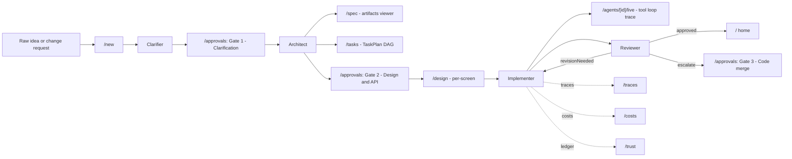

# Spine Dashboard End-to-End

## Status: NOT STARTED — gated on M4 COMPLETE (see Phase 0)

## Related Documents

- **Parent context:** [`docs/plans/active/chips-next-steps/execution-plan.md`](../chips-next-steps/execution-plan.md) — M0-M3.6 history, milestone table, brownfield wiring notes
- **Hard upstream:** [`docs/plans/active/chips-next-steps/m4-execution-plan.md`](../chips-next-steps/m4-execution-plan.md) — Implementer + Reviewer agent packages. This plan does not start until M4 is COMPLETE.
- **ADR-057:** [`docs/adrs/ADR-057-task-type-aware-design-slice-strategy.md`](../../../adrs/ADR-057-task-type-aware-design-slice-strategy.md) — task-type-aware design slice strategy (NEW: `'none'`, MODIFY: `'structure-only'`)
- **Vision:** [`docs/vision.md`](../../../vision.md) — Layer 8 (Implementation), Layer 9 (Review), Layer 10 (HITL gates)
- **Planning gates:** [`docs/guides/planning-docs.md`](../../../guides/planning-docs.md)

## Goal

Any developer using the CHIP dashboard at `packages/dashboard/` can take an application idea from raw text through every spine stage — Clarifier → Architect → Design → Implementer → Reviewer — with all three HITL gates wired to real UI, and (later) repeat the loop for "add a feature to an existing project" (brownfield) without leaving the dashboard.

## Working Assumptions (revise by editing this file)

- **A1. Hard gate on M4 completion. No stubs anywhere.** This plan does **not** start Phase 1 until [`m4-execution-plan.md`](../chips-next-steps/m4-execution-plan.md) is fully COMPLETE — meaning all 7 M4 phases done, all 8 M4 exit criteria green ([`m4-execution-plan.md:59-73`](../chips-next-steps/m4-execution-plan.md)), full spine eval (Clarifier → Architect → Design → Implementer → Reviewer) passing end-to-end on the CashPulse fixture. Phase 0 of this plan is the verification gate that proves M4 is truly done. **Every stage the dashboard surfaces must be backed by a working agent. No "disabled with tooltip" placeholders. No "pending M4 Phase N" copy in the UI.**
- **A2. Brownfield is phased in.** Phases 2-5 cover greenfield E2E. Phases 6-7 add brownfield (evolution-mode entry, `AffectedScreen` panel, `DesignSpecDelta` viewer). Brownfield agent capability must also be M4-COMPLETE before Phase 6 begins (M4 Phases 2, 3, 4 cover the agent side).
- **A3. CashPulse is the smoke-fixture.** Same fixture used by M0 ([`packages/eval/src/scenarios/cashpulse.yaml`](../../../../packages/eval/src/scenarios/cashpulse.yaml)) and M3.5 brownfield ([`packages/eval/src/scenarios/cashpulse-brownfield.yaml`](../../../../packages/eval/src/scenarios/cashpulse-brownfield.yaml)). Every phase's verification step uses this fixture.
- **A4. No new top-level routes (decided in Phase 1).** All new surfaces live as panels/tabs inside existing pages ([`packages/dashboard/src/app/(dashboard)/`](../../../../packages/dashboard/src/app/(dashboard)/)). Sidebar from [`sidebar-nav.tsx:47-87`](../../../../packages/dashboard/src/components/layout/sidebar-nav.tsx) stays as-is. Phase 1 either confirms or revises this.

## Non-goals

- Building the Implementer / Reviewer agent packages themselves (owned by M4 — this plan cannot start until that work is done).
- Git-worktree parallelism (R1, deferred per [`m4-execution-plan.md:78`](../chips-next-steps/m4-execution-plan.md)).
- Replacing the standalone design pipeline (Phase 8 cleanup in parent [`execution-plan.md`](../chips-next-steps/execution-plan.md)).
- Vision evaluator wiring (ADR-045, opt-in later).

## Out of scope items that are explicitly NOT this plan

- New agents, new pipeline stages, new public APIs (those belong in M4 or follow-ups).
- ~~The `/approvals` `badge: 3` is currently hard-coded at [`sidebar-nav.tsx:61`](../../../../packages/dashboard/src/components/layout/sidebar-nav.tsx). Replacing it with a live count IS in scope (Phase 3).~~ **DONE (2026-05-18, M4 Phase 7 session).** `useApprovalCount()` hook fetches from `/api/approvals` with 30s polling. Badge hidden when count is 0. Phase 3 should add E2E test coverage for this behavior.

---

## Architecture: the user's journey

---

## Phase 0: M4 completion gate (BLOCKING — no dashboard work begins until green)

**Goal:** Prove that the spine architecture works end-to-end in code — Clarifier through Reviewer, both greenfield and brownfield — **before any dashboard file is touched.** If any check below fails, this plan stops here and M4 is the only active workstream.

### Hard prerequisites (every one must be true)

- [ ] [`m4-execution-plan.md`](../chips-next-steps/m4-execution-plan.md) Phase 1-7 all checked complete in the plan file.
- [ ] All 8 M4 exit criteria green ([`m4-execution-plan.md:59-73`](../chips-next-steps/m4-execution-plan.md)):
  1. ADR-057 routing wired with passing wiring tests.
  2. Brownfield `DesignSpecDelta` path produces deltas + `deltaApply` + structural quality gate passes.
  3. Instrumentation logs `taskType`, `sliceStrategy`, `qualityProxy` per implementer call.
  4. Implementer LangGraph package executes ≥1 frontend task from a `TaskPlan`.
  5. Reviewer LangGraph package runs deterministic gates + LLM review on ≥1 completed task diff.
  6a. Full spine eval runs Clarifier → Architect → Design → Implement → Review on CashPulse (greenfield + brownfield) without errors; results in `packages/eval/results/m4/`.
  6b. `design-info-value.yaml` regression passes (mean fidelity within ±0.15 of M3.6 baseline per task type).
  7. `nx run-many -t typecheck test lint` — zero failures.
- [ ] CLAUDE.md updated with `M4 COMPLETE` and [`docs/plans/active/chips-next-steps/execution-plan.md:3`](../chips-next-steps/execution-plan.md) milestone status line reflects M4 done.

### Tasks (verification only — read-only checks, no dashboard edits)

- [ ] **Re-run the full spine eval locally.** Execute `scripts/run-spine-eval.ts` (or equivalent from [`m4-execution-plan.md:315`](../chips-next-steps/m4-execution-plan.md)) against the CashPulse greenfield fixture. Capture: stage transitions, total cost, total wall time, final `ReviewResult.disposition`. Record receipt at `packages/eval/results/spine-dashboard-e2e/phase-0/greenfield-receipt.md`.
- [ ] **Re-run the brownfield spine eval.** Same against `cashpulse-brownfield.yaml`. Confirm `DesignSpecDelta` emitted for the MODIFY screen, `deltaApply` round-trips, structural quality gate passes on applied spec. Record receipt at `packages/eval/results/spine-dashboard-e2e/phase-0/brownfield-receipt.md`.
- [ ] **Trace every spine API call the dashboard will need.** Without writing any dashboard code, confirm each of these exists as a callable function exported from the agent packages:
  - `compileClarifierGraph()` — already shipped (M1).
  - `compileArchitectGraph()` — M3 deliverable.
  - `compileImplementerGraph()` — M4 Phase 5 deliverable ([`m4-execution-plan.md:250`](../chips-next-steps/m4-execution-plan.md)).
  - `compileReviewerGraph()` — M4 Phase 6 deliverable.
  - LangGraph checkpointer for resume across HITL gates — verify Postgres checkpointer config exists per [`m4-execution-plan.md:250`](../chips-next-steps/m4-execution-plan.md).
  - `ReviewResult` schema with `disposition: 'approved' | 'revisionNeeded' | 'escalate'` ([`m4-execution-plan.md:281-284`](../chips-next-steps/m4-execution-plan.md)).
  - `AffectedScreenSchema` on `ChangeClassificationSchema` ([`m4-execution-plan.md:156`](../chips-next-steps/m4-execution-plan.md)).
  - `DesignSpecDeltaSchema` ([`m4-execution-plan.md:155`](../chips-next-steps/m4-execution-plan.md)).
- [ ] **Bounded retry contract verified in code, not just the plan.** Confirm Reviewer's revision-cycle interface ([`m4-execution-plan.md:281-286`](../chips-next-steps/m4-execution-plan.md)) is callable by an external caller — the dashboard will be that caller in Phase 3.

### Phase 0 Gate (hard block — do not proceed if any unchecked)

- [ ] Every checkbox above is checked.
- [ ] `/review-plan-impl docs/plans/active/spine-dashboard-e2e/execution-plan.md --phase 0`
- [ ] `/mid-session-drift-check`
- [ ] Both receipts (greenfield + brownfield) committed under `packages/eval/results/spine-dashboard-e2e/phase-0/`.
- [ ] **If any check fails:** STOP. File the gap as a follow-up M4 task. Do not start Phase 1.

---

## Phase 1: Dashboard audit + nav decision

**Goal:** With M4 proven complete (Phase 0), reconcile the dashboard scaffolding against the now-real spine and lock the nav layout once.

### Tasks

- [ ] **Reconcile [`spine-constants.ts`](../../../../packages/dashboard/src/components/spine/spine-constants.ts).** All four stages should now legitimately be `implemented: true` because M4 is COMPLETE. If [`spine-constants.ts:19`](../../../../packages/dashboard/src/components/spine/spine-constants.ts) was previously `true` based on a premature assumption (drift item from initial audit), update inline justification comment to reference M4 exit criteria #4 and #5.
- [ ] **Reconcile [`run-manager.ts:30`](../../../../packages/dashboard/src/app/api/_lib/run-manager.ts) `RunStatus['type']` union.** Current value: `'init' | 'design-generate' | 'design-penpot' | 'design-browser' | 'design-chat-iterate' | 'implementer'`. Add `'architect'` and `'reviewer'`. Implementer already present — leave as-is.
- [ ] **Replace hard-coded `badge: 3`** at [`sidebar-nav.tsx:61`](../../../../packages/dashboard/src/components/layout/sidebar-nav.tsx) with a real fetch from `/api/approvals` returning the live pending-gate count (the count is real because gates are real because M4 is done; the panel UI lands in Phase 3).
- [ ] **Decide nav layout once.** Confirm assumption A4 (no new top-level routes) by listing every artifact the spine produces and mapping each to an existing page from the screen-by-screen analysis. If any artifact has no natural home, add the route to `NAV_SECTIONS` at [`sidebar-nav.tsx:47-87`](../../../../packages/dashboard/src/components/layout/sidebar-nav.tsx) here, not later. Document the final decision in this plan file under a new "Nav decision" subsection.

### Verification

- [ ] `nx run-many -t typecheck test lint` — green.
- [ ] Manual: open dashboard, confirm sidebar renders with real badge count (0 is fine if no run is pending), `SpineRail` shows all 4 stages as `implemented`.

### Phase 1 Gate

- [ ] `/review-plan-impl docs/plans/active/spine-dashboard-e2e/execution-plan.md --phase 1`
- [ ] `/mid-session-drift-check`
- [ ] `nx run-many -t typecheck test lint` — green

---

## Phase 2: Greenfield E2E in the dashboard (the spine works end-to-end through the UI)

**Goal:** A developer submits the CashPulse PRD via `/new`, watches `SpineRail` move through all 4 stages backed by real M4 agents, and lands on a completed run. No stubs, no placeholders — every stage event the rail shows traces to a real agent call.

### Tasks

- [ ] Create `packages/dashboard/src/app/api/architect/route.ts` — POST handler with SSE streaming, mirrors [`api/clarifier/route.ts`](../../../../packages/dashboard/src/app/api/clarifier/route.ts) pattern (`resolve auth → create traced provider → load checkpointer → stream events`). Calls `compileArchitectGraph()` (verified callable in Phase 0).
- [ ] Create `packages/dashboard/src/app/api/implementer/route.ts` per [`m4-execution-plan.md:254`](../chips-next-steps/m4-execution-plan.md) — calls `compileImplementerGraph()` (verified callable in Phase 0), emits per-node SSE events (`loadTaskContext` → `runDesignSpecialist` → `generateCode` → `reportCompletion`).
- [ ] Create `packages/dashboard/src/app/api/reviewer/route.ts` per [`m4-execution-plan.md:288`](../chips-next-steps/m4-execution-plan.md) — calls `compileReviewerGraph()` (verified callable in Phase 0), emits deterministic-gate results + LLM review findings + final `ReviewResult.disposition`.
- [ ] Wire a thin sequential orchestration layer in `packages/dashboard/src/app/api/spine/run/route.ts` — POST takes `{ projectId, mode: 'greenfield' }`, kicks off Clarifier, on completion advances to Architect, then Design, then Implementer, then Reviewer, persisting run state via `run-manager` at every transition. Single-threaded sequential per assumption A1 (no R1 orchestrator).
- [ ] Implement the bounded-retry loop from [`m4-execution-plan.md:285-286`](../chips-next-steps/m4-execution-plan.md) inside `api/spine/run/route.ts`: `disposition === 'revisionNeeded' && cycle < 2 → re-invoke Implementer with findings; else → stop with disposition`.
- [ ] Extend `SpineRail` ([`packages/dashboard/src/components/spine/spine-rail.tsx`](../../../../packages/dashboard/src/components/spine/spine-rail.tsx)) to subscribe to the spine SSE stream and animate stage transitions per real M4 events.
- [ ] Add a "Run spine" button on `/pipeline` ([`pipeline/page.tsx`](../../../../packages/dashboard/src/app/(dashboard)/pipeline/page.tsx)) that triggers the `/api/spine/run` endpoint for the active project.

### Verification

- [ ] Manual: open dashboard, load CashPulse fixture, click "Run spine", confirm `SpineRail` reaches `reviewer` with disposition `'approved'` on a fresh greenfield run.
- [ ] Compare wall time + cost against Phase 0 greenfield receipt — dashboard overhead should be < 10% on top of raw eval cost.
- [ ] Chrome DevTools MCP screenshot per [`m4-execution-plan.md:321`](../chips-next-steps/m4-execution-plan.md) — `SpineRail` shows all 4 stages completed, not just active.

### Phase 2 Gate

- [ ] `/review-plan-impl docs/plans/active/spine-dashboard-e2e/execution-plan.md --phase 2`
- [ ] `/mid-session-drift-check`
- [ ] `/verify-done` (test triad + headed E2E + Chrome DevTools visual)

---

## Phase 3: Approvals — wire the three HITL gates

**Goal:** `/approvals` becomes the single HITL surface for the spine. All three gates work end-to-end, badge count is live, no mocks.

### Tasks

- [ ] Extend `/api/approvals` route ([`api/approvals/route.ts`](../../../../packages/dashboard/src/app/api/approvals/route.ts)) to return real pending gates keyed by `{ runId, gateType: 'clarification' | 'design-api' | 'code-merge' }`, sourced from LangGraph checkpointer interrupt state.
- [ ] Build three panel components in `packages/dashboard/src/components/approvals/`:
  - `ClarificationGatePanel` — surfaces Clarifier questions + answers (per Scenario 1 Step 1, [`execution-plan.md:213`](../chips-next-steps/execution-plan.md)).
  - `DesignApiGatePanel` — renders Architect's `ContractBundle` summary (ScreenPlans, ComponentComposition, ADRs, TaskPlan DAG) with inline-edit support (per [`execution-plan.md:277-279`](../chips-next-steps/execution-plan.md)).
  - `CodeMergeGatePanel` — shows Reviewer findings with `disposition: 'escalate'` ([`m4-execution-plan.md:281-284`](../chips-next-steps/m4-execution-plan.md)), diff viewer, "Approve" / "Send back" actions.
- [ ] Wire `/api/approvals/[gateId]/decide` ([`approvals/[gateId]/decide/route.ts`](../../../../packages/dashboard/src/app/api/approvals/[gateId]/decide/route.ts)) to call the appropriate LangGraph `resume()` for each gate type.
- [ ] Confirm the Phase 1 sidebar badge subscription now reflects real Gate 1 / 2 / 3 counts during a live run.

### Verification

- [ ] Run the spine on CashPulse, confirm Gate 1 surfaces in `/approvals` with Clarifier questions, approve → Architect runs → Gate 2 surfaces with ContractBundle, approve → Design + Implementer run → if Reviewer disposition is `'escalate'`, Gate 3 surfaces. End-to-end through real M4 agents — no mocks.
- [ ] Sidebar badge updates in real time during the run.

### Phase 3 Gate

- [ ] `/review-plan-impl docs/plans/active/spine-dashboard-e2e/execution-plan.md --phase 3`
- [ ] `/mid-session-drift-check`
- [ ] `/verify-done`

---

## Phase 4: Pipeline page upgrades (Architect graph viewer + TaskPlan DAG)

**Goal:** `/pipeline` becomes the spine's main observatory — see the Architect's 7-node flow, the Critic verdict, and the TaskPlan DAG.

### Tasks

- [ ] Build `ArchitectGraphPanel` in `packages/dashboard/src/components/pipeline/` — visualizes Nodes 0.5 → 6 per the diagram at [`execution-plan.md:146-148`](../chips-next-steps/execution-plan.md), with per-node status (pending / running / done / failed) and the Critic's verdict.
- [ ] Build `TaskPlanDagPanel` — renders the task DAG from Architect Node 5 (table example at [`execution-plan.md:253-264`](../chips-next-steps/execution-plan.md) for greenfield; the brownfield version with NEW/MODIFY badges at [`execution-plan.md:343-353`](../chips-next-steps/execution-plan.md) lands in Phase 6).
- [ ] Surface per-task fields from [`m4-execution-plan.md:204-217`](../chips-next-steps/m4-execution-plan.md): `mode`, `contextRefs` chips, `estimatedTokenBudget`, downgrade warnings when token budget overflows.
- [ ] Add a "Re-run from Architect" affordance on the pipeline page that resumes the spine from a chosen node (LangGraph checkpointer-backed — checkpointer verified callable in Phase 0).

### Verification

- [ ] Run spine on CashPulse, navigate to `/pipeline`, confirm Architect graph shows all 7 nodes with verdicts and the TaskPlan DAG renders all greenfield tasks T1-T10 from the fixture.

### Phase 4 Gate

- [ ] `/review-plan-impl docs/plans/active/spine-dashboard-e2e/execution-plan.md --phase 4`
- [ ] `/mid-session-drift-check`
- [ ] `/verify-done`

---

## Phase 5: Spec / Tasks / Agents enrichment (artifact surfaces)

**Goal:** Every spine artifact has a real home in the dashboard.

### Tasks

- [ ] **`/spec`** ([`spec/page.tsx`](../../../../packages/dashboard/src/app/(dashboard)/spec/page.tsx)) — add tabs for `EnrichedRequirement`, `FeaturePlan`, `AssumptionLedger`, Architect's `ConstraintSet` / `OptionsBundle` / `ArchitectureSpec` / `ContractBundle`. Source: [`execution-plan.md:213, 233-237`](../chips-next-steps/execution-plan.md).
- [ ] **`/tasks`** ([`tasks/page.tsx`](../../../../packages/dashboard/src/app/(dashboard)/tasks/page.tsx)) — render the same TaskPlan DAG as `/pipeline` but in list form with filtering (`mode`, status, package). Token-budget warnings inline.
- [ ] **`/agents/[id]/live`** ([`agents/[id]/live/page.tsx`](../../../../packages/dashboard/src/app/(dashboard)/agents/[id]/live/page.tsx)) — render Implementer tool-loop trace (`read_file`, `write_file`, `apply_patch`, `run_typecheck`, `run_tests`, `run_lint`, `report_assumption_violation` from [`m4-execution-plan.md:242-249`](../chips-next-steps/m4-execution-plan.md)) and Reviewer 3-node trace (`deterministicGates`, `llmReview`, `emitReviewResult` from [`m4-execution-plan.md:277-280`](../chips-next-steps/m4-execution-plan.md)).
- [ ] **`/audit`** ([`audit/page.tsx`](../../../../packages/dashboard/src/app/(dashboard)/audit/page.tsx)) — list ADRs from Architect Node 3 with diff against prior project state.

### Verification

- [ ] CashPulse run, confirm each artifact appears in the right page within 5s of being produced.

### Phase 5 Gate

- [ ] `/review-plan-impl docs/plans/active/spine-dashboard-e2e/execution-plan.md --phase 5`
- [ ] `/mid-session-drift-check`
- [ ] `/review-prd-compliance` (touches the artifact contracts the UI consumes)
- [ ] `/verify-done`

---

## Phase 6: Brownfield greenpath (evolution mode + AffectedScreen panel)

**Goal:** A developer picks an existing project, describes a change, walks through the same spine — with per-screen impact analysis visible at Gate 2. Brownfield agent capability is already proven by Phase 0 brownfield receipt.

### Tasks

- [ ] Extend `/new` ([`new/page.tsx`](../../../../packages/dashboard/src/app/(dashboard)/new/page.tsx)) with a mode toggle: "New project" vs "Add to existing project." Brownfield path triggers Clarifier evolution mode (per [`execution-plan.md:298-301`](../chips-next-steps/execution-plan.md)) with project context preloaded.
- [ ] Build `AffectedScreensPanel` for `DesignApiGatePanel` (Phase 3) — renders the `AffectedScreen[]` list (per [`execution-plan.md:310-317, 833`](../chips-next-steps/execution-plan.md)) with `new` / `modified` / `unchanged` badges and per-screen node-impact details.
- [ ] Extend `TaskPlanDagPanel` (Phase 4) with NEW/MODIFY badges per [`execution-plan.md:343-353`](../chips-next-steps/execution-plan.md).
- [ ] Extend the spine API orchestrator (`api/spine/run/route.ts` from Phase 2) to accept `{ projectId, mode: 'brownfield', changeRequest: string }`.

### Verification

- [ ] Run CashPulse-brownfield fixture ("Add recurring transactions"), confirm `/approvals` Gate 2 shows AffectedScreens panel with correct screen impact analysis matching the hand-derived expected output in [`cashpulse-brownfield.yaml`](../../../../packages/eval/src/scenarios/cashpulse-brownfield.yaml) and the Phase 0 brownfield receipt.

### Phase 6 Gate

- [ ] `/review-plan-impl docs/plans/active/spine-dashboard-e2e/execution-plan.md --phase 6`
- [ ] `/mid-session-drift-check`
- [ ] `/verify-done`

---

## Phase 7: DesignSpec delta viewer + per-screen modify flow

**Goal:** When the spine produces a `DesignSpecDelta` for a MODIFY task (proven working in Phase 0 brownfield receipt), the dashboard shows a real diff — not just the final spec.

### Tasks

- [ ] Build `DesignSpecDeltaViewer` component in `packages/dashboard/src/components/design/` that renders the hybrid delta format (`added` / `modified` / `removed` / `reordered` from [`m4-execution-plan.md:155`](../chips-next-steps/m4-execution-plan.md)) side-by-side against the existing spec.
- [ ] Wire `/design` ([`design/page.tsx`](../../../../packages/dashboard/src/app/(dashboard)/design/page.tsx)) to detect MODIFY screens and render the delta viewer instead of (or alongside) the full-spec preview.
- [ ] Extend `/api/pages/[pageId]/design/route.ts` ([`api/pages/[pageId]/design/route.ts:26, 195`](../../../../packages/dashboard/src/app/api/pages/[pageId]/design/route.ts)) to pass `existingDesignSpec` into the design pipeline when the task is MODIFY (per [`m4-execution-plan.md:182-190`](../chips-next-steps/m4-execution-plan.md)).
- [ ] Add a "before / after" toggle on the delta viewer for visual confirmation against the existing rendered design.

### Verification

- [ ] CashPulse-brownfield → MODIFY `dashboard` screen → confirm delta viewer shows added `BudgetProgressSection` node, preserves existing nodes by ID, no full-screen regen.

### Phase 7 Gate

- [ ] `/review-plan-impl docs/plans/active/spine-dashboard-e2e/execution-plan.md --phase 7`
- [ ] `/mid-session-drift-check`
- [ ] `/verify-design-render` (from `.claude/skills/`) on the modified screen
- [ ] `/verify-done`

---

## Phase 8: Observability surfaces (costs / traces / trust)

**Goal:** Every spine run has a cost breakdown, every Implementer call has a trace, every assumption violation lands in `/trust`. M4 instrumentation (verified callable in Phase 0) drives the data.

### Tasks

- [ ] **`/costs`** ([`costs/page.tsx`](../../../../packages/dashboard/src/app/(dashboard)/costs/page.tsx)) — per-run, per-stage cost breakdown using the cost estimate from [`m4-execution-plan.md:304-308`](../chips-next-steps/m4-execution-plan.md): Clarifier ~$0.05, Architect ~$0.30, Design ~$0.50, Implementer ~$0.50-1.50, Reviewer ~$0.20.
- [ ] **`/traces`** ([`traces/page.tsx`](../../../../packages/dashboard/src/app/(dashboard)/traces/page.tsx)) — surface the M4 Phase 1 instrumentation fields (`taskType`, `sliceStrategy`, `qualityProxy` from [`m4-execution-plan.md:136`](../chips-next-steps/m4-execution-plan.md)) per Implementer call. Address the known telemetry gap ([`execution-plan.md:1006-1016`](../chips-next-steps/execution-plan.md)) by adding stage spans for Architect and Reviewer.
- [ ] **`/trust`** ([`trust/page.tsx`](../../../../packages/dashboard/src/app/(dashboard)/trust/page.tsx)) — list AssumptionLedger violations from `report_assumption_violation` ([`m4-execution-plan.md:248`](../chips-next-steps/m4-execution-plan.md)) and ledger lifecycle diagram ([`execution-plan.md:126-144`](../chips-next-steps/execution-plan.md)).

### Phase 8 Gate

- [ ] `/review-plan-impl docs/plans/active/spine-dashboard-e2e/execution-plan.md --phase 8`
- [ ] `/mid-session-drift-check`
- [ ] `/verify-done`

---

## Phase 9: End-to-end developer journey eval

**Goal:** Prove "any developer can use the dashboard to run an application through the full SDLC" with a recorded run, not just unit tests.

### Tasks

- [ ] Add `packages/eval/src/scenarios/dashboard-e2e-cashpulse.yaml` — scripted browser-driven scenario using `.claude/skills/verify-done` browser tooling.
  - Greenfield path: open `/new` → submit CashPulse PRD → approve Gate 1 → approve Gate 2 → wait for completion → assert `SpineRail` shows `reviewer.status = 'completed'` with disposition `'approved'`.
  - Brownfield path: open `/new` in evolution mode → "Add recurring transactions" → approve Gate 2 with AffectedScreens visible → wait for delta-viewer to render → wait for completion.
- [ ] Cost telemetry: record actual `$ / tokens` per stage, log to `packages/eval/results/spine-dashboard-e2e/phase-9/`. Compare against Phase 0 receipts — dashboard overhead must remain < 10%.
- [ ] Documentation pass: add `docs/guides/dashboard-spine-walkthrough.md` (per Backstage TechDocs rules — blind-subagent test required).

### Phase 9 Gate

- [ ] `/review-plan-impl docs/plans/active/spine-dashboard-e2e/execution-plan.md --phase 9`
- [ ] `/mid-session-drift-check`
- [ ] `/review-prd-compliance`
- [ ] `/verify-done` — full triad + headed E2E
- [ ] `/verify-docs` — task-scoped
- [ ] Blind subagent test on `docs/guides/dashboard-spine-walkthrough.md` per CLAUDE.md "Blind Subagent Test"

---

## End-of-Plan Gate

- `/verify-done` — test triad + headed E2E + Chrome DevTools visual + `/verify-docs` task-scoped
- `git commit` — only after `/verify-done` passes
- `/prepare-handoff` — if continuing in a new session

---

## UX Observations from M4 Phase 7 Spine Eval (2026-05-17)

Observations captured during a real 25+ min spine eval run (Clarifier fixture → Architect → Implementer → Reviewer on CashPulse greenfield with Claude Opus via Vertex AI). These directly inform the UX quality required for the $100M investment bar.

### Real-time progress visibility (CRITICAL)

The Architect pipeline alone takes ~25 min with Opus. Per-node timings observed:

| Node | Duration | What it produces |
|------|----------|-----------------|
| contextAssembler | <1s | Loads context |
| optionsExplorer | ~8 min | Architecture alternatives |
| architectureWriter | ~3 min | Architecture spec + ADRs |
| contractDesigner | ~5 min | Full data model, API schemas, screen plans |
| taskPlanner | ~4 min | TaskPlan DAG |
| critic | <1s | Deterministic gate check |
| Gate 2 HITL | User action | Design/API approval |

**Every phase and every Implementer tool-loop iteration must show real-time progress in the dashboard.** A 25-min wait with no feedback is unacceptable UX. This is the top priority for Phases 2 and 5.

### Notification system

- Desktop/browser notifications when spine stages complete or hit HITL gates
- Sound/visual indicators for Gate 1, 2, 3 readiness — the user may be in another tab
- Estimated time remaining per stage (use observed timings as baselines)

### Sample app strategy for UX validation

CashPulse (7 screens, 25 features) takes ~25+ min per spine run — too slow for rapid UX iteration. The plan needs a fixture ladder:

1. **Tiny fixture (~2 screens, ~30s-1 min)** — for rapid iteration during Phase 2-5 development. Could be a simple "Todo app" with 1 page + 1 entity.
2. **CashPulse (medium, 7 screens, ~25 min)** — the existing eval fixture. Use for Phase 9 end-to-end validation.
3. **Large fixture (20+ screens, ~60+ min)** — stress-test progress UX, notification queuing, cost tracking at scale. Deferred.

### Page-by-page UX audit task

Before Phase 2 begins, conduct a pixel-level audit of every dashboard page currently live:

- **Home `/`** — SpineRail renders 4 stages with icons + connectors. Run status card shows last run. Clean layout. Need: run history preview, spine "Run" CTA.
- **Runs `/pipeline`** — SpineRail + run history table. Run type shows "Spec Generation" (legacy). Need: add "Spine Run" type, per-stage progress column, cost column with real data (currently "—").
- **Tasks `/tasks`** — Kanban board with 5 columns (Backlog/Blocked/In Progress/In Review/Done). Shows 1 old task. Need: populate from Architect TaskPlan, add NEW/MODIFY badges for brownfield.
- **Approvals `/approvals`** — Badge shows "3" (hardcoded). Need: live gate count, HITL panel UIs.
- Each page needs spacing, typography, color, interaction polish to $100M standard.

### Task: UX Strategy & Fixture Planning (new task, pre-Phase 1)

Before starting Phase 1, invest one focused session in:

1. **Define the UX quality bar** — Reference best-in-class developer tools (Linear, Vercel, Cursor) and extract specific patterns: loading states, progress indicators, notification design, error recovery flows.
2. **Create the tiny fixture** — A 2-screen "QuickNote" app that runs the full spine in <2 min, enabling rapid iteration.
3. **Map every user wait moment** — Chart the entire developer journey noting every point where the user waits >5s. For each, design a specific loading/progress UX (skeleton, progress bar, stage completion animation, notification).
4. **Evaluate alternative approaches** — Should we consider: (a) background runs with email/Slack notifications? (b) a "preview mode" that uses cached intermediate outputs? (c) streaming tokens directly for transparency? (d) parallel estimation + execution? Pick the approach that feels most premium.

---

## Pre-Phase 1 UX Audit (2026-05-18)

Full pixel-level audit of all 11 dashboard pages completed. Results documented in [`ux-audit-findings.md`](ux-audit-findings.md) with screenshots at `packages/eval/results/m4/dashboard-smoke-*.png`.

**Investment-readiness score: 4/10** — strong structural bones, fatal gap on progress visibility.

### Top P0 fixes (must complete before investor demo)

1. **Real-time layer (SSE/WebSocket)** — No mechanism to surface pipeline progress in dashboard. Foundation for everything else. (3-5 days)
2. **Remove hardcoded/fake data** — Header budget, approval badge "3", phase label, agent count all inconsistent with actual data. (1 day)
3. **Animate SpineRail** — Active stage pulses, completed stages get checkmarks. Needs real-time layer. (1-2 days)
4. **Notification system** — Toast on gate interrupt, completion, failure. Browser notifications for background tabs. (1-2 days)
5. **Post-submission feedback on /new** — After PRD submission, show Clarifier progress. Currently: nothing happens visually. (1 day)

### Cross-cutting issues

- **Legacy agent model:** Agents page shows 7 old design-era agents, not the 4 spine stages
- **Tasks page:** Shows design-era tasks, not Architect TaskPlan output
- **Run history:** Only "Spec Generation" type exists, no "Spine Run"
- **Empty states:** Bare "No tasks" text everywhere, no illustrations/CTAs

See full findings with per-page screenshots and severity ratings in [`ux-audit-findings.md`](ux-audit-findings.md).

---

## Relationship to M4

This plan is **downstream of, not parallel to**, [`m4-execution-plan.md`](../chips-next-steps/m4-execution-plan.md). Phase 0 is the verification gate that M4 is truly done end-to-end before any dashboard work starts. Once Phase 0 passes, every subsequent phase consumes M4 deliverables as load-bearing dependencies — there are no stub fallbacks. If a regression in M4 surfaces during Phase 2+ (e.g., the Reviewer's `ReviewResult.disposition` changes shape), the dashboard work pauses and the regression is fixed in M4 first.

The plan deliberately renumbers from earlier drafts: what was "Phase 0: audit" is now "Phase 1," because the true Phase 0 is the M4-completeness gate.

## Anti-shortcut (process)

- Each phase gate is a checkbox **inside** the phase. A skipped gate is an unchecked box visible next session.
- `/review-plan-impl` spawns fresh-context subagent — implementing agent cannot coach it.
- Skipping a gate without explicit user waiver is a process violation surfaced by `/mid-session-drift-check`.
- **No stubs.** If a phase's verification cannot be completed because the underlying M4 capability does not behave as the plan asserts, STOP and file an M4 follow-up. Do not paper over with placeholders.

## STOP conditions

- Phase 0 M4-completion check fails on any line → STOP. This plan does not begin until M4 is fixed.
- Phase 2 dashboard run produces different `ReviewResult.disposition` than Phase 0 receipt → STOP, root-cause whether dashboard wiring or M4 regression.
- Phase 6 AffectedScreen panel doesn't match the hand-derived expected output in [`cashpulse-brownfield.yaml`](../../../../packages/eval/src/scenarios/cashpulse-brownfield.yaml) or the Phase 0 brownfield receipt → STOP, root-cause whether the dashboard is mis-rendering the agent output or M4's `change-classifier` regressed.
- Phase 9 cost or wall-time exceeds Phase 0 receipts by more than 10% → STOP, investigate dashboard overhead before declaring complete.

## Verification (plan-level)

1. This file exists at `docs/plans/active/spine-dashboard-e2e/execution-plan.md`.
2. Every phase has a gate block per [`docs/guides/planning-docs.md`](../../../guides/planning-docs.md).
3. Working assumptions A1-A4 are visible at the top and editable.
4. Phase 0 hard prerequisites cite specific M4 exit-criteria line numbers and produce committed receipts.
5. Every claim about an existing dashboard file traces to a verified line citation.
6. The phrase "stub" / "placeholder" / "disabled with tooltip" appears nowhere in the implementation tasks — only in the explicit no-go list under A1.
