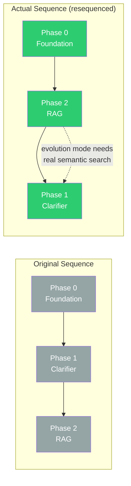
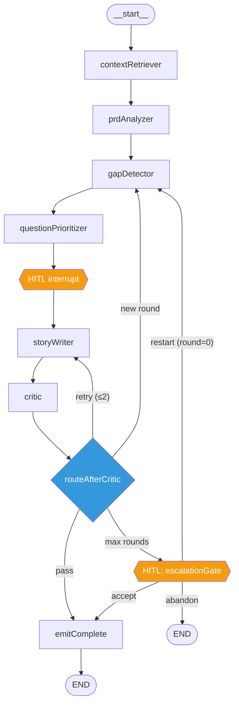
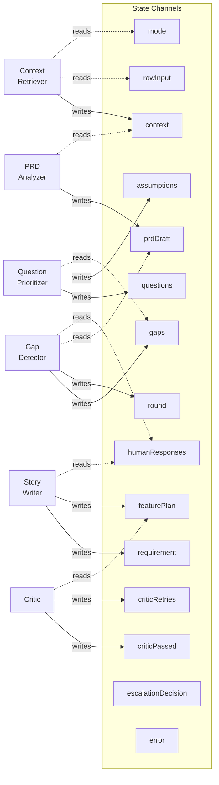

# Clarifier Initiative — Execution Plan

## Related Documents

- **Roadmap:** `docs/roadmap.md` Phases 0, 1, 2
- **Vision:** `docs/vision.md` Layer 2 (coordination), Layer 3 (spine), Layer 5 (Clarifier), Layer 6 (RAG), Layer 10 (HITL), Layer 14 (dashboard)
- **ADR-043:** `docs/adrs/ADR-043-typescript-only-orchestration.md` — LangGraph TypeScript commitment
- **Planning docs:** `docs/guides/planning-docs.md` — document lifecycle

## Context

The Clarifier is the first spine stage (vision Layer 3). This initiative built the nine-node Clarifier with both bootstrap and evolution modes, backed by real RAG retrieval. Tasks 1.0–1.7 are complete (2026-04-28): gap analysis (2-pass deterministic + ClarifyGPT), multi-round question loop with HITL interrupts, assumption ledger, and EARS/INVEST critic. Dashboard `/new` page exists but UX needs redesign (CHIP UX Overhaul Phase 3).

**Resequenced roadmap:** Phase 0 -> Phase 2 (RAG) -> Phase 1 (Clarifier), instead of Phase 0 -> 1 -> 2. Rationale: evolution mode needs real semantic search, not stubs. RAG built first so the Clarifier demo shows grounded questions from day one.



!!! tip "Context for implementers"

    - **Use LangGraph `StateGraph` from day one** — do NOT follow the plain async `runDesignPipeline` pattern. The Clarifier is the first LangGraph graph in the monorepo (see challenge report below).
    - Follow `generateAppSpec` pattern for LLM calls with Zod schemas (`packages/agents-ux/src/app-spec/generate-app-spec.ts`)
    - Follow `packages/agents-ux/` structure for new agent package scaffold
    - See `.claude/rules/new-agent.md` for the full agent role checklist

---

## Progress Checklist

### Phase 0 — Foundation Completion
- [x] **0.1** ADR-043 orchestration runtime (pre-existing, merged)
- [x] **0.2** Typed cross-boundary artifact schemas (2026-04-28) — 9 Zod schemas + TS interfaces in `packages/core/src/types/cross-boundary-artifacts.{schemas,}.ts`. 25 tests (parse + reject invalid). Exported from barrel.
- [x] **0.3** Postgres checkpointer (2026-04-28) — `@langchain/langgraph-checkpoint` + `@langchain/langgraph-checkpoint-postgres` in core. Factory `createCheckpointer()`: MemorySaver when no DB, PostgresSaver when `DATABASE_URL` set. Docker Compose at `docker/docker-compose.agentforge.yml` (port 5433). 4 unit tests, 3 integration tests (skipped without `AGENTFORGE_TEST_POSTGRES`). Exported from core barrel.

### Phase 2 — RAG Layer
- [x] **2.0** Package scaffold + integration spike (2026-04-28) — `packages/retrieval/` scaffolded with ESM config, 3 client wrappers (Voyage embeddings, Cohere reranking, Qdrant vector store), config resolver, types, 23 unit tests, 1 integration test (gated). Native `tree-sitter` failed node-gyp on Node 25.8.1 — switched to `web-tree-sitter` 0.26.8 (WASM). Qdrant added to docker-compose (port 6333/6334). `cohere-ai` v8.0.0 (not 7.20.0 as planned). All monorepo checks green (typecheck 17 projects, 391 tests, lint).
- [x] **2.1** Aider-style repo map (2026-04-28) — Regex-based parser (deferred web-tree-sitter WASM to code chunker), symbol graph, personalized PageRank (damping 0.85, convergence 1e-6, seed file personalization), token-budgeted renderer. `generateRepoMap()` orchestrator with recursive directory scan. 5 test fixture files, 19 unit tests across parser/graph/pagerank/renderer/orchestrator. Verified: `add` (2 importers) ranks above `formatNumber` (0 importers). Output against repo-map source dir produces meaningful ~2000-char summary.
- [x] **2.2** Code embedding pipeline (2026-04-28) — `chunkCodeFile()` AST-aware chunking at symbol boundaries with merge/split. `tokenize()` + `buildVocabulary()` + `computeBM25Sparse()` for BM25 sparse vectors. `buildMerkleTree()` + `diffMerkleTrees()` for incremental indexing. `indexCodebase()` orchestrator: Merkle diff → chunk changed → batch embed (Voyage, 64/batch) → upsert Qdrant (dense+sparse). `searchCode()`: embed query → BM25 sparse → Qdrant hybrid (RRF) → Cohere rerank. 20 new unit tests (BM25, code-chunker, merkle-tree).
- [x] **2.3** Document embedding pipeline (2026-04-28) — `chunkMarkdown()` (heading-boundary splitting), `chunkYaml()` (top-level key splitting), `chunkDocument()` auto-detect. `indexDocuments()` orchestrator with Merkle diff. `searchDocs()` hybrid search. 8 new unit tests. Plus `chunkDesignSpec()` and `chunkCatalog()` for design retrieval (Task 2.3b). Design indexer (`indexDesigns()`) and design search (`searchDesigns()`) added 2026-04-28 — full design retrieval pipeline with `__`-prefix dir filtering, screenId from filename, Merkle-based incremental indexing, hybrid search + rerank. `searchDesigns` wired into `RetrievalTools` interface and tool factory. 10 new tests.
- [x] **2.4** RetrievedContext type + tool registration (2026-04-28) — `RetrievedContextSchema` (Zod) in `packages/core/src/types/retrieved-context.ts` with codeChunks, docChunks, designChunks, repoMap. 5 MCP-compatible tool definitions: `searchCode`, `searchDocs`, `searchDesigns`, `getRepoMap`, `findSimilarPatterns`. `createRetrievalTools(config, rootDir, projectId)` factory + `createRetrievalToolsFromEnv()` convenience. All exported from barrel.
- [x] **2.5** Golden query set + precision gate (2026-04-28) — 15 code + 5 doc golden queries with expected file paths. `computePrecisionAtK()` evaluator with prefix matching for directory-level expectations. 6 unit tests. Integration eval against live indexed monorepo gated by `AGENTFORGE_TEST_RETRIEVAL`. Gate: precision@5 >= 70% on both code and doc queries.

### Phase 1 — Clarifier
- [x] **1.0** Clarifier package scaffold (2026-04-28) — `packages/agents-clarifier/` with ESM config, 6 node stubs, LangGraph StateGraph with `interrupt_before` on storyWriter, `ClarifierStateAnnotation` with typed channels, internal Zod schemas (Gap, Question, ClarifierContext, HumanResponse). Full new-agent checklist: `RequirementsClarified` domain event, init.ts clarifier role, governance `clarify` phase + `clarification` HITL phase, CLAUDE.md deps. 7 scaffold tests, 391 monorepo tests green.
- [x] **Foundation** DI + state + graph topology (2026-04-28) — `ClarifierDeps` factory pattern, 5 new state channels (prdDraft, featurePlan, criticRetries, criticPassed, escalationDecision), conditional routing (critic retry, multi-round, escalation gate with accept/restart/abandon HITL), `runClarifierPipeline()` wrapper, core barrel exports for cross-boundary types. 17 tests, 408 monorepo tests green. Challenge report applied (3 violations fixed, 3 trade-offs resolved).
- [x] **1.1** Context Retriever node (2026-04-28) — `createContextRetriever(deps)`, bootstrap: `loadBaseCatalog()` + optional tokens + platform constraints, evolution: project catalog (fallback to base) + all 5 RAG tools via `Promise.allSettled` with partial failure tolerance. 8 tests.
- [x] **1.2** PRD/Request Analyzer node (2026-04-28) — `createPrdAnalyzer(deps)`, claude-opus-4-6, forced-JSON via PRD_RESPONSE_SCHEMA (manual JSON Schema mirroring PRDSchema), `parsePromptFrontmatter` for version tracking, prompt at `src/prompts/prd-analyzer-system.md` (v1.0.0), mode-aware user message (bootstrap=thorough, evolution=impact focus with code/doc/design context). Falls back to content parsing when structured output unavailable. 12 tests.
- [x] **1.3** Gap/Conflict Detector node (2026-04-28) — `createGapDetector(deps)`, Pass 1: deterministic checklist (auth, validation, error handling, NFR targets, accessibility, orphan screens), Pass 2: ClarifyGPT (2 LLM calls, claude-sonnet-4-6 — generate 3 implementations at temp 0.7 + divergence analysis at temp 0). Round>1 filters addressed gaps via humanResponses. Deduplicates LLM gaps matching deterministic gaps. Prompts: `gap-detector-system.md`, `gap-divergence-system.md` (v1.0.0). 21 tests.
- [x] **1.4** Question Prioritizer node (2026-04-28) — `createQuestionPrioritizer(deps)`, EVPI proxy: `blastRadius * answerability * confidenceGap` per gap. Budget: micro (≤5 items) → 2 questions, standard (6-15) → 7, cross-cutting (>15) → 15. Below-threshold (EVPI<0.15) + budget-overflow gaps → `AssumptionLedger` entries (deduped, confidence-based confirmation flag). Multiple-choice when evolution mode + code context + divergent interpretations. No LLM calls. 19 tests.
- [x] **1.5** Story Writer node (2026-04-28) — `createStoryWriter(deps)`, claude-sonnet-4-6, EARS-format acceptance criteria (`WHEN <condition> THE SYSTEM SHALL <behavior>`), FeaturePlan DAG with dependencies, EnrichedRequirement wrapping prdDraft + AssumptionLedger + clarification rounds. Mode branching: bootstrap=completeness, evolution=impact. After max rounds: confidence capped at 0.5, unresolved gaps → assumptions with `requiresConfirmation: true`. Prompt: `story-writer-system.md` (v1.0.0). 15 tests.
- [x] **1.6** Critic node (2026-04-28) — `createCritic(deps)`, deterministic-only: EARS compliance (criteria existence + non-empty condition/behavior), INVEST compliance (description length + criteria count), DAG consistency (orphan deps + cycle detection via DFS). Bounded retry: retries<2 → fail (routes to storyWriter), retries>=2 → pass with warnings. Prompt `critic-system.md` (v1.0.0) scaffolded for optional LLM review (not wired). 14 tests.
- [x] **1.7** Graph assembly (2026-04-28) — RequirementsClarified event via `writeBridgeEvent()` in wrapper (NOT graph node). Fixed interrupt detection: `getState().next`. 6 integration tests. 114 total.
- [ ] **1.8** Dashboard integration — PARTIAL. API routes done. `/new` page created but UX needs redesign — see `docs/plans/active/chip-ux-overhaul/execution-plan.md` Phase 3.

!!! info "Context for Phase 1 implementers (2026-04-28 challenge report)"

    - **LangGraph StateGraph from day one.** Do NOT use plain async `runDesignPipeline` pattern. The Clarifier is the first spine stage (vision Layer 3) and owns the first HITL checkpoint (Layer 10). HITL must use real LangGraph `interrupt_before` persisted to Postgres checkpointer, not simulated polling. This is the first LangGraph graph in the monorepo — validates the runtime pattern for all future spine stages.
    - **Cross-boundary schemas already exist.** `EnrichedRequirementSchema` and `AssumptionLedgerSchema` are in `packages/core/src/types/cross-boundary-artifacts.schemas.ts` (Phase 0.2). Import from `@agentforge/core`, do NOT duplicate in `agents-clarifier/src/schemas.ts`. Only internal types (`ClarifierState`, `Gap`, `Question`, `ClarifierContext`) go in the agent package.
    - **All 5 retrieval tools in evolution mode.** `searchDesignsTool` was missing from the original plan but vision Layer 5 explicitly lists "existing designs" as a Context Retriever source. The tool exists and is wired in `createRetrievalTools()`.
    - **TracedProvider on every LLM call.** Observability Phase 1-3 is complete (ADR-046). All LLM calls must use `createTracedProvider()` from `@agentforge/telemetry`. Tasks 1.2, 1.3, 1.5 each make LLM calls.
    - **Full new-agent checklist.** `.claude/rules/new-agent.md` requires 7 items: init.ts, domain-events, core barrel export, implementation, permission-checker, hitl-enforcer, integration test. Don't skip governance stubs.
    - **`screenId` derivation for design search.** `chunkDesignSpec(filePath, content, screenId)` requires a third argument. The design indexer extracts screenId via `basename(filePath, '.json')`. This is NOT stored in the spec — it's derived from the filename.
    - **Design retrieval gap was closed (2026-04-28).** `design-indexer.ts` and `design-search.ts` were added to complete Task 2.3b. The `searchDesigns` method is now on the `RetrievalTools` interface.
    - **Domain event name:** Add `RequirementsClarified` to `packages/core/src/events/domain-events.ts`. This is a telemetry event (not coordination) per vision Layer 2.

??? warning "Implementation gotchas (Phase 1 foundation, 2026-04-28)"

    - **Cross-boundary types not re-exported from core barrel.** `EnrichedRequirement`, `AssumptionLedger`, `PRD`, `FeaturePlan` are in `packages/core/src/types/cross-boundary-artifacts.ts` and `packages/core/src/types/index.ts`, but were NOT in `packages/core/src/index.ts`. Jest+SWC transpiles without full type checking so scaffold tests passed, but `tsc --build` fails. Fixed: added cross-boundary type/schema exports to core barrel.
    - **LangGraph StateGraph builder type tracking is extremely strict.** `buildClarifierGraph()` must NOT declare an explicit return type — let TypeScript infer it from the chain. Declaring `StateGraph<typeof ClarifierStateAnnotation.State>` causes type mismatches because `addNode`/`addEdge`/`addConditionalEdges` return progressively narrower types that don't match the base annotation type. `compileClarifierGraph` uses `ReturnType<ReturnType<typeof buildClarifierGraph>['compile']>` for the return type.
    - **`addConditionalEdges` path maps cause type errors.** The third argument (path map) triggers strict type narrowing that rejects valid node names. Omit the path map — LangGraph resolves routing from the function return value automatically.
    - **`createCheckpointer()` is async.** Returns `Promise<BaseCheckpointSaver>`, not `BaseCheckpointSaver`. Must `await` it before passing to `graph.compile()`.
    - **Factory pattern for dependency injection.** Each node is a `create*(deps: ClarifierDeps) → ClarifierNodeFn` factory. `buildClarifierGraph(deps)` threads deps to all factories. This avoids `as unknown` casts that `config.configurable` would require. Defined in `src/deps.ts`.
    - **Escalation gate with HITL.** `interruptBefore: ['storyWriter', 'escalationGate']` — two HITL interrupt points. After max rounds, the graph interrupts at `escalationGate` so the user can accept/restart/abandon.

??? warning "Implementation gotchas (Task 1.0, 2026-04-28)"

    - **New-agent checklist has hidden test dependencies.** `.claude/rules/new-agent.md` lists 7 items, but two test files also need updating: `event-bus.test.ts` requires the new event in BOTH its `fixtures` record AND its `allEventTypes` array; `agent-contract-schema-p12.test.ts` requires the new role in `PHASE_1_AGENTS`.
    - **Packages with `.md` prompt files need a `project.json`.** Nx auto-infers targets for packages without non-TS assets, but prompt files require explicit `cp -r src/prompts/* dist/prompts/` in the build. See `packages/agents-ux/project.json` for the pattern. Packages without prompts (like `retrieval`, `telemetry`) need NO `project.json`.
    - **LangGraph `Annotation.Root()` pattern.** First usage in the monorepo is `packages/agents-clarifier/src/graph/state.ts`. Each channel gets a `reducer` function (last-write-wins for scalars, concatenation for arrays like `humanResponses`) and a `default` factory. The `interruptBefore` option on `graph.compile()` takes an array of node names — e.g., `['storyWriter']`.
    - **Governance phase naming convention.** `AgentAction.phase` uses short names (`clarify`, `design`, `spec`, `code`). `HITLPhase` uses descriptive names (`clarification`, `spec_review`, `code_generation`). The mapping is in `PHASE_MAPPING` in `hitl-enforcer.ts`.

??? warning "Implementation gotchas (Tasks 1.2-1.6, 2026-04-28)"

    - **Mock `CompletionResult` requires full `CostRecord`.** The `CostRecord` interface has mandatory `model: string` and `timestamp: string` fields, plus `inputCostUsd`/`outputCostUsd`/`totalCostUsd` (NOT `inputCost`/`outputCost`/`totalCost`). SWC-transformed Jest tests compile without type errors, but `tsc --build` catches the mismatch. Always include `model` and `timestamp` in mock cost objects.
    - **Linter strips unused prompt loading code.** If you scaffold `readFileSync` + `parsePromptFrontmatter` + `import.meta.url` for a future LLM call but don't wire the LLM call yet (as in Critic), the linter removes the unused imports on save. Re-add them when wiring the LLM call.
    - **`extractStructured` pattern for every LLM-calling node.** Check `result.value.structured` first (native structured output via `output_config`), then fall back to JSON-parsing `result.value.content` with code-fence stripping (`/^```(?:json)?\s*/m`). Three nodes (prd-analyzer, gap-detector, story-writer) implement this. Extract to shared utility if a 4th node needs it.
    - **Manual JSON Schema for `responseSchema`, not `zodToJsonSchema`.** CLAUDE.md says use `zod-to-json-schema` but zero codebase usage exists. All `responseSchema` objects in agents-ux are hand-written JSON Schema. Follow this pattern for consistency. Use `PRDSchema.safeParse()` (Zod) for response validation after receipt.
    - **EVPI threshold calibration.** Set at 0.15. Gaps with `category: 'incomplete'` + `confidence: 0.9` produce EVPI = 0.5 * 0.9 * 0.1 = 0.045, well below threshold → they become assumptions, not questions. This is intentional: high-confidence minor gaps shouldn't consume the question budget.

??? warning "Implementation gotchas (Tasks 1.7-1.8, 2026-04-28)"

    - **LangGraph `interruptBefore` does NOT throw.** `invoke()` returns the partial state normally when an interrupt fires. Do NOT catch `GraphInterrupt` — instead call `getState(config)` after invoke and check `graphState.next.length > 0` to detect interrupts. The original `runClarifierPipeline` caught exceptions that never came, so `interrupted` was always `false`. Fixed in `run.ts:74-79`.
    - **Event emission belongs in the wrapper, not the graph node.** Challenge revealed that NO pipeline stage node in the codebase takes `eventBus` as a dependency. The design pipeline uses a sink pattern where callers handle telemetry. `emitComplete` stays as a no-op state transition. `runClarifierPipeline()` emits `RequirementsClarified` via `writeBridgeEvent()` after successful non-interrupted completion.
    - **`import.meta.url` under Next.js webpack** resolves to `.next/server/app/api/clarifier/` where prompt `.md` files don't exist. Fix: add `@agentforge/agents-clarifier` to `serverExternalPackages` in `next.config.js` (not `transpilePackages`). Must `nx build agents-clarifier` before running dashboard dev server so `dist/` + `dist/prompts/` exist.
    - **`loadBaseCatalog()` fails under webpack** because `__dirname` resolves to the webpack output directory. Dashboard workaround: pass `baseCatalog` string via `ClarifierInput` (optional field), pre-loaded from `MONOREPO_ROOT` absolute path in the API route. Context retriever uses it when available, falls back to `loadBaseCatalog()` otherwise.
    - **`createCheckpointer()` tries Postgres when `DATABASE_URL` is set.** Dashboard API routes must try/catch and fall back to `new MemorySaver()` when the database is unavailable. Integration tests always pass `checkpointer: new MemorySaver()` to avoid Postgres dependency.
    - **Mantine v9.1.1** was installed (latest), not v7 as originally planned. API is compatible. Coexists with Tailwind — components accept `className` prop. PostCSS config needs `postcss-preset-mantine` + `postcss-simple-vars` alongside `@tailwindcss/postcss`.

!!! success "Phase 1 exit criteria"

    User submits seed at `/new`, clarifier asks <=7 questions in <=3 rounds, produces structured PRD YAML with assumption ledger, dashboard shows PRD for approval. Both modes (bootstrap + evolution) work. HITL interrupt persists in Postgres (survives page refresh). All tests green (typecheck, unit, lint, E2E).

### Phase 1 Task Detail

Six internal stages (vision Layer 5), wired as a **LangGraph `StateGraph`** with typed channels and `interrupt_before` for HITL (vision Layers 1, 10). This is the first LangGraph graph in the monorepo — validates the runtime pattern for all future spine stages.

**Challenge report applied (2026-04-28):** LangGraph from day one (not plain async), complete new-agent checklist, reuse existing cross-boundary schemas, add `searchDesignsTool` to Context Retriever, TracedProvider on all LLM calls.

#### Task 1.0: Clarifier Package Scaffold (0.5 session)

**Files to create:**
- `packages/agents-clarifier/package.json` — deps: `@agentforge/core`, `@agentforge/providers`, `@agentforge/retrieval`, `@agentforge/telemetry`, `@langchain/langgraph`, `@langchain/core`, `zod`
- `packages/agents-clarifier/tsconfig.json`, `tsconfig.lib.json`, `jest.config.cjs`, `project.json`
- `packages/agents-clarifier/src/index.ts` — barrel
- `packages/agents-clarifier/src/types.ts` — internal types only: `ClarifierState`, `ClarifierMode`, `Gap`, `Question`, `ClarifierContext`
- `packages/agents-clarifier/src/schemas.ts` — internal Zod schemas for `Gap`, `Question`, `ClarifierContext`. Cross-boundary schemas (`EnrichedRequirementSchema`, `AssumptionLedgerSchema`) imported from `@agentforge/core` — NOT duplicated here.

**Full new-agent checklist (per `.claude/rules/new-agent.md`):**
1. `packages/cli/src/commands/init.ts` — add `clarifier` to `buildAgentsYaml()` with all 7 PRD sections
2. `packages/core/src/events/domain-events.ts` — add `RequirementsClarified` event (telemetry plane)
3. `packages/core/src/index.ts` — export the new event type
4. Agent implementation — Tasks 1.1–1.7
5. `packages/governance/src/permission-checker.ts` — add clarifier role permissions (stub initially)
6. `packages/governance/src/hitl-enforcer.ts` — add clarifier HITL gate (Layer 10)
7. Integration test — `packages/agents-clarifier/src/__tests__/clarifier-pipeline.integration.test.ts`
8. CLAUDE.md Package Dependencies — add `agents-clarifier` depends on: `core`, `providers`, `retrieval`, `telemetry`

#### Foundation: Dependency Injection + State + Graph Topology (COMPLETE, 2026-04-28)

**Completed as Step 1 of the implementation plan.** Pulled forward graph topology (originally Task 1.7) because all nodes depend on the factory pattern and routing.

**Key design decisions (from challenge report):**
- **Factory pattern for DI.** Each node is `create*(deps: ClarifierDeps) → ClarifierNodeFn`. `ClarifierDeps` has `provider` (TracedProvider-wrapped), `retrievalTools?`, `projectRoot`, `projectId`. Defined in `src/deps.ts`.
- **5 new state channels:** `prdDraft` (PRD | null), `featurePlan` (FeaturePlan | null), `criticRetries` (number), `criticPassed` (boolean), `escalationDecision` ('accept' | 'restart' | 'abandon' | null). Types from `@agentforge/core`.
- **Graph topology with conditional routing:**


- **`runClarifierPipeline(input)`** in `src/run.ts` — convenience wrapper, entry point for Task 1.8.
- **17 tests** (7 scaffold + 10 routing). 408 monorepo tests green.

**Files created/modified:**
- `src/deps.ts` (new) — `ClarifierDeps`, `ClarifierNodeFn`
- `src/run.ts` (new) — `runClarifierPipeline()` wrapper
- `src/graph/state.ts` — 5 new channels
- `src/graph/clarifier-graph.ts` — factory deps, conditional routing, escalation edges
- `src/types.ts` — `EscalationDecision`, updated `ClarifierState`
- `src/nodes/*.ts` (6 files) — converted to `create*` factory pattern
- `src/index.ts`, `src/nodes/index.ts`, `src/graph/index.ts` — updated barrels
- `packages/core/src/index.ts` — added cross-boundary type exports (PRD, FeaturePlan, EnrichedRequirement, etc.)

#### Per-Node Channel Data Flow



#### Task 1.1: Context Retriever Node

- `packages/agents-clarifier/src/nodes/context-retriever.ts` — `createContextRetriever(deps)`
- **Bootstrap:** read base catalog from `packages/core/src/catalogs/base-component-catalog.yaml` (NOT `agentforge/spec/` — project doesn't exist yet). Read `design-tokens.yaml` if available.
- **Evolution:** read project catalog from `{projectRoot}/agentforge/spec/component-catalog.yaml` (fallback to base catalog). Call all 5 retrieval tools via `Promise.allSettled`: `searchCode`, `searchDocs`, `searchDesigns`, `getRepoMap`, `findSimilarPatterns`.
- **Reads:** `rawInput`, `mode`. **Writes:** `context`, `error`.
- **No LLM calls.**
- **Test:** bootstrap file reads, evolution 5-tool calls, missing tools error, partial failure graceful.

#### Task 1.2: PRD/Request Analyzer Node

- `packages/agents-clarifier/src/nodes/prd-analyzer.ts` — `createPrdAnalyzer(deps)`
- `packages/agents-clarifier/src/prompts/prd-analyzer-system.md` (frontmatter: version 1.0.0, extend with output schema)
- Forced-JSON via `provider.complete(prompt, { responseSchema })` with Zod schema
- **Model: `claude-opus-4-6`** (structured intent extraction from ambiguous raw input requires stronger reasoning)
- All LLM calls via `createTracedProvider()` from `@agentforge/telemetry` (ADR-046)
- Parse response with `PRDSchema.safeParse()` from `@agentforge/core`
- **Reads:** `rawInput`, `context`, `mode`. **Writes:** `prdDraft`, `error`.
- **Test:** valid response parsing, malformed JSON error, promptVersion threading.

#### Task 1.3: Gap/Conflict Detector Node

- `packages/agents-clarifier/src/nodes/gap-detector.ts` — `createGapDetector(deps)`
- **Pass 1 (deterministic):** checklist (auth, validation, error states, edge cases, NFR targets, metrics, accessibility)
- **Pass 2 (ClarifyGPT):** 2 LLM calls with `claude-sonnet-4-6` — generate 3 implementations (temp 0.7) + analyze divergence (temp 0). Cost cap: 3 extra LLM calls (2 + retry).
- Round>1: filter gaps addressed by prior `humanResponses`
- All LLM calls via `createTracedProvider()` (ADR-046)
- **Prompts (new):** `gap-detector-system.md`, `gap-divergence-system.md`
- **Reads:** `prdDraft`, `context`, `mode`, `humanResponses` (round>1), `gaps` (round>1). **Writes:** `gaps`, `round` (increment).
- **Test:** deterministic gap creation, LLM gap dedup, round filtering, cost cap.

#### Task 1.4: Question Prioritizer Node

- `packages/agents-clarifier/src/nodes/question-prioritizer.ts` — `createQuestionPrioritizer(deps)`
- EVPI proxy: `blastRadius * answerability * confidenceGap` per gap
- Budget: micro (<=2 features) → 2 questions, standard → 7, cross-cutting → 15
- Multiple-choice when context retrieval surfaces codebase precedent (evolution mode, grounded per vision Layer 5)
- Below-threshold gaps → `AssumptionLedger` entries via `AssumptionLedgerSchema` from `@agentforge/core`
- **No LLM calls.** Pure computation.
- **Reads:** `gaps`, `prdDraft`, `mode`. **Writes:** `questions`, `assumptions`.
- **Test:** scoring order, budget enforcement, assumption creation, multiple-choice generation.

#### Task 1.5: Story Writer Node

- `packages/agents-clarifier/src/nodes/story-writer.ts` — `createStoryWriter(deps)` (single file, mode branching)
- EARS format: "WHEN `<condition>` THE SYSTEM SHALL `<behavior>`"
- INVEST-compliant stories, typed feature DAG
- All LLM calls with `claude-sonnet-4-6` via `createTracedProvider()` (ADR-046)
- **Output: `EnrichedRequirement` + `FeaturePlan` + updated `AssumptionLedger`** (all from `@agentforge/core` schemas)
- `FeaturePlan` as separate state channel with `FeatureNode[]` containing `acceptanceCriteria: EARSCriterion[]` and `dependencies`
- Mode branching: bootstrap emphasizes completeness/feature discovery; evolution emphasizes impact analysis/change scoping. Different system prompt sections, same output schema.
- After max rounds: set low confidence on `EnrichedRequirement`, all unresolved gaps → assumptions with `requiresConfirmation: true`
- **Prompt (new):** `story-writer-system.md`
- **Reads:** `prdDraft`, `context`, `questions`, `humanResponses`, `assumptions`, `mode`, `round`. **Writes:** `requirement`, `featurePlan`, `assumptions`.
- **Test:** response parsing, EARS format, FeaturePlan production, human response merging, low-confidence output after max rounds.

#### Task 1.6: Critic Node

- `packages/agents-clarifier/src/nodes/critic.ts` — `createCritic(deps)`
- INVEST compliance on `FeaturePlan` nodes, EARS compliance on acceptance criteria
- DAG consistency: no orphans, no cycles (topological sort)
- Optional LLM quality review with `claude-sonnet-4-6` if deterministic checks pass
- Bounded retry: retries<2 → fail (routes to storyWriter); retries>=2 → pass with warnings
- **Prompt (new):** `critic-system.md`
- **Reads:** `requirement`, `featurePlan`, `criticRetries`. **Writes:** `criticPassed`, `criticRetries`, `requirement` (warnings).
- **Test:** INVEST/EARS/DAG checks, bounded retry, clean pass.

#### Task 1.7: Graph Assembly — PARTIALLY COMPLETE (2026-04-28)

Graph topology, conditional routing, escalation edges, and `runClarifierPipeline()` were completed as part of Foundation (Step 1). Remaining work:
- `RequirementsClarified` event emission in `emitComplete` node (Step 8)
- Integration test covering all routing scenarios (Step 8)

#### Task 1.8: Dashboard Integration (2 sessions)

- `packages/dashboard/src/app/(dashboard)/new/page.tsx` — bootstrap clarifier UI (chat metaphor)
- `packages/dashboard/src/app/(dashboard)/evolve/page.tsx` — evolution clarifier UI
- `packages/dashboard/src/app/api/clarifier/route.ts` — calls `runClarifierPipeline`, passes checkpointer thread_id
- `packages/dashboard/src/app/api/clarifier/respond/route.ts` — human answers resume the LangGraph graph via `graph.invoke(humanResponse, { configurable: { thread_id } })`
- `packages/dashboard/src/components/clarifier/chat-interface.tsx` — shared chat component
- `packages/dashboard/src/components/clarifier/question-card.tsx` — multiple-choice display
- `packages/dashboard/src/components/clarifier/assumption-list.tsx` — assumption ledger display
- `packages/dashboard/src/components/clarifier/prd-preview.tsx` — PRD for approval
- **Reuse:** Extend existing ChatTab pattern from `packages/dashboard/src/components/design/design-inspector.tsx:497-560`. Reuse event polling via `/api/events`.

#### Patterns to Reuse

| Pattern | Source file |
|---------|------------|
| Result `Ok`/`Err` | `packages/core/src/types/result.ts` |
| LLM + Zod structured output | `packages/agents-ux/src/app-spec/generate-app-spec.ts` |
| TracedProvider wrapping | `packages/telemetry/src/traced-provider.ts` |
| Retrieval tool factory | `packages/retrieval/src/tools/tool-factory.ts` |
| Checkpointer factory | `packages/core/src/checkpointer/index.ts` |
| Package scaffold | `packages/telemetry/` (cleanest recent example) |
| Cross-boundary schemas | `packages/core/src/types/cross-boundary-artifacts.schemas.ts` |

#### Risks

1. **First LangGraph StateGraph in the monorepo** — no prior art. Spike in Task 1.7 to validate `interrupt_before` + Postgres checkpointer. Fallback: conditional node that writes state to Postgres manually (same external API).
2. **LLM cost for ClarifyGPT** — 3 extra LLM calls per gap detection (Task 1.3). Budget cap keeps cost bounded. Monitor via Langfuse.
3. **HITL interrupt UX** — dashboard must poll for graph state. Use existing `/api/events` pattern.

---

## Key Files

| File | Role | Phase |
|------|------|-------|
| `packages/core/src/types/cross-boundary-artifacts.schemas.ts` | 9 Zod schemas | 0.2 |
| `packages/core/src/checkpointer/index.ts` | Checkpointer factory | 0.3 |
| `docker/docker-compose.agentforge.yml` | Postgres + Qdrant | 0.3, 2.2 |
| `packages/retrieval/src/repo-map/` | Tree-sitter repo map | 2.1 |
| `packages/retrieval/src/embeddings/` | Voyage + Cohere clients | 2.2 |
| `packages/retrieval/src/search/` | Hybrid search | 2.2, 2.3 |
| `packages/retrieval/src/tools/` | 5 LangGraph tools (incl. searchDesigns) | 2.1-2.4 |
| `packages/retrieval/src/indexing/design-indexer.ts` | Design spec indexing | 2.3b |
| `packages/retrieval/src/search/design-search.ts` | Design spec search | 2.3b |
| `packages/agents-clarifier/src/nodes/` | 6 clarifier stages | 1.1-1.6 |
| `packages/agents-clarifier/src/graph/` | LangGraph StateGraph + typed state | 1.7 |
| `packages/dashboard/src/components/clarifier/` | Chat UI | 1.8 |

---

## Exit Criteria

**Phase 0:** All 9 artifact schemas with tests; Postgres checkpointer integration test passes.

**Phase 2:** `searchCodeTool`, `searchDocsTool`, `getRepoMapTool`, `findSimilarPatternsTool` work; Qdrant with 2 collections; incremental indexing; all tests green.

**Phase 1 (roadmap exit criteria):** User submits seed at `/new`, clarifier asks <=7 questions in <=3 rounds, produces structured PRD YAML with assumption ledger, dashboard shows PRD for approval. Both modes work.

**Decision gate (after Phase 1):** "Demo the clarifier. If it doesn't feel obviously better than the text box, reconsider."

---

## Known Trade-Offs and Future Work (v0 Pipeline Review, 2026-05-02)

Findings from the v0 pipeline review. See `docs/lessons-learned-rules.md` § "Clarifier: Known v0 Trade-Offs and Coverage Gaps" for the consolidated rule.

### Future: Semantic Deduplication for LLM Gaps (FB1)

**Context:** SHA-256 content hashing of `topic::description` misses semantic duplicates with different wording.
**Current mitigation:** System prompt instruction (gap-divergence-bootstrap.md v3.1.0, gap-divergence-evolution.md v2.1.0) + `qaSection` in user message + `filterAskedGaps` by ID.
**Future work:** Embed gap descriptions with the same Voyage model used for code search, compute cosine similarity between new gaps and prior Q&A topics, reject gaps above a similarity threshold (e.g., 0.85). Requires the retrieval package to be available at gap-detection time.

### Known Trade-Off: PRD Over-Production (FB2)

The PRD Analyzer in bootstrap mode deliberately over-produces features, screens, and entities to avoid missing real requirements. The `could-have` priority and divergence prompt constraints are the mitigations.

**Eval metric (future):** `unvalidated-artifact-survival` — count of `could-have` features/entities/screens/NFRs in the final PRD that were never referenced by any human answer. High survival rate (>60%) indicates the analyzer is too speculative or the question pipeline is not validating enough scope decisions.

**Future mitigation:** Post-clarification pruning step — after max rounds, remove `could-have` features with zero answer references and move them to `outOfScope` with a note.

### Known Limitation: Critic is Structure-Only (FB3)

The Critic node runs ONLY deterministic checks (EARS compliance, INVEST compliance, DAG consistency). `criticPassed: true` means the plan has valid structure — it does NOT mean the requirements are good, complete, or user-aligned.

`critic-system.md` is scaffolded but not loaded. Wiring the LLM review is dependent on eval data showing structural checks are insufficient.

**Future eval metric:** Track false-positive rate — how often `criticPassed: true` correlates with plans the evaluator-challenger pipeline later scores below 60/100.

### Future: Eval Personality Variants (FB4)

**Context:** The cooperative eval simulator always picks `recommended: true` and gives descriptive answers. It never says "must have" or "don't need," so the PRD updater's priority-update logic is untested.

**Future work:** Add personality variants to the eval simulator:

- **Cooperative** (current): agrees with recommendations, descriptive answers.
- **Opinionated**: disagrees with recommendations, uses priority language ("this is critical", "skip this").
- **Evasive**: gives vague or off-topic answers, tests assumption fallback.
- **Contradictory**: gives answers that conflict with prior answers, tests PRD consistency.

Each personality should have at least one eval run with the test prompt.
