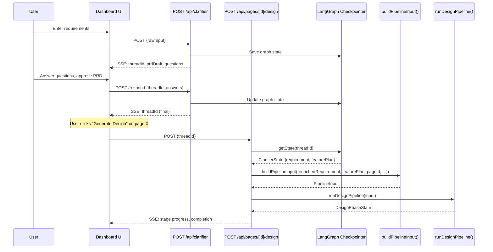
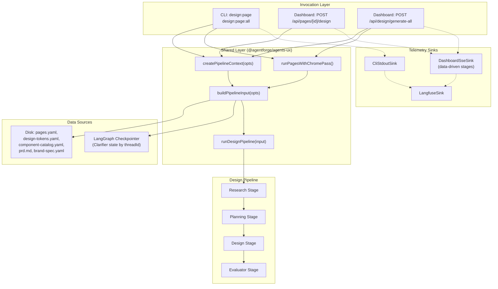
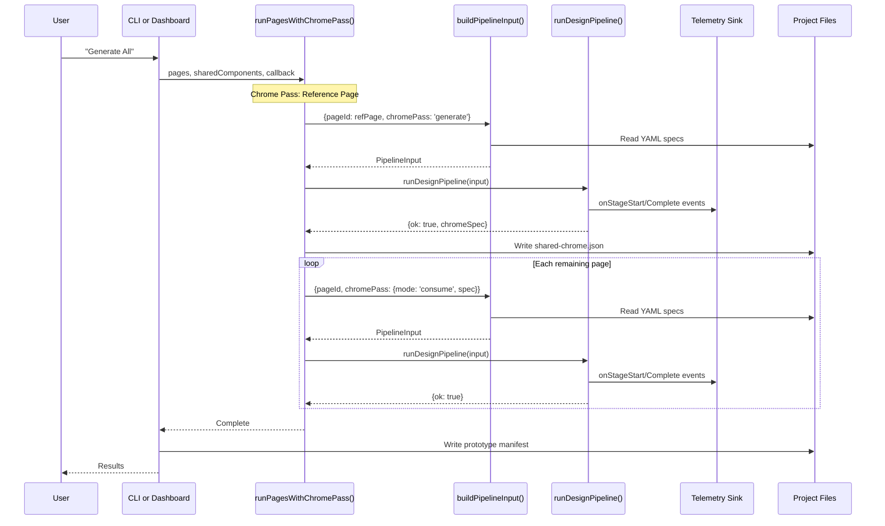

# R7: Dashboard → Spine Integration — Research Report

!!! info "Research brief"

    This report answers all 8 desired output items and 9 open questions from the
    [R7 research brief](briefs/R7-dashboard-spine-integration.md). It provides
    concrete, implementable recommendations with code sketches and migration
    sequencing.

## TL;DR

- **Unify all four invocation paths into a single `buildPipelineInput()` function** in `@agentforge/agents-ux`, eliminating 3 sources of input construction drift. CLI and dashboard become thin callers passing their overrides via an options object.
- **Replace both AgentContext factories with one `createPipelineContext(options)` function** in `@agentforge/agents-ux`, accepting an options bag that covers CLI features (MCP client) and dashboard features (required provider factory) uniformly.
- **Fix Dashboard "Generate All" by implementing its own per-page loop** using the unified builder and `DashboardSseSink`, not by delegating to the CLI command. This gives the dashboard proper SSE progress, run tracking, and Langfuse tracing for every page.
- **Bridge Clarifier to Design via `threadId` in the POST body.** The design route looks up the Clarifier's LangGraph checkpoint by `threadId`, extracts `EnrichedRequirement` and `FeaturePlan`, and passes them to the unified builder. No server-side session store needed.
- **Extend `PipelineInput` with `enrichedRequirement` and `featurePlan` fields.** `prdRequirements` becomes compat-only, auto-populated from `enrichedRequirement.prd` when the caller does not supply it.
- **Make `DashboardSseSink` stage-map data-driven** by accepting a `StageDescriptor[]` from the pipeline, removing the hardcoded `STAGE_INDEX` and `VISIBLE_STAGE_COUNT`.

---

## Methodology

This report's recommendations are derived from codebase analysis, not external surveys. Each recommendation traces to specific code paths and dependency chains.

**Analysis approach:**

1. **Dependency chain tracing.** For placement decisions (where should shared code live?), traced `package.json` dependencies and import chains across `core`, `agents-ux`, `cli`, `dashboard`, and `designspec-renderer` to verify no circular dependencies are introduced.

2. **Pattern reuse over invention.** For new code proposals (threadId bridge, checkpoint lookup), identified existing patterns in the Clarifier flow (`clarifier/route.ts`, `run.ts`, `checkpointer.ts`) and extended them rather than designing from scratch.

3. **Inconsistency root-cause analysis.** For each inconsistency (e.g., missing `designSystemPrompt`), traced the code to understand WHY it exists — is it a bug, a limitation, or a deliberate omission? This prevents "fixes" that don't address the actual cause.

4. **YAML reading function divergence.** Discovered that CLI and Dashboard use entirely different YAML reading implementations for the same files. This must be unified before any shared builder can work.

**Evidence format:** Each section includes a "Codebase Evidence" block with file paths, line numbers, and the specific code that drives the recommendation. Claims without code citations are flagged as assumptions.

---

## 1. Shared `buildPipelineInput()` Architecture

**Open question addressed:** Q1 (shared input builder location)

### Analysis

The four invocation paths (CLI per-page, CLI all-pages, Dashboard per-page, Dashboard all-pages) each construct `PipelineInput` independently, causing inconsistencies at two levels:

**Level 1: Hardcoded values.** The dashboard hardcodes `designTool: 'browser'` and `providerString: 'claude'` where the CLI resolves these dynamically.

**Level 2: Different YAML reading implementations.** CLI and Dashboard read the same project files using entirely different functions:

| File | CLI reads via | Dashboard reads via |
|------|--------------|-------------------|
| `pages.yaml` | `readSpecs()` from `@agentforge/core` (`state/spec-reader.ts`) | `readYamlFile()` from local `project-reader.ts` |
| `design-tokens.yaml` | `loadDesignTokens()` from `@agentforge/core` (`state/design-system-reader.ts`) | `readYamlFile()` from local `project-reader.ts` |
| `component-catalog.yaml` | `loadComponentCatalog()` from `@agentforge/core` | `readYamlFile()` from local `project-reader.ts` |
| `docs/prd.md` | `readFileSync()` from Node.js `fs` | `readTextFile()` from local `project-reader.ts` |

A shared builder must pick one set. Core's functions (`loadDesignTokens`, `loadBrandSpec`, `loadComponentCatalog`, `readSpecs`) are canonical — they handle schema validation and defaults that the dashboard's raw `readYamlFile` skips.

!!! warning "`designSystemPrompt` is NOT a dashboard bug"

    The current dashboard builder does not construct `designSystemPrompt`. This is NOT an omission — it CAN'T be built pre-pipeline. The function `buildDesignSystemContextFromSpec()` in `agents-ux/src/ux-design/design-system-context.ts:296` requires `planningOutput` (component tree + token bindings) as its third parameter — data that only exists AFTER the Planning stage runs. The CLI only uses it post-pipeline for the Penpot feedback loop (`design-page.ts:878-888`). The shared builder inherits this limitation.

**Where should it live?** Three options exist:

| Location | Pro | Con |
|----------|-----|-----|
| `@agentforge/core` | Shared by everything | Core has no design pipeline types (`PipelineInput`, `ChromePassConfig`); would create circular deps |
| `@agentforge/agents-ux` | Co-located with `PipelineInput` type; CLI + dashboard already depend on it | Gains a dependency on core's YAML readers (already exists) |
| New `@agentforge/pipeline-builder` package | Clean separation | Another package to maintain for one function |

### Recommendation

**Place `buildPipelineInput()` in `@agentforge/agents-ux`** next to the `PipelineInput` type it constructs. Use core's canonical YAML loaders (`loadDesignTokens`, `loadBrandSpec`, `loadComponentCatalog`, `readSpecs`) instead of the dashboard's local `readYamlFile`. The dashboard route stops importing from `project-reader.ts` for spec files.

### Codebase Evidence

**Dependency chain verification (from package.json):**

- `core` → no agentforge deps (leaf package). Exports `loadDesignTokens`, `loadBrandSpec`, `loadComponentCatalog`, `readSpecs`, `resolveViewports`.
- `agents-ux` → depends on `core` (already), `designspec-renderer`, `providers`. No backward deps.
- `cli` → depends on `agents-ux` (already). Import path: `import { buildPipelineInput } from '@agentforge/agents-ux'` — safe.
- `dashboard` → depends on `agents-ux` (already). Same import path — safe.
- `dashboard` → depends on `cli` (pre-existing cycle for `designPageAllCommand`). Orthogonal to this change.

**Shared helper functions already in agents-ux (from `packages/agents-ux/src/index.ts`):**

- `buildComponentCatalogPrompt()` — both CLI and Dashboard import this from agents-ux
- `buildPageContext()` — both import from agents-ux
- `resolvePageEntry()` — both import from agents-ux
- `loadCatalogForRenderer()` — from `@agentforge/designspec-renderer`, both use it

The shared builder follows the established pattern: helper functions that both CLI and Dashboard need live in agents-ux.

### Function Signature

```typescript
// packages/agents-ux/src/design-pipeline/build-pipeline-input.ts

export interface BuildPipelineInputOptions {
  /** Page to design. */
  readonly pageId: string;
  /** Unique task ID for this run. */
  readonly taskId: string;
  /** Project root directory. */
  readonly projectRoot: string;

  // ── Caller-provided overrides ──
  /** Design tool backend. Defaults to 'browser'. */
  readonly designTool?: DesignTool;
  /** Provider string. Defaults to 'claude'. */
  readonly providerString?: string;
  /** Telemetry sink for progress callbacks. */
  readonly telemetry?: PipelineTelemetrySink;
  /** Chrome Pass configuration (generate/consume). */
  readonly chromePass?: ChromePassConfig;
  /** Pre-built AgentContext. */
  readonly agentContext: AgentContext;
  /** Resume from cached artifacts. Defaults to true. */
  readonly resume?: boolean;
  /** Skip to a specific stage. */
  readonly stage?: PipelineInput['stage'];

  // ── Spine integration (M1+) ──
  /** Structured requirement from Clarifier. When set, prdRequirements is auto-populated. */
  readonly enrichedRequirement?: EnrichedRequirement;
  /** Feature plan DAG from Clarifier. */
  readonly featurePlan?: FeaturePlan;
}

/**
 * Build a PipelineInput from project files and caller overrides.
 *
 * Reads pages.yaml, design-tokens.yaml, component-catalog.yaml, prd.md,
 * design-config.yaml, and brand-spec.yaml from the project root.
 * Returns null if the pageId is not found in pages.yaml.
 */
export function buildPipelineInput(
  opts: BuildPipelineInputOptions,
): PipelineInput | null;
```

### Before/After: Dashboard Per-Page Route

??? example "Before: Dashboard route with inline builder"

    ```typescript
    // packages/dashboard/src/app/api/pages/[pageId]/design/route.ts
    const agentContext = createDashboardPipelineContext(taskId, projectRoot, providerFactory, projectManifest);
    const pipelineInput = buildDashboardPipelineInput(pageId, taskId, sink, agentContext);
    ```

??? example "After: Dashboard route with unified builder"

    ```typescript
    // packages/dashboard/src/app/api/pages/[pageId]/design/route.ts
    const agentContext = createPipelineContext({
      taskId,
      projectRoot,
      providerFactory,
      manifest: projectManifest,
    });
    const pipelineInput = buildPipelineInput({
      pageId,
      taskId,
      projectRoot,
      telemetry: sink,
      agentContext,
      enrichedRequirement,  // from Clarifier threadId lookup
      featurePlan,
    });
    ```

### Before/After: CLI Per-Page Command

??? example "Before: CLI with ~35 lines of inline construction"

    ```typescript
    // packages/cli/src/commands/design-page.ts (lines 530-564)
    const pipelineInput: PipelineInput = {
      moduleId, taskId, projectRoot: baseDir,
      designTool, providerString: resolveCLIModel(),
      // ... 15 more fields constructed inline
    };
    ```

??? example "After: CLI with unified builder + CLI-specific overrides"

    ```typescript
    // packages/cli/src/commands/design-page.ts
    const agentContext = createPipelineContext({
      taskId,
      projectRoot: baseDir,
      mcpClient,
      providerFactory,
      manifest: projectManifest,
    });
    const pipelineInput = buildPipelineInput({
      pageId: moduleId,
      taskId,
      projectRoot: baseDir,
      designTool,
      providerString: resolveCLIModel(),
      stage: skipToStage as PipelineInput['stage'],
      resume: !forceFresh,
      telemetry: sink,
      chromePass,
      agentContext,
    });
    ```

### Tradeoffs

- **Pro:** Single source for YAML file reading, viewport resolution, and catalog map construction. Eliminates the dashboard's local `readYamlFile()` / `readTextFile()` functions in favor of core's canonical loaders with schema validation.
- **Pro:** The `enrichedRequirement` field has exactly one integration point.
- **Known limitation:** `designSystemPrompt` cannot be built pre-pipeline — it requires `planningOutput` from the Planning stage. Both CLI and dashboard will continue to omit this field from `PipelineInput`. The CLI uses it only post-pipeline for the Penpot feedback loop.
- **Con:** CLI-specific helpers like `resolveCLIModel()` and `requireClaudeAuth()` stay in the CLI package. The builder does not know about authentication — callers wire the provider factory.

---

## 2. Unified AgentContext Factory

**Open question addressed:** Q2 (unified AgentContext factory)

### Analysis

The two factories (`createPipelineContext` in CLI, `createDashboardPipelineContext` in Dashboard) differ in three parameters:

| Parameter | CLI | Dashboard |
|-----------|-----|-----------|
| `mcpClient` | Optional (for Penpot design tool) | Not supported |
| `projectRoot` | Defaults to `process.cwd()` | Required (no default) |
| `providerFactory` | Optional (errors if called without) | Required |

All other behavior is identical: create `eventBus`, create `fs`, bypass governance, no-op `recordAudit`.

### Recommendation

**Single factory with an options bag** in `@agentforge/agents-ux`. No discriminated union needed — all three parameters are individually optional with different defaults.

```typescript
// packages/agents-ux/src/design-pipeline/create-pipeline-context.ts

export interface PipelineContextOptions {
  /** Unique task ID for this run. */
  readonly taskId: string;
  /** Project root. Defaults to process.cwd() if omitted. */
  readonly projectRoot?: string;
  /** Provider factory. When omitted, resolveProvider returns Err. */
  readonly providerFactory?: (model: string) => LLMProviderRef;
  /** MCP client for design tool integration (CLI-only, Penpot). */
  readonly mcpClient?: MCPClient;
  /** Project manifest for per-stage model resolution (ADR-033). */
  readonly manifest?: Pick<ProjectManifest, 'agents'>;
}

/**
 * Create a minimal AgentContext for design pipeline runs.
 *
 * Governance is bypassed (CLI handles approval via interactive prompts;
 * dashboard uses structural HITL gates). Both are non-governance contexts.
 */
export function createPipelineContext(opts: PipelineContextOptions): AgentContext {
  const projectRoot = opts.projectRoot ?? process.cwd();
  if (!opts.projectRoot) {
    debugLog('createPipelineContext: projectRoot not provided, defaulting to process.cwd()');
  }
  return {
    taskId: opts.taskId,
    projectRoot,
    eventBus: createEventBus(),
    fs: createRealFs(),
    mcpClient: opts.mcpClient,
    manifest: opts.manifest,
    runGovernance: async () => Ok({ status: 'proceed' as const }),
    resolveProvider: opts.providerFactory
      ? (model: string) => Ok(opts.providerFactory!(model))
      : () => Err({
          code: 'MCP_UNAVAILABLE' as const,
          message: 'resolveProvider not wired — pass providerFactory to createPipelineContext',
          recoverable: false,
        }),
    recordAudit: () => {},
  };
}
```

### Migration

1. Export `createPipelineContext` from `@agentforge/agents-ux` barrel.
2. Update CLI imports: `import { createPipelineContext } from '@agentforge/agents-ux'`.
3. Update dashboard imports: same path.
4. Delete `packages/cli/src/utils/pipeline-context.ts` (keep `ensureOutputDir`, `saveArtifact`, `loadArtifact` — move them to a `pipeline-io.ts` file in CLI).
5. Delete `packages/dashboard/src/app/api/_lib/pipeline-context.ts`.

### Codebase Evidence

**Side-by-side comparison (verified by reading both files):**

- **CLI factory** (`packages/cli/src/utils/pipeline-context.ts:35-58`): 5 params, creates `eventBus` via `createEventBus()`, `fs` via `createRealFs()`, governance returns `Ok({ status: 'proceed' })`, recordAudit is no-op. Optional `mcpClient`, optional `providerFactory` (returns `Err` if missing).
- **Dashboard factory** (`packages/dashboard/src/app/api/_lib/pipeline-context.ts:19-35`): 4 params, identical `eventBus`/`fs`/governance/audit. No `mcpClient`, required `providerFactory`.
- **Diff:** 3 parameter-level differences, 0 behavioral differences. The function bodies are identical except for MCP client handling and projectRoot defaulting.

**CLI I/O helpers that stay in CLI** (from `packages/cli/src/utils/pipeline-context.ts:64-107`): `ensureOutputDir()`, `saveArtifact()`, `loadArtifact()`, `saveTextArtifact()`, `deriveModuleId()` — these are CLI output concerns, not pipeline context.

### Tradeoffs

- **Pro:** One function to test, one place to add governance wiring when real HITL gates arrive.
- **Con:** The CLI's `pipeline-context.ts` also exports I/O helpers (`ensureOutputDir`, `saveArtifact`, etc.). These are CLI-only and stay in the CLI package — rename the file to `pipeline-io.ts` after extracting `createPipelineContext`.

---

## 3. Dashboard All-Pages Fix

**Open question addressed:** Q3 (telemetry for Generate All), Q4 (dashboard all-pages delegation)

### Analysis

Three options from the brief:

| Option | Description | Telemetry | Run Tracking | Chrome Pass |
|--------|-------------|-----------|--------------|-------------|
| A: Dashboard owns the loop | Dashboard implements its own per-page orchestration | Full SSE per page | Full | Dashboard manages |
| B: CLI accepts `PipelineTelemetrySink` | `designPageAllCommand` takes a sink param | Partial (CLI controls loop) | Post-hoc | CLI manages |
| C: Keep delegation + notification hook | Current approach + callback | Post-hoc only | Post-hoc | CLI manages |

### Recommendation

**Option A: Dashboard implements its own all-pages loop.** This is the only option that gives the dashboard real-time per-page SSE progress and proper run tracking.

!!! warning "Why not Option B"

    Option B (`designPageAllCommand` accepts a sink) solves telemetry but not run tracking. The CLI's `designPageAllCommand` does not call `startRun`/`completeRun`/`failRun`, does not manage task entries, and does not update `pages.yaml` `designStatus`. These are dashboard concerns. Threading them through CLI function parameters inverts the dependency.

### Implementation Sketch

```typescript
// packages/dashboard/src/app/api/design/generate-all/route.ts

export async function POST() {
  const projectRoot = getActiveProjectRoot();
  const pages = loadPagesFromSpec(projectRoot);
  
  // Start a parent run for the batch
  const batchRunId = `batch-${Date.now()}`;

  // Use the unified builder + per-page sink
  for (let i = 0; i < pages.length; i++) {
    const page = pages[i];
    const taskId = `task-design-${page.id}-${Date.now()}`;
    const runResult = startRun('design-browser', { pageId: page.id, batchId: batchRunId });
    if (!runResult.ok) continue;

    const dashSink = new DashboardSseSink(runResult.run.runId, 'design-browser', taskId);
    const langfuseSink = createLangfuseSink(runResult.run.runId, { projectName: projectRoot.split('/').pop() });
    const sink = langfuseSink ? new CompositeSink([dashSink, langfuseSink]) : dashSink;

    const agentContext = createPipelineContext({
      taskId,
      projectRoot,
      providerFactory,
      manifest: projectManifest,
    });

    const pipelineInput = buildPipelineInput({
      pageId: page.id,
      taskId,
      projectRoot,
      telemetry: sink,
      agentContext,
      chromePass: i === 0
        ? { mode: 'generate' }
        : sharedChromeSpec
          ? { mode: 'consume', spec: sharedChromeSpec, activePageId: page.id }
          : undefined,
    });

    if (!pipelineInput) {
      failRun(runResult.run.runId, `Page ${page.id} not found`);
      continue;
    }

    const result = await runDesignPipeline(pipelineInput);
    // ... Chrome Pass extraction, run completion, error handling
  }

  return NextResponse.json({ ok: true, batchId: batchRunId });
}
```

### Chrome Pass Coordination

The dashboard's all-pages loop takes over Chrome Pass coordination from the CLI. The pattern is identical: first page runs with `chromePass: { mode: 'generate' }`, the result's `design.spec` becomes the frozen chrome spec, subsequent pages run with `chromePass: { mode: 'consume', spec: sharedChromeSpec }`.

### Codebase Evidence

**Current delegation pattern** (from `packages/dashboard/src/app/api/design/generate-all/route.ts:20-29`):

```typescript
const sink = new Writable({
  write(_chunk, _encoding, callback) { callback(); },  // No-op: zero telemetry
});
await designPageAllCommand(sink, { projectRoot });      // CLI delegation
```

**What the dashboard per-page route does that generate-all skips** (from `packages/dashboard/src/app/api/pages/[pageId]/design/route.ts`):

- Line 103: `startRun('design-browser', { pageId })` — run tracking
- Line 120-141: Task entry creation in `agentforge/tasks.yaml`
- Line 143: Page status update to `'generating'`
- Lines 173-174: `DashboardSseSink` + `LangfuseSink` — full telemetry
- Lines 186-230: `completeRun()` / `failRun()` — run lifecycle

None of this happens during "Generate All". The user gets zero feedback until all pages complete.

**Why Option B (CLI accepts sink) doesn't solve it:** `designPageAllCommand` in `packages/cli/src/commands/design-page-all.ts:164` accepts a `Writable` (line output stream), not a `PipelineTelemetrySink`. Changing its signature to accept a telemetry sink would help with per-stage events but still wouldn't call `startRun`/`completeRun`/`failRun` or create task entries — those are dashboard concerns that shouldn't be pushed into the CLI.

### Tradeoffs

- **Pro:** Full SSE progress per page. Full run tracking per page. Full Langfuse tracing per page. The dashboard is no longer a second-class citizen.
- **Con:** Chrome Pass logic is duplicated between CLI and dashboard. Mitigation: extract Chrome Pass sequencing into a shared `runPagesWithChromePass()` function in `@agentforge/agents-ux` that accepts a callback for each page.
- **Con:** The dashboard route becomes ~100 lines. This is acceptable — the CLI's `designPageAllCommand` is 614 lines, and the dashboard's loop is simpler (no CLI output formatting, no `.env` loading, no interactive auth).

---

## 4. Clarifier `threadId` → Design Pipeline Bridge

**Open question addressed:** Q5 (Clarifier → Design bridge)

### Analysis

Three options from the brief:

| Option | Mechanism | Coupling | Offline Support | Testability |
|--------|-----------|----------|-----------------|-------------|
| A: POST body `threadId` | Client sends `threadId`, server looks up checkpoint | Low | Yes (checkpoint persists) | Easy to mock |
| B: Server-side session store | Dashboard stores latest `threadId` per project | Medium | Requires session management | Harder |
| C: LangGraph-native continuation | Design is a subgraph of the same graph | High | N/A | Requires graph refactoring |

### Recommendation

**Option A: `threadId` in the POST body.** The dashboard client already has the `threadId` from the Clarifier SSE stream (stored in `useClarifierStream`'s `threadId` state). The design route receives it, looks up the Clarifier's final checkpoint via the shared checkpointer, and extracts the `EnrichedRequirement` and `FeaturePlan`.

!!! note "Why not Option C"

    Option C (LangGraph-native continuation) is architecturally pure but premature. The design pipeline is not yet a LangGraph graph — it is a sequential function pipeline (`runDesignPipeline`). Converting it to a LangGraph subgraph is future work (M3-M4 in the execution plan). Option A works with the current architecture and degrades gracefully to the existing flat `prdRequirements` path.

### Sequence Diagram



### Implementation

```typescript
// packages/dashboard/src/app/api/pages/[pageId]/design/route.ts — POST handler

// 1. Extract threadId from request body (optional — compat with pre-Clarifier flow)
const body = await request.json().catch(() => ({}));
const { threadId } = body as { threadId?: string };

// 2. Look up Clarifier state if threadId provided
let enrichedRequirement: EnrichedRequirement | undefined;
let featurePlan: FeaturePlan | undefined;

if (threadId) {
  const checkpointer = await getSharedCheckpointer();
  const config = { configurable: { thread_id: threadId } };
  const checkpoint = await checkpointer.getTuple(config);
  
  if (checkpoint?.checkpoint) {
    const state = checkpoint.checkpoint.channel_values as Record<string, unknown>;
    if (state.requirement) {
      enrichedRequirement = EnrichedRequirementSchema.parse(state.requirement);
    }
    if (state.featurePlan) {
      featurePlan = FeaturePlanSchema.parse(state.featurePlan);
    }
  }
}

// 3. Build input (unified builder handles compat fallback)
const pipelineInput = buildPipelineInput({
  pageId,
  taskId,
  projectRoot,
  telemetry: sink,
  agentContext,
  enrichedRequirement,
  featurePlan,
});
```

### Compat Fallback

When `threadId` is not provided (CLI mode, or pre-Clarifier dashboard use), the builder falls back to the existing `prdRequirements` path:

```typescript
// Inside buildPipelineInput()
const prdRequirements: string[] = opts.enrichedRequirement
  ? buildPrdRequirementsFromEnriched(opts.enrichedRequirement, pageId, description)
  : [description, ...(prdContent ? [prdContent] : [])];
```

The `buildPrdRequirementsFromEnriched` function extracts the screen-specific features, entities, and personas from the structured `EnrichedRequirement` and formats them as context strings for the existing research/planning stages.

### Re-generation After Design Review

When the user regenerates after reviewing a design, the same `threadId` is used. The Clarifier's checkpoint is immutable after approval — the `EnrichedRequirement` does not change. If the user wants to modify requirements, they return to the Clarifier, which creates a new `threadId`.

### Codebase Evidence

**Existing threadId lifecycle (verified by tracing the Clarifier flow):**

1. **Creation:** `packages/agents-clarifier/src/run.ts:84` — `const threadId = input.threadId ?? crypto.randomUUID()`
2. **Config:** `run.ts:86` — `const config = { configurable: { thread_id: threadId } }`
3. **State persistence:** LangGraph's `compiled.stream(input, config)` automatically saves state to the checkpointer at each node boundary
4. **State retrieval:** `run.ts:224` — `const graphState = await compiled.getState(config)` returns `{ values: ClarifierState }` with `requirement: EnrichedRequirement | null` and `featurePlan: FeaturePlan | null`
5. **SSE emission:** `packages/dashboard/src/app/api/clarifier/route.ts:141` — sends `threadId` to client via SSE `result` event
6. **Client storage:** `packages/dashboard/src/lib/hooks/use-clarifier-stream.ts:134` — `setThreadId(data.threadId)` stores in React state
7. **Resume:** `packages/dashboard/src/app/api/clarifier/respond/route.ts:111-122` — client sends `threadId` back, route creates new config with same `thread_id`

**Checkpointer singleton pattern (proven stable):**

- `packages/dashboard/src/app/api/_lib/checkpointer.ts:17-27` — `globalThis` singleton with PostgresSaver fallback to MemorySaver
- 3 tests in `packages/dashboard/src/app/api/_lib/checkpointer.test.ts` verify singleton behavior
- Same checkpointer instance serves both Clarifier and (future) design pipeline — no separate infrastructure needed

**getTuple API (verified in integration test):**

- `packages/core/src/checkpointer/checkpointer.integration.test.ts:45` — `saver.getTuple(config)` returns `{ checkpoint: { id, ts, channel_values }, metadata }`
- `channel_values` contains the full ClarifierState — `requirement`, `featurePlan`, `assumptions`, etc.

**No existing endpoint for state-by-threadId** — currently state flows only via SSE streaming. Once the SSE connection closes, state is in the checkpoint but not HTTP-accessible. The design route's `checkpointer.getTuple(config)` call is a new access pattern, but it uses the same checkpointer and config shape that the resume flow already uses.

### Tradeoffs

- **Pro:** Zero new infrastructure. The checkpointer already exists as a global singleton. The `threadId` is already in client state. The `getTuple` API is proven in integration tests.
- **Pro:** Graceful degradation. If no `threadId` is provided, the builder falls back to flat `prdRequirements`. CLI callers are unaffected until they opt in.
- **Con:** The LangGraph checkpoint stores the full Clarifier graph state (all rounds, gaps, assumptions). Reading it requires knowledge of the Clarifier's channel schema. Mitigation: extract a `getClarifierResult(threadId)` function in `@agentforge/agents-clarifier` that returns only the typed `EnrichedRequirement` and `FeaturePlan`, validated against their Zod schemas.

---

## 5. `PipelineInput` Extension for Spine

**Open question addressed:** Q6 (PipelineInput extension)

### Recommendation

Add `enrichedRequirement` and `featurePlan` as optional fields. Make `prdRequirements` explicitly compat-only with a JSDoc annotation.

```typescript
// packages/agents-ux/src/design-pipeline/types.ts

export interface PipelineInput {
  readonly moduleId: string;
  readonly taskId: string;
  readonly projectRoot: string;
  readonly designTool: DesignTool;
  readonly providerString: string;
  readonly stage?: 'research' | 'planning' | 'design' | 'evaluator' | 'feedback' | 'implementation';
  readonly resume?: boolean;
  readonly telemetry?: PipelineTelemetrySink;
  readonly chromePass?: ChromePassConfig;
  readonly agentContext: AgentContext;

  // ── Spine integration (M1+) ──
  /** Structured requirement from Clarifier. When present, takes precedence over prdRequirements. */
  readonly enrichedRequirement?: EnrichedRequirement;
  /** Feature plan DAG from Clarifier. Provides per-screen feature mapping. */
  readonly featurePlan?: FeaturePlan;

  // ── Pass-through fields for node functions ──
  /**
   * @deprecated Migration-period compat only. Use enrichedRequirement instead.
   * Auto-populated from enrichedRequirement.prd when not explicitly set.
   */
  readonly prdRequirements?: readonly string[];
  readonly pageContext?: PageContext;
  readonly designTokensSpec?: DesignTokensSpec;
  readonly designConfig?: DesignConfig;
  readonly description?: string;
  readonly viewportWidth?: number;
  readonly rendererTokens?: Record<string, unknown>;
  readonly catalogMap?: CatalogMap;
  readonly componentCatalogPrompt?: string;
  readonly designSystemPrompt?: string;
}
```

### Field Source Mapping

| Field | Source | Populated by |
|-------|--------|-------------|
| `enrichedRequirement` | LangGraph checkpoint (via `threadId`) | Design API route |
| `featurePlan` | LangGraph checkpoint (via `threadId`) | Design API route |
| `prdRequirements` | Auto-generated from `enrichedRequirement` OR from disk (`prd.md` + description) | `buildPipelineInput()` |
| `designTokensSpec` | Disk (`agentforge/spec/design-tokens.yaml`) | `buildPipelineInput()` |
| `designConfig` | Disk (`agentforge/spec/design-config.yaml`) | `buildPipelineInput()` |
| `pageContext` | Disk (`agentforge/spec/pages.yaml`) | `buildPipelineInput()` |
| `catalogMap` | Disk (`agentforge/spec/component-catalog.yaml`) | `buildPipelineInput()` |
| `designSystemPrompt` | Disk (`agentforge/spec/brand-spec.yaml`) | `buildPipelineInput()` |
| `designTool` | Caller override (CLI flag / dashboard default) | Caller |
| `providerString` | Caller override (CLI resolution / dashboard default) | Caller |
| `telemetry` | Caller-created sink | Caller |
| `chromePass` | Caller (Chrome Pass coordinator) | Caller |
| `agentContext` | Caller (via `createPipelineContext()`) | Caller |

### How Research and Planning Stages Consume `enrichedRequirement`

The research stage currently derives accessibility constraints, data model dependencies, and competitive context from the flat `prdRequirements` strings. With `enrichedRequirement` available:

1. **Research stage** receives typed entities (field-level data model), typed NFRs (WCAG level with confidence), and typed personas. It can skip re-deriving what the Clarifier already established and focus on screen-specific context (component usage patterns, design token constraints).

2. **Planning stage** receives per-screen feature mapping from `featurePlan.features` (which features target which screens). It can produce a component tree grounded in actual feature requirements rather than inferred from description strings.

!!! tip "Incremental adoption"

    The research and planning node functions do not need to change immediately. In the first iteration, `enrichedRequirement` is serialized into richer `prdRequirements` strings by `buildPipelineInput()`. The stages consume the same `prdRequirements` field they always have — they just get better content. Structured consumption (direct access to `enrichedRequirement.prd.dataEntities`) comes in a follow-up phase.

---

## 6. "Generate All" in Spine Mode

**Open question addressed:** Q7 (per-page vs all-pages in spine mode), Q9 (Chrome Pass in spine mode)

### Analysis

Two patterns for "Generate All":

| Pattern | Description | Chrome Pass Owner | Telemetry |
|---------|-------------|-------------------|-----------|
| Single spine invocation | One graph run produces all N page designs | Spine internal | One SSE stream |
| N individual invocations | Caller invokes spine N times with shared context | Caller | N SSE streams (per-page) |

### Recommendation

**N individual invocations with shared `EnrichedRequirement`, coordinated by the caller.** Chrome Pass coordination stays with the caller (dashboard's all-pages loop or CLI's `designPageAllCommand`).

Rationale:

1. **Single-writer per artifact** (Vision Layer 7 locked decision #1: "Per-screen generation is single-threaded within a screen"; broader principle at Layer 8 and `design-decisions.md` §1.4). Each page design is a separate artifact. Running them as separate invocations preserves the single-writer guarantee without needing in-graph sequencing.

2. **LangGraph thread-per-task** (R1 finding). The Orchestrator (future M4) dispatches tasks as separate threads. "Generate All" is a batch of N tasks, each with its own `threadId`. This matches the R1-validated pattern.

3. **Chrome Pass is a coordination concern, not a graph concern.** The 2-pass loop (generate shared chrome from first page, consume on subsequent pages) is a sequencing decision that the caller makes based on project configuration (which pages share chrome). Moving this into the spine graph would couple the graph to project-level page topology.

4. **Per-page SSE streams.** The dashboard needs per-page progress. With N individual invocations, each page gets its own `DashboardSseSink` and SSE event stream. A single spine invocation would require multiplexing per-page events on one stream — added complexity for no benefit.

### Chrome Pass Coordination — Extracted Helper

To avoid duplicating Chrome Pass sequencing between CLI and dashboard:

```typescript
// packages/agents-ux/src/design-pipeline/run-pages-with-chrome-pass.ts

export interface PageRunCallback {
  (page: PageEntry, index: number, chromePass?: ChromePassConfig): Promise<{
    ok: boolean;
    chromeSpec?: DesignSpecV2;
  }>;
}

/**
 * Run design pipeline for multiple pages with Chrome Pass coordination.
 *
 * First page runs with chromePass: 'generate'. If successful, subsequent
 * pages run with chromePass: 'consume' using the frozen chrome spec.
 * Sequential per vision Layer 7.
 */
export async function runPagesWithChromePass(
  pages: readonly PageEntry[],
  sharedComponents: SharedComponentsMeta | undefined,
  runPage: PageRunCallback,
): Promise<void> {
  let sharedChromeSpec: DesignSpecV2 | undefined;

  if (sharedComponents) {
    const refPage = pages.find(p => p.id === sharedComponents.referencePageId);
    if (refPage) {
      const result = await runPage(refPage, 0, { mode: 'generate' });
      if (result.ok && result.chromeSpec) {
        sharedChromeSpec = result.chromeSpec;
      }
    }
  }

  for (let i = 0; i < pages.length; i++) {
    const page = pages[i];
    const chromePass = sharedChromeSpec
      ? { mode: 'consume' as const, spec: sharedChromeSpec, activePageId: page.id }
      : undefined;
    await runPage(page, i, chromePass);
  }
}
```

### Codebase Evidence

**Existing Chrome Pass pattern** (from `packages/cli/src/commands/design-page-all.ts`):

- Line 318-369: Reference page runs with `chromePass: { mode: 'generate' }`
- Line 414-416: Subsequent pages run with `chromePass: { mode: 'consume', spec: sharedChromeSpec, activePageId: page.id }`
- Line 377-471: Sequential `for` loop, one page at a time
- Line 495-603: Post-loop prototype manifest building (shared chrome regions, navigation extraction)

The `runPagesWithChromePass()` helper extracts lines 301-471 into a reusable function. The prototype manifest building (lines 495-603) stays with the caller because it involves file I/O to specific output locations.

### Tradeoffs

- **Pro:** Each page is an independent invocation — failures in page 3 do not abort pages 4-7.
- **Pro:** Per-page SSE progress without multiplexing.
- **Pro:** Chrome Pass coordination is tested independently of the pipeline.
- **Con:** The same `EnrichedRequirement` is loaded N times (once per page). Mitigation: the lookup is a single checkpoint read (~1ms for MemorySaver, ~5ms for Postgres). Negligible compared to LLM call latency (~30-120s per page).

---

## 7. Stage-Count / Telemetry Migration Plan

**Open question addressed:** Q8 (stage count and telemetry evolution)

### Analysis

`DashboardSseSink` hardcodes:

```typescript
const STAGE_INDEX: Record<string, number> = { research: 0, planning: 1, design: 2 };
const VISIBLE_STAGE_COUNT = 3;
const HIDDEN_STAGES = new Set(['evaluator']);
```

This breaks when spine mode renames stages (Research + Planning → Architect) or adds new visible stages (Evaluator becomes visible in spine mode).

### Recommendation

**Make the stage map data-driven.** The pipeline declares its stages as metadata, and the sink receives them at construction time.

```typescript
// packages/agents-ux/src/design-pipeline/types.ts

/** Describes a pipeline stage for telemetry consumers. */
export interface StageDescriptor {
  /** Internal stage identifier (e.g., 'research', 'architect'). */
  readonly id: string;
  /** Display label (e.g., 'Research', 'Architect'). */
  readonly label: string;
  /** Whether the stage is visible in the dashboard progress UI. */
  readonly visible: boolean;
}

/** Default stage descriptors for the current design pipeline. */
export const DESIGN_PIPELINE_STAGES: readonly StageDescriptor[] = [
  { id: 'research', label: 'Research', visible: true },
  { id: 'planning', label: 'Planning', visible: true },
  { id: 'design', label: 'Design', visible: true },
  { id: 'evaluator', label: 'Evaluator', visible: false },
] as const;

/** Stage descriptors for spine mode (future). */
export const SPINE_PIPELINE_STAGES: readonly StageDescriptor[] = [
  { id: 'architect', label: 'Architect', visible: true },
  { id: 'design', label: 'Design', visible: true },
  { id: 'evaluator', label: 'Evaluator', visible: true },
] as const;
```

### Updated `DashboardSseSink`

```typescript
// packages/dashboard/src/app/api/_lib/dashboard-sink.ts

export class DashboardSseSink implements PipelineTelemetrySink {
  private readonly stageIndex: Map<string, number>;
  private readonly visibleCount: number;
  private readonly hiddenStages: Set<string>;

  constructor(
    private readonly runId: string,
    private readonly pipeline: PipelineRunProgress['pipeline'],
    private readonly taskId: string,
    stages: readonly StageDescriptor[] = DESIGN_PIPELINE_STAGES,
  ) {
    const visibleStages = stages.filter(s => s.visible);
    this.stageIndex = new Map(visibleStages.map((s, i) => [s.id, i]));
    this.visibleCount = visibleStages.length;
    this.hiddenStages = new Set(stages.filter(s => !s.visible).map(s => s.id));
  }

  onStageStart(stage: string, attrs: { agentRole: string; moduleId: string; taskId: string }): void {
    if (this.hiddenStages.has(stage)) return;
    const idx = this.stageIndex.get(stage) ?? 0;
    const label = capitalize(stage);
    updateRunStatus(this.runId, {
      status: 'running',
      stage: label,
      progress: { current: idx, total: this.visibleCount, label },
      agentRole: attrs.agentRole,
      stageDescription: `Running ${label} stage`,
    });
    // ... event emission
  }
  // ... rest of implementation unchanged
}
```

### Stage Mapping: Old → New

| Current (pre-spine) | Spine Mode | Notes |
|---------------------|------------|-------|
| `research` (visible, index 0) | Absorbed into `architect` | Research becomes a tool call within the Architect |
| `planning` (visible, index 1) | Absorbed into `architect` | Planning becomes a tool call within the Architect |
| `design` (visible, index 2) | `design` (visible, index 1) | Unchanged semantics |
| `evaluator` (hidden) | `evaluator` (visible, index 2) | Becomes visible in spine mode |

### Codebase Evidence

**Current hardcoded values** (from `packages/dashboard/src/app/api/_lib/dashboard-sink.ts:16-24`):

```typescript
const STAGE_INDEX: Record<string, number> = { research: 0, planning: 1, design: 2 };
const VISIBLE_STAGE_COUNT = 3;
const HIDDEN_STAGES = new Set(['evaluator']);
```

**How these are consumed** (from `dashboard-sink.ts:48-60`):

- `onStageStart` checks `HIDDEN_STAGES` and skips hidden stages
- Uses `STAGE_INDEX[stage]` to compute progress percentage
- Calls `updateRunStatus(runId, { progress: { current: idx, total: VISIBLE_STAGE_COUNT } })`

**Impact of spine mode:** When Research and Planning are absorbed by the Architect:

- `STAGE_INDEX` would need `{ architect: 0, design: 1, evaluator: 2 }` — completely different keys
- `HIDDEN_STAGES` would be empty (evaluator becomes visible in spine mode)
- `VISIBLE_STAGE_COUNT` changes from 3 to 3 (coincidentally same count, but different stages)

Making these data-driven eliminates the need to modify `dashboard-sink.ts` when spine mode launches.

### Tradeoffs

- **Pro:** No code changes needed when spine mode launches — just pass `SPINE_PIPELINE_STAGES` instead of `DESIGN_PIPELINE_STAGES` to the sink constructor.
- **Pro:** The dashboard progress bar automatically adjusts to 2 stages or 5 stages without code changes.
- **Con:** The `StageDescriptor` type adds a small abstraction. Mitigation: it replaces three hardcoded constants with one typed array — net reduction in magic values.

---

## 8. End-to-End Flow Diagram

### Unified Architecture (Per-Page)



### Unified Architecture (All-Pages with Chrome Pass)



---

## Migration Sequence

Implement changes in this order. Each step produces a working, testable state.

### Phase 1: Unify (prerequisite, no behavioral changes)

| Step | What | Files | Tests |
|------|------|-------|-------|
| 1.1 | Create `createPipelineContext(opts)` in agents-ux | `packages/agents-ux/src/design-pipeline/create-pipeline-context.ts` | Unit test: verify AgentContext fields for CLI and dashboard option combinations |
| 1.2 | Create `buildPipelineInput(opts)` in agents-ux | `packages/agents-ux/src/design-pipeline/build-pipeline-input.ts` | Unit test: verify all fields populated from fixture YAML files |
| 1.3 | Export both from agents-ux barrel | `packages/agents-ux/src/index.ts` | Typecheck |
| 1.4 | Migrate CLI `design-page.ts` to use unified builder | `packages/cli/src/commands/design-page.ts` | Existing CLI tests must pass unchanged |
| 1.5 | Migrate CLI `design-page-all.ts` to use unified builder | `packages/cli/src/commands/design-page-all.ts` | Existing CLI tests must pass unchanged |
| 1.6 | Migrate dashboard per-page route to use unified builder | `packages/dashboard/src/app/api/pages/[pageId]/design/route.ts` | Existing E2E tests must pass unchanged |
| 1.7 | Delete old factories and builder | `packages/cli/src/utils/pipeline-context.ts` (keep I/O helpers), `packages/dashboard/src/app/api/_lib/pipeline-context.ts`, `packages/dashboard/src/app/api/_lib/pipeline-input-builder.ts` | Typecheck: no dangling imports |

### Phase 2: Dashboard All-Pages Fix

| Step | What | Files | Tests |
|------|------|-------|-------|
| 2.1 | Extract `runPagesWithChromePass()` helper | `packages/agents-ux/src/design-pipeline/run-pages-with-chrome-pass.ts` | Unit test with mock callback |
| 2.2 | Rewrite dashboard generate-all route | `packages/dashboard/src/app/api/design/generate-all/route.ts` | E2E test: verify SSE events emitted per page |
| 2.3 | Migrate CLI `designPageAllCommand` to use `runPagesWithChromePass` | `packages/cli/src/commands/design-page-all.ts` | Existing CLI tests must pass |

### Phase 3: Data-Driven Telemetry

| Step | What | Files | Tests |
|------|------|-------|-------|
| 3.1 | Add `StageDescriptor` type and constants | `packages/agents-ux/src/design-pipeline/types.ts` | Type-only, typecheck |
| 3.2 | Update `DashboardSseSink` constructor | `packages/dashboard/src/app/api/_lib/dashboard-sink.ts` | Existing sink tests with default stages |
| 3.3 | Add sink tests with custom stages | Same file | New test: verify 2-stage and 5-stage configurations |

### Phase 4: Clarifier Bridge (M1 Connect)

| Step | What | Files | Tests |
|------|------|-------|-------|
| 4.1 | Add `enrichedRequirement` and `featurePlan` to `PipelineInput` | `packages/agents-ux/src/design-pipeline/types.ts` | Typecheck |
| 4.2 | Add `getClarifierResult(threadId)` to agents-clarifier | `packages/agents-clarifier/src/pipeline/get-clarifier-result.ts` | Unit test: extract from checkpoint |
| 4.3 | Update `buildPipelineInput()` to consume `enrichedRequirement` | `packages/agents-ux/src/design-pipeline/build-pipeline-input.ts` | Unit test: verify `prdRequirements` populated from enriched data |
| 4.4 | Update dashboard design route to accept `threadId` | `packages/dashboard/src/app/api/pages/[pageId]/design/route.ts` | E2E test: Clarifier → Design flow |
| 4.5 | Update dashboard UI to pass `threadId` on "Generate Design" | Dashboard React components | E2E test: button click sends threadId |

---

## Risks and Mitigations

| Risk | Likelihood | Impact | Mitigation |
|------|-----------|--------|------------|
| **Unified builder breaks CLI behavior** | Medium | High | Phase 1 migration is 1:1 — each CLI option maps to a builder option. Run full CLI test suite after each step. |
| **Dashboard generate-all Chrome Pass regression** | Medium | Medium | Extract Chrome Pass sequencing into shared helper tested independently. Run `design:page:all` on `fixtures/claim-filling-sample` before and after. |
| **Checkpointer state schema changes in agents-clarifier** | Low | High | The `getClarifierResult(threadId)` function validates output against `EnrichedRequirementSchema`. Schema mismatches throw typed errors, not silent data loss. |
| **`designSystemPrompt` is undefined in both paths** | N/A | N/A | Not a regression risk — both CLI and dashboard pass `undefined` to `PipelineInput.designSystemPrompt` during input construction. The CLI builds it post-pipeline for the Penpot feedback loop only (`design-page.ts:878-888`). The shared builder inherits this limitation. |
| **DashboardSseSink stage map breaks existing UI** | Low | Low | Default `stages` parameter matches current hardcoded values. Existing callers (no `stages` argument) see identical behavior. |
| **MemorySaver loses Clarifier state on Next.js hot-reload** | Medium | Medium | Already mitigated by `globalThis` pattern in `checkpointer.ts`. Production uses Postgres checkpointer. **Caveat:** `checkpointer.ts` has a bare `catch {}` that silently falls back to MemorySaver — operators won't know they lost durability. |
| **Dashboard Pipeline Fix is a dependency** | High | High | `import.meta.url` under webpack breaks dashboard pipeline execution (`docs/plans/active/dashboard-pipeline-fix/`). R7's dashboard changes cannot be tested until this is resolved. Must be fixed first or in parallel. |
| **Feature-to-screen mapping gap** | Medium | Medium | No schema links `FeatureNode` to `ScreenRef`. M1 must decide: pass full `FeaturePlan` to every page (simple), or add `featureIds` to `ScreenRefSchema` (requires Clarifier changes). See brief's "Hidden Prerequisite" section. |

!!! warning "Testing the full pipeline"

    After each migration phase, run the full pipeline verification from `.claude/rules/design-pipeline.md`: `design:page:all` on a real fixture, check viewport widths, verify `shared-chrome.json` has non-empty regions, open prototype in browser. Code-only verification is insufficient for pipeline changes.
