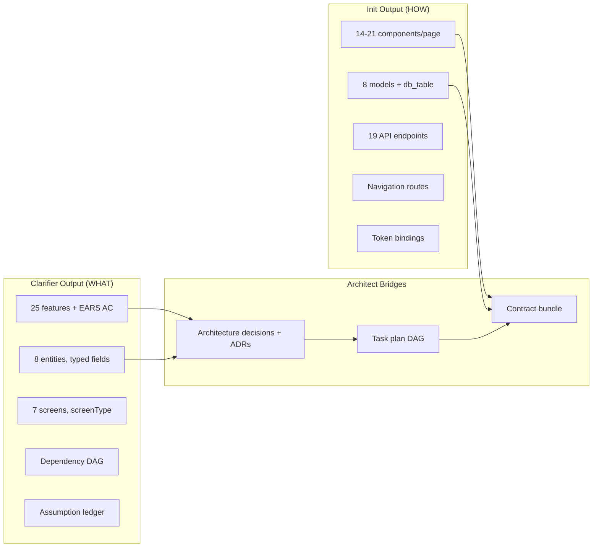
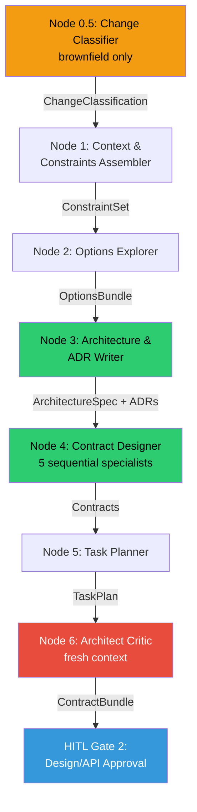
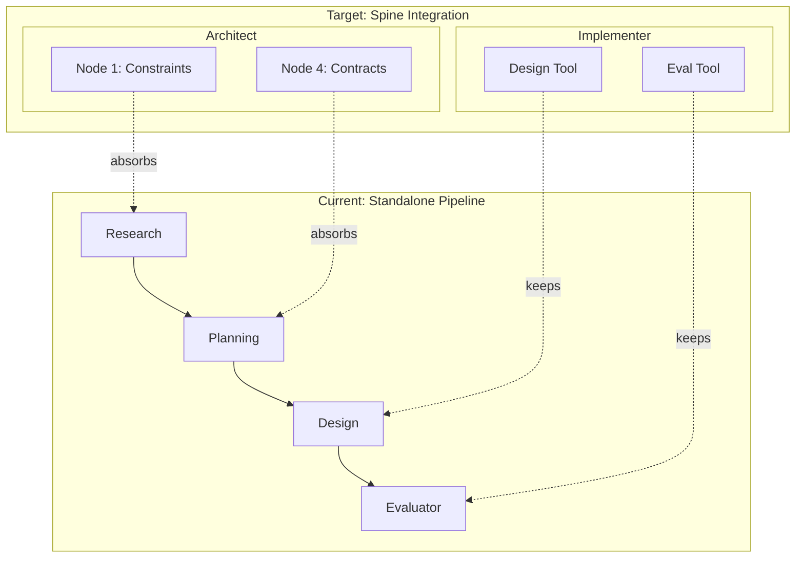
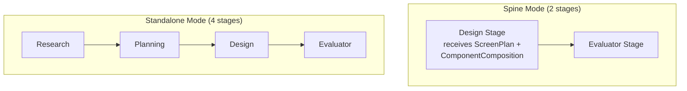
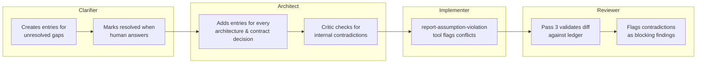
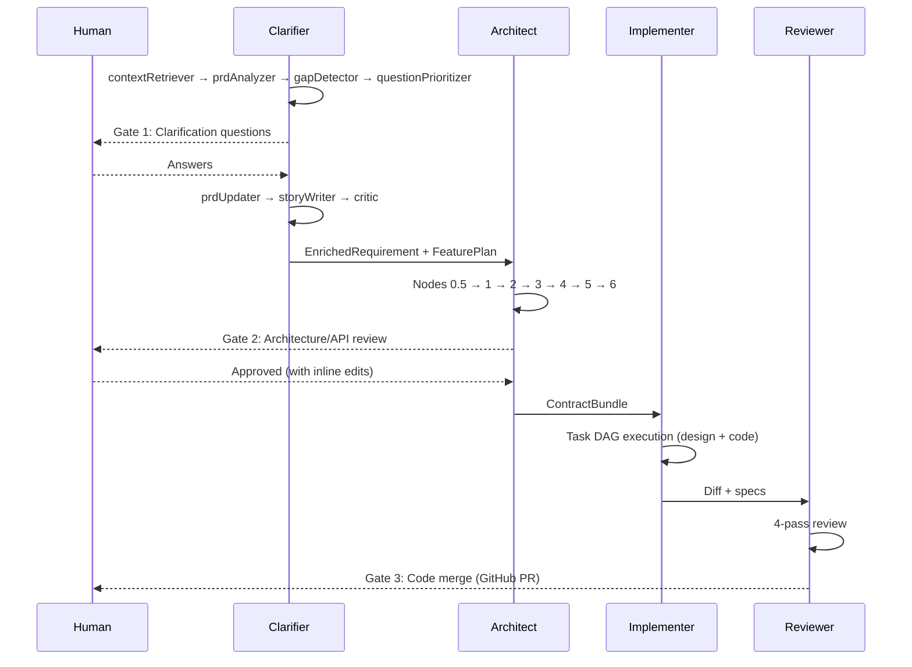

# Codebase-Grounded Design: Architect, Implementer, and Reviewer Stages

!!! warning "Point-in-time snapshot (2026-05-04)"

    This document was written against the codebase as of 2026-05-04. Schema-name
    citations (e.g., `EnrichedRequirementSchema`) are stable across refactors;
    verify line numbers against current code before acting on them.
    `spine-implementation.md` synthesizes these findings into the canonical
    architecture reference. Verify claims against current code before acting on them.

## TL;DR

- **The six-function Architect (Approach B) proposed in `architect-design.md` is validated by the codebase, with three structural adjustments.** The Clarifier produces structured entities, screens, and feature DAGs — the Architect refines, not discovers. The design pipeline's research/planning stages do Architect-level work and should be extracted into shared modules. No "Classifier" exists; `ChangeClassification` needs a producer (recommended: Architect Node 0.5).
- **Real data from both pipeline paths confirms the gap.** The Clarifier produces WHAT (25 features with EARS criteria, 8 typed entities, 7 screens with screenType, dependency DAG) while init produces HOW (14-21 components/page, 8 entities with db_table, 19 API endpoints, navigation routes). Neither is a superset — the Architect bridges them.
- **Design pipeline stage analysis reveals 3-4x prompt duplication** across Research, Planning, and DesignSpec prompts. Container treatments, typography, and spacing rules repeat in every prompt file. Root cause: `design-page.ts` passes `[description]` not `EnrichedRequirement`, forcing Research to re-derive what the Clarifier already produced.
- **The Implementer design is well-specified (vision Layer 8) and needs minimal adaptation.** Design + evaluator become specialist tools, cutting pipeline invocation from 4 stages to 2 in spine mode.
- **The Reviewer is the most complete stage (vision Layer 9) — identical for greenfield and brownfield.** Four passes, fresh context, bounded retry. No codebase changes needed to the design.
- **Four of eight required typed contracts exist** (`EnrichedRequirement`, `AssumptionLedger`, `PRD`, `FeaturePlan`). Four need creation: `ArchitectureSpec`, `TaskPlan`, `ConstraintSet`, `OptionsBundle`. Two exist but are unused: `ScreenPlan`, `ChangeClassification`.

---

## Part 0: How the Pipeline Works — Two Worked Examples

These scenarios trace real CashPulse fixture data through both the existing pipeline and the target spine, making the abstract architecture concrete.

### Scenario 1: Greenfield — CashPulse (real data from M0 ground truth capture)

**Input:** The CashPulse PRD (`fixtures/personal-expense-tracker/docs/prd.md`) — 421 lines, 3 screens, full design system tokens.

**Path A — What the Clarifier produces** (actual run, 2026-05-04):

| Output | Count | Detail |
|--------|-------|--------|
| Screens | 7 | dashboard, add-expense, spending-insights (page), settings-dialog (modal), expense-detail-popover (drawer), date-picker-calendar-dropdown (sheet), category-filter-dropdown (sheet) |
| Data entities | 8 | Expense(8 fields), Category(5), Budget(4), UserSettings(3), MonthSummary(7), CategorySpending(5), DailySpending(3), QuickAddSuggestion(6) — typed fields with required flags and relationships |
| Features | 25 | 17 must-have, 4 should-have, 4 could-have — each with EARS acceptance criteria and dependency DAG |
| Questions | 7 | Feature prioritization, UX detail, data storage decisions — all multiple-choice with recommended options |
| Personas | 3 | Alex, Priya, Jordan |
| NFRs | 9 | Performance, accessibility, usability |
| Assumptions | 6 | 3 confirmed (WCAG, validation, error handling), 3 unresolved after max rounds |

**Path B — What `agentforge init` produces** (existing fixture):

| Output | Count | Detail |
|--------|-------|--------|
| Pages | 5 | dashboard(14 components), add-expense(16), spending-insights(21), settings(drawer), confirm-delete(modal) — each with route, components, data_sources, navigates_to |
| Models | 8 | Expense(10 fields), Category(9), Budget(7), PaymentMethod(7), QuickAddSuggestion(9), DailyAggregate(7), CategoryAggregate(8), UserSettings(6) — all with db_table |
| API endpoints | 19 | Full REST API coverage |
| Design tokens | Full system | 10 primitives, 16 semantic, 6 typography roles, spacing scale, 4 elevations |
| Component catalog | 25 | Components with anatomy, variants, states, token_bindings |
| Token bindings | 99 | component.property → design token path |

**The gap the Architect fills:**



The Clarifier produces structured requirements; init produces implementation specs. The Architect takes Clarifier output and produces what init currently generates — but with deterministic validation, ADR documentation, task planning, and assumption ledger threading.

### Scenario 2: Brownfield — "Add budgeting to existing expense tracker"

**Input:** "Add monthly budget tracking. Dashboard should show budget progress. Alert when spending exceeds 80%."

**TWO sub-types the pipeline must distinguish:**

- **2A: New screens** — `budget-overview` doesn't exist yet
- **2B: Modified screens** — existing `dashboard` gets a budget progress section

**Change Classifier output** (Architect Node 0.5):
```typescript
{
  scopeAxes: { ui: true, component: true, designSystem: false, api: true, dataModel: true },
  blastRadius: 'module'
}
```

??? info "Brownfield pipeline flow — how modifications differ from new screens"

    The Change Classifier reads the enriched requirement (screens list with new + modified names) and the repo map (existing `agentforge/designs/*.json` files). Comparison:

    - Screen in requirement AND has existing design → **modified** (design delta needed)
    - Screen in requirement but NO existing design → **new** (full design needed)
    - Screen in design files but NOT in requirement → **unchanged** (skip)

    For modified screens, the specialist receives the existing DesignSpec v2 JSON and produces a **delta specification** — unchanged nodes referenced by ID, new nodes fully specified, modified nodes with changed fields only.

---

## Methodology

This document cross-references `architect-design.md` (the theoretical research grounded in Cognition, Anthropic, MetaGPT, Kiro, Spec Kit, and the academic SDLC-agent literature) against the actual CHIP codebase as of 2026-05-04. Every claim about "what exists" cites a schema or function name. Every claim about "what's missing" was verified by grep across the monorepo.

Sources examined:

- `docs/vision.md` — Layers 3 (Agent taxonomy), 5 (Artifacts), 8 (Implementation), 9 (Review), 10 (HITL)
- `docs/specs/sdlc-agents.md` — Agent taxonomy, SDLC phase details, model selection
- `docs/concepts/agent-taxonomy.md` — Spine + specialist structure
- `packages/agents-clarifier/src/` — Complete Clarifier implementation (9 nodes, Zod schemas, HITL interrupts)
- `packages/agents-ux/src/` — Design pipeline (4 stages: research → planning → design → evaluator)
- `packages/core/src/types/` — Cross-boundary artifact schemas, design system types
- `packages/designspec-renderer/src/types/` — DesignSpec v2 interface
- `packages/retrieval/` — RAG infrastructure (tree-sitter, voyage-code-3, Qdrant, Cohere Rerank)
- `fixtures/personal-expense-tracker/` — Real pipeline output (design pipeline + Clarifier M0 capture)

---

## Part 1: Architect Stage — Grounded Adjustments to the Six-Node Design

### 1.1 The Clarifier's actual output is richer than the research assumes

The research treats the Clarifier as emitting an "enriched PRD + assumption ledger." This is correct but incomplete. The Clarifier's actual output (from `ClarifierStateAnnotation` in `graph/state.ts` and `cross-boundary-artifacts.schemas.ts → EnrichedRequirementSchema`) includes:

**EnrichedRequirement** (`cross-boundary-artifacts.schemas.ts → EnrichedRequirementSchema`):
```typescript
{
  id: string,                              // "req-{timestamp}"
  rawInput: string,                        // Original user request
  mode: 'bootstrap' | 'evolution',         // Which clarifier mode ran
  prd: PRD,                                // Structured PRD (see below)
  assumptionLedger: AssumptionLedger,      // First-class artifact
  clarificationRounds: [{round, questionsAsked, questionsAnswered, timestamp}],
  confidence: number,                      // 0–1 (capped at 0.5 if maxRounds reached)
  createdAt: string,
}
```

**PRD** (`cross-boundary-artifacts.schemas.ts → PRDSchema`) — already structured JSON, not prose:
```typescript
{
  features: [{id, name, description, priority: 'must-have'|'should-have'|'could-have'|'wont-have'}],
  personas: [{id, name, role, goals: string[]}],
  dataEntities: [{id, name, fields: [{name, type, required?, description?}], relationships?: string[]}],
  screens: [{id, name, description, screenType?: 'page'|'modal'|'drawer'|'sheet'}],
  nfrs: [{id, category, description, target?, measurement?}],
  successMetrics: [{id, name, description, target, measurement}],
  outOfScope: string[],
  version: string,
  status: 'draft' | 'reviewed' | 'approved',
}
```

**FeaturePlan** (`cross-boundary-artifacts.schemas.ts → FeaturePlanSchema`):
```typescript
{
  id: string,
  features: [{
    id, name, description,
    acceptanceCriteria: [{id, condition, behavior, formatted}],  // EARS format
    priority: 'must-have'|'should-have'|'could-have'|'wont-have',
    dependencies: string[],                                       // Feature DAG
    status: 'planned'|'in-progress'|'implemented'|'verified',
  }],
}
```

**AssumptionLedger** (`cross-boundary-artifacts.schemas.ts → AssumptionLedgerSchema`):
```typescript
{
  id: string,
  entries: [{
    id, statement, evidence, confidence: 0-1,
    blastRadius: 'low'|'medium'|'high'|'critical',
    requiresConfirmation: boolean,
    resolvedBy?: string, resolvedAt?: string, resolution?: string,
  }],
  createdAt: string,
  lastUpdatedAt: string,
}
```

**Implication for Architect Node 4 (Contract Designer):** The data model specialist does not start from zero. `prd.dataEntities[]` already provides entity names, fields with types, required flags, and relationships. The specialist's job is to *refine* these into concrete column types, indexes, constraints, nullability decisions, and migration strategy — not to discover entities. Similarly, `prd.screens[]` already provides screen names, descriptions, and screen types. The screen spec specialist refines these into component membership, data bindings, and navigation targets.

### 1.2 The Clarifier has 9 nodes, not 6

The research references "6-node LangGraph StateGraph" for the Clarifier. The implementation in `clarifier-graph.ts → buildClarifierGraph()` has 9 nodes:

| # | Node | Role | HITL? |
|---|------|------|-------|
| 1 | `contextRetriever` | Loads catalog, platform constraints; evolution mode calls 5 RAG tools | No |
| 2 | `prdAnalyzer` | Extracts structured PRD from raw input via forced-JSON Zod schema | No |
| 3 | `gapDetector` | Two-pass: deterministic intent checks + ClarifyGPT divergence detection | No |
| 4 | `questionPrioritizer` | Ranks gaps by EVPI score | No |
| 5 | `storyWriter` | Produces EnrichedRequirement, FeaturePlan, AssumptionLedger | **Yes** |
| 6 | `critic` | Deterministic INVEST/EARS/DAG consistency checks | No |
| 7 | `prdUpdater` | Merges human clarification answers back into prdDraft between rounds | No |
| 8 | `escalationGate` | Human decides after maxRounds exhausted | **Yes** |
| 9 | `emitComplete` | Finalization, bridge event emission | No |

The 9 nodes confirm the research's own caveat: "The six-node count is not magic. The argument is for the *functions* ... and the *property* (single-writer per artifact, parallel reads only at evidence-gather nodes, fresh-context critic)." The extra nodes serve multi-round HITL mechanics.

### 1.3 No Classifier stage exists — ChangeClassification needs a producer

The research assumes a "Classifier" stage that produces `ChangeClassification`. The type exists (`cross-boundary-artifacts.schemas.ts → ChangeClassificationSchema`):

```typescript
ChangeClassificationSchema = z.object({
  scopeAxes: z.object({
    ui: z.boolean(),
    component: z.boolean(),
    designSystem: z.boolean(),
    api: z.boolean(),
    dataModel: z.boolean(),
  }),
  blastRadius: z.enum(['isolated', 'module', 'cross-cutting', 'system-wide']),
})
```

But no code produces this.

!!! tip "Recommendation: Architect Node 0.5"

    Add a deterministic + LLM hybrid node at the start of the Architect graph that reads `EnrichedRequirement` + repo context and classifies the change. Keeps the Architect self-contained — the classification is only consumed by the Architect's own nodes. Alternative (Clarifier evolution-mode output) would couple the Clarifier to brownfield concerns that are architecturally the Architect's domain.

### 1.4 The design pipeline's research and planning stages are doing Architect-level work

This is the central reuse opportunity. The design pipeline in `packages/agents-ux/` has 4 stages:

**Stage 1 — Research** (`ux-research.ts → UXResearchOutput`):
```typescript
interface UXResearchOutput {
  briefId: string,
  moduleId: string,
  requirementIds: string[],
  designConstraints: string[],
  referencePatterns: string[],
  accessibilityRequirements: string[],
  dataModelDependencies: string[],
}
```

**Stage 2 — Planning** (`ux-planning.ts → UXPlanningOutput`):
```typescript
interface UXPlanningOutput {
  specRef: string,
  moduleId: string,
  componentTree: ComponentTreeNode[],    // 34-node tree for dashboard
  tokenBindings: Record<string, string>, // 99 entries for CashPulse
  responsiveRules: ResponsiveRule[],
  screens?: ScreenDefinition[],
}
```

**Stage 3 — Design** (`ux-penpot-design.ts`): Generates DesignSpec v2 JSON.
**Stage 4 — Evaluator** (`design-evaluator.ts`): Structural quality + catalog adoption.

**The overlap matrix:**

| Architect Node 4 Specialist | Design Pipeline Stage | Overlap | Reuse Path |
|-----------------------------|-----------------------|---------|------------|
| Screen spec specialist | Research + Planning | **High** — both produce design constraints, component trees | Extract shared constraint analysis + component composition logic |
| Component composition specialist | Planning | **High** — `ComponentTreeNode` is exactly the composition spec | Lift building logic to shared module |
| Design system diff specialist | Planning (token validation) | **Medium** — planning validates bindings but doesn't produce a diff | Reuse `token-validation.ts`; add diff reporting |
| Data model specialist | Research (data model dependencies) | **Low** — research only lists dependencies | No reuse; Architect builds from `prd.dataEntities[]` |
| API contract specialist | None | **None** — design pipeline doesn't touch API contracts | New capability |

**Additional reusable modules in agents-ux:**

| Module | Location | What it does | Reuse in Architect |
|--------|----------|-------------|-------------------|
| `design-system-context.ts` | `ux-design/` | Parses typography, spacing, colors from `DesignTokensSpec` | Node 1 (constraint assembly for UI scope) |
| `assess-catalog-adoption.ts` | `ux-design/` | Measures catalog component usage in a design | Node 6 (critic — validate catalog coverage) |
| `token-validation.ts` | `ux-planning/` | Validates token bindings against `DesignTokensSpec` | Node 4 (design system diff specialist) |
| `buildComponentCatalogPrompt()` | `design-system-context.ts` | Renders component catalog as LLM-friendly markdown | Node 1 (constraint assembly) |

### 1.5 Typed contracts — what exists vs what's needed

**Already exist and are used:**

| Contract | Schema Location | Used By |
|----------|----------------|---------|
| `EnrichedRequirement` | `cross-boundary-artifacts.schemas.ts → EnrichedRequirementSchema` | Clarifier output |
| `AssumptionLedger` | `cross-boundary-artifacts.schemas.ts → AssumptionLedgerSchema` | Clarifier output, threaded through spine |
| `PRD` | `cross-boundary-artifacts.schemas.ts → PRDSchema` | Clarifier output, structured JSON |
| `FeaturePlan` | `cross-boundary-artifacts.schemas.ts → FeaturePlanSchema` | Clarifier output, feature DAG with EARS criteria |

**Exist as schemas but are unused:**

| Contract | Schema Location | Notes |
|----------|----------------|-------|
| `ScreenPlan` | `cross-boundary-artifacts.schemas.ts → ScreenPlanSchema` | Usable as Architect screen spec output |
| `ChangeClassification` | `cross-boundary-artifacts.schemas.ts → ChangeClassificationSchema` | Needs a producer |

!!! note "Planned contracts"

    | Contract | Purpose | Key Fields |
    |----------|---------|------------|
    | `ConstraintSet` | Node 1 output | `hard`, `soft`, `gaps`, `mode` |
    | `OptionsBundle` | Node 2 output | `options: OptionMemo[]` |
    | `ArchitectureSpec` | Node 3 output | `overview`, `components`, `integrations`, `nfrs` |
    | `TaskPlan` | Node 5 output | `tasks: Task[]` with `filePaths[]`, `dependencies[]`, `writeOrder` |
    | `ContractBundle` | Full Architect output | All of the above + `criticReport` |

### 1.6 Adjusted Architect node structure



Legend: orange = scope-conditional, green = single-threaded writer, red = fresh-context gate, blue = HITL interrupt.

**Node 0.5 — Change Classifier** (brownfield only): Single LLM call with `ChangeClassificationSchema`. Greenfield: skipped, all scope axes `true`.

**Node 1 — Context & Constraints Assembler**: Parallel read subagents (repo map, ADR library, steering files, reference patterns, design system context via `buildDesignSystemContext()`). Deterministic merger fuses into `ConstraintSet`.

**Node 2 — Options Explorer**: Parallel read subagents — one per open axis in `ConstraintSet.gaps`. Each returns `OptionMemo`. No commitments — evidence only.

**Node 3 — Architecture & ADR Writer**: Single-threaded LLM writer (Opus). Reads all evidence, writes `ArchitectureSpec` + ADRs. Brownfield: `defaultToExistingPattern = true`.

**Node 4 — Contract Designer**: Single-threaded tool loop, 5 sequential specialists: data model → API contracts → component composition → screen specs → design system diff. Each reads prior artifacts. Brownfield: only specialists for active scope axes.

**Node 5 — Task Planner**: Decomposes into `TaskPlan` DAG. Deterministic validators: PRD criterion coverage, DAG acyclic, single-writer, contract-task coverage.

**Node 6 — Architect Critic**: Fresh context. Deterministic gates first (OpenAPI lints, migration SQL parses, ADR completeness, DAG acyclicity, single-writer). LLM review second. Blocking → retry; suggestions → `AssumptionLedger`.

---

## Part 2: Design Pipeline Stage Analysis (grounded in real data)

### 2.1 Per-stage data flow

```mermaid
flowchart LR
    I[Pipeline Input<br/>prdRequirements: string[]] --> R[Research<br/>v1.0.0, 56 lines]
    R -->|UXResearchOutput| P[Planning<br/>v2.2.0, 214 lines]
    P -->|UXPlanningOutput| D[Design<br/>v2.4.0, 222 lines]
    D -->|DesignSpecV2| E[Evaluator]

    style I fill:#E74C3C,color:#fff
    style R fill:#F39C12,color:#000
    style P fill:#F39C12,color:#000
```

Legend: red = known issue (passes `[description]` not structured PRD), orange = overlap with Architect.

### 2.2 Prompt coverage table

| Category | Research (v1.0.0, 56 lines) | Planning (v2.2.0, 214 lines) | DesignSpec (v2.4.0, 222 lines) | Unique owner |
|---|---|---|---|---|
| Component hierarchy | — | **Primary** | Flat adjacency list | Planning |
| Container treatments | — | Token binding for elevation | 5 treatments with rules | **Duplicated** |
| Typography scale | — | Roles by name | Exact px/weight | DesignSpec |
| Semantic color tokens | — | Allowlist enforcement | Token names listed | Planning gates, DesignSpec consumes |
| Spacing values | — | Sizing defaults (px ranges) | Spacing & grouping rules | **Duplicated** |
| Responsive breakpoints | Mention only | **Primary** (3 breakpoints) | Single viewport | Planning |
| WCAG accessibility | **Primary** | Touch targets, ARIA | Semantic HTML from catalog | Research discovers, others implement |
| navigateTo routing | — | **Primary** | — | Planning |
| Screen partitioning | — | **Primary** | screen field | Planning |

### 2.3 Clarifier → Research duplication analysis (real data)

| Information | Clarifier output (CashPulse) | Research output | Status |
|---|---|---|---|
| Accessibility | 3 assumption entries (WCAG 2.1 AA, confidence 1.0) | 17 WCAG flat strings | **Duplicated with loss** |
| Data entities | 8 entities with typed fields + relationships | `dataModelDependencies[]` — flat strings | **Duplicated with loss** |
| Screens | 7 screens with screenType enum | Not produced | **Clarifier-only** |
| Features | 25 features with EARS AC + dependency DAG | Not produced | **Clarifier-only** |
| Design constraints | Not produced | Grounded in design tokens | **Unique to Research** |
| UX reference patterns | Not produced | UI idioms from catalog | **Unique to Research** |

Root cause: `design-page.ts` constructs `prdRequirements = [description]` — the pipeline never receives `EnrichedRequirement`.

### 2.4 Evaluator reality vs claims

| Capability | In `evaluateDesign()` | In pipeline `evaluatorNode` | Runs in pipeline? |
|---|---|---|---|
| Container diversity | Yes | Yes | **YES** |
| Catalog adoption | Yes | Yes | **YES** |
| Vision (5-dim LLM) | Yes | No | **NO** (ADR-045) |
| Token compliance | Yes (optional) | No | **NO** |
| NavigateTo count | Yes (optional) | No | **NO** |

### 2.5 Field-by-field overlap map (real data, both paths)

| Data needed by Design Pipeline | Clarifier produces | `agentforge init` produces | Research re-derives | Planning re-derives | Gap |
|---|---|---|---|---|---|
| **Screen list** | 7 screens with screenType | 5 pages with route, components, navigates_to | — | `screens[]` partial | Clarifier has seed; init has enriched |
| **Components per screen** | — | 14-21 per page | `referencePatterns[]` flat | **34-node tree** with props | Planning is unique value |
| **Data models** | 8 entities, typed fields, relationships | 8 models, db_table, 6-10 fields | `dataModelDependencies[]` flat | — | Clarifier has MORE per-field detail; init has db_table |
| **API contracts** | — | 19 endpoints | — | — | Init-only |
| **Design tokens** | — | Full system (10 primitives, 16 semantic) | Reads + references | Validates bindings (99) | Init produces; pipeline consumes |
| **Component catalog** | — | 25 components with anatomy | `referencePatterns[]` flat | Reads as vocabulary | Init produces |
| **Navigation** | — | `navigates_to` structured | — | `navigateTo` simple string | Init is richer |
| **Token bindings** | — | — | — | 99 entries | Planning-only |
| **Features + criteria** | 25 features, EARS AC, deps DAG | — | — | — | Clarifier-only |
| **Assumptions** | 6 entries with confidence, blastRadius | — | — | — | Clarifier-only |

---

## Part 3: Stage Fate + Solutions

### 3.1 Stage fate recommendations

**Research → Slim and absorb into Architect Node 1**

- Keep: design-token-aware constraints, UX pattern selection (unique)
- Eliminate: re-derivation of accessibility, entities (Clarifier produces these structured)
- Prerequisite: thread `EnrichedRequirement` into pipeline

**Planning → Becomes Architect Node 4 specialist**

- Component tree, token binding, screen partitioning are architectural decisions
- Token validation loop (`token-validation.ts`) moves to shared module
- Planning prompt becomes Node 4 component composition specialist prompt

**Design → Implementer specialist tool (confirmed)**

- Visual composition depends on Architect contracts
- Prompt deduplication: container treatments, typography, spacing become sole responsibility of DesignSpec prompt

**Evaluator → Wire vision into pipeline (Phase 2)**

- Function exists, schema exists, 7 callers work. Wiring task only (ADR-045 deferral).

### 3.2 Concrete solutions (before → after)

**Solution: Thread structured PRD**

Before (`design-page.ts`):
```typescript
const prdRequirements = [description];
if (prdContent) prdRequirements.push(prdContent);
```

After:
```typescript
interface PipelineInput {
  enrichedRequirement?: EnrichedRequirement;  // structured Clarifier output
  featurePlan?: FeaturePlan;                  // feature DAG
  prdRequirements?: string[];                 // fallback for standalone mode
}
```

**Solution: Design pipeline redistribution**



**Solution: Prompt deduplication map**

| Category | Current owners | Target owner | Action |
|---|---|---|---|
| Container treatments | Planning+DesignSpec+Penpot | **DesignSpec** | Remove from Planning, Penpot |
| Typography scale | DesignSpec+Penpot | **DesignSpec** | Remove from Penpot |
| Spacing rules | Planning+DesignSpec+Penpot | DesignSpec (visual), Planning (structural) | Remove from Penpot |
| `readSpecs()` | Research+Planning | **Once in `initState()`** | Add `existingSpecs` to state |

---

## Part 4: Key Decisions

!!! question "Decision 1: Should the Architect receive the Clarifier's structured PRD?"

    **Recommendation: Yes.** Thread `EnrichedRequirement` into `PipelineInput`. When present, Research skips re-derivation. When absent, standalone mode unchanged. This is the M1 milestone gate.

!!! question "Decision 2: Should Planning survive as a standalone stage?"

    **Recommendation: Slim standalone for dev, authoritative through Architect.** Planning's component composition logic becomes the Architect Node 4 specialist. The standalone `design:page` path keeps a slim Research+Planning for developer iteration.

!!! question "Decision 3: Where does the token validation loop live?"

    **Recommendation: Shared module in `packages/core/src/architect/`.** Currently in `packages/agents-ux/src/ux-planning/token-validation.ts`. Both Architect Node 4 and the standalone pipeline need it.

??? info "Decision 4: When to wire vision evaluation into pipeline?"

    **Recommendation: Opt-in flag, default off for iteration.** Vision evaluation exists and works (`evaluateDesign()` in `design-evaluator.ts`). Wiring into pipeline evaluator is a cost/latency tradeoff. ADR-045 deferred this.

??? info "Decision 5: Shared module location?"

    **Recommendation: `packages/core/src/architect/`.** Co-locate with existing typed contracts. Avoid a new `packages/architect-shared/` — it adds a build target and dependency for what is logically part of core.

---

## Part 5: Implementer Stage — Vision-Grounded Design with Design Pipeline Integration

### 5.1 What the vision specifies (Layer 8)

The Implementer is the best-specified unbuilt stage. From `vision.md → Layer 8: Implementation`:

**Core structure:** Single-threaded tool-loop implementer processing one task at a time in sequential write order. Cross-task parallelism via git worktrees.

**Sequential write order** (locked decision):

1. DB migration
2. Backend endpoint + service layer
3. Backend tests
4. Frontend component
5. Frontend tests
6. Integration test

**Deterministic gates** (locked decision): typecheck, lint, tests pass → exit. Hard caps: 5 iterations, 200K tokens, 15 minutes. LLM never self-declares completion.

**Tools:** workspace (read/write/patch, scoped to worktree), gates (test/typecheck/lint), context (search/repo-map), research subagent, report-assumption-violation.

**Model:** `claude-sonnet-4-6` (balanced).

### 5.2 Design pipeline integration — the key adaptation



When the Implementer reaches a frontend task:

1. Invokes the design stage as a specialist tool with the Architect's `ScreenPlan` + `ComponentComposition` + `DesignTokensSpec`
2. Design stage generates DesignSpec v2 JSON — does NOT re-run research or planning
3. Evaluator validates the generated design against the Architect's specs
4. If evaluator flags issues, design stage retries within the Implementer's iteration budget

??? info "Open decisions from vision (still unresolved)"

    1. **How to handle tasks with no UI or no backend changes.** Skip irrelevant steps, driven by task scope from `TaskPlan`.
    2. **Whether the Implementer can request mid-task clarification.** Probably yes, via escalation to human.
    3. **How to handle tasks that touch multiple modules.** Architect splits upstream so Implementer gets scoped tasks.
    4. **Whether to commit intermediate progress.** Intermediate commits give rollback points; continuous rebase gives clean final diff.

---

## Part 6: Reviewer Stage — Vision-Grounded Design

### 6.1 What the vision specifies (Layer 9)

The Reviewer is the most complete stage design. From `vision.md → Layer 9: Review`:

**Four sequential passes:**

1. **Deterministic gates** (run first): typecheck, lint, tests, security scan (Semgrep + CodeQL), license check. Any failure → blocking, return to Implementer.
2. **LLM reviewer** — failure-mode checklist, scoped to diff, with `ArchitectureSpec` and `AssumptionLedger` as context.
3. **Assumption validator** — compares diff against `AssumptionLedger`. Catches "the Implementer quietly decided to use PUT instead of PATCH."
4. **Triage** — blocking / suggestion / false-positive with evidence.

**Post-review:** Approved → HITL merge gate. Rejected → return (max 2 revisions). After 2 failures → human escalation.

**Model:** `claude-sonnet-4-6` for POC; possibly Opus for production.

??? info "Open decisions from vision"

    1. **Whether reviewer findings need their own schema.** Probably yes — recommend `ReviewReport` Zod schema.
    2. **How to scope "the diff" for large changes.** Per-file with final cross-file integration review for >1000 lines.

### 6.2 The assumption ledger lifecycle



---

## Part 7: The Shared Module Opportunity

### 7.1 What to extract

**Proposed shared module structure** (location: `packages/core/src/architect/`):

| Module | Source | Consumers |
|--------|--------|-----------|
| `constraint-assembler.ts` | New, from `ux-research.ts` patterns | Architect Node 1, standalone design pipeline |
| `component-composition.ts` | Extract from `ux-planning.ts` | Architect Node 4, design pipeline planning |
| `token-validation.ts` | Move from `agents-ux/src/ux-planning/` | Architect Node 4, design pipeline planning |
| `screen-spec-builder.ts` | New, using `ScreenPlanSchema` | Architect Node 4 |
| `design-system-context.ts` | Already in `agents-ux/src/ux-design/` | Architect Node 1, design stage |

### 7.2 Design pipeline after extraction

**Spine mode** (invoked by Implementer): Design + Evaluator only — receives Architect contracts.

**Standalone mode** (CLI `design:page`): Research → Planning → Design → Evaluator unchanged. Uses shared modules.

---

## Part 8: Contract Summary

### Input contract: Clarifier → Architect

```typescript
interface ArchitectInput {
  requirement: EnrichedRequirement;       // PRD + AssumptionLedger + confidence + rounds
  featurePlan: FeaturePlan;               // Feature DAG with EARS criteria + dependencies
  mode: 'bootstrap' | 'evolution';
}
```

### Output contract: Architect → Implementer

```typescript
interface ContractBundle {
  architectureSpec: ArchitectureSpec;
  adrs: ADR[];
  dataModel?: DataModelSpec;
  apiContracts?: OpenAPISpec;
  componentComposition?: ComponentComposition;
  screenSpecs?: ScreenPlan[];             // Exists — ScreenPlanSchema
  designSystemDiff?: DesignSystemDiff;
  taskPlan: TaskPlan;
  assumptionLedger: AssumptionLedger;     // Updated with all decisions
  criticReport: ArchitectCriticReport;
  changeClassification?: ChangeClassification; // Brownfield only
}
```

### HITL gates across the spine



---

## Part 9: Implementation Sequence

Building order, optimized for earliest testable output:

**Phase 1 — Typed contracts.** Create Zod schemas in `packages/core/src/types/`. The spine's load-bearing surface.

**Phase 2 — Architect Critic (Node 6) first.** Cheapest to evaluate in isolation: hand-written bundles → gate validation.

**Phase 3 — Contract Designer (Node 4) second.** Highest-risk node. Extract shared modules from `packages/agents-ux/`.

**Phase 4 — Nodes 1, 2, 3, 5.** Each cheaper than Node 4. Defer parallel subagents until single-threaded works end-to-end.

**Phase 5 — Implementer.** Single-threaded tool loop. Wire design + evaluator as specialist tools.

**Phase 6 — Reviewer.** 4-pass review system. Most self-contained stage.

---

## Part 10: Prerequisite Plans

| # | Capability | Needed by | Scope |
|---|-----------|-----------|-------|
| 1 | **Orchestrator / Task Dispatcher** | M4 | New `packages/orchestrator/`, LangGraph outer graph |
| 2 | **Design Delta Specification** | M3 (brownfield) | Extension to DesignSpecV2 type |
| 3 | **Existing Design Loader** | M3 (brownfield) | Utility in `packages/core/` |
| 4 | **Impact Analysis** | M3 (brownfield) | Part of Architect Node 0.5 |
| 5 | **Structured PRD Threading** | M1 | Wiring in `design-page.ts` + `PipelineInput` |
| 6 | **Architect Eval Harness** | M2 | Golden bundles, schema validation, regression baseline |

---

## Clarifier v0 Known Trade-Offs (FB1-FB4)

??? warning "FB1: Semantic Deduplication (future)"

    SHA-256 content hashing of `topic::description` misses semantic duplicates. Current mitigation: system prompt instruction + `qaSection` + `filterAskedGaps` by ID. Future: embed gap descriptions with Voyage, cosine similarity rejection above 0.85 threshold.

??? warning "FB2: PRD Over-Production (documented trade-off)"

    Bootstrap mode deliberately over-produces features/screens/entities. `could-have` priority and divergence prompt constraints are mitigations. CashPulse M0 run: 25 features from a 3-screen PRD (4 `could-have`). Eval metric: `unvalidated-artifact-survival`.

??? warning "FB3: Critic is Structure-Only (documented limitation)"

    Critic runs ONLY deterministic checks (EARS, INVEST, DAG). `criticPassed: true` = structurally valid, NOT quality-assured. CashPulse M0 run: critic failed twice before escalation accepted. `critic-system.md` scaffolded but not wired.

??? warning "FB4: Eval Personality Variants (future)"

    Cooperative simulator always picks `recommended: true`. Priority-update logic in PRD Updater is untested. CashPulse M0 run used cooperative simulator — 21 answers across 3 resume cycles (7 questions × 3 cycles due to critic retries). Future: opinionated, evasive, contradictory personas.

---

## Related

- [Spine Implementation](../architecture/spine-implementation.md) — synthesizes this research into canonical architecture reference
- [Spine Pattern](../architecture/spine-pattern.md) — the four-stage spine pattern this research validates
- [Architect Design Research](architect-design.md) — the theoretical companion
- [Vision Layer 8: Implementation](../vision.md#layer-8-implementation) — Implementer authority
- [Vision Layer 9: Review](../vision.md#layer-9-review) — Reviewer authority
- [ADR-045](../adrs/ADR-045-evaluator-deferred-to-phase-2.md) — vision evaluation deferral
- [Design Pipeline Dataflow](../architecture/design-pipeline-dataflow.md) — current pipeline data flow
- [CHIP's Next Steps](../plans/active/chips-next-steps/execution-plan.md) — the spine build-out plan

---

## Appendix: File Reference Map

### Existing code to reuse or reference

```
packages/agents-clarifier/src/
├── graph/clarifier-graph.ts             # 9-node LangGraph StateGraph
├── graph/state.ts                       # ClarifierStateAnnotation
├── nodes/story-writer.ts               # Produces EnrichedRequirement + FeaturePlan
├── nodes/critic.ts                      # Deterministic INVEST/EARS/DAG checks
└── types.ts                             # Gap, Question, HumanResponse

packages/agents-ux/src/
├── design-pipeline/
│   ├── pipeline.ts                      # 4-stage entry point
│   ├── types.ts                         # DesignPhaseState, PipelineInput
│   └── nodes.ts                         # researchNode, planningNode, designNode, evaluatorNode
├── ux-research/ux-research.ts           # UXResearchOutput
├── ux-planning/
│   ├── ux-planning.ts                   # UXPlanningOutput — componentTree, tokenBindings
│   └── token-validation.ts              # Token binding validation — extract target
├── ux-design/
│   ├── design-system-context.ts         # buildDesignSystemContext()
│   ├── assess-catalog-adoption.ts       # Catalog usage metrics
│   └── structural-quality-gate.ts       # Quality metrics
└── types.ts                             # ComponentTreeNode, ResponsiveRule

packages/core/src/types/
├── cross-boundary-artifacts.schemas.ts  # Zod schemas: EnrichedRequirement, PRD,
│                                        #   AssumptionLedger, FeaturePlan, ScreenPlan,
│                                        #   ChangeClassification
├── cross-boundary-artifacts.ts          # TypeScript types
├── design-system.ts                     # DesignTokensSpec, ComponentCatalogSpec
└── spec-types.ts                        # PageEntry, ScreenType

packages/designspec-renderer/src/types/
└── design-spec-v2.ts                    # DesignSpecV2 — flat node map

packages/retrieval/                      # RAG infrastructure
```

### Types to create

```
packages/core/src/types/
├── architect-contracts.schemas.ts       # ConstraintSet, OptionsBundle, ArchitectureSpec,
│                                        #   TaskPlan, ContractBundle, ArchitectCriticReport
└── architect-contracts.ts               # TypeScript types
```

### Ground truth fixture data

```
fixtures/personal-expense-tracker/
├── docs/prd.md                          # Input PRD (421 lines)
├── agentforge/
│   ├── spec/
│   │   ├── pages.yaml                   # Init output — 5 pages, 14-21 components
│   │   ├── models.yaml                  # Init output — 8 models + db_table
│   │   └── design-tokens.yaml           # Full token system
│   └── clarifier-output/                # M0 capture (2026-05-04)
│       ├── enriched-requirement.json    # 7 screens, 8 entities, 25 features
│       ├── feature-plan.json            # 25 features + EARS AC + dependency DAG
│       ├── prd-draft.json               # Structured PRD
│       ├── assumption-ledger.json       # 6 entries
│       ├── questions.json               # 7 questions
│       └── validation-report.json       # 4/4 schemas pass
```

---

## Citations

- `architect-design.md` — theoretical research grounding (Cognition, Anthropic, MetaGPT, Kiro, Spec Kit, academic literature)
- `docs/vision.md` — Layers 3, 5, 8, 9, 10 (architectural authority)
- `docs/specs/sdlc-agents.md` — agent taxonomy, model selection, SDLC phase details
- `docs/concepts/agent-taxonomy.md` — spine + specialist structure
- `packages/agents-clarifier/src/` — complete Clarifier implementation (reference architecture)
- `packages/agents-ux/src/` — design pipeline (reuse target for Architect Node 4)
- `packages/core/src/types/cross-boundary-artifacts.schemas.ts` — existing typed contracts
- `fixtures/personal-expense-tracker/agentforge/clarifier-output/` — M0 ground truth capture (2026-05-04)
- `fixtures/personal-expense-tracker/agentforge/spec/` — design pipeline init output
