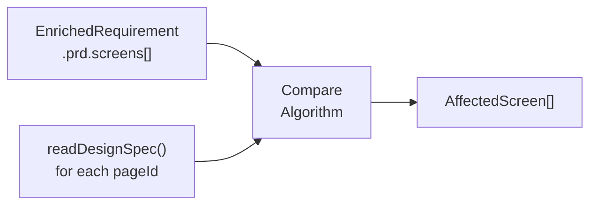
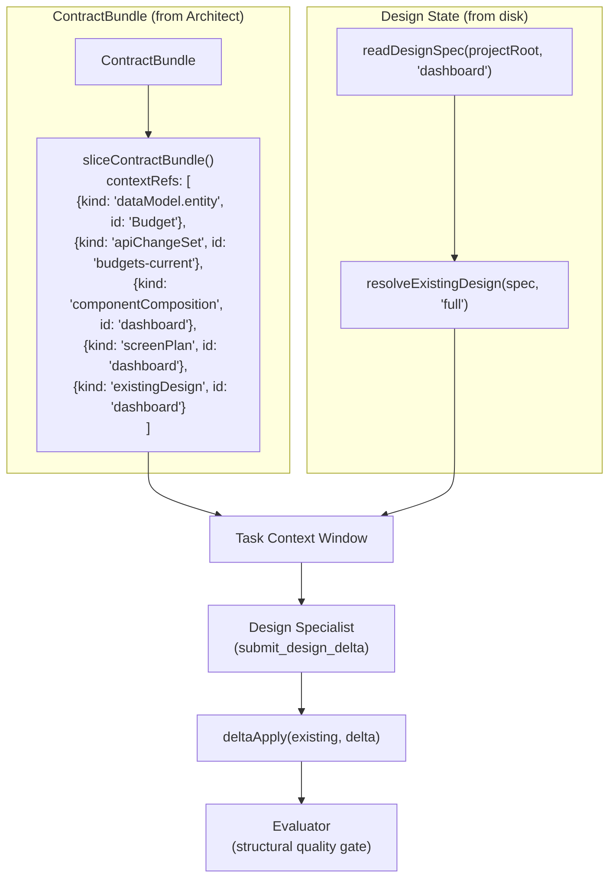

# R9: Brownfield Design Delta — Per-Screen Impact, Delta Format, MODIFY Wiring

**Scope.** This report informs implementation of brownfield frontend task handling in **M4 (Implementer + Reviewer)**. It answers three analysis questions: how Node 0.5 identifies affected design specs (R9.1), what delta schema extends DesignSpecV2 (R9.2), and how MODIFY tasks receive existing design state (R9.3). It does NOT address R9.4 (design-info value in code generation) — that question requires empirical measurement and is split to **M3.6** as a parallel eval milestone.

**Running example.** CashPulse brownfield fixture (M3.5 Phase 1): "Add recurring transactions — let users mark a transaction as recurring (weekly/monthly/yearly) and see upcoming recurrence on the dashboard." Clarifier evolution mode produced 6 screens (3 modified, 2 new, 1 overlapping), 3 entities (1 modified, 1 unchanged, 1 new), 8 features. Fixture at `packages/eval/src/scenarios/cashpulse-brownfield.yaml`.

**Evidence base.** Kiro Bugfix Specs + Design-First workflow (kiro.dev/blog, Feb 2026); Cursor 3 worktree isolation (cursor.com/changelog); Devin 2.0 analyze→search→plan workflow (cognition.ai/blog); Spec Kit Agents (Taghavi & Bhavani, arXiv 2604.05278, April 2026); ACON context compression (Kang et al., arXiv 2510.00615, Oct 2025); OpenSpec delta markers (intent-driven.dev, March 2026).

**Locked decisions (NOT relitigated):**

- Single-threaded Implementer per task (Vision Layer 8)
- MODIFY tasks receive `existingDesignSpec + deltaTree` (Vision Layer 8)
- Symmetric greenfield/brownfield nodes — same Architect structure, different parameters (architect-design.md §4)
- ContractBundle as shared inter-task context (R3)
- 76K input token ceiling per task (R3 §5)
- Git worktree parallelism for cross-task work (Vision Layer 8)
- DesignSpecV2 NodeSpec budget: 19 of 24 optional fields used (Anthropic strict mode limit)
- R9.4 → M3.6 (out of scope)

---

## 1. Executive Summary

**Ranked recommendations (evidence-grounded):**

1. **Screen-level impact classification is the right granularity for Node 0.5.** [HIGH] Node-level diffing belongs in the design specialist, not the Architect's classifier. Kiro's Bugfix Spec operates at feature-level granularity (current/expected/unchanged behavior), not line-level. Spec Kit Agents' context-grounding hooks probe at module level. The classifier should output `AffectedScreen[]` — which screens are `new`, `modified`, or `unchanged` — and leave node-level delta computation to the design stage.

2. **Use an operation-list delta format, not state-snapshot.** [HIGH] OpenSpec's ADDED/MODIFIED/REMOVED markers and Kiro's three-section bugfix format both use explicit operation tagging rather than inferring deltas from two full snapshots. An operation-list schema (each entry = one node operation) is more compact, serializable, and composable than diffing two full 159-node specs.

3. **DesignSpecDelta is a separate schema, not an extension of DesignSpecV2.** [HIGH] DesignSpecV2 is the LLM-facing tool schema with a hard 24-optional-field budget (19 used). Adding delta fields to NodeSpec would consume budget slots for a capability only used in brownfield mode. A separate `DesignSpecDelta` schema wraps the delta operations and references the base spec by screen ID.

4. **Extend ContextRefKindSchema with `existingDesign` and `designDelta` kinds.** [MEDIUM] This routes existing design state through the established `sliceContractBundle()` pipeline rather than creating a parallel channel. The slice mechanism is already proven (5 kinds, used by M3 Node 4 specialists). Adding 2 kinds is a smaller surface area change than a new `DesignContextSliceStrategy` type.

5. **The design specialist receives the full existing spec, not a pre-computed delta.** [MEDIUM] The LLM produces the delta, not a deterministic diffing algorithm. Passing the full existing spec (~9.4K tokens for a 159-node dashboard) plus the change instructions lets the LLM decide which nodes are affected. The output is a `DesignSpecDelta` that the renderer applies deterministically.

6. **Token budget for a MODIFY design task: ~25-35K of 76K ceiling.** [HIGH] Measured against the CashPulse fixture: existing dashboard spec ~9.4K + ContractBundle slice ~8-12K + system prompt + tools ~4K + delta output headroom ~4-8K = ~25-35K. Well within the 76K ceiling. No compression needed for the unsliced approach on typical specs.

7. **`deltaApply(existing, delta)` must produce a valid DesignSpecV2 — enforce via round-trip test.** [HIGH] Spec Kit Agents report 99.7-100% test compatibility as their primary brownfield safety metric. The delta apply function must be deterministic and invertible: `deltaApply(readDesignSpec(projectRoot, pageId), delta).nodes` must pass the same structural quality gate as a fresh full-spec design.

8. **Make the existing-design slice strategy configurable so M3.6 can refine it.** [MEDIUM] ACON demonstrates 26-54% memory reduction via optimized compression while preserving 95%+ accuracy. M3.6 may find that a narrowed DesignSpec slice (labels + data bindings only, dropping spacing/typography) suffices for MODIFY tasks. The wiring must support swapping the slice strategy without refactoring the pipeline.

---

## 2. R9.1 — Per-Screen Impact Analysis

### Current State (M3)

`ChangeClassificationSchema` in `packages/core/src/types/cross-boundary-artifacts.schemas.ts:168-175`:

```typescript
export const ChangeClassificationSchema = z.object({
  id: z.string(),
  changeRequestId: z.string(),
  scopeAxes: z.array(ScopeAxisSchema).min(1),
  blastRadius: BlastRadiusSchema,
  affectedModules: z.array(z.string()),
  confidence: z.number().min(0).max(1),
});
```

`ScopeAxisSchema` enumerates 5 module-level axes: `'ui' | 'component' | 'design-system' | 'api' | 'data-model'`. The `affectedModules` field carries free-form strings with no typed structure — it cannot express "dashboard is modified, budget-overview is new, settings is unchanged."

Node 0.5 (Change Classifier) in `packages/agents-architect/src/graph/nodes/change-classifier.ts:26-31` is a placeholder that populates `existingFiles` from a repo snapshot but makes no LLM call. No screen-level classification exists today.

`readDesignSpec(projectRoot, pageId)` in `packages/core/src/design-spec-store.ts:38` reads `{projectRoot}/agentforge/designs/{pageId}.json` and returns parsed JSON or null.

### Comparison Algorithm

The impact analysis compares two data sources:

1. **Existing design specs** — files on disk at `agentforge/designs/*.json`, each a `DesignSpecV2` with a `screen` field and `nodes` map.
2. **Post-change requirement** — `EnrichedRequirement.prd.screens[]`, each with `id`, `name`, `screenType`, and `description`.



**Algorithm (deterministic, no LLM):**

1. Enumerate existing design spec files: `readdirSync(agentforge/designs/)`, filter to `.json`, exclude `prototype.json`, `shared-chrome.json`, `*.backup.json`.
2. For each screen in `EnrichedRequirement.prd.screens`:
   - **Name-match** against existing spec files. The Clarifier's screen IDs are semantic (e.g., `screen-001: "Dashboard — Upcoming Recurring Card"`) while existing files use kebab-case page IDs (`dashboard`, `add-expense`). Match by normalized name substring or explicit mapping from `pages.yaml`.
   - If a matching existing spec exists → `impact: 'modified'`
   - If no matching existing spec → `impact: 'new'`
3. For each existing spec file NOT referenced by any screen in the requirement → `impact: 'unchanged'`
4. Multiple requirement screens can map to the same existing spec (e.g., screens 001 and 006 both target `dashboard`). Collapse to a single `modified` entry with merged annotations.

**Production system evidence:** Kiro's Bugfix Spec explicitly documents "Unchanged Behavior" alongside "Current" and "Expected" — the three-way classification (new/modified/unchanged) is validated by AWS's brownfield workflow. Devin's analyze→search→plan workflow performs codebase search *before* generating a task plan, analogous to reading existing specs before classifying impact.

### Schema Extension: AffectedScreen

```typescript
export const ScreenImpactSchema = z.enum(['new', 'modified', 'unchanged']);

export const AffectedScreenSchema = z.object({
  screenId: z.string(),
  impact: ScreenImpactSchema,
  existingSpecPath: z.string().optional(),
  existingNodeCount: z.number().int().min(0).optional(),
  changeDescription: z.string().optional(),
  confidence: z.number().min(0).max(1),
});
```

This type is added to `ChangeClassificationSchema` as a new field:

```typescript
// Extension (additive, backward compatible):
export const ChangeClassificationSchema = z.object({
  id: z.string(),
  changeRequestId: z.string(),
  scopeAxes: z.array(ScopeAxisSchema).min(1),
  blastRadius: BlastRadiusSchema,
  affectedModules: z.array(z.string()),
  confidence: z.number().min(0).max(1),
  affectedScreens: z.array(AffectedScreenSchema).optional(), // NEW
});
```

The `.optional()` preserves backward compatibility — existing M3 code that produces `ChangeClassification` without `affectedScreens` still validates.

### Worked Example: CashPulse Fixture

From the M3.5 fixture, the comparison algorithm would produce:

| screenId | impact | existingSpecPath | existingNodeCount | changeDescription |
|----------|--------|-----------------|-------------------|-------------------|
| dashboard | modified | `agentforge/designs/dashboard.json` | 159 | Screens 001+006: add Upcoming Recurring card + recurring badges on expense rows |
| add-expense | modified | `agentforge/designs/add-expense.json` | 157 | Screen 002: add recurrence configuration (frequency picker, dates) |
| confirm-delete | modified | `agentforge/designs/confirm-delete.json` | 22 | Screen 005: add single-vs-series deletion choice |
| settings | unchanged | `agentforge/designs/settings.json` | — | Not referenced by change request |
| spending-insights | unchanged | `agentforge/designs/spending-insights.json` | — | could-have feature only (low confidence) |
| expense-detail-popover | new | — | 0 | Screen 003: new modal for recurring info |
| manage-recurring | new | — | 0 | Screen 004: new drawer for recurring transaction management |

The hand-derived expected output in the fixture matches this table. The algorithm's confidence on `spending-insights` is lower (0.70) because the "Recurring Expense Totals" feature is `could-have` priority and may be deferred.

---

## 3. R9.2 — DesignSpec Delta Format

### Current State (M3)

`DesignSpecV2` in `packages/designspec-renderer/src/types/design-spec-v2.ts:116-127` is a flat adjacency list:

```typescript
export interface DesignSpecV2 {
  readonly screen: string;
  readonly width: number;
  readonly nodes: Readonly<Record<string, NodeSpec>>;
  readonly screenType?: 'page' | 'modal' | 'drawer' | 'sheet';
  readonly regions?: Readonly<Record<string, readonly string[]>>;
}
```

Each `NodeSpec` (lines 54-110) has `parent: string | null`, `order: number`, and 19 optional fields. The `nodes` map uses string IDs as keys. **No delta representation exists.**

Prior art: `applyFrozenChromeToPageSpec()` in `packages/agents-ux/src/prototype/merge-frozen-chrome.ts:114-134` demonstrates partial spec merge — it overwrites a subset of nodes (chrome nodes) into an existing spec while preserving the rest. This proves the flat adjacency list structure supports surgical node-level updates.

### Three Candidate Schemas

**Candidate A: Operation-List**

Each entry is one node-level operation with an explicit `op` discriminator.

```typescript
const DesignNodeDeltaSchema = z.discriminatedUnion('op', [
  z.object({ op: z.literal('keep'), nodeId: z.string() }),
  z.object({ op: z.literal('add'), nodeId: z.string(), spec: NodeSpecSchema }),
  z.object({
    op: z.literal('modify'),
    nodeId: z.string(),
    changes: z.record(z.unknown()),
  }),
  z.object({ op: z.literal('remove'), nodeId: z.string() }),
]);

const DesignSpecDeltaSchema = z.object({
  screenId: z.string(),
  baseWidth: z.number(),
  operations: z.array(DesignNodeDeltaSchema),
});
```

**Pros:** Explicit intent per node. Compact — `keep` operations can be omitted (implicit). Composable — deltas can be merged sequentially. Matches OpenSpec's ADDED/MODIFIED/REMOVED markers.
**Cons:** `changes` in `modify` is untyped (`z.record(z.unknown())`). Requires merge logic to validate that modified fields are valid NodeSpec fields.

**Candidate B: State-Snapshot (two full specs)**

Delta is computed by diffing two complete `DesignSpecV2` objects — the "before" and "after."

```typescript
const DesignSpecDeltaSchema = z.object({
  screenId: z.string(),
  before: DesignSpecV2Schema,
  after: DesignSpecV2Schema,
});
```

**Pros:** No new schema — just two existing objects. Diffing is deterministic. The renderer always receives a complete spec.
**Cons:** Massive token cost — two full 159-node specs = ~18.8K tokens for the dashboard alone. The LLM must produce a complete "after" spec, defeating the purpose of delta-aware generation. No explicit intent (inferring "what changed" from two snapshots is lossy for semantically equivalent reorderings).

**Candidate C: Hybrid (changed nodes + keep-list)**

```typescript
const DesignSpecDeltaSchema = z.object({
  screenId: z.string(),
  baseWidth: z.number(),
  added: z.record(z.string(), NodeSpecSchema),
  modified: z.record(z.string(), z.record(z.unknown())),
  removed: z.array(z.string()),
  // Unchanged nodes are implicit — everything in the existing spec
  // not in added/modified/removed is kept as-is
});
```

**Pros:** Compact — only changed nodes are specified. Simple merge logic. Unchanged nodes are implicit (no `keep` list needed). Easy to measure delta size.
**Cons:** No explicit `keep` → harder to verify round-trip completeness. `modified` values are untyped. Cannot express reordering without adding `order` to `modified`.

### Recommendation: Candidate C (Hybrid) with refinements

Candidate C is the right balance. The implicit-keep model matches how Kiro's Bugfix Spec works — you state what changes and what should be unchanged is preserved automatically. Candidate A's explicit `keep` per node adds ~1 token per unchanged node × 159 nodes = ~159 wasted tokens for a dashboard delta that only changes 3 nodes.

**Refined schema:**

```typescript
export const DesignSpecDeltaSchema = z.object({
  screenId: z.string(),
  baseWidth: z.number(),
  added: z.record(z.string(), NodeSpecSchema).default({}),
  modified: z.record(z.string(), z.record(z.unknown())).default({}),
  removed: z.array(z.string()).default([]),
  reordered: z.array(z.object({
    nodeId: z.string(),
    newParent: z.string().optional(),
    newOrder: z.number().optional(),
  })).default([]),
});
```

The `reordered` array handles the case where existing nodes need to shift to accommodate new insertions (e.g., existing nodes after the insertion point get their `order` incremented).

### Apply Semantics

```typescript
function deltaApply(existing: DesignSpecV2, delta: DesignSpecDelta): DesignSpecV2 {
  const nodes = { ...existing.nodes };

  // 1. Remove
  for (const id of delta.removed) {
    delete nodes[id];
  }

  // 2. Add
  for (const [id, spec] of Object.entries(delta.added)) {
    nodes[id] = spec;
  }

  // 3. Modify (shallow merge per node)
  for (const [id, changes] of Object.entries(delta.modified)) {
    if (nodes[id]) {
      nodes[id] = { ...nodes[id], ...changes } as NodeSpec;
    }
  }

  // 4. Reorder
  for (const { nodeId, newParent, newOrder } of delta.reordered) {
    if (nodes[nodeId]) {
      const patched = { ...nodes[nodeId] } as Record<string, unknown>;
      if (newParent !== undefined) patched.parent = newParent;
      if (newOrder !== undefined) patched.order = newOrder;
      nodes[nodeId] = patched as NodeSpec;
    }
  }

  return { ...existing, nodes };
}
```

**Round-trip property:** `deltaApply(readDesignSpec(projectRoot, pageId), delta)` must produce a valid `DesignSpecV2` that passes the structural quality gate. This is enforced by a unit test that validates every delta-applied spec against the existing `runStructuralQualityGate()`.

### Delta Generation Strategy

**Recommendation:** One LLM call per affected screen, producing one `DesignSpecDelta` that covers all modifications to that screen. The design specialist (`designNode` in `packages/agents-ux/src/design-pipeline/nodes.ts:80`) receives the full per-screen existing DesignSpec plus the scoped change descriptions for that screen, and emits a single delta.

**Rejected alternative:** Multiple calls per screen (one per modification zone) was considered and rejected. It reintroduces parallel writers within a task, requires merging partial deltas with overlapping node ID space, and creates the canonical reconciliation problem — conflicting `order` values when one zone inserts at index 2 and another inserts at index 3 without knowledge of the first; conflicting parent assignments when modifications overlap. This is the "incompatible implicit decisions that no orchestrator can reconcile" failure mode the sequential spine was designed to prevent (`docs/design-decisions.md` rejected parallel write-agents; `docs/vision.md` Layer 3 codifies single-writer per artifact).

**What remains scoped:** Per-screen iteration is preserved. If a change request affects N screens, the design specialist still runs N times — once per affected screen — matching the existing greenfield `designNode` invocation pattern and preserving the symmetric greenfield/brownfield structure from `architect-design.md` §4. Across screens is task-level iteration, which is allowed; within a screen is parallel-writer territory, which is not.

**Token implications:** Measured against the Phase 1 fixture, a single screen's full existing spec (~9.4K tokens for the 159-node dashboard) plus scoped change descriptions sits well within R3's 76K input ceiling. If a future screen's existing spec ever breaches the ceiling, that becomes an R9.3 slicing problem, not a delta-generation strategy problem.

### designNode Emission Path

Currently, `designNode` in `packages/agents-ux/src/design-pipeline/nodes.ts:80` always produces a full `DesignSpecV2`. For MODIFY tasks:

1. The design specialist receives `existingDesignSpec` (the full existing spec) plus the change description from the task's `description` field.
2. The system prompt is augmented with a delta-aware instruction: "You are modifying an existing design. Output a `DesignSpecDelta` — only the nodes that change. Unchanged nodes are preserved automatically."
3. The LLM outputs a `DesignSpecDelta` via a new tool (`submit_design_delta`), distinct from the existing `submit_design` tool.
4. The pipeline applies `deltaApply(existingSpec, delta)` to produce the final complete `DesignSpecV2`, which feeds into the evaluator as normal.

For NEW tasks, the flow is unchanged — `submit_design` produces a full `DesignSpecV2`.

### Worked Example: CashPulse Dashboard Delta

The brownfield change "Add recurring transactions" modifies the dashboard. From the fixture, the expected delta:

```json
{
  "screenId": "dashboard",
  "baseWidth": 1440,
  "added": {
    "recurring-section": {
      "parent": "left-column",
      "order": 2,
      "type": "section",
      "label": "Upcoming Recurring"
    },
    "recurring-list": {
      "parent": "recurring-section",
      "order": 0,
      "type": "container",
      "layout": { "dir": "column", "gap": 8 }
    },
    "recurring-item-1": {
      "parent": "recurring-list",
      "order": 0,
      "catalog": "list-item",
      "label": "Netflix Subscription",
      "overrides": {
        "subtitle": "Monthly · $15.99 · Due in 3 days",
        "badge": "recurring"
      }
    }
  },
  "modified": {},
  "removed": [],
  "reordered": [
    { "nodeId": "recent-transactions-section", "newOrder": 3 }
  ]
}
```

This delta adds a recurring section to `left-column` at order 2, shifting the existing `recent-transactions-section` from order 2 to order 3. The `added` map contains 3 new nodes (~0.5K tokens). The `reordered` array contains 1 entry. Total delta: ~0.7K tokens vs ~9.4K tokens for a full dashboard spec.

---

## 4. R9.3 — MODIFY Task Context Wiring (Slice-Aware)

### Current State (M3)

`ContextRefKindSchema` in `packages/core/src/types/architect.schemas.ts:132-138`:

```typescript
export const ContextRefKindSchema = z.enum([
  'dataModel.entity',
  'apiChangeSet',
  'componentComposition',
  'screenPlan',
  'pattern',
]);
```

`sliceContractBundle()` in `packages/agents-architect/src/context-slicer.ts:47-124` filters a `ContractBundle` to include only elements matching the task's `contextRefs`. It supports the 5 kinds above. **No design-related kind exists.**

`TaskNodeSchema` in `packages/core/src/types/architect.schemas.ts:168-181` has `mode: TaskModeSchema` ('NEW' | 'MODIFY') and `contextRefs: z.array(ContextRefSchema)`. MODIFY tasks today cannot reference existing design state through `contextRefs`.

### Two Candidate Approaches

**Approach A: Extend ContextRefKindSchema**

Add two new kinds to the existing enum:

```typescript
export const ContextRefKindSchema = z.enum([
  'dataModel.entity',
  'apiChangeSet',
  'componentComposition',
  'screenPlan',
  'pattern',
  'existingDesign',   // NEW: references existing DesignSpecV2 by pageId
  'designDelta',      // NEW: references computed DesignSpecDelta by screenId
]);
```

Extend `sliceContractBundle()` to handle the new kinds:

```typescript
// In sliceContractBundle():
if (existingDesignIds.size > 0 && bundle.existingDesigns) {
  const filtered = Object.fromEntries(
    Object.entries(bundle.existingDesigns)
      .filter(([id]) => existingDesignIds.has(id))
  );
  if (Object.keys(filtered).length > 0) {
    result.existingDesigns = filtered;
  }
}
```

**Pros:** Reuses the proven `sliceContractBundle()` pipeline. Single mechanism for all context filtering. Node 5 (Task Planner) populates `contextRefs` with design references the same way it does for entities and APIs.
**Cons:** `ContractBundle` grows with design-specific fields (`existingDesigns`, `designDeltas`). The bundle is Architect output — should it contain artifacts from a prior pipeline run?

**Approach B: Parallel DesignContextSlice channel**

A separate type that lives alongside `ContractBundle` in the Implementer's state:

```typescript
export const DesignContextSliceSchema = z.object({
  existingSpec: DesignSpecV2Schema.optional(),
  delta: DesignSpecDeltaSchema.optional(),
  sliceStrategy: z.enum(['full', 'labels-only', 'structure-only']).default('full'),
});
```

**Pros:** Clean separation — design context is not conflated with Architect contracts. The `sliceStrategy` field is a natural extension point for M3.6 findings.
**Cons:** Two context-filtering mechanisms instead of one. The Implementer must assemble context from two sources. More wiring surface area.

### Recommendation: Approach A with a configurable slice strategy

Approach A keeps a single context pipeline. The `sliceStrategy` concern from Approach B is addressed by making the *content* of the existing design configurable, not the *routing*. The `existingDesign` ContextRef always routes through `sliceContractBundle()`, but the *resolution* of that reference applies a configurable transform:

```typescript
type DesignSliceStrategy = 'full' | 'labels-only' | 'structure-only';

function resolveExistingDesign(
  spec: DesignSpecV2,
  strategy: DesignSliceStrategy,
): DesignSpecV2 | Record<string, unknown> {
  switch (strategy) {
    case 'full': return spec;
    case 'labels-only': return extractLabelsAndBindings(spec);
    case 'structure-only': return extractStructure(spec);
  }
}
```

M4 ships with `strategy: 'full'`. M3.6's eval results determine whether narrowing to `'labels-only'` preserves quality. The wiring doesn't change — only the resolution function.

### Token Budget Math (Measured Against Fixture)

For task T6 (MODIFY dashboard: add budget progress section) from the CashPulse brownfield fixture:

| Context component | Source | Tokens (measured) |
|---|---|---|
| System prompt + tools | Design specialist prompt | ~4,000 |
| ContractBundle slice (dataModel.Budget + apiChangeSets.budgets + componentComposition.dashboard + screenPlan.dashboard) | `sliceContractBundle()` | ~8,000-12,000 |
| Existing dashboard DesignSpec (full, 159 nodes) | `readDesignSpec(projectRoot, 'dashboard')` | **~9,400** |
| Change description + delta instructions | Task description | ~500-1,000 |
| **Total input** | | **~22,000-27,000** |
| Delta output headroom | LLM response | ~4,000-8,000 |
| **Total (input + output)** | | **~26,000-35,000** |
| **76K ceiling headroom** | | **~41,000-50,000** |

The unsliced `'full'` strategy consumes ~35% of the 76K ceiling on a 159-node dashboard — the largest screen in CashPulse. Smaller screens (confirm-delete: 22 nodes, ~1.5K tokens) consume far less. **No compression is needed for the unsliced approach.**

If M3.6 demonstrates that `'labels-only'` preserves design quality, the existing-spec cost drops from ~9.4K to ~2-3K tokens (labels, catalog references, and data bindings only, dropping layout/typography/spacing). This frees ~7K tokens for richer change descriptions or additional context.

### Worked Example: T6 Context Assembly



---

## 5. Cross-Cutting Analysis

### 5.1 R9.1 → R9.2 → R9.3 Cascade

The three questions form a pipeline: R9.1's `AffectedScreen[]` output drives R9.2 by determining which screens need delta generation vs full generation. R9.2's `DesignSpecDelta` schema is what R9.3's wiring delivers to the design specialist. Each question's recommendation is independent but the implementation flows sequentially:

1. Node 0.5 produces `ChangeClassification` with `affectedScreens` (R9.1)
2. Node 5 (Task Planner) reads `affectedScreens` to assign `mode: 'MODIFY'` vs `mode: 'NEW'` on frontend tasks and populates `contextRefs` with `existingDesign` references (R9.1 → R9.3)
3. The Implementer's design specialist reads `existingDesign` from context, produces `DesignSpecDelta`, applies it to get a complete `DesignSpecV2` (R9.2 + R9.3)

### 5.2 Compatibility with Existing Infrastructure

| M3 Component | Compatibility | Notes |
|---|---|---|
| Critic Gate 14 (mode-consistency) | Compatible | Already validates MODIFY tasks touch existing files. `affectedScreens` adds design-specific validation. |
| `selectSpecialists(scopeAxes)` | Compatible | Screen specialist runs when `ui` axis is active. `affectedScreens` refines *which* screens, not *whether* to run. |
| `sliceContractBundle()` | Requires extension | Add handling for `existingDesign` and `designDelta` kinds. Pattern follows existing 5-kind implementation. |
| `readDesignSpec()` / `writeDesignSpec()` | Compatible | Used as-is for reading existing specs and writing delta-applied results. |
| `applyFrozenChromeToPageSpec()` | Compatible | Chrome merge happens after delta apply — frozen chrome overwrites chrome regions in the delta-applied spec. |
| Structural quality gate | Compatible | Runs on the delta-applied complete spec, not on the delta itself. |

### 5.3 Greenfield/Brownfield Symmetry

The symmetric Architect structure (architect-design.md §4) is preserved:

- **Greenfield:** Node 0.5 skipped. Node 5 assigns `mode: 'NEW'` to all tasks. No `existingDesign` contextRefs. Design specialist uses `submit_design` for full specs.
- **Brownfield:** Node 0.5 produces `affectedScreens`. Node 5 assigns `mode: 'MODIFY'` for affected screens with existing specs. `existingDesign` contextRefs populated. Design specialist uses `submit_design_delta` for modified screens, `submit_design` for new screens.

Same nodes, different parameters. The `submit_design_delta` tool is additive — it doesn't change the existing `submit_design` flow.

### 5.4 M3.6 Hooks

R9.3's slice-aware wiring explicitly supports M3.6:

- `DesignSliceStrategy` enum (`'full' | 'labels-only' | 'structure-only'`) is the hook M3.6 configures.
- M3.6 tests configurations A-D across NEW and MODIFY tasks.
- M3.6's recommendation becomes the default `sliceStrategy` value.
- No wiring changes needed — only the default enum value changes.

---

## 6. Recommended Schema Changes (Zod Definitions)

All changes are additive and backward-compatible with M3 outputs.

### 6.1 AffectedScreen + ScreenImpact (R9.1)

```typescript
// packages/core/src/types/cross-boundary-artifacts.schemas.ts

export const ScreenImpactSchema = z.enum(['new', 'modified', 'unchanged']);

export const AffectedScreenSchema = z.object({
  screenId: z.string(),
  impact: ScreenImpactSchema,
  existingSpecPath: z.string().optional(),
  existingNodeCount: z.number().int().min(0).optional(),
  changeDescription: z.string().optional(),
  confidence: z.number().min(0).max(1),
});

// Add to existing ChangeClassificationSchema:
//   affectedScreens: z.array(AffectedScreenSchema).optional(),
```

### 6.2 DesignSpecDelta + DesignNodeDelta (R9.2)

```typescript
// packages/core/src/types/design-delta.schemas.ts (new file)

import { z } from 'zod';

export const NodeSpecPartialSchema = z.record(z.unknown());

export const ReorderEntrySchema = z.object({
  nodeId: z.string(),
  newParent: z.string().optional(),
  newOrder: z.number().optional(),
});

export const DesignSpecDeltaSchema = z.object({
  screenId: z.string(),
  baseWidth: z.number(),
  added: z.record(z.string(), NodeSpecPartialSchema).default({}),
  modified: z.record(z.string(), NodeSpecPartialSchema).default({}),
  removed: z.array(z.string()).default([]),
  reordered: z.array(ReorderEntrySchema).default([]),
});
```

### 6.3 ContextRefKindSchema Extension (R9.3)

```typescript
// packages/core/src/types/architect.schemas.ts — extend existing enum:

export const ContextRefKindSchema = z.enum([
  'dataModel.entity',
  'apiChangeSet',
  'componentComposition',
  'screenPlan',
  'pattern',
  'existingDesign',   // NEW
  'designDelta',      // NEW
]);
```

### 6.4 DesignSliceStrategy (R9.3 — M3.6 hook)

```typescript
// packages/core/src/types/design-delta.schemas.ts

export const DesignSliceStrategySchema = z.enum([
  'full',
  'labels-only',
  'structure-only',
]).default('full');
```

---

## 7. Implementation Implications for M4

### 7.1 Node 0.5 (Change Classifier) — additions

- Wire an LLM call that reads `EnrichedRequirement.prd.screens` and existing design spec files from disk.
- Produce `ChangeClassification` with the new `affectedScreens` field.
- The comparison algorithm (§2) is deterministic — the LLM validates and enriches with `changeDescription` and `confidence`.

### 7.2 Node 5 (Task Planner) — additions

- Read `affectedScreens` from state.
- For each `modified` screen: create a MODIFY frontend task with `contextRefs` including `{ kind: 'existingDesign', id: screenId }`.
- For each `new` screen: create a NEW frontend task (no `existingDesign` ref).
- Ensure the Task Planner's sizing heuristic accounts for the existing spec token cost (~9.4K for a large screen) in `estimatedTokenBudget`.

### 7.3 Implementer Design Specialist — additions

- When `existingDesign` is present in the sliced context: load existing spec, augment the design prompt with delta-aware instructions, offer `submit_design_delta` tool.
- Implement `deltaApply()` function.
- Write `writeDesignSpec()` with the delta-applied result.
- Run the structural quality gate on the applied result.

### 7.4 Deliverables Table

| Deliverable | Report section | M4 component |
|---|---|---|
| `AffectedScreenSchema` + comparison algorithm | §2 | Node 0.5 |
| `DesignSpecDeltaSchema` + `deltaApply()` | §3 | Implementer design specialist |
| `ContextRefKindSchema` extension + `sliceContractBundle()` update | §4 | Node 5 + context-slicer.ts |
| `DesignSliceStrategy` configurable resolution | §4 | context-slicer.ts |
| `submit_design_delta` tool schema | §3 | Design specialist prompt |
| Round-trip test: `deltaApply(existing, delta)` passes quality gate | §3 | Test suite |

### 7.5 Risk Register

| Risk | Likelihood | Impact | Mitigation |
|---|---|---|---|
| LLM produces invalid node IDs in delta `modified` map | Medium | Medium | Validate all `modified` keys exist in existing spec before applying |
| Reordering cascades: shifting one node's order invalidates siblings | Medium | Low | `deltaApply` renumbers siblings deterministically after insertion |
| Screen name matching (semantic vs kebab-case) fails | Low | High | Use `pages.yaml` as the authoritative mapping; fall back to fuzzy match with human confirmation at Gate 2 |
| Existing spec too large for context (>200 nodes) | Low | Medium | `DesignSliceStrategy` already handles this — `'labels-only'` drops 60-70% of tokens |
| `submit_design_delta` tool schema exceeds 24-field budget | Low | High | Delta schema uses `z.record(z.unknown())` (1 optional field), not per-field definitions |

---

## 8. References

**Production systems:**

- Kiro Bugfix Specs. [kiro.dev/docs/specs/bugfix-specs](https://kiro.dev/docs/specs/bugfix-specs/). Current/Expected/Unchanged three-way classification.
- Kiro Design-First + Bugfix workflows. [kiro.dev/blog/specs-bugfix-and-design-first](https://kiro.dev/blog/specs-bugfix-and-design-first/). Feb 2026.
- Kiro Bug Fix Paradox. [kiro.dev/blog/bug-fix-paradox](https://kiro.dev/blog/bug-fix-paradox/). Why agents break working code without explicit unchanged specifications.
- Cursor 3 Worktrees. [cursor.com/changelog/3-0](https://cursor.com/changelog/3-0). Git worktree isolation for parallel agents.
- Devin 2.0. [cognition.ai/blog/devin-2](https://cognition.ai/blog/devin-2). Analyze→search→plan workflow.
- Devin Search. [cognition.ai/blog/how-cognition-uses-devin-to-build-devin](https://cognition.ai/blog/how-cognition-uses-devin-to-build-devin). Codebase indexing and Deep Mode exploration.
- Devin Review. [cognition.ai/blog/devin-review](https://cognition.ai/blog/devin-review). Fresh-context PR review.
- OpenSpec delta markers. [intent-driven.dev/blog/2026/03/10/spec-driven-development-brownfield](https://intent-driven.dev/blog/2026/03/10/spec-driven-development-brownfield/). ADDED/MODIFIED/REMOVED markers.
- Augment Code: SDD tools comparison. [augmentcode.com/tools/best-spec-driven-development-tools](https://www.augmentcode.com/tools/best-spec-driven-development-tools).

**Academic:**

- Taghavi, P., Bhavani, S. *Spec Kit Agents: Context-Grounded Agentic Workflows.* arXiv:2604.05278, April 2026. Context-grounding hooks improve judged quality +0.15; 99.7-100% test compatibility.
- Kang, M. et al. *ACON: Optimizing Context Compression for Long-horizon LLM Agents.* arXiv:2510.00615, October 2025. 26-54% peak-token reduction while preserving 95%+ accuracy.
