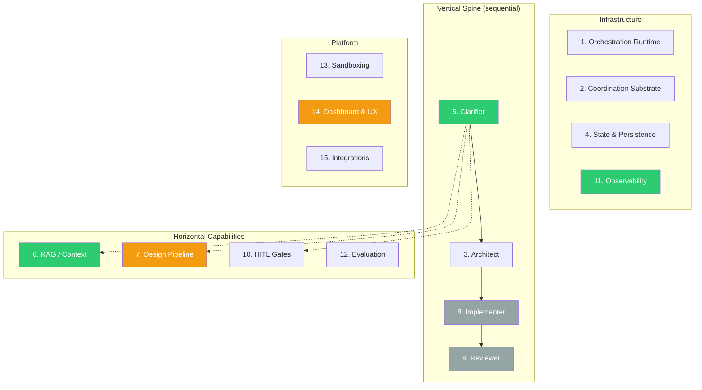
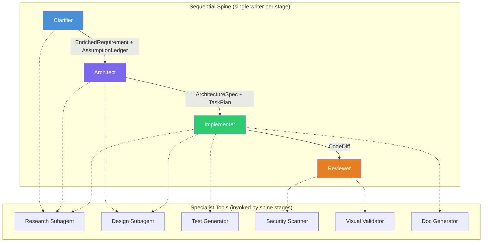
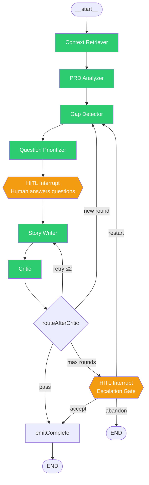
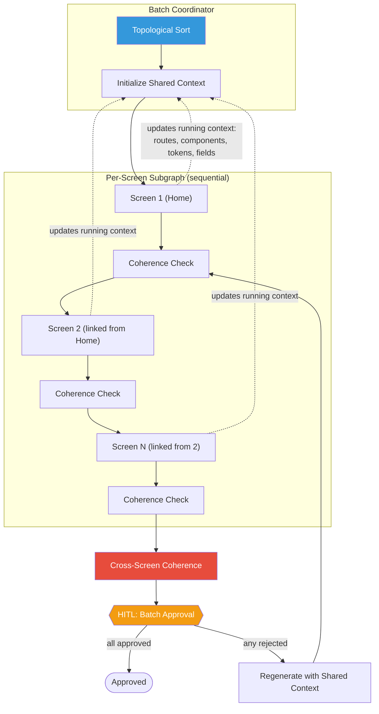
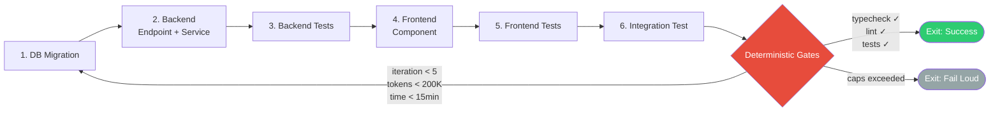
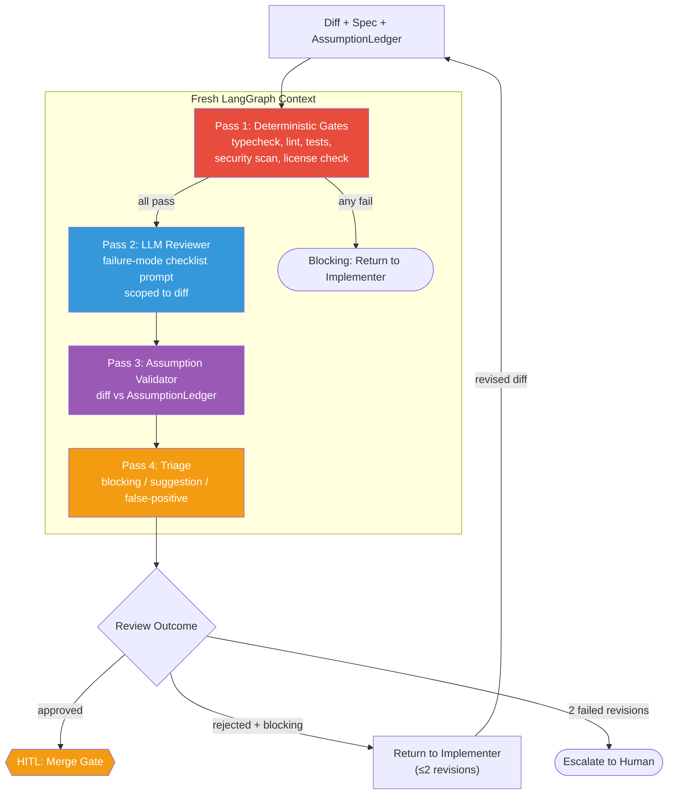
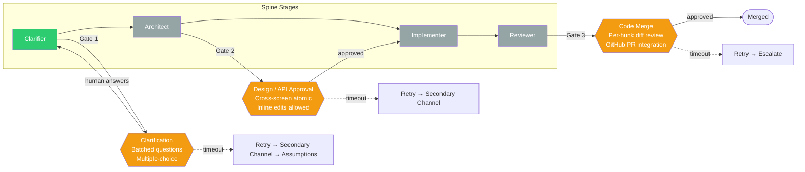

# CHIP — Architecture Vision

!!! warning "Read this before making any architectural decision"

    This document is the target vision for CHIP. The current codebase is in migration toward this vision. When the codebase and this document conflict, **the document wins** — add a TODO, an ADR, or raise the conflict; do not replicate the codebase's legacy pattern as if it were correct.

---

## Executive summary

CHIP is a four-stage agent spine (**Clarify → Architect → Implement → Review**) that turns a product idea into working software.

**What's operational today:**

- **Clarifier** — 9-node LangGraph StateGraph with HITL interrupts, assumption ledger, escalation handling
- **Design pipeline** — 4-stage Research → Planning → Design → Evaluator with vision correction
- **RAG layer** — hybrid search (BM25 + dense + rerank) for code, docs, and designs; repo map; 5 MCP tools
- **Dashboard** — 15 routes, Mantine v9, serves both design and clarifier workflows
- **Observability** — OTel + Langfuse self-hosted, prompt versioning, cost tracking

**What's specified but not yet built:**

- Architect, Implementer, and Reviewer spine stages
- Golden evaluation test sets
- Sandboxing / ephemeral containers

This document describes both what exists and what's next — every layer explicitly separates current state from target vision.

---

## How to use this document

This is the architectural authority for CHIP. Every layer has current-state, 
target-vision, and locked-vs-open decisions explicit.

For other reading modes:
- Why the spine pattern wins → `architecture/spine-pattern.md` (24 citations)
- How CHIP applies the spine → `architecture/spine-implementation.md`
- Evidence behind these decisions → `research/architect-design.md`, `research/clarifier-research.md`
- Why we rejected alternatives → `design-decisions.md` (appendix)
- How decisions are sequenced into work → `roadmap.md`

When the codebase and this document conflict, this document wins. See Section 17.

## Table of contents

- [0. How to read this document](#0-how-to-read-this-document)
- [1. Product vision](#1-product-vision-one-paragraph)
- [2. Architectural layers at a glance](#2-architectural-layers-at-a-glance)
- [Layer 1: Orchestration runtime](#layer-1-orchestration-runtime)
- [Layer 2: Coordination substrate](#layer-2-coordination-substrate)
- [Layer 3: Agent taxonomy](#layer-3-agent-taxonomy)
- [Layer 4: State and persistence](#layer-4-state-and-persistence)
- [Layer 5: Clarifier (front door)](#layer-5-clarifier-front-door)
- [Layer 6: RAG / context engineering](#layer-6-rag--context-engineering)
- [Layer 7: Design pipeline](#layer-7-design-pipeline)
- [Layer 8: Implementation](#layer-8-implementation)
- [Layer 9: Review](#layer-9-review)
- [Layer 10: HITL](#layer-10-hitl-human-in-the-loop)
- [Layer 11: Observability](#layer-11-observability)
- [Layer 12: Evaluation](#layer-12-evaluation)
- [Layer 13: Sandboxing and security](#layer-13-sandboxing-and-security)
- [Layer 14: Dashboard and UX](#layer-14-dashboard-and-ux)
- [Layer 15: Integrations](#layer-15-integrations)
- [16. Migration map](#16-the-migration-map-code-vs-vision)
- [17. What Claude Code should do when in doubt](#17-what-claude-code-should-do-when-in-doubt)
- [18. What this document is not](#18-what-this-document-is-not)
- [19. Change log](#19-change-log-for-this-document)
- [20. The single invariant](#20-the-single-invariant)

---

## 0. How to read this document

The document is organized by layer. For each layer, you'll find four subsections:

- **Current state** — what exists in the codebase today (may be partial, legacy, or drifted from target).
- **Target vision** — what we're migrating toward.
- **Locked decisions** — commitments already made. Do not re-derive. Do not propose alternatives unless new evidence supports reopening.
- **Open decisions** — questions still outstanding, with candidate options and the criteria for choosing. When you hit one of these during implementation, flag it rather than picking silently.

Every legacy pattern in the current state has a reason it's there, and a reason we're moving away from it. The **Why it's wrong today** notes are deliberate — they're what Claude Code and future contributors need to understand so the old pattern doesn't silently get reinforced.

---

## 1. Product vision (one paragraph)

CHIP is an autonomous multi-agent SDLC framework that takes a product idea and produces working, reviewed, deployable software.

**How it works:** A small set of specialized LLM-driven stages coordinated as a typed, durable, checkpointed graph — with a conversational clarifier front-end, a code/doc RAG layer, a spec-first artifact system, and structural human-in-the-loop gates at phase boundaries.

**What differentiates CHIP:** Not how many agents it has or how autonomous they seem — but the quality of **context engineering**, the rigor of **clarification before implementation**, and the discipline of **single-writer artifacts**.

**Target audience:** Persona B (5–15 person engineering teams) first; Persona A (solo builders) second.

---

## 2. Architectural layers at a glance

| # | Layer | Where we are | Current state (summary) | Target (summary) |
|---|---|---|---|---|
| 1 | Orchestration runtime | Done | TypeScript LangGraph adopted (ADR-043). Python engine deprecated. | TypeScript LangGraph only |
| 2 | Coordination substrate | Partial | Clarifier uses typed channels. Older code still uses EventEmitter for some control flow. | Typed LangGraph channels for control; event bus relegated to telemetry |
| 3 | Agent taxonomy | Partial | Clarifier + Design pipeline operational as spine stages. Architect/Implementer/Reviewer not built. | Four-stage spine (Clarifier, Architect, Implementer, Reviewer) + specialist tools |
| 4 | State persistence | Partial | YAML artifacts operational. Checkpointer factory built (MemorySaver/PostgresSaver). Wired into Clarifier pipeline; design pipeline uses imperative caching. | YAML for artifacts + Postgres LangGraph checkpointer for run state |
| 5 | Clarifier / input | Done | Nine-node LangGraph StateGraph with HITL interrupts, assumption ledger, escalation handling. | Nine-node conversational clarifier with assumption ledger |
| 6 | RAG / context | Done | Hybrid search (BM25+dense+rerank) for code/docs/designs. Repo map. 5 MCP tools. Wired into Clarifier. | Aider-style repo map + voyage-code-3 + Qdrant for code; LlamaIndex + voyage-3-large for docs |
| 7 | Design pipeline | Partial | Per-screen pipeline works (Research→Planning→Design→Evaluator). Cross-screen coherence is post-hoc. | In-loop cross-screen coherence with shared running context |
| 8 | Implementation | Not started | Architecture specified (single-threaded, sequential write order). No code. | Single-threaded tool-loop implementer with sequential write order |
| 9 | Review | Not started | Architecture specified (fresh context, deterministic gates first). No code. | Fresh-context reviewer with deterministic gates + LLM review + assumption validator |
| 10 | HITL | Partial | Two gates operational (clarification interrupt, design approval). Code merge gate not built. | Three gates: clarification, design/API, code merge |
| 11 | Observability | Done | Langfuse self-hosted + OTel spans + prompt versioning + cost tracking per call. | OpenTelemetry + Langfuse + prompt versioning + cost tracking |
| 12 | Evaluation | Not started | Design evaluator exists (structural + vision). No golden test sets. | Golden test sets with CI-integrated regression detection |
| 13 | Sandboxing | Not started | Runs on dev machine. Zero-secret design principle followed. | Ephemeral containers, egress allowlist, zero-secret agent design |

> Legend: 🟢 Done — 🟡 Partial — ⚪ Not started

---

## Layer 1: Orchestration runtime

### Current state
- TypeScript monorepo (Nx workspace) contains the real agent logic: `packages/agents-ux`, `packages/agents-design`, `packages/designspec-renderer`, `packages/core`, `packages/cli`, `packages/dashboard`.
- Python service at `services/engine` is **deprecated** (ADR-043). Agent nodes are stubs; no active workflow reaches it. Scheduled for removal after migration Phase M-4.
- ADR-022 committed to TypeScript-only orchestration. ADR-043 formalizes the deprecation.

### Target vision
Single orchestration runtime: `@langchain/langgraph` (TypeScript). Every spine and specialist runs in the TypeScript process. Python remains available for auxiliary services only (not orchestration).

### Locked decisions
- **TypeScript LangGraph is the sole orchestration runtime.** Python engine formally deprecated via ADR-043. Scheduled for deletion after migration Phase M-4.
- **LangGraph is chosen over CrewAI (no typed state), OpenAI Agents SDK (no checkpointing), and Microsoft Agent Framework (fine but wrong ecosystem fit).**

### Open decisions
- ~~**Whether any legacy Python code survives the migration.**~~ **Resolved (ADR-043).** Nothing in `services/engine` is load-bearing at runtime. Scheduled for deletion after migration Phase M-4.
- **LangGraph local vs LangGraph Platform.** Local for POC. Hosted Platform is an upgrade path if deployment complexity grows — not a near-term decision.

??? danger "Why the current state is wrong"

    Two orchestrators means every feature lands in two codebases or one side becomes a zombie. The Python engine is currently the zombie. Maintaining both forces cross-language state serialization (fragile) or duplicate logic (drift-prone). The research report's Part 1 and the Anthropic/Cognition reconciliation both assume a single, typed, checkpointable graph — that's LangGraph TS here.

---

## Layer 2: Coordination substrate

!!! abstract "Expanded overview"

    For an expanded overview with diagrams, see [Concepts: Coordination & State](concepts/coordination-and-state.md)

### Current state
- `CLAUDE.md` at repo root says: "Agents communicate via event bus ONLY. No direct agent-to-agent calls."
- In-memory EventEmitter is the coordination primitive.
- YAML files serve as the durable shared state for spec artifacts.
- Inter-agent payloads are untyped blobs passed through event emissions.

### Target vision
Two distinct planes:
- **Coordination plane:** typed LangGraph channels with reducers. Spine agents read and write specific, Zod-typed fields. Graph topology is declared.
- **Telemetry plane:** event emissions and OpenTelemetry spans for observability, debugging, replay. No control flow decisions depend on event subscriptions.

### Locked decisions
- **Event bus is demoted to telemetry only.** It is not the coordination substrate.
- **Typed LangGraph state channels with Zod schemas are the coordination substrate.**
- **Every artifact that crosses an agent boundary has a Zod schema in `packages/core/src/types/`.**
- **Reducers (concatenation, last-write-wins, merge) are declared on channels where concurrent writes could occur.**

### Open decisions
- **Whether to keep `EventEmitter` or switch to OpenTelemetry-native event emission.** Either works for the telemetry plane. Easier migration is: keep EventEmitter as a facade that emits OTel spans underneath.
- **Reducer semantics for specific channels.** Most channels are last-write-wins. `AssumptionLedger` needs concatenation. `errors` needs concatenation. Per-channel decision, made when the channel is introduced.

??? danger "Why the current state is wrong"

    Every emitter-receiver pair with an untyped payload is a silent-drift bug candidate. With ten agents, that's ~45 pairwise channels. Types catch shape errors at authoring time; event buses catch them in production, if at all. See research report Part 1 "Inter-agent communication" and the Anthropic/Cognition analysis on implicit-decision drift. The `CLAUDE.md` rule "agents communicate via event bus ONLY" must be rewritten — it's currently directing Claude Code to reinforce the anti-pattern.

### Migration note
The `CLAUDE.md` rule at repo root that mandates event-bus-only communication is the single highest-leverage update. Until it changes, Claude Code has license to build every new feature on the wrong substrate. Phase 0.1 ADR must include updating this rule.

---

## Layer 3: Agent taxonomy

!!! abstract "Expanded overview"

    For an expanded overview with diagrams, see [Concepts: Agent Taxonomy](concepts/agent-taxonomy.md)

### Current state

!!! info "Historical context"

    The original PRD v2.0 described ten peer agents (PM, Product, Architect, Design, Implementation, Testing, Review, DevOps, Security, Docs) communicating via event bus. This design was rejected during research before any code was written. The spine architecture was the first and only implementation. The ten-agent taxonomy is preserved here as context for why the spine was chosen.

Four-stage spine with the Clarifier operational (9-node LangGraph StateGraph, Tasks 1.0–1.7 complete). RAG layer wired into Clarifier's Context Retriever. Architect, Implementer, and Reviewer specified but not yet built. Six specialist tools defined, two operational (RAG, Design).

### Target vision
**Four-stage spine with specialists as tools:**

**Spine (sequential, single writer per stage):**
1. **Clarifier** — takes raw input (bootstrap seed or change request), retrieves context, analyzes gaps, asks questions, produces enriched requirement + assumption ledger.
2. **Architect** — takes enriched requirement, produces architecture spec, ADRs, task plan.
3. **Implementer** — takes approved architecture, produces code diff in a sandboxed workspace. Single-threaded within a task.
4. **Reviewer** — takes diff + spec + assumption ledger, runs in fresh context, produces review result.

**Specialists (invoked as tools by spine stages):**
- **Research subagents** — read-only codebase/docs exploration returning compressed summaries.
- **Design subagent** — UI proposals, screen specs, invoked during Architect and Implementer phases.
- **Test generator** — emits failing tests before implementation.
- **Security scanner** — diff-scoped Semgrep/CodeQL with LLM triage.
- **Visual validator** — Playwright for UI work.
- **Documentation generator** — invoked during Implementer phase.

### Locked decisions
- **Four-stage spine is the committed structure.** No flat peer network.
- **Specialists are read-heavy or narrow-write tools invoked by spine stages.** They never run in parallel as writers to a shared artifact.
- **PM Agent and Product Agent from the old taxonomy are absorbed into Clarifier + Architect.**
- **DevOps, Security, Docs agents are demoted to specialists.**

### Open decisions
- **Whether the Implementer's "research subagent" should be a single capability or multiple specialized subagents (code-exploration, docs-lookup, pattern-matching).** Single, tool-differentiated is simpler; multiple is more flexible. Lean toward single for POC.
- **Whether the Design subagent should be owned by Architect or Implementer.** It's invoked by both. Likely: Architect uses it for screen-level design; Implementer uses it for component-level proposals. Decide when concrete workflows clarify.
- **Whether testing is a specialist tool or part of the Implementer's inner loop.** Both patterns work. Recommended: test generation is a tool; test execution is a deterministic gate, not an agent.

??? danger "Why the current state is wrong"

    The ten-agent taxonomy is org-chart thinking: it maps the system onto how a human engineering team is organized, then expects LLM calls to inherit the properties of human collaboration. They don't. The real questions — which LLM call owns which artifact, what context gets passed between calls, who decides when to stop — are answered by the four-stage spine cleanly and answered by the ten-agent pattern not at all. See the research report Part 1 "The agent taxonomy problem."

---

## Layer 4: State and persistence

!!! abstract "Expanded overview"

    For an expanded overview with diagrams, see [Concepts: State Persistence](concepts/state-persistence.md) and [Concepts: Coordination & State](concepts/coordination-and-state.md)

### Current state
- YAML files in `agentforge/spec/` as the living spec (project.yaml, pages.yaml, api.yaml, models.yaml, components/).
- In-memory dict for pipeline state during a run.
- YAML in `agentforge.tasks.yaml` for task tracker.
- Checkpointer factory in `packages/core/src/checkpointer/`: `MemorySaver` for dev, `PostgresSaver` via `@langchain/langgraph-checkpoint-postgres` when `DATABASE_URL` is set. Docker Compose at `docker/docker-compose.agentforge.yml` (Postgres 16, port 5433). Wired into the Clarifier pipeline (`agents-clarifier/src/run.ts`) and dashboard Clarifier route (`dashboard/src/app/api/_lib/checkpointer.ts` via `getSharedCheckpointer()` singleton). Design pipeline uses imperative file-based caching — checkpointer adoption for remaining pipelines follows ADR-043 Phase M-2+.

### Target vision
Three tiers of persistence, each with the right substrate:

**Artifacts (YAML in git):** PRDs, ADRs, design specs, task plans, component catalog, design tokens. Human-readable, version-controlled, diff-friendly. Kept as-is — YAML is fine for artifacts.

**Run state (Postgres LangGraph checkpointer):** execution state of a spine run — which node is current, what's in each channel, interrupt status, retry budgets, cost counters. Durable across process restarts. Supports time-travel for debugging.

**Ephemeral (in-memory per run):** tool call results that don't need persistence, subagent results that have already been compressed into summaries.

### Locked decisions
- **Postgres checkpointer is the run state backend for LangGraph.**
- **YAML artifacts stay in git.** No database migration for spec files.
- **Checkpoints on every node boundary, not just phase boundaries.** Fine-grained resumption beats coarse-grained.
- **Human-edited YAML always wins over agent-edited YAML.** File locking prevents concurrent corruption. Content hashing detects human edits mid-agent-write.

### Open decisions
- ~~Whether to use Prisma for checkpointer schema management~~ **Resolved:** using `@langchain/langgraph-checkpoint-postgres`'s built-in migration via `.setup()`. Simpler than Prisma for a library-managed schema.
- **Retention policy for checkpoints.** Keep indefinitely during POC; add TTL for production.
- **Whether to support SQLite for single-user local development.** LangGraph has a SQLite checkpointer. Could ease local setup.

??? danger "Why the current state is wrong"

    In-memory state means the first real long-running agent task that crashes loses all work — a research or implementation session that burned $5 of LLM calls disappears with the process. LangGraph checkpointers solve this with minimal integration cost. The current "YAML + in-memory" pattern conflates two different persistence needs (artifact storage vs run state) into one mechanism that's wrong for one of them.

---

## Layer 5: Clarifier (front door)

!!! abstract "Expanded overview"

    For an expanded overview with diagrams, see [Concepts: Agent Taxonomy](concepts/agent-taxonomy.md).
    For the research-backed design with 24 citations, see [CHIP's Spine — Clarifier](architecture/spine-implementation.md#stage-1-clarifier).

### Current state
- `packages/agents-clarifier/` implements all 9 Clarifier nodes as a LangGraph `StateGraph` with typed `Annotation.Root()` channels (first LangGraph graph in the monorepo).
- **Context Retriever** (Task 1.1): bootstrap loads base catalog + tokens; evolution calls all 5 RAG tools (`searchCode`, `searchDocs`, `searchDesigns`, `getRepoMap`, `findSimilarPatterns`) via `Promise.allSettled` with partial failure tolerance.
- **PRD/Request Analyzer** (Task 1.2): `claude-opus-4-6`, forced-JSON via `responseSchema`, mode-aware prompts, `PRDSchema.safeParse()` validation.
- **Gap/Conflict Detector** (Task 1.3): deterministic checklist (auth, validation, errors, NFR targets, accessibility, orphan screens) + ClarifyGPT (2 LLM calls with `claude-sonnet-4-6` — 3 implementations at temp 0.7, divergence analysis at temp 0). Round>1 filters addressed gaps.
- **Question Prioritizer** (Task 1.4): EVPI proxy ranking (`blastRadius * answerability * confidenceGap`), budget enforcement (micro≤2, standard≤7, cross-cutting≤15), below-threshold gaps → `AssumptionLedger`. Multiple-choice in evolution mode with codebase precedent.
- **Story Writer** (Task 1.5): `claude-sonnet-4-6`, EARS-format acceptance criteria, `FeaturePlan` DAG with dependencies, `EnrichedRequirement` assembly. After max rounds: confidence capped at 0.5, unresolved gaps → assumptions with `requiresConfirmation: true`.
- **Critic** (Task 1.6): deterministic EARS/INVEST/DAG compliance checks, bounded retry (≤2 then pass with warnings).
- **Graph topology**: `__start__` → contextRetriever → prdAnalyzer → gapDetector → questionPrioritizer → [HITL interrupt] → storyWriter → critic → conditional routing (retry/new round/escalation/complete). Two HITL interrupt points: `storyWriter` (human answers questions) and `escalationGate` (accept/restart/abandon after max rounds).
- **Escalation resolved**: after 3 rounds without convergence, user gets accept (best-effort PRD, low confidence), restart (reset rounds), or abandon (exit). Implemented via `escalationGate` node with `interruptBefore`.
- **Not yet wired**: `RequirementsClarified` event emission in `emitComplete` node (Task 1.7 remaining). Dashboard integration at `/new` and `/evolve` (Task 1.8).
- **114+ tests** across 7 test suites in `packages/agents-clarifier/`.

### Target vision
Nine-node conversational clarifier, symmetric across bootstrap (new app) and evolution (change to existing app) modes:

1. **Context Retriever** — mode-dependent. Bootstrap: component catalog, pattern library, platform constraints. Evolution: codebase via RAG, existing designs, ADRs, PRD.
2. **PRD / Request Analyzer** — extracts structured intent into forced-JSON schema. Features, personas, data entities, screens, NFRs, success metrics, out-of-scope items.
3. **Gap/Conflict Detector** — two passes. Deterministic checklist for high recall. ClarifyGPT-style consistency sampling (3–5 plausible implementations, divergence = gap) for semantic ambiguity.
4. **Question Prioritizer** — EVPI proxy ranking: (blast_radius × answerability × confidence_gap). Top N above threshold become questions; rest become assumptions.
5. **Story Writer (evolution) or PRD Synthesizer (bootstrap)** — emits EARS-format acceptance criteria, INVEST-compliant stories, data entities with fields, typed feature DAG.
6. **Critic** — INVEST + EARS compliance check, bounded retry (≤2).

### Locked decisions
- **Clarifier is a first-class gated phase.** Nothing downstream runs without it.
- **One pipeline handles both bootstrap and evolution modes.** Same six nodes, different retrieval priors.
- **EARS format ("WHEN <condition> THE SYSTEM SHALL <behavior>") for acceptance criteria.**
- **Assumption Ledger is a first-class artifact.** Every unanswered gap becomes a recorded assumption with evidence, confidence, blast_radius, and requires_confirmation flag.
- **Question budget:** micro features 0–2, standard epics 3–7, cross-cutting ≤15 across ≤3 rounds. Hard cap 15 per round, 3 rounds total.
- **Grounded multiple-choice preferred** whenever retrieval surfaces codebase precedent.
- **Consistency sampling cost capped** at 3 extra LLM calls per run.

### Open decisions
- **Whether the dashboard conversational UI uses chat metaphor or wizard metaphor.** Chat scales better for follow-ups; wizard is clearer for first-time users. Research bias: industry pattern has moved away from wizards (Bolt, Lovable, v0 all use chat + optional attachments).
- **Whether the user can skip the clarifier.** Risk: they always will. Probably: offer "accept all suggested assumptions and proceed" after the first clarification round, but not skip the clarifier entirely.
- **Input modalities beyond text.** Image upload for inspiration, URL ingestion for reference apps, voice input. Defer.
- ~~**When the clarifier escalates.**~~ **Resolved (2026-04-28).** After max rounds (default 3), the graph interrupts at `escalationGate` with three options: **accept** (best-effort PRD with capped confidence ≤0.5, unresolved gaps become assumptions with `requiresConfirmation: true`), **restart** (reset round counter, re-enter gap detection), or **abandon** (exit to END). Implemented via `routeAfterEscalation` in `clarifier-graph.ts`.

??? danger "Why the current state is wrong"

    A text-box input without clarification is the most common root cause of autonomous agent failures documented in the research report (Answer.AI's Devin test, Replit Agent 3 "creative workarounds", the general "looks-right-but-broken" failure mode). The clarifier is the single highest-leverage differentiation opportunity per the research — no commercial tool ships it properly. Skipping the clarifier means every downstream stage compounds ambiguity it could have resolved upfront.

---

## Layer 6: RAG / context engineering

!!! abstract "Expanded overview"

    For an expanded overview with diagrams, see [Concepts: RAG & Context](concepts/rag-context.md)

### Current state
- `packages/retrieval/` implements the full RAG layer (Phase 2 complete, 2026-04-28).
- Three retrieval pipelines operational: code (`searchCode`), documents (`searchDocs`), designs (`searchDesigns`), plus `getRepoMap` and `findSimilarPatterns`.
- Code: AST-aware chunking, BM25 sparse + Voyage dense hybrid search with RRF fusion, Cohere rerank. Merkle-tree incremental indexing.
- Docs: header-aware Markdown/YAML splitting, same hybrid search pipeline.
- Designs: DesignSpec JSON chunked by node, component catalog by entry. Same hybrid search pipeline. `__`-prefix dirs filtered at scan time.
- Qdrant vector store (3 collections: `agentforge_code`, `agentforge_docs`, `agentforge_designs`). Docker Compose at `docker/docker-compose.agentforge.yml`.
- 5 MCP-compatible tool definitions in `createRetrievalTools()` factory.
- Golden query evaluation framework with precision@5 gate.
- Wired into Clarifier's Context Retriever node (5 tools called via `Promise.allSettled` in both bootstrap and evolution modes). Architect, Implementer, and Reviewer will consume retrieval when built.

### Target vision
Three retrieval pipelines feeding a single `RetrievedContext` artifact:

**Code retrieval:**
- Aider-style repo map (tree-sitter parsing, PageRank over symbol graph, no embeddings) — always injected, deterministic.
- Semantic search: tree-sitter cAST chunking → voyage-code-3 embeddings → Qdrant (hybrid BM25+dense with RRF) → Cohere Rerank 3.5.
- Merkle-tree incremental re-indexing on git commits.

**Design retrieval:**
- DesignSpec JSON indexed by screen.
- Component catalog indexed by component.
- Design tokens loaded fresh every request.

**Document retrieval:**
- Header-aware Markdown splitter for PRDs, ADRs.
- YAML structural splitter for pages.yaml, models.yaml.
- Voyage-3-large embeddings.
- Same Qdrant instance, separate collection, same Rerank pass.

All five exposed as LangGraph tools: `searchCodeTool`, `searchDocsTool`, `searchDesignsTool`, `getRepoMapTool`, `findSimilarPatternsTool`.

### Locked decisions
- **Hybrid retrieval (deterministic structure first, semantic search second).**
- **Aider-style repo map is the default code-context tool.** No embeddings required for structural context.
- **voyage-code-3 for code embeddings, voyage-3-large for docs.** Separate collections.
- **Cohere Rerank 3.5 on every retrieval.** Adds more than switching embedding models.
- **Hybrid BM25 + dense with RRF (k=60) for code.** Rare tokens, error codes, identifiers need BM25.
- **Skip GraphRAG.** AST + import graph already gives the structural relationships.
- **Skip Mem0.** 97.8% junk rate in production audits; not a RAG tool.
- **Skip Cognee.** Wrong problem domain for POC.
- **Merkle-tree incremental re-index.** Full re-indexing on every commit is cost-prohibitive.

### Open decisions
- **When to consider LazyGraphRAG for documents.** Only if flat-vector baseline measurably fails on global multi-hop ADR/PRD questions. Measure first.
- **Whether to index past chat transcripts as a separate RAG source.** Could capture "we discussed this in session X" memory. Not POC scope.
- **Whether to self-host an embedding model.** Voyage via API is simpler and cheaper at POC scale. AWS Marketplace Voyage deployment is the upgrade path for data sovereignty.
- **Qdrant vs pgvector.** Qdrant is purpose-built and faster. Pgvector means one fewer service. Qdrant recommended but not locked.
- **Whether to build a dedicated compression model for long contexts.** Cognition fine-tuned one. For POC, a Haiku call as compressor is good enough.

??? danger "Why the current state is wrong"

    Without retrieval, every agent operates blind to the codebase. The clarifier can't ask grounded questions ("I see you already use pattern X in this codebase — reuse or extend?"). The implementer can't follow existing patterns. The reviewer can't spot inconsistencies with conventions. Every feature effectively reinvents the codebase from scratch every time. The research report Part 2 is entirely about why this is the single largest quality lever.

---

## Layer 7: Design pipeline

!!! abstract "Expanded overview"

    For an expanded overview with diagrams, see [Concepts: Design Pipeline](concepts/design-pipeline.md)

### Current state
- Per-screen design pipeline works: Planning Agent → Design Agent → browser render → mechanical checks → vision correction loop.
- Design Studio dashboard at `/design` provides per-screen approval.
- Pass 3 coherence checker exists but runs post-hoc (after approval) and is informational only.
- Cross-screen generation is serialized by the human (one screen at a time in the UI). Batch "generate all pages" would expose cross-screen coherence failures.

### Target vision
Per-screen pipeline wrapped as a LangGraph subgraph; batch coordinator runs screens in topological order (home first, then pages linked from home, etc.) with a shared running context.

**Running context threaded across screens includes:**
- Navigation routes each screen declares (for cross-screen nav validation).
- Component usage (what catalog entries, what variants).
- Design tokens touched (for consistency).
- Data fields referenced (for model alignment).

**Coherence checking moves in-loop:**
- Per-screen coherence-check-single-screen runs inside the per-screen subgraph, after design generation, before approval.
- Cross-screen coherence runs in the batch coordinator before the HITL approval gate.
- Incoherence triggers regeneration of the specific page with the shared context as input, not post-hoc fixing.

**HITL gate:**
- Approve all affected screens together, atomically. Any screen rejected drops the whole batch back to `in_correction` status.

### Locked decisions
- **Per-screen generation is single-threaded within a screen.** Planning → Design → Render → Correction is sequential.
- **Across-screen generation is sequential via topological order.** Not parallel, even though each screen's file is independent.
- **Shared running context threaded through the batch.**
- **Coherence check moves from post-hoc to in-loop.**
- **DesignSpec JSON is the central intermediate representation.** Constrained by response schema. Hallucinated catalog references silently corrected via fuzzy-match.

### Open decisions
- **Whether the interactive preview / tagging flow stays as-is.** It works today. Keep it.
- **Version history UX for designs.** Currently: snapshots on approval. Likely fine.
- **Whether partial regeneration (Pattern B) for requirement changes gets smarter.** Currently: whole-screen regen. Smarter: diff the requirement change and only regenerate affected sections.
- **Design system changes (token modifications) cascading across screens.** Classifier knows this is a cross-cutting change; design branch must then regenerate all screens using those tokens. Workflow not yet specified.

??? danger "Why the current state is partially wrong"

    The existing per-screen pipeline is good and stays. The failure mode is in the cross-screen story: today, coherence is post-hoc and informational, which means the human has to notice and act on inconsistencies. At POC scale with a human clicking one screen at a time, this works. At any scale requiring batch generation, inconsistencies propagate silently. The fix is structural: move coherence into the loop and serialize across screens.

---

## Layer 8: Implementation

!!! abstract "Expanded overview"

    For an expanded overview with diagrams, see [Concepts: Agent Taxonomy](concepts/agent-taxonomy.md)

### Current state
- Implementation Agent described in PRD v2.0 Section 11.3.1 as a parallel fan-out: Frontend Coder + Backend Coder + Test Writer running concurrently via `max_concurrent_agents: 3`.
- PRD Section 24.2 roadmaps this explicitly: "Multi-agent code generation (frontend + backend + tests in parallel)."
- Shipped code to date does not yet implement this; it's still in roadmap phase.

### Target vision
**Single-threaded tool-loop implementer** that writes all code for a task sequentially in one LLM conversation. Task-level parallelism achieved via git worktrees on independent features.

**Within-task write order:**
1. DB migration
2. Backend endpoint + service layer
3. Backend tests
4. Frontend component
5. Frontend tests
6. Integration test spanning both

Each step appends to the LLM's context so later steps see earlier decisions.

**Tools available to the implementer:**
- Workspace tools: `read_file`, `write_file`, `apply_patch` (scoped to git worktree).
- Gate tools: `run_tests`, `run_typecheck`, `run_lint`.
- Context tools: `search_code`, `search_docs`, `get_repo_map`, `find_similar_patterns`.
- Research subagent: read-only exploration returning compressed summaries.
- Report-assumption-violation tool: if the implementer encounters an architecture detail that conflicts with an assumption, writes a typed record to the AssumptionLedger.

**Deterministic gates decide "done":**
- Typecheck, lint, tests pass → exit with success.
- Iteration cap (default 5), token budget (default 200K), wall-clock cap (default 15 min) enforced as hard caps.
- LLM never self-declares completion.

**Cross-task parallelism:**
- Multiple tasks run concurrently in separate git worktrees.
- Merging via normal git, not by agent coordination.
- `max_concurrent_agents` applies at the task level, not within a task.

### Locked decisions
- **Single-threaded writer within a task.** Kills PRD Section 24.2's parallel pattern. Must be accompanied by an ADR documenting the deviation.
- **Git worktrees for cross-task parallelism.**
- **Sequential write order (migration → backend → backend tests → frontend → frontend tests → integration test).**
- **Deterministic gates own "done."** LLM does not self-declare.
- **Budget caps are hard.** Fail loud when exceeded.
- **Assumption violations are flagged, not silently resolved.**

### Open decisions
- **How to handle tasks that genuinely have no UI changes or no backend changes.** Skip the irrelevant steps. Classifier drives this.
- **Whether the implementer can request a clarification mid-task.** E.g., "this task references an entity field that doesn't exist — should I add it?" Probably yes, via escalation to human, not autonomous decision.
- **How to handle tasks that touch multiple modules (e.g., a cross-cutting refactor).** Single worktree, larger sequential write order? Or split into smaller tasks upstream? Lean toward: classifier/architect splits, so implementer always gets scoped tasks.
- **Whether implementer should commit intermediate progress.** Intermediate commits give rollback points; continuous rebase gives a clean final diff. Either works.

??? danger "Why the current state is wrong (about the aspirational part)"

    PRD Section 24.2's parallel pattern is the textbook Cognition Flappy Bird failure mode. File locks don't help — the shared artifact is the running application. Frontend and backend agents will invent incompatible API shapes because their implicit decisions (field names, error formats, timestamp types) can't be fully pinned down by the OpenAPI spec. This is the single most important decision to lock before implementation work begins. See research report Part 1 and the Cognition discussion.

---

## Layer 9: Review

!!! abstract "Expanded overview"

    For an expanded overview with diagrams, see [Concepts: Agent Taxonomy](concepts/agent-taxonomy.md)

### Current state
- Review Agent exists in PRD but not implemented.
- Current flow: implementation complete → PR created → human reviews.

### Target vision
Reviewer as a spine stage running in fresh LangGraph context (not inheriting the Implementer's conversation). Multi-stage review:

1. **Deterministic gates run first:**
   - `typecheck`
   - `lint`
   - Tests
   - Security scan (Semgrep, Semgrep Cloud rules)
   - License check (dependency licenses)
2. **LLM reviewer call** with failure-mode checklist prompt, scoped to the diff, with architecture and AssumptionLedger as context.
3. **Assumption validator** compares diff against AssumptionLedger; flags any implementation detail that contradicts a recorded assumption.
4. **Triage** categorizes findings into blocking / suggestion / false-positive with evidence.

**Review outcome routes back:**
- Approved: proceed to HITL merge gate.
- Rejected with blocking findings: return to Implementer with findings. Bounded retry (≤2 revisions).
- Escalated: after 2 failed revisions, hand to human with full context.

### Locked decisions
- **Reviewer runs in fresh context.** Does not inherit Implementer's conversation.
- **Deterministic gates run first; LLM review second.**
- **Security is a specialist, not a gate.** Semgrep/CodeQL find issues; LLM triages; human decides on non-trivial findings. No autonomous security remediation.
- **Assumption validator is a separate pass.**
- **Bounded retry (≤2) before escalation.**

### Open decisions
- **Reviewer model choice.** `claude-sonnet-4-6` or `claude-opus-4-6` for higher quality at higher cost. Sonnet for POC.
- **Whether reviewer findings need their own schema for downstream consumption.** Probably yes — the UI displays them, Implementer parses them.
- **How to scope "the diff" for large changes.** If the diff is >1000 lines, reviewer by hunk? By file? Likely per-file with a final cross-file integration review.

??? warning "Why this layer is not yet wrong — it's just missing"

    No reviewer means every diff goes straight to human. At POC scale with the builder reviewing their own agent's output, this works. At any larger scale, it's a bottleneck. The reviewer is the piece that lets the human focus on semantic decisions while the reviewer catches mechanical drift.

---

## Layer 10: HITL (human-in-the-loop)

!!! abstract "Expanded overview"

    For an expanded overview with diagrams, see [Concepts: HITL & Governance](concepts/hitl-governance.md)

### Current state
- One approval gate: after design generation, before code.
- Dashboard shows pending approvals.
- No interrupt/resume on process death — approvals recreated if state is lost.

### Target vision
**Three structural HITL checkpoints:**

1. **Clarification round** — human answers batched questions from the Clarifier. Multiple-choice where possible.
2. **Design / API approval** — after design batch coherence, before Implementer runs. Cross-screen approval is atomic.
3. **Code review** — per-hunk diff review before merge. Integrated with git host (GitHub PR).

**All HITL implemented as LangGraph interrupts:**
- State persists in the Postgres checkpointer when an interrupt fires.
- Dashboard exposes a webhook for human decision.
- On decision, graph resumes from the interrupt point.
- If human doesn't respond within a configurable timeout, escalation rules fire (retry notification, fall back to secondary channel, or fall back to recorded assumptions for non-critical questions).

**Explicit anti-pattern (do not build):**
- "Approve every tool call" / "approve every file write." Produces rubber-stamping. Vulnerable to HITL flooding attacks. Defeats autonomy.

### Locked decisions
- **Three gates, not one.**
- **LangGraph interrupts, not application-layer callbacks.**
- **Approve every action is explicitly rejected.**
- **Async approval via Slack / Telegram for Persona A (solo builder).** Web dashboard for Persona B.
- **Timeout handling with graceful degradation.**

### Open decisions
- **Timeout durations per gate.** Clarification: probably 24h. Design: probably 7 days. Merge: probably depends on team agreements. Configurable per-project.
- **Whether the human can edit the artifact at the gate or just approve/reject.** Design approval with inline edits is a common pattern in competing tools. Lean toward: inline edits allowed at design gate, approve/reject only at code merge gate.
- **Notification strategy.** Email is universal but slow. Slack/Telegram per user preference. Dashboard always shows pending.
- **Authentication / authorization for approvals.** Signed approval? Single human? Team-based?

??? danger "Why the current state is wrong (about having only one gate)"

    Single-gate HITL means errors that occur earlier (clarification) or later (implementation) propagate without a checkpoint. If the clarifier hallucinates a requirement, it flows through design and into code before anyone notices. If the implementer makes a bad decision, it's in the branch before human sees it. Three gates catch three different classes of error at lower correction cost than one late gate.

---

## Layer 11: Observability

!!! abstract "Expanded overview"

    For an expanded overview with diagrams, see [Concepts: Observability](concepts/observability.md)

### Current state (updated 2026-04-28, ADR-046)
- **Langfuse self-hosted** via `docker/docker-compose.langfuse.yml` (Postgres, ClickHouse, Redis, MinIO).
- **OTel spans** via `packages/telemetry/` — `TracedProvider` wraps `provider.complete()` to auto-capture LLM call I/O (system prompt, user message, response, tokens, cost, latency).
- **`createTracedMCPClient`** wraps `MCPClient.callTool()` with OTel spans (`mcp:server.method`). Uses `@opentelemetry/api` directly for post-hoc span lifecycle.
- **`LangfuseSink`** emits real OTel spans for pipeline stage lifecycle (`stage:research`, `stage:planning`, etc.) with cost/token attributes. `dispose()` for orphan cleanup.
- **`CompositeSink`** combines transport sinks (CLI stdout, dashboard SSE) with LangfuseSink.
- **Graceful degradation** — when `LANGFUSE_SECRET_KEY` is not set, all telemetry code is no-op.
- **Prompt versioning** — `parsePromptFrontmatter()` strips YAML frontmatter from `.md` prompts; version recorded in `metadata.promptVersion` on Langfuse generation spans via `CompletionOptions.promptVersion`. Pre-commit hook (`scripts/check-prompt-versions.ts`) enforces version bumps.
- Cost tracking captured per-call via `TracedProvider.costDetails`; Langfuse aggregates automatically.

### Target vision
**OpenTelemetry is the tracing spine.** Every LLM call, tool call, and state transition emits an OTel span with typed attributes:

- Model, prompt version, input/output tokens, latency, cost, retry count.
- Tool name, arguments (sanitized), return value size, latency.
- Node name, superstep, state-hash-before/after, interrupt reason.

**Langfuse self-hosted is the trace backend.** Dashboard links every run to its Langfuse trace.

**Prompt versioning via git frontmatter:**
- Every `.md` prompt file has `version: X.Y.Z` in frontmatter.
- LLM wrapper reads version, records per call.
- Pre-commit hook fails if prompt content changed without version bump.

**Cost tracking aggregates spans:**
- Per run, per project, per user.
- Surfaced in dashboard.
- Alerts at configurable thresholds (from `agentforge.yaml` budget config).

**Evaluation hooks:**
- Traces replay into evaluation runs for regression detection.
- Prompt version can be swapped in replay to A/B test changes.

### Locked decisions
- **OpenTelemetry is the tracing standard.** No proprietary tracing.
- **Langfuse self-hosted for POC.** Hosted / managed is an upgrade path.
- **Prompt versioning is git-native.** No external prompt registry for POC.
- **Cost tracking is a first-class feature, not an afterthought.**

### Open decisions
- **Whether to use Langfuse OpenLLMetry or custom OTel spans.** OpenLLMetry has conventions; custom gives control. Likely Langfuse's SDK with OTel export.
- **Sampling strategy at scale.** POC: 100% sampling. Production: head-based sampling for successful runs, 100% for failures.
- **Prompt registry vs git frontmatter.** Git works for POC. External registry (Helicone, PromptLayer) might matter at scale. Defer.
- **Replay infrastructure.** Storing enough state to replay a run is substantial. Decide when eval harness demands it.

??? danger "Why the current state is wrong"

    Without traces, every bug report starts with "can you reproduce it?" and ends with "well, the model was non-deterministic." Without prompt versions, you can't tell which change caused a regression. Without cost tracking, you discover your LLM bill is 10× expected at the end of the month. These are not nice-to-haves for agent systems — they're the difference between a debuggable system and a black box.

---

## Layer 12: Evaluation

### Current state
- No evaluation harness.
- No golden test set.
- No regression detection.
- Every prompt change is a guess about whether quality improved.

### Target vision
**Golden test sets maintained in-repo:**

- `packages/eval/datasets/bootstrap/` — 20 seed-to-PRD scenarios covering different app types, complexity levels, ambiguity profiles.
- `packages/eval/datasets/evolution/` — 50 change-request scenarios against known apps covering UI changes, API changes, cross-cutting changes, and bug fixes.

**Metrics computed per run:**
- Clarifier question count (target 3–7).
- Blocking-gap coverage (target >90%).
- Assumption accuracy (human-labeled on sample).
- First-pass test/type/lint pass rate.
- Reviewer reject rate (healthy: 20–40%).
- End-to-end success rate.
- Cost per feature.

**CI integration:**
- On PRs touching `packages/agents-*` or `packages/retrieval`, run sampled eval (5 bootstrap, 10 evolution).
- Nightly full eval on main.
- Regression threshold: any metric worse by >10% fails PR.

**Growing the dataset:**
- Every production failure becomes a new golden scenario.
- Every prompt regression caught becomes a new scenario.
- Quarterly review to prune obsolete scenarios.

### Locked decisions
- **Golden test sets live in the repo, not an external eval platform.**
- **Metrics are computed automatically, not subjectively assessed.**
- **PR gate with 10% regression threshold.**
- **Eval scenarios grow from production failures.**

### Open decisions
- **LLM-as-judge for subjective metrics.** Quality of generated PRDs, story clarity — these need LLM judging. Cost and bias considerations.
- **Whether to use RAGAS for retrieval-specific evaluation.** Good standard, worth adopting.
- **Human-in-the-loop evaluation on a sample.** Anthropic's pattern. Catches what automated eval misses.
- **Cross-model evaluation (how does the system perform on Claude vs GPT vs Gemini).** Likely defer — picks one model, optimize for it, evaluate on others if portability becomes a requirement.

??? danger "Why the current state is wrong"

    Without eval, every change is a guess. The research report is unanimous: teams that skip evaluation end up with mysterious quality regressions they can't diagnose. Eval is the feedback loop that lets you improve prompts, retrieval, and workflow without depending on subjective judgment.

---

## Layer 13: Sandboxing and security

### Current state
- Agents run on the developer's machine.
- Filesystem access is unconstrained.
- Network egress is unconstrained.
- No secrets-in-context protection.

### Target vision
**Ephemeral sandboxes per run:**
- Docker container with the project cloned into a git worktree.
- Network egress allowlisted (LLM APIs, package registries, GitHub for git operations).
- No access to developer's home directory, secrets, or other projects.

**Zero-secret agent design (GitHub Copilot coding agent pattern):**
- LLM API tokens held by a proxy service, not injected into the LLM's context.
- Credentials for external services (GitHub, npm publish) held by tool implementations, not passed through the LLM.
- Prompt injection cannot exfiltrate credentials because the credentials are never in a context the LLM could read.

**Destructive operations require elevated approval:**
- Database drops, production deploys, external writes → explicit HITL approval regardless of trust level.
- Budget caps prevent runaway loops.

**Generated code scanned before execution:**
- Semgrep + CodeQL on generated diffs.
- Dependency license check.
- Suspicious-pattern heuristics (eval/exec, dynamic require, suspicious network calls).

### Locked decisions
- **Sandboxed execution with egress allowlist is the production target.**
- **Zero-secret agent design.**
- **Generated code scanned before execution.**
- **Destructive operations require elevated approval.**

### Open decisions
- **Whether POC runs in Docker or locally.** POC: local with git worktree isolation. Production: Docker or Firecracker.
- **Specific allowlist.** Starts small (Anthropic API, npm, PyPI, GitHub). Extends as tools require.
- **Audit logging format.** OTel spans capture most of this; supplement with explicit audit events for compliance.

??? info "Why this layer is deferred for POC"

    POC users (Praveen) run against their own machine and accept the security tradeoff. Any multi-user exposure triggers this layer as non-negotiable. Design for it now (tool isolation patterns, no-secrets-in-context) to avoid retrofit pain.

---

## Layer 14: Dashboard and UX

!!! abstract "Expanded overview"

    For an expanded overview with diagrams, see [Concepts: Dashboard & UX](concepts/dashboard-architecture.md)

### Current state
- Next.js dashboard in `packages/dashboard`.
- Screens exist for project view, pages list, design studio, pipeline view.
- `/new` has a text-box input.
- Real-time updates via polling (no websockets).

### Target vision
**Three primary surfaces:**

1. **Clarifier surface (`/new` for bootstrap, `/evolve` for changes)** — chat-like conversational UI. Multiple-choice buttons where available. "Accept suggested assumptions" shortcut. Real-time progress.

2. **Pipeline surface (`/project/<id>`)** — graph visualization of the current spine run. Highlighted current node. Pending HITL approvals surfaced prominently. Cost and progress per node.

3. **Artifacts surface** — PRDs, DesignSpecs, diffs, review reports, AssumptionLedger. Version history. Edit-at-approval-gate capability.

**Cross-cutting:**
- Dashboard preferences (theme, layout) persisted per-user.
- Agent reasoning traces linkable from any node (opens Langfuse).
- Cost visible per run and per project.
- Emergency controls (Pause All / Abort All).

### Locked decisions
- **Chat metaphor for clarifier, not wizard.**
- **Real-time updates via Server-Sent Events or websockets** (decide per-complexity) rather than 2s polling for active runs.
- **Graph visualization via LangGraph's built-in Mermaid export.**
- **Langfuse integration for reasoning traces.**

### Open decisions
- **Mobile experience.** Persona A mentioned Telegram for approvals. Dashboard probably desktop-first.
- **Collaborative features (multi-user, team).** Defer past POC.
- **Notification strategy (in-dashboard, email, Slack, Telegram).** Configurable per user.

??? danger "Why the current state is partially wrong"

    The existing dashboard works and most of it stays. The `/new` text box is the wrong entry point for the clarifier-first vision. The pipeline view needs to expose the new spine structure rather than the old ten-agent layout. These are localized changes, not rewrites.

---

## Layer 15: Integrations

### Current state
- CLI (Commander.js) in `packages/cli`.
- No Slack / Telegram / Jira integrations.
- GitHub Actions workflow exists but doesn't run agent code.

### Target vision
**MCP as the universal integration protocol.** Every tool the agent can invoke — filesystem, retrieval, rendering, git, Semgrep, Playwright — is MCP-compatible. This means tools can be:
- Invoked by the in-house spine.
- Invoked by Claude Desktop / Claude Code as a standalone surface.
- Invoked by other MCP clients (Cursor, Claude for Chrome, etc.).

**Prioritized consumer integrations:**
- **GitHub** — PR creation, branch management, review comments. Non-optional.
- **Slack / Telegram** — async HITL approvals for Persona A.
- **Jira / Linear / GitHub Issues** — ingress for change requests. Low priority; clarifier flow doesn't need it to work.

### Locked decisions
- **MCP is the tool protocol.**
- **Tools are self-hosted, not dependent on third-party MCP servers.**
- **GitHub integration is non-optional.**

### Open decisions
- **Which MCP client surface to prioritize.** Claude Desktop gets tools for free; Claude for Chrome opens more use cases; custom dashboard is what most users will actually use.
- **Jira/Linear integration depth.** Ingress only (read tickets, create PRDs) vs bidirectional (update tickets as work progresses).
- **Custom MCP servers for enterprise systems** (Salesforce, Workday, etc.). Not POC scope.

??? info "Why this is mostly about the future"

    Current state is fine for POC. The MCP-first design is about not locking out integration options later.

---

## 16. The migration map (code vs vision)

For every layer above, the current state diverges from the target. Here's the single map of what needs to change:

| Layer | Change required | Phase | Status |
|---|---|---|---|
| Orchestration | Deprecate Python engine via ADR | 0.1 | ✅ ADR-043 done |
| Coordination | Rewrite CLAUDE.md "event bus only" rule; introduce typed channels | 0.1, 0.2 | ✅ Clarifier uses typed channels |
| State persistence | Add Postgres checkpointer | 0.3 | ✅ Factory built |
| Clarifier | Build `packages/agents-clarifier`, replace text-box UI | 1 | ✅ Graph built, UI partial |
| RAG | Build `packages/retrieval` | 2 | ✅ Complete |
| Agent taxonomy | Collapse ten agents into four-stage spine | Spread across 3, 4, 5, 6 | Partial |
| Design pipeline | Move coherence in-loop, add batch coordinator | 4 | Partial |
| Implementation | Kill parallel code-gen; build single-threaded implementer | 5 | Not started |
| Review | Build `packages/agents-reviewer` | 6 | Not started |
| HITL | Add three gates as LangGraph interrupts | Spread across 1, 4, 6 | Partial (2 of 3) |
| Observability | Add OTel + Langfuse + prompt versions | 7 | ✅ Complete |
| Evaluation | Build `packages/eval` with golden sets | 8 | Not started |
| Sandboxing | Add Docker sandboxing when scale demands | Post-POC | Not started |
| Dashboard | Update `/new` for clarifier, pipeline for spine | Spread across 1, 3 | Partial (UX overhaul in progress) |
| Integrations | MCP-compatible tools by default | Ongoing | Partial (MCP tools built) |

---

## 17. What Claude Code should do when in doubt

When implementing against this vision, if a choice arises:

1. **Is the target locked?** Look under the layer's "Locked decisions." If yes, follow it — even if the codebase currently does the opposite.
2. **Is the target open?** Look under "Open decisions." If yes, pick a reasonable default and flag it in the PR description as "this follows the vision doc's default for <open decision>; <Praveen> may want to revise."
3. **Is the current codebase wrong by the vision's standard?** Look under "Why the current state is wrong." If the new code you're writing would replicate the legacy pattern, do NOT — add a TODO, write an ADR, or escalate to Praveen.
4. **Is there a conflict you can't resolve?** Stop, write up the conflict (what the vision says, what the code says, what the PRD says), and ask. Do NOT pick silently.

The discipline already in `CLAUDE.md` (no stub fallbacks, ADR every PRD deviation, Do-Not-Repeat list) still applies. This vision document is an additional authority on top of PRD-v2.md — specifically for architectural decisions where the PRD is either silent or contradicts the research report.

---

## 18. What this document is not

- It is not a PRD. `docs/specs/PRD.md` is the PRD. This document is the architectural vision.
- It is not an implementation plan. The plan is `roadmap.md`.
- It is not a research report. The research files (`research/architect-design.md`, `research/clarifier-research.md`, `research/architect-codebase-grounded-design.md`) contain the evidence; this document states the decisions derived from it. The spine architecture pages (`architecture/spine-pattern.md`, `architecture/spine-implementation.md`) synthesize the research into consolidated references.
- It is not immutable. Every "locked decision" has a revisit trigger. Every "open decision" is explicitly open. New evidence changes the document.

---

## 19. Change log for this document

- **2026-04-22** — Initial version. Synthesizes the research report, design decisions file, red flags file, and session state into a layered vision.

When this document is updated, add an entry here with what changed and why.

---

## 20. The single invariant

Of everything in this document, one thing matters more than the rest:

> **Context quality and write-coupling are the axes. Everything else is downstream.**

A system that gets context wrong produces wrong output regardless of architecture. A system that couples writes to shared artifacts across parallel agents produces inconsistent output regardless of quality. Every decision in this document exists to protect one of these two properties: get good context into each call, keep writes single-threaded per artifact. If a proposed change helps either, it's probably right. If it hurts either, it's probably wrong.